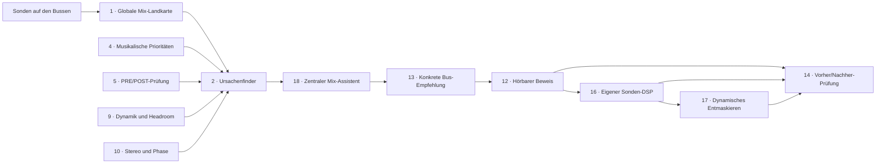

# Nakama mit Instrumentenbus-Sonden — Produktentwurf 0.1

- **Stand:** 2026-08-18
- **Status:** Erster festgehaltener Zielentwurf nach User-Auswahl
- **Gegenstand:** Funktions- und Interaktionsdesign, bewusst ohne visuelle Gestaltung
- **Bauentscheidung:** Noch nicht erteilt

---

## 0. Zweck und Einordnung

Dieser Entwurf hält fest, wie Nakama maximal sinnvoll erweitert werden könnte, wenn neben der
Hauptinstanz auf dem Master eigene Sonden auf den Instrumenten- und Gruppenbussen liegen.

Der User hat für den ersten **Kernumfang** folgende Punkte aus der zuvor beschriebenen
20-Punkte-Vision gewählt:

1. globale Mix-Landkarte,
2. Ursachenfinder,
4. musikalische Prioritäten,
5. Pre/Post-Kettenprüfung,
9. Dynamik- und Headroom-Analyse,
10. Stereo- und Phasenanalyse,
12. hörbarer Beweis,
13. konkrete Bus-Empfehlungen,
14. Vorher/Nachher-Prüfung,
16. Fernsteuerung des eigenen Sonden-DSPs,
17. intelligentes dynamisches Entmaskieren,
18. zentraler Mix-Assistent.

Die übrigen Punkte **3, 6, 7, 8, 11, 15, 19 und 20** stehen gesammelt am Ende als Roadmap.

### 0.1 Verhältnis zum heutigen Nakama-Vertrag

Der aktuelle, kanonische Nakama-Vertrag bleibt vorerst unverändert:

- Nakama misst und berät;
- das Audiosignal bleibt sampleidentisch;
- es gibt keine Parameterfernsteuerung und keinen eigenen hörbaren EQ;
- der User führt Änderungen selbst aus.

Dieser Entwurf ist deshalb eine **zukünftige Produkterweiterung**, keine Beschreibung des bereits
Gebauten. Besonders die Punkte **16 und 17** führen erstmals eine aktive Sondenvariante ein. Vor
einer Umsetzung müssten der kanonische Produktplan, die Schemata, die Audio-Sicherheitsregeln und
die Nulltest-Verträge ausdrücklich erweitert werden. Das darf nicht als stiller Ausbau der
heutigen passiven Instanz geschehen.

Maßgebliche Ist-Quellen bleiben:

- [`FL-EQ-Copilot-Recherche.md`](FL-EQ-Copilot-Recherche.md)
- [`eq-copilot/docs/NAKAMA-SPECTRAL-FIELD-BAUPLAN.md`](eq-copilot/docs/NAKAMA-SPECTRAL-FIELD-BAUPLAN.md)
- [`FL-Inter-Plugin-Kommunikation-Wissen.md`](FL-Inter-Plugin-Kommunikation-Wissen.md)

---

## 1. Produktidee in einem Satz

**Nakama wird von einem Master-Analysator zu einem quellenbewussten Mix-System: Es sieht die
Summe und ihre wichtigsten Instrumentenbusse gleichzeitig, findet den wahrscheinlichen
Verursacher eines Problems, beweist den Befund hörbar, schlägt eine konkrete Änderung am
richtigen Bus vor und kann diese auf ausdrücklichen Wunsch ausschließlich im eigenen
Sondenprozessor ausführen und überprüfen.**

Der entscheidende Sprung lautet:

```text
Heute:  „Im Master stimmt bei 900 Hz etwas nicht.“

Ziel:   „Das Problem entsteht hauptsächlich zwischen Klavier und Chor.
         Im Refrain verdeckt das Klavier den priorisierten Chor zwischen
         700 Hz und 1,2 kHz. Höre den Unterschied, teste 1,5 dB dynamische
         Absenkung nur auf dem Klavierbus und prüfe danach dieselbe Passage.“
```

Nakama soll damit nicht einfach mehr Messwerte anzeigen. Es soll die vollständige Kette
**Erkennen → Zuordnen → Verstehen → Hören → Handeln → Überprüfen** schließen.

---

## 2. Produktversprechen

Nach einer verwertbaren Passage soll Nakama sechs Fragen beantworten können:

1. **Was** fällt im Gesamtmix auf?
2. **Welche Quelle oder Kette** verursacht es wahrscheinlich?
3. **Ist es angesichts der musikalischen Rollen überhaupt ein Problem?**
4. **Wie kann der User den Befund hören**, statt nur einer Grafik zu glauben?
5. **Was ist der kleinste sinnvolle Eingriff und auf welchem Bus gehört er hin?**
6. **Was hat sich danach messbar und hörbar verändert?**

### 2.1 Was Nakama ausdrücklich nicht werden soll

- kein unkontrollierter Auto-Mixer;
- kein System, das jeden Mix auf dieselbe Kurve zwingt;
- kein Ersatz für musikalische Entscheidungen;
- kein allgemeiner Fernzugriff auf FLs Mixer oder fremde Plugins;
- kein Analyzer, der den User mit zwanzig gleichrangigen Warnungen überlädt;
- kein Loudness-Maximierer;
- kein System, das eine messbare Änderung automatisch als „klingt besser“ bezeichnet.

---

## 3. Das System aus Usersicht

### 3.1 Nakama Main

Die Hauptinstanz liegt auf dem Master oder Pre-Master. Sie ist die zentrale Arbeitsfläche und:

- sieht die fertige Summe;
- empfängt Messdaten der Sonden;
- ordnet alle Quellen derselben Projektsitzung zu;
- priorisiert Befunde;
- zeigt Begründung und Unsicherheit;
- startet Hörproben und Vergleiche;
- schickt bestätigte Einstellungen an eigene aktive Sonden.

Nakama Main muss auch allein funktionieren. Ohne Sonden darf es weiterhin eine ehrliche
Masterdiagnose liefern, aber keine sichere Quellenzuordnung behaupten.

### 3.2 Passive Nakama Probe

Eine passive Sonde liegt beispielsweise auf:

- Klavierbus,
- Chor-/Vocalbus,
- Drumbus,
- Bassbus,
- Streicher-/Atmosphärenbus,
- Reverb- oder Effektbus.

Sie hört genau das Signal an ihrer Insert-Position, misst es und leitet es unverändert weiter.
Sie ist die sichere Standardform.

### 3.3 Aktive Nakama Probe

Die aktive Variante besitzt zusätzlich einen eigenen, klar begrenzten Prozessor. Dieser kann
von Nakama Main bedient werden, aber nur nach sichtbarer Freigabe des Users.

Sie ist kein Zugang zu einem fremden EQ. Nakama steuert ausschließlich Funktionen, die in der
eigenen Sonde gebaut und als normale Plugin-Parameter gespeichert werden.

### 3.4 Pre/Post-Paar

Zwei Sonden können dieselbe Kette einrahmen:

```text
Klavier → PRE-Sonde → vorhandene Effektkette → POST-Sonde → Master
```

Dadurch kann Nakama nicht nur sagen, wie der Klavierbus jetzt klingt, sondern was die
dazwischenliegende Kette tatsächlich verändert hat.

### 3.5 Begleitdienst

Ein lokaler Begleitdienst darf Discovery, Sitzungszuordnung, Speicherung und größere
Auswertungen übernehmen. Er bleibt aus Usersicht Infrastruktur. Die tägliche Arbeit findet
weiterhin in Nakama Main innerhalb von FL Studio statt; kein Terminal ist nötig.

---

## 4. Was Main und Sonden austauschen

Die genaue Transporttechnik wird in diesem Entwurf bewusst nicht festgelegt. Aus Usersicht
braucht die Zusammenarbeit folgende Inhalte:

### Sonde → Main

- Identität, Name und Rolle des Busses;
- Position als normaler, PRE- oder POST-Messpunkt;
- aktuelle Aktivität und Messqualität;
- Frequenzverteilung und auffällige Bereiche;
- Lautheit, Peaks, Dynamik und Headroom-Beitrag;
- Stereobreite, Korrelation und Mono-Risiko;
- zeitliche Zuordnung zur gerade laufenden Passage;
- Zustand des eigenen Sondenprozessors;
- Information, ob eine Messung frisch, unvollständig oder veraltet ist.

### Main → Sonde

- Messung starten, stoppen oder zurücksetzen;
- eine Passage oder einen Frequenzbereich genauer beobachten;
- PRE- und POST-Instanzen zu einem Paar verbinden;
- eine kurze Hörprobe vorbereiten;
- einen Änderungsvorschlag als noch nicht aktiven Entwurf senden;
- einen Entwurf vorhören, bestätigen, zurücknehmen oder neutralisieren;
- eine dynamische Entmaskierungsbeziehung zwischen zwei eigenen Sonden konfigurieren.

Das normale Audiorouting bleibt bei FL Studio. Analysekommunikation darf den Audiofluss niemals
blockieren.

---

## 5. Vier Bedienebenen

Das Produkt trennt vier Ebenen sichtbar. Dadurch ist jederzeit klar, ob Nakama nur beobachtet
oder tatsächlich Klang verändert.

| Ebene | Verhalten | Klangänderung |
|---|---|---|
| **Beobachten** | Main und Sonden messen und bauen die Mix-Landkarte auf. | Nein |
| **Beraten** | Nakama erklärt Ursache, Priorität und einen kleinen Versuch. | Nein |
| **Vorhören** | Eine Änderung wird nur gehalten oder kurz befristet hörbar gemacht. | Vorübergehend |
| **Anwenden** | Der User bestätigt einen Zustand im eigenen aktiven Sonden-DSP. | Ja, sichtbar und rückgängig machbar |

Ein Befund darf nie direkt von **Beobachten** zu **Anwenden** springen. Dazwischen liegen immer
eine verständliche Empfehlung und eine bewusste Userhandlung.

---

## 6. Zusammenspiel der zwölf Kernfunktionen



Die Funktionen sind kein loses Paket. Die Landkarte liefert Kontext, Prioritäten geben diesem
Kontext eine musikalische Bedeutung, der Ursachenfinder wählt den wahrscheinlich richtigen
Bus, der Assistent formuliert den nächsten Schritt und Hörprobe plus Nachmessung prüfen ihn.

---

## 7. Kernfunktion 1 — Globale Mix-Landkarte

### Ziel

Der User soll den Mix nicht mehr nur als eine Masterkurve sehen, sondern als zusammenhängendes
System aus benannten Quellen.

### Was die Landkarte abbildet

- welche Busse gerade aktiv sind;
- wo jede Quelle im Frequenzraum hauptsächlich Energie trägt;
- welche Quelle Vordergrund, Fundament, Begleitung oder Raum bildet;
- welche Quellen dauerhaft und welche nur kurz auftreten;
- wo Lautheit, Dynamik und Stereobreite einer Quelle im Verhältnis zur Summe liegen;
- welche Sonde fehlt, veraltet ist oder zu wenig verwertbares Signal gesehen hat;
- welche aktive Sonde gerade einen bestätigten Eingriff ausführt.

### Nutzerwirkung

Statt „zu viele Tiefmitten im Master“ sieht der User beispielsweise:

> Die Tiefmitten entstehen überwiegend auf dem Klavierbus. Der Chor trägt dort ebenfalls bei,
> ist aber leiser. Der Drumbus ist in dieser Passage nicht beteiligt.

### Ehrliche Grenze

Die Summe ist besonders hinter Sättigung, Kompression oder Limiting nicht einfach die sichtbare
Addition aller Sonden. Nakama zeigt deshalb Beiträge und Wahrscheinlichkeiten, keine erfundene
mathematische Gewissheit.

---

## 8. Kernfunktion 2 — Ursachenfinder

### Ziel

Nakama soll zu einem Masterbefund den wahrscheinlichsten Entstehungsort nennen.

### Mögliche Ursachenklassen

- eine einzelne Quelle besitzt eine Resonanz oder Überbetonung;
- zwei Quellen konkurrieren gleichzeitig im selben Bereich;
- eine Effektkette erzeugt das Problem erst zwischen PRE und POST;
- mehrere kleine Beiträge summieren sich erst auf dem Master;
- ein Peakproblem stammt überwiegend von einem transienten Bus;
- eine Stereoveränderung entsteht durch eine bestimmte Quelle oder Kette;
- die Daten reichen noch nicht für eine belastbare Zuordnung.

### Ergebnisform

Jeder Ursachenbefund enthält:

1. **Ort:** betroffener Bus und optional PRE/POST-Stelle;
2. **Beobachtung:** was gemessen wurde;
3. **Zusammenhang:** warum dieser Bus als Ursache infrage kommt;
4. **Alternativen:** weitere mögliche Verursacher;
5. **Sicherheit:** hoch, mittel oder noch unklar;
6. **nächster Beweisschritt:** was abgespielt oder vorgehört werden soll.

### Beispiel

> **Wahrscheinliche Ursache: Klavierbus, 180–280 Hz.** Der Aufbau tritt in 78 % der
> aktiven Klaviermomente auf und wächst auf dem Master gleichzeitig mit. Der Bass war in der
> gemessenen Passage nicht aktiv. Sicherheit: hoch. Nächster Schritt: Bereich am Klavierbus
> level-normalisiert vorhören.

---

## 9. Kernfunktion 4 — Musikalische Prioritäten

### Ziel

Nakama soll nicht alles, was sich überlappt, automatisch „reparieren“. Es muss wissen, welches
Element in einer Passage führen, tragen, begleiten oder bewusst verschmelzen soll.

### Rollen

Eine Sonde kann eine einfache musikalische Rolle erhalten:

- **Fokus:** soll deutlich verständlich und vorne bleiben;
- **Fundament:** trägt Körper, Harmonie oder tiefen Halt;
- **Begleitung:** darf Platz machen, ohne charakterlos zu werden;
- **Impuls:** kurze Transienten sollen erhalten bleiben;
- **Raum:** Reverb, Atmosphäre und Breite dürfen verschmelzen;
- **Geschützt:** dieser Klangbereich soll nicht automatisch vorgeschlagen werden;
- **Bewusst verschmolzen:** Überdeckung ist gewollt und kein Fehler.

Rollen bleiben optional. Ohne Rolle darf Nakama messen, muss Interpretationen aber vorsichtiger
formulieren.

### Wichtigste Regel

**Die Absicht des Users schlägt die statistisch „sauberere“ Lösung.**

Wenn im Refrain der Chor führen soll, darf Nakama dem Klavier eine kleine dynamische
Rücksichtnahme vorschlagen. Wenn Klavier und Chor bewusst zu einer Fläche verschmelzen sollen,
darf derselbe Messwert nur als Information erscheinen.

### Abgrenzung zur späteren Abschnittserkennung

Im Kernumfang setzt der User die Priorität für die gerade untersuchte Passage. Eine automatisch
wechselnde Rollenlogik für Intro, Strophe und Refrain gehört zu Roadmap-Punkt 6.

---

## 10. Kernfunktion 5 — PRE/POST-Kettenprüfung

### Ziel

Nakama soll zeigen, was eine vorhandene Effektkette tatsächlich mit einem Bus macht.

### Fragen, die das System beantworten soll

- Welche Frequenzbereiche hebt oder senkt die Kette wirklich?
- Verändert sie nur den Klang oder auch die Lautheit?
- Komprimiert sie Transienten stärker als erwartet?
- verengt oder verbreitert sie das Signal?
- verschlechtert sie Mono-Verträglichkeit oder Phasenlage?
- behebt sie den ursprünglichen Befund oder verschiebt sie ihn nur?
- erzeugt sie einen Nebeneffekt in einem anderen Bereich?

### Bedienung

1. Eine Sonde wird als **PRE**, eine zweite als **POST** markiert.
2. Beide erhalten dieselbe Paarzuordnung.
3. Der User spielt dieselbe Passage einmal ab.
4. Nakama gleicht Pegel und Zeit soweit belastbar ab.
5. Das Ergebnis beschreibt die Veränderung der Kette, nicht bloß zwei Kurven.

### Beispiel

> Die Kette reduziert 2–5 kHz leicht, nimmt dem Klavier aber gleichzeitig deutlich
> Stereobreite. Die Härte sinkt, die Breite fällt stärker als beabsichtigt. Empfehlung:
> Imaging-Stufe einzeln prüfen, bevor weiterer EQ eingesetzt wird.

### Grenze

Ist die zeitliche Ausrichtung durch latente oder nichtlineare Fremdplugins unsicher, lautet das
Ergebnis „wahrscheinliche PRE/POST-Wirkung“ statt einer kausalen Behauptung.

---

## 11. Kernfunktion 9 — Dynamik- und Headroom-Analyse

### Ziel

Nakama soll erklären, wo Dynamik entsteht, wo sie verloren geht und welcher Bus den Master am
stärksten in Kompression oder Limiting treibt.

### Pro Bus und Master relevant

- laufende und kurzfristige Lautheit;
- Peaks und True Peaks;
- Abstand zwischen Durchschnitt und Spitze;
- Transientenstärke und -dichte;
- anhaltende Energie gegenüber kurzen Impulsen;
- Veränderung durch eine PRE/POST-Kette;
- Beitrag zu knappem Master-Headroom;
- Verhalten in Stille, Ausklang und sehr dynamischen Passagen.

### Typische Antworten

- „Nicht der Bass, sondern drei einzelne Drumspitzen treiben den Limiter.“
- „Der Klavierbus ist laut, besitzt aber noch gesunde Dynamik; pauschale Kompression wäre nicht
  der erste Hebel.“
- „Die Buskette gewinnt 2 dB Lautheit, verliert aber einen großen Teil des Crest-Faktors.“
- „Der Chor braucht eher einen stabileren Pegel als zusätzlichen Hochton.“

### Produktregel

Nakama optimiert nicht automatisch auf maximale Lautheit. Bei dynamischer Musik ist erhaltene
Bewegung ein Zielwert und kein Fehler.

---

## 12. Kernfunktion 10 — Stereo- und Phasenanalyse

### Ziel

Nakama soll nicht nur erkennen, dass der Master schmal, diffus oder mono-gefährdet ist, sondern
welcher Bus oder welche Kette dazu beiträgt.

### Funktionsumfang

- Breite pro Quelle und Gesamtmix;
- Korrelation und mögliche Gegenphasigkeit;
- Mono-Verlust insgesamt und in einzelnen Frequenzbereichen;
- ungewöhnlich breiter Tiefbass;
- seitliche Energie, die nur aus einem Effektbus stammt;
- PRE/POST-Vergleich einer Imaging-, Reverb- oder Mastering-Stufe;
- Hinweis, ob ein Problem dauerhaft oder nur bei bestimmten Klängen auftritt.

### Beispiel

> Der Mix wird nicht durch die Instrumentenbusse schmal. Die Verengung entsteht erst hinter
> der markierten Mastering-Stufe. PRE ist stabil breit, POST deutlich enger.

### Produktregel

„Breiter“ ist nicht automatisch „besser“. Nakama bewertet Stabilität, Mono-Verträglichkeit und
musikalische Rolle gemeinsam.

---

## 13. Kernfunktion 12 — Hörbarer Beweis

### Ziel

Der User soll einen Befund hören können, bevor er ihm vertraut oder eine Änderung übernimmt.

### Mögliche Hörbeweise

1. **Frequenzfokus:** Solange der User die Hörfunktion hält, wird nur der auffällige Bereich der
   Mastersumme hervorgehoben oder isoliert.
2. **Bus-Wirkung:** Eine aktive Sonde führt eine vorgeschlagene Änderung nur vorübergehend aus.
3. **Delta-Hören:** Bei einem geeigneten PRE/POST-Paar wird die Wirkung der Kette als
   hörbarer Unterschied verständlich gemacht.
4. **Level-Match-A/B:** Vorher und Vorschau werden auf vergleichbare Lautheit gebracht, damit
   „lauter“ nicht mit „besser“ verwechselt wird.
5. **Manuell geführter Beweis:** Im rein passiven Betrieb sagt Nakama genau, welchen Bus oder
   Effekt der User kurz solo beziehungsweise bypass hören soll.

### Sicherheitsverhalten

- Eine Hörprobe ist zunächst **momentan oder zeitlich begrenzt**.
- Loslassen, Zeitablauf, Verbindungsabbruch oder Transportwechsel beendet die Vorschau sanft.
- Eine Vorschau wird nie still als dauerhafte Einstellung gespeichert.
- Pegelsprünge werden vermieden; der User sieht jederzeit, was gerade hörbar verändert wird.

Der bestehende, eng begrenzte Hörmarker kann dafür die passive Ausgangsbasis bilden. Eine
Bus-spezifische Klangvorschau benötigt dagegen die neue aktive Sonde.

---

## 14. Kernfunktion 13 — Konkrete Bus-Empfehlungen

### Ziel

Nakama soll nicht bei „Tiefmitten prüfen“ stehen bleiben. Der User erhält einen kleinen,
ausführbaren Versuch am wahrscheinlich richtigen Ort.

### Aufbau jeder Empfehlung

1. **Wo:** Bus und Insert-Bereich;
2. **Was:** Filter, Gain-, Breiten- oder Dynamikaktion;
3. **Startwert:** bewusst kleiner Ausgangspunkt;
4. **Wann:** dauerhaft oder nur bei gleichzeitig aktiver Gegenquelle;
5. **Warum:** musikalischer Zweck in einem Satz;
6. **Hörziel:** worauf der User achten soll;
7. **Stoppbedingung:** wann die Änderung zu weit geht;
8. **Sicherheit:** wie belastbar der Vorschlag ist;
9. **Ausführung:** manuell im gewählten Tool oder als Vorschau im eigenen Sonden-DSP.

### Beispiel

> **Klavierbus · dynamischer Bell-Cut · 850 Hz · Start −1,5 dB · breit.** Nur absenken,
> wenn der priorisierte Chor gleichzeitig aktiv ist. Ziel: mehr Textverständlichkeit, ohne dem
> Klavier Körper zu nehmen. Stoppen, sobald das Klavier kleiner oder hohl wirkt. Sicherheit:
> mittel bis hoch.

### Regel

Nakama empfiehlt zuerst den kleinsten plausiblen Eingriff. Es soll nicht fünf Busse gleichzeitig
„optimieren“.

---

## 15. Kernfunktion 14 — Vorher/Nachher-Prüfung

### Ziel

Nach einer manuellen oder aktiven Änderung wird dieselbe Passage erneut geprüft.

### Vergleich

Nakama stellt gegenüber:

- den ursprünglichen Befund;
- die konkrete Änderung;
- Veränderung am bearbeiteten Bus;
- Veränderung auf dem Master;
- mögliche Nebeneffekte bei Dynamik, Breite und Lautheit;
- den Hörvergleich bei angeglichener Lautheit;
- das Urteil des Users: **behalten**, **verwerfen** oder **noch unklar**.

### Vergleichbarkeitsregeln

- möglichst dieselbe Projektpassage;
- ähnliche aktive Quellen;
- gleicher Messpunkt und gleiche Samplerate;
- Lautheitsabgleich vor einer Klangwertung;
- Warnung oder Sperre, wenn das musikalische Material nicht vergleichbar ist.

### Wichtige Grenze

Nakama darf sagen:

> Der Konfliktbereich ist um 1,2 dB zurückgegangen, die Chorverständlichkeit wurde vom User als
> besser markiert und die Klavierbreite blieb stabil.

Es darf nicht allein aus der Kurve folgern:

> Der Mix ist jetzt objektiv besser.

Der Kernumfang hält Baseline und Ergebnis für den aktuellen Versuch. Ein langfristiger Vergleich
zwischen Projektständen gehört zu Roadmap-Punkt 15.

---

## 16. Kernfunktion 16 — Fernsteuerung des eigenen Sonden-DSPs

### Ziel

Eine Empfehlung kann direkt am richtigen Bus vorgehört und nach Bestätigung angewendet werden,
ohne dass Nakama fremde Plugins oder FLs Mixer steuern muss.

### Vorgeschlagener aktiver Werkzeugumfang

Der erste aktive Sondenprozessor bleibt absichtlich EQ- und Korrektur-zentriert:

- Eingangs- und Ausgangstrim;
- Hoch- und Tiefpass;
- Bell-, Shelf- und Notch-Bänder;
- dynamische EQ-Bänder;
- Bearbeitung von Mitte oder Seite pro geeignetem Band;
- begrenzte Stereobreite und optional Mono-Bass;
- Polarität und kurze Laufzeitkorrektur für nachgewiesene Fälle;
- automatische Lautheitsangleichung für die Vorschau.

Ein kompletter Channelstrip mit Sättigung, Reverb, Limiter und kreativen Effekten gehört nicht
in diesen ersten aktiven Umfang. Nakama soll Ursachen korrigieren und nicht alle vorhandenen
Mixwerkzeuge ersetzen.

### Interaktion

1. Nakama erzeugt einen **Entwurf**, der noch nichts verändert.
2. Der User kann den Entwurf **halten oder kurz vorhören**.
3. Der User wählt **Anwenden** oder **Verwerfen**.
4. Ein angewendeter Zustand ist im Projekt sichtbar, speicherbar und vollständig rückgängig.
5. Nakama misst danach dieselbe Passage erneut.

### Harte Grenze

Nakama kann damit weder Fruity Parametric EQ 2 noch Pro-Q, Ozone oder einen FL-Mixerfader
fernsteuern. Für solche Werkzeuge bleibt die Empfehlung eine verständliche manuelle Anleitung.

### Verhalten bei Kommunikationsverlust

- Ein bereits bestätigter statischer Zustand bleibt lokal stabil und verändert sich nicht
  plötzlich.
- Eine noch nicht bestätigte Vorschau kehrt sanft in den vorherigen Zustand zurück.
- Es werden keine neuen Fernbefehle angenommen, bis die Sitzung eindeutig wiederverbunden ist.
- Der gespeicherte Projektzustand bleibt die Wahrheit.

---

## 17. Kernfunktion 17 — Intelligentes dynamisches Entmaskieren

### Ziel

Eine Hintergrundquelle macht nur dann und nur dort etwas Platz, wenn eine priorisierte Quelle es
tatsächlich braucht.

### Beispiel

- **Priorisierte Quelle:** Chor
- **Rücksicht nehmende Quelle:** Klavier
- **Konfliktbereich:** 700 Hz–1,2 kHz
- **Aktion:** maximal 1,5 dB dynamische Absenkung im Klavier
- **Aktiv:** nur während gleichzeitiger relevanter Chorenergie
- **Schutz:** Klavierkörper, Anschlag und Ausklang bleiben außerhalb des Konflikts erhalten

### Was „intelligent“ hier bedeutet

- Die Beziehung besitzt eine klare musikalische Richtung: Wer führt, wer macht Platz?
- Nur der nachgewiesene Konfliktbereich reagiert.
- Die Stärke ist begrenzt und für den User sichtbar.
- Reaktion und Rückkehr folgen musikalisch sinnvollen Zeiten.
- Die Absenkung wird nicht ausgelöst, wenn die priorisierte Quelle schweigt.
- Der User kann Bereiche oder Quellen schützen.
- Nakama prüft nach dem Einstellen, ob der Masterbefund tatsächlich zurückgeht.

### Kein globaler Auto-Spectral-Ducker

Der Kernumfang bearbeitet nur eine bewusst bestätigte Beziehung zwischen ausgewählten Quellen.
Eine vollständige automatische Masking-Matrix über alle Buspaare ist Roadmap-Punkt 3.

### Ausfallsicherheit

Fällt das Steuersignal der priorisierten Quelle aus, darf keine Absenkung hängen bleiben. Die
dynamische Bearbeitung kehrt sanft in den neutralen Zustand zurück. Der Audioweg wartet niemals
auf Netzwerk, Broker oder Main-Plugin.

---

## 18. Kernfunktion 18 — Zentraler Mix-Assistent

### Ziel

Der Assistent verbindet alle Messbereiche zu einer verständlichen Arbeitsreihenfolge. Er ist die
Entscheidungsebene, nicht bloß ein Chatfenster.

### Seine Aufgaben

- die wichtigsten Befunde aus allen Sonden zusammenführen;
- Ursache, musikalische Priorität und Sicherheit gemeinsam bewerten;
- höchstens wenige nächste Schritte priorisieren;
- einen Änderungsschritt nach dem anderen führen;
- zwischen EQ-, Dynamik-, Stereo-, Gain- und „nicht bearbeiten“-Lösung unterscheiden;
- vor dem Eingriff einen Hörbeweis verlangen, wenn die Sicherheit nur mittel ist;
- nach dem Eingriff automatisch zum passenden Vergleich zurückführen;
- unvollständige oder veraltete Sonden sichtbar berücksichtigen;
- widersprüchliche Ziele offen benennen;
- Erklärungen an das Wissensniveau des Users anpassen.

### Standardform eines Assistenten-Schritts

```text
PRIORITÄT
Chorverständlichkeit im Refrain

WAHRSCHEINLICHE URSACHE
Klavier verdeckt 700 Hz–1,2 kHz, Sicherheit mittel bis hoch

KLEINSTER VERSUCH
Breite dynamische Absenkung bis maximal 1,5 dB auf dem Klavierbus

HÖREN
Wird der Chor lesbarer, ohne dass das Klavier kleiner wird?

PRÜFEN
Dieselbe Refrainpassage erneut messen
```

### Deterministik und KI

Messung, Grenzwerte, Sicherheitslogik und DSP-Entwürfe entstehen lokal und nachvollziehbar.
Eine KI darf Befunde erklären, zusammenfassen und in eine passendere Sprache übersetzen. Sie ist
nicht die alleinige Mess- oder Regelinstanz und darf keine Klangänderung ohne Bestätigung
auslösen.

---

## 19. Vollständiger Kernablauf

### 19.1 Einstieg

1. Der User lädt **Nakama Main** auf den Master.
2. Main funktioniert sofort in der heutigen Masterdiagnose.
3. Der User lädt Sonden auf die wichtigsten Busse.
4. Die Sonden werden automatisch gefunden; Namen und Rollen können knapp bestätigt werden.
5. Aktive Verarbeitung bleibt zunächst überall aus.

### 19.2 Messen

1. Der User spielt eine relevante Passage.
2. Die globale Mix-Landkarte füllt sich.
3. Nakama prüft Datenabdeckung und zeitliche Vergleichbarkeit.
4. Dynamik-, Stereo-, Spektral- und PRE/POST-Befunde werden zusammengeführt.

### 19.3 Entscheiden

1. Der Ursachenfinder nennt den wahrscheinlichsten Bus.
2. Die musikalische Priorität entscheidet, ob Handlungsbedarf besteht.
3. Der zentrale Assistent schlägt genau einen ersten Versuch vor.
4. Bei Unsicherheit fordert er zuerst eine bessere Messung oder Hörprobe statt einer Änderung.

### 19.4 Hören und Handeln

1. Der User startet den hörbaren Beweis.
2. Er führt die Änderung entweder manuell im eigenen Werkzeug aus oder hört sie über die aktive
   Sonde vor.
3. Eine aktive Vorschau wird nur nach bewusster Bestätigung dauerhaft.

### 19.5 Prüfen

1. Dieselbe Passage wird erneut abgespielt.
2. Nakama führt einen level-normalisierten Vorher/Nachher-Vergleich durch.
3. Der User entscheidet: behalten, verwerfen oder weiter prüfen.
4. Erst danach wird der nächste Befund geöffnet.

---

## 20. Beispielabläufe für den tatsächlichen Musikstil

### 20.1 Klavier und Chor in den Mitten

**Situation:** Der Refrain wirkt groß, aber der Chor verliert Verständlichkeit.

1. Main sieht den Aufbau im mittleren Bereich.
2. Klavier- und Chorsonde zeigen gleichzeitige Belegung.
3. Der User setzt den Chor für diese Passage auf **Fokus**, das Klavier auf **Fundament**.
4. Der Ursachenfinder nennt das Klavier als wahrscheinlichen Verdecker.
5. Nakama lässt den Konfliktbereich hören.
6. Die aktive Klaviersonde testet eine sehr kleine dynamische Absenkung.
7. Die Nachmessung prüft Chorverständlichkeit, Klavierkörper und Gesamtlautheit.

### 20.2 Sparse Drums treiben den Master

**Situation:** Der Song ist insgesamt dynamisch, einzelne reale Drums lösen aber starke
Limiter-Reaktionen aus.

1. Die Headroom-Analyse erkennt wenige, sehr hohe Spitzen statt dauerhafter Überlautheit.
2. Die Drumbus-Sonde wird als Ursache eingegrenzt.
3. Nakama empfiehlt keine pauschale Masterkompression.
4. Der User prüft stattdessen einen kleinen Gain-, Transienten- oder Busketten-Eingriff.
5. Vorher/Nachher kontrolliert, ob der Anschlag lebendig bleibt.

### 20.3 Mastering-Stufe verengt die Mischung

**Situation:** Die Mischung ist vor dem Master breit, danach deutlich enger.

1. PRE- und POST-Sonde rahmen die Mastering-Stufe ein.
2. Stereoanalyse zeigt, dass die Busbreite vorher stabil war.
3. Die PRE/POST-Prüfung ordnet die Verengung der dazwischenliegenden Kette zu.
4. Nakama empfiehlt, zuerst die Imaging-Stufe dieser Kette zu prüfen statt einzelne
   Instrumente breiter zu machen.

### 20.4 Später Basseinsatz

**Situation:** Der reale Bass erscheint erst in der zweiten Hälfte.

1. Eine frühe Messung darf keinen belastbaren Bassbefund behaupten.
2. Nakama fordert eine Passage mit aktivem Bass an.
3. Der User misst die spätere Passage gezielt.
4. Erst dann werden Bass, tiefe Klavierakkorde und Kick gemeinsam bewertet.

Eine automatische Erkennung und Verwaltung aller Songabschnitte folgt erst mit Roadmap-Punkt 6.

---

## 21. Sicherheits- und Vertrauensregeln

Diese Regeln sind für die aktive Variante nicht optional:

1. **Passiv ist Standard.** Eine neu geladene Sonde verändert kein Audio.
2. **Jede Klangänderung ist sichtbar.** Kein versteckter EQ und kein stiller Lernmodus.
3. **Vorschau ist flüchtig.** Loslassen oder Abbruch stellt den vorherigen Zustand wieder her.
4. **Anwenden braucht Bestätigung.** Diagnose allein löst keine Änderung aus.
5. **Ein Schritt zur Zeit.** Dadurch bleibt hörbar, welche Änderung welche Wirkung hatte.
6. **Vollständiges Undo.** Jeder bestätigte Zustand hat einen eindeutigen Rückweg.
7. **Level-Match vor Klangurteil.** Lauter darf nicht als besser verkauft werden.
8. **Verbindungsausfall ist klangsicher.** Kein Hängenbleiben einer dynamischen Absenkung.
9. **Analyseüberlast verwirft Daten, nie Audio.** Der Klangpfad darf nicht auf Messung warten.
10. **Projekttrennung.** Sonden eines anderen FL-Projekts gelangen nie still in die Sitzung.
11. **Unsicherheit bleibt sichtbar.** Vermutung, Messung und Userabsicht werden getrennt.
12. **Audio bleibt lokal.** Externe Erklärungen erhalten standardmäßig Messdaten, keinen
    dauerhaften Audiostream.
13. **Fremdplugins bleiben fremd.** Nakama liest oder schreibt keine undokumentierten Parameter.
14. **Musikalischer Schutz.** Der User kann Quellen, Bereiche und gewünschte Überdeckungen sperren.

---

## 22. Lieferreihenfolge innerhalb des Kernumfangs

Die zwölf gewählten Punkte definieren gemeinsam das Kernprodukt, sind aber zu groß für einen
einzigen Entwicklungsschritt. Eine sinnvolle Lieferreihenfolge ist:

### Kernbaustein A — Sehen und Entscheiden

- 1 · globale Mix-Landkarte
- 2 · Ursachenfinder
- 4 · musikalische Prioritäten
- 9 · Dynamik und Headroom
- 10 · Stereo und Phase
- 13 · konkrete Bus-Empfehlungen
- 18 · zentraler Mix-Assistent

**Ergebnis:** Nakama weiß, was wo geschieht und was der nächste manuelle Versuch ist. Audio bleibt
vollständig passiv.

### Kernbaustein B — Beweisen und Lernen

- 5 · PRE/POST-Kettenprüfung
- 12 · hörbarer Beweis
- 14 · Vorher/Nachher-Prüfung

**Ergebnis:** Empfehlungen werden nicht nur behauptet, sondern kontrolliert gehört und gemessen.

### Kernbaustein C — Kontrolliert Eingreifen

- 16 · eigener fernsteuerbarer Sonden-DSP
- 17 · intelligentes dynamisches Entmaskieren

**Ergebnis:** Der User kann einen bestätigten Vorschlag am richtigen Bus vorhören und anwenden,
ohne fremde Plugins fernzusteuern.

Die aktive Stufe beginnt erst, wenn die passive Diagnose und der Vergleichszyklus zuverlässig
genug sind. Sonst würde Nakama schneller eingreifen, als es Ursachen beweisen kann.

---

## 23. Abhängigkeiten

| Funktion | Benötigt mindestens |
|---|---|
| Globale Mix-Landkarte | mehrere sauber getrennte Sonden und gemeinsame Projektzuordnung |
| Ursachenfinder | Landkarte, zeitlich vergleichbare Messung und sichtbare Konfidenz |
| Musikalische Prioritäten | kurze Userangabe oder vorsichtiger neutraler Fallback |
| PRE/POST-Prüfung | gepaartes Signal derselben Quelle und belastbare Ausrichtung |
| Dynamik/Headroom | synchronisierte Pegel- und Peakmessung pro Quelle |
| Stereo/Phase | Stereoquellen und ehrliche Kennzeichnung bei Mono |
| Hörbarer Beweis | begrenzter Master-Hörweg oder aktive Sonde; sicherer Rückweg |
| Konkrete Empfehlung | Ursache, Rolle, Messqualität und Werkzeuggrenze |
| Vorher/Nachher | Baseline, dieselbe Passage und Lautheitsabgleich |
| Eigener Sonden-DSP | neue aktive Produktklasse oder ausdrücklich aktiver Modus |
| Dynamisches Entmaskieren | aktiver DSP, zwei ausgewählte Quellen und Prioritätsrichtung |
| Zentraler Assistent | alle Befunde in einem gemeinsamen Zustandsmodell |

---

## 24. Roadmap — die übrigen acht Punkte

Diese Funktionen gehören ausdrücklich **hinter** den gewählten Kernumfang.

### Roadmap 3 — Vollständige Masking-Analyse

Eine globale Matrix zeigt alle relevanten Quellenpaare, Dauer und Frequenz der Überdeckung sowie
mögliche Vorder-/Hintergrundbeziehungen. Der Kern enthält nur die schmale Masking-Erkennung, die
für eine bewusst gewählte dynamische Entmaskierung nötig ist.

### Roadmap 6 — Automatische Abschnittsdiagnose

Nakama erkennt Intro, Strophe, Refrain, Übergänge und Ausklänge beziehungsweise lässt sie bequem
markieren. Rollen, Zielwerte und Befunde können pro Abschnitt wechseln.

### Roadmap 7 — Arrangement-Beratung

Wenn EQ nicht der richtige Hebel ist, schlägt Nakama musikalische Alternativen vor: Oktavlage,
Notendichte, Einsatzzeit, Pausen, Voicing, Dopplung oder Rollenverteilung. Änderungen bleiben
Vorschläge; Nakama schreibt keine Noten oder Arrangements automatisch um.

### Roadmap 8 — Spezialisierter Low-End-Manager

Eine eigene Sicht koordiniert tiefe Klavierakkorde, spärliche Kick und spät einsetzenden realen
Bass. Sie trennt Sustain, Impulse, Grundtöne, Mono-Stabilität und Headroom, ohne den Song als
Sub-Bass-Musik zu behandeln.

### Roadmap 11 — Quellenbewusstes Referenz-Matching

Neben dem Master können Rollen oder Busse gegen geeignete Referenzkorridore geprüft werden.
Nakama versucht nicht, einen isolierten Bus aus einer fertigen Referenzaufnahme exakt zu
rekonstruieren, sondern arbeitet mit ehrlichen Rollen- und Zielprofilen.

### Roadmap 15 — Verlauf und Versionsvergleich

Messungen, Entscheidungen und Userurteile werden über Projektstände hinweg vergleichbar. Der
User kann sehen, welche Änderung einen Befund gelöst oder einen neuen Nebeneffekt erzeugt hat.

### Roadmap 19 — Begrenzter Autopilot

Für klar freigegebene, sichere Aufgaben darf Nakama mehrere kleine Schritte innerhalb harter
Grenzen selbst ausführen. Jede Aufgabe besitzt Vorschau, Maximalwerte, Protokoll und globales
Zurücksetzen. Ein autonomer Gesamtmix bleibt ausgeschlossen.

### Roadmap 20 — Lernen der Userpräferenzen

Nakama lernt aus **Behalten**, **Verwerfen**, Schutzbereichen und wiederkehrenden Entscheidungen,
welche Eingriffe zum persönlichen Klang passen. Es lernt Präferenzen, keine angebliche objektive
Wahrheit, und jede gelernte Annahme bleibt einsehbar und löschbar.

### Empfohlene Roadmap-Reihenfolge

1. **Diagnosetiefe:** 3 → 6 → 8
2. **Projektgedächtnis und Ziele:** 15 → 11
3. **Musikalische Erweiterung:** 7
4. **Personalisierung und begrenzte Automation:** 20 → 19

Der begrenzte Autopilot steht bewusst zuletzt: Erst muss das System zuverlässig sehen,
zuordnen, erklären, vorhören und aus Userurteilen lernen.

---

## 25. Bewusste Grenzen des Gesamtprodukts

Auch im maximalen Ausbau kann Nakama nicht:

- beliebige FL-Mixerregler oder fremde Plugins universell bedienen;
- ohne Sonde sicher wissen, welches Instrument einen Masterbefund verursacht;
- nach nichtlinearer Masterbearbeitung jeden Quellenbeitrag exakt zurückrechnen;
- aus Messwerten beweisen, ob eine künstlerische Überdeckung gewollt ist;
- automatisch eine einzige „richtige“ Mixkurve bestimmen;
- einen guten Mix garantieren, wenn Arrangement, Klangwahl oder Performance das eigentliche
  Problem sind.

Seine Stärke ist nicht Allwissen, sondern **bessere Evidenz am richtigen Insert-Punkt, ein
kontrollierter Hörversuch und ein klarer Rückweg**.

---

## 26. Erfolgskriterien für den ersten vollständigen Kern

Der Entwurf gilt funktional als eingelöst, wenn der User in einem echten FL-Projekt:

1. Main plus mehrere Sonden ohne Pflichtkonfiguration verwenden kann;
2. jederzeit erkennt, welche Sonden verwertbare Daten liefern;
3. einen Masterbefund auf einen wahrscheinlichen Bus oder eine Kette zurückführen kann;
4. seine musikalische Priorität mit wenigen Handlungen festlegt;
5. Dynamik-, Headroom-, Stereo- und Phasenursachen quellenbezogen versteht;
6. eine konkrete, kleine Bus-Empfehlung erhält;
7. den Befund und den vorgeschlagenen Eingriff level-normalisiert hören kann;
8. optional nur den eigenen Sonden-DSP fernsteuert;
9. eine bewusste dynamische Entmaskierungsbeziehung konfigurieren kann;
10. dieselbe Passage vorher und nachher belastbar vergleicht;
11. jede aktive Änderung vollständig rückgängig macht;
12. bei Kommunikations- oder Analysefehlern ohne Audiounterbrechung weiterarbeiten kann.

---

## 27. Noch offene Produktentscheidungen

Vor einem Bau müssen folgende Punkte ausdrücklich entschieden werden:

1. Bleiben passive und aktive Sonde zwei klar getrennte Plugin-Einträge oder ein Plugin mit
   bewusst umschaltbarem Modus?
2. Welche aktiven Werkzeuge gehören verbindlich in die erste Sonde: nur EQ und Gain oder auch
   Breite, Polarität und Laufzeitkorrektur?
3. Soll jede aktive Aktion grundsätzlich zuerst als gehaltene Vorschau beginnen?
4. Wie viele Busse sollen im normalen Projekt ohne unübersichtliche Einrichtung empfohlen
   werden?
5. Wie wird eine musikalische Priorität für die aktuelle Passage am schnellsten gesetzt?
6. Welche Form des Delta-Hörens ist in FL Studio robust genug, ohne falsche
   Samplegenauigkeit zu versprechen?
7. Wie werden aktiver Zustand, Automation, Undo und Projekt-Recall in FL sichtbar und eindeutig?
8. Welche maximalen Eingriffstiefen gelten ab Werk für dynamisches Entmaskieren?

Diese Fragen ändern nicht die Produktidee. Sie bestimmen, wie sicher und verständlich die aktive
Stufe umgesetzt werden kann.

---

## 28. Festgehaltene Entscheidung

Der erste Zielentwurf von **Nakama mit Instrumentenbus-Sonden** besteht aus den zwölf gewählten
Kernfunktionen **1, 2, 4, 5, 9, 10, 12, 13, 14, 16, 17 und 18**.

Das Zielprodukt ist damit:

> **Ein quellenbewusster Mix-Assistent, der Probleme im Master bis zum wahrscheinlichen Bus
> zurückverfolgt, musikalische Absichten berücksichtigt, Befunde hörbar beweist, konkrete
> Schritte anbietet und auf Wunsch ausschließlich über den eigenen Sonden-DSP kontrolliert
> eingreift.**

Die übrigen acht Ideen bleiben erhalten und bilden die nachgelagerte Roadmap. Visuelles Design,
konkrete Protokolle und Implementierungsmeilensteine sind ausdrücklich nicht Teil dieses ersten
Entwurfs.
