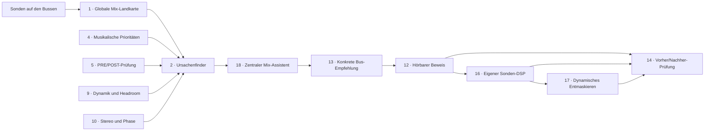
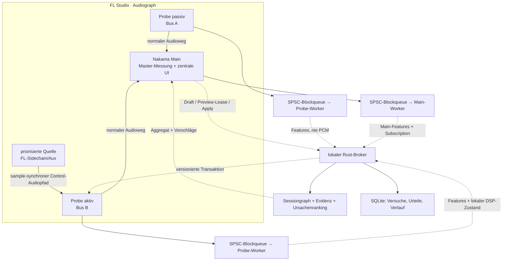
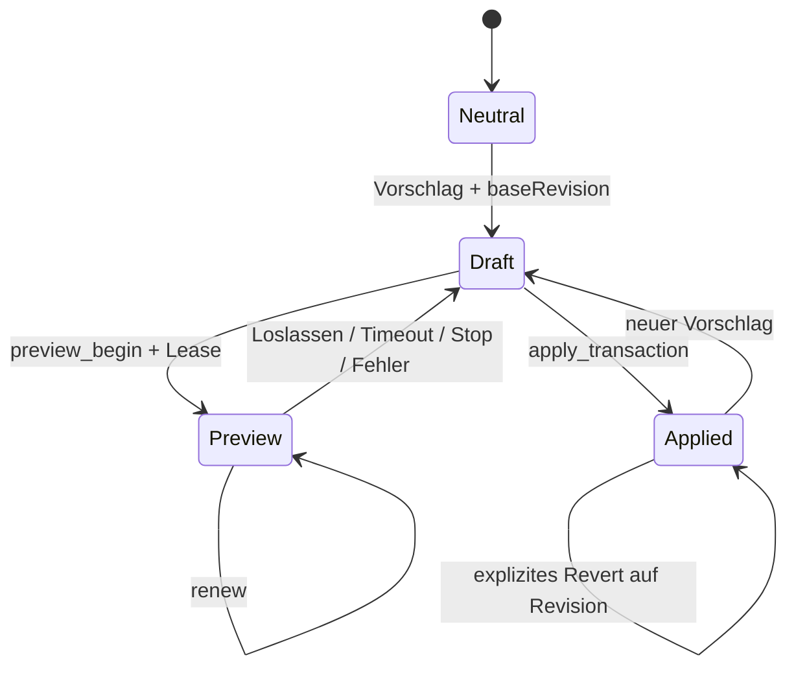
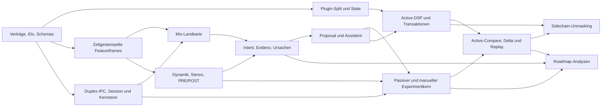

# Nakama mit Instrumentenbus-Sonden — Produkt-, Technik- und Implementierungsentwurf 0.4

- **Stand:** 2026-08-20
- **Status:** Technische Spezifikation mit ausführbarem Implementierungsphasenplan
- **Gegenstand:** Funktions-, Interaktions-, System- und Technikdesign; bewusst ohne visuelle Gestaltung
- **Bauentscheidung:** erteilt am 20.08.2026 (User: „okay dann fangen wir damit nächste session an"; Errata (a))
- **Errata 21.08.2026:** der Block direkt unter dieser Liste hat Vorrang vor dem Rest des Dokuments
- **Fassung 0.4 (20.08.2026):** Befunde des unabhängigen Prüfberichts
  ([`pruefbericht-sondenentwurf-2026-08-20.md`](pruefbericht-sondenentwurf-2026-08-20.md))
  eingearbeitet — Impersonation-Reihenfolge (§48.4/§66.2), CID-Ableitung
  samt eingefrorenem `JUCE_VST3_CAN_REPLACE_VST2=0` (§31.2/§44.1/§53.5),
  Frame-Bündelung entschieden (§33.1), `experiment_abort` (§33.3/§43/§46),
  Wrapper-NaN- und Tautologie-Nachschärfung (§0.1/§32.3), Zitat-/
  Datumskorrekturen (§29.2/§37.1), Store-Batching und WAL-Größentrigger
  (§53.9), Static-Lib-Randbedingung (§53.4), `SONDE-004` an Position 1
  (§65), Sichtbarkeitsvorbehalt für `aux_compare_pre` (§53.2),
  `sidechain_source`-Wertebereich (§53.8). Außerdem die
  **Produktentscheidung des Users vom 20.08.2026** in §0.3 — sie löst
  Prüfbericht-Befund A auf — und das **Arbeitsmodell Technik-voraus /
  Design-parallel** in §0.4.

## Errata und Entscheide nach dem Kontext-Interview (21.08.2026)

Dieser Block hat **Vorrang vor dem Rest des Dokuments**. Fassung 0.4 bleibt
darunter unverändert stehen (kein Umschreiben — die Stellen sind hier benannt,
nicht ausgetauscht); wo ein Absatz unten einem Punkt hier widerspricht, gilt
dieser Block. Quelle der Entscheide ist das Register in
[`CLAUDE.md`](../CLAUDE.md) (Datum + Wortlaut des Users) und das
Kontext-Interview vom 21.08.2026. Kennzeichnung: **Entscheid** = User-Wort mit
Datum · **Befund** = in der Session vom 21.08. gelesen oder gemessen ·
**Vorschlag** = eigene Formulierung, nicht abgenommen.

**(a) Bauentscheidung.** Entscheid 20.08.2026: „okay dann fangen wir damit
nächste session an". Kopfzeile und §68 trugen bis zum 21.08. „noch nicht
erteilt" — beide Stellen sind berichtigt (minimaler Edit, sonst unverändert).
Befund: der Bau läuft seit S0 (20.08.); Manifeste in `beweise/`.

**(b) Namen.** Entscheid 21.08.2026: „Nakama Gen = Main app · aktive sonde =
Nakama Probeeq · passive sonde = Nakama Suna · Bundle = Nakama Studio"
(Schreibweise „Probeeq" wie vom User getippt). Zuordnung zum Text:
**Nakama Main → Nakama Gen** · **Passive Probe / „Nakama Probe" → Nakama Suna**
· **Active Probe / „Nakama Active Probe" → Nakama Probeeq**. Die Namen
„Nakama Main/Probe/Active Probe" (§3.1–3.3, §30, §31.1, §44.1, §53.5 u. a.)
gelten als alte Arbeitstitel. Befund: Plugin-Codes `Eqcp`/`NkPr`/`NkAc` und
die CIDs (§31.2, §53.5, `../eq-copilot/identity/plugin-identities-v1.json`)
leiten sich aus Hersteller- und Plugin-Code ab, nicht aus Namen; die Bundle-
und Produktnamen `EQ-Copilot.vst3`, „Nakama Probe.vst3", „Nakama Active
Probe.vst3" (§53.5) sind durch den Entscheid überholt. Weil `bundle` und
`produktname` im Identitätsmanifest eingefrorene Zeilen sind, ist die
Umbenennung eine Identitätsänderung: **NAK-30**, kein Nebenbei-Refactor; bis
dahin bleiben Code, Bundle, Pipes und Schemas bei `EqCop*`/`Eqcp`.

**(c) §0.3 Produktarchitektur.** Entscheid 21.08.2026 zur Festlegung vom
20.08.: „Meine Entscheidung, so gesagt" — die Trennung Master-Plugin
konventionell / Prisma daneben gilt. **Aber** seit 21.08.: „Familie; Prisma nur
Studie" · Prisma-Herkunft „Meine Idee" · Hörkompass „Alles nur Studie" ·
„Glas/Licht raus; Profil nur Studie". Folge: alle Aussagen über die Prisma-App
als Begleit-App, read-only-Spiegel oder Broker-Client ohne
`control_capability` (§0.3 letzter Punkt, §0.4 Punkt 3 „zwei Design-Spuren",
§3.5 zweiter Absatz, §30 Zeile „Prisma-App", §31.1 letzter Punkt, §35.1) sind
**Studie, kein Bauziel** — kein Ticket, kein Client, kein Vokabular in der
Plugin-UI. Der Hörkompass-Zielvertrag bindet nichts im Produkt;
`geschmacksprofil.md` (§0.3) bindet nur die Studie. Beide liegen geparkt unter
`../eq-copilot/design/prisma-studie/docs/`. Gestaltungs-Vorgabe der Plugin-UI
ist der Figma-Stand des Users (siehe (h)); die Lesbarkeitsregel des
Design-Repos („in 2 Sekunden ablesbar", dessen Regel 6) bleibt dort bestehen.

**(d) Probeeq ist ein EQ.** Entscheid 21.08.2026: „die active Probe fester Name :
Nakama Probeeq ist ein vollwertiger hochwertiger EQ der mit Nakama
kommuniziert. er kann von nakama direkt anweisungen umsetzen aber auch ganz
normal manuell vom user benutzt werden". Folge: das Grundgesetz „berät nur"
(§0.1 erster Absatz; `CLAUDE.md` Wahrheitskern) gilt für **Gen und Suna**;
§0.1 „es gibt keine Parameterfernsteuerung und keinen eigenen hörbaren EQ"
beschreibt den heutigen Code (EQ-Copilot 0.3.0), nicht das Ziel. Die
§0.1-Forderung, der kanonische Produktplan müsse vorher erweitert werden, ist
durch den Wahrheitskern in `CLAUDE.md` (21.08.) erledigt; Schemata,
Audio-Sicherheitsregeln und Nulltest-Verträge bleiben Arbeit der Tickets
(`SONDE-006`, `SONDE-015`–`017`; Gates §49.2 Nr. 1–5) — Befund, keine neue
Regel. Die Recherche ist **Archiv** (Entscheid 21.08.: „Archiv") und liegt unter
`archiv/`; wo der Text „kanonischer Produktplan" sagt (§0.1), ist heute
`CLAUDE.md` gemeint. Befund: §30.1 definiert den **ersten** aktiven Kern (ohne
lineare Phase, Sättigung, Limiting); ob „vollwertig, hochwertig" später mehr
verlangt, ist nicht entschieden.

**(e) KI-/Claude-Schicht.** Entscheid 21.08.2026: „Nein – raus aus dem
Produkt". Der Advisor ist regelbasiert. Gestrichen sind alle Stellen, die einen
Sprachadapter, ein Sprachmodell oder eine erklärende KI voraussetzen oder
einhegen (per grep gefunden): §18 „Deterministik und KI" · §30 Zeile „KI" (die
Zeile „Roh-Audio … nie an externe Modelle" bleibt als Verbot gültig) · §31.1
„kennt … noch KI" · §34.2 „KI-Text" ·
§42.1 Schlussabsatz · §42.4 „Sprachmodell-Ausfall" · §46.3 „KI-Grenze" (ganz) ·
§46.4 dritter Punkt · §47.3 „Ein Sprachmodell darf …" · §47.7 „KI hat weder
Policy- noch Toolautorität" · §48.4 „externe KI ist opt-in" · §49.2 Gate 2
(ohne „KI") und **Gate 8 gegenstandslos** · §59 P5 letzter Punkt · §68 „oder
KI". Der Satz „Ohne Modell bleibt der gesamte Workflow funktionsfähig" ist
damit kein Fallback mehr, sondern der einzige Zustand. Befund, nicht erfasst:
die lokalen Analysemodelle der Roadmap (§47.2 Strukturmodell, §47.5
Ähnlichkeitssuche, §47.8 paarweises Präferenzmodell) sind keine
Erklärschicht; Roadmap nach R4, nicht entschieden.

**(f) Produktzahlen.** Entscheid 21.08.2026: „Hingenommen, passen aber". Status
aller Zahlen unten: **„Startwert des Users, änderbar"**. Das ersetzt die drei
Namen, die der Entwurf für dieselben Zahlen führt — „Verbindliche Entscheidung
0.3" (§27), „Entscheidung 0.3" (§30), „Design-Startwerte" (§33.2),
„verbindliches Startbudget" und „Hypothesen mit Abnahmetest" (§49.3).
Betroffen: 1 Main + 16 sichtbare Sonden / Verträge bis 32 (§27, §30, §57) ·
acht Band-Slots (§0.4, §44.2, §53.8) · ±12 dB manuell, ±3 dB Remote (§44.2) ·
1,5 dB Standard, 3 dB Hard-Cap (§27, §42.3). Eine Änderung läuft versioniert
mit Beleg, wie §27 letzter Absatz und §49.3 Schluss es ohnehin verlangen.
Befund: die Obergrenze 32 steht bereits im v3-Vertrag (§53.9;
`beweise/SONDE-005b.md` §7) — dort ist eine Änderung Versionierung, kein
Edit. Entscheid 21.08. zum Regelfall: „ich habe schlicht 5 genommen weil 16
bedeutet 16 geladene proben auf instrumenten … 16 plugins nur für eq kostet
auch massig leistung" (`Nakama-Design/abnahmen/`) — Regelfall einstellig, 16 =
Obergrenze.

**(g) UI-Sprache.** Entscheid 21.08.2026: „Englisch – mein Wort". §5 „Vier
Bedienebenen" (Beobachten · Beraten · Vorhören · Anwenden) und alle deutschen
UI-Beschriftungen dieses Entwurfs sind **Übersetzungsvorlagen, kein
Produkttext**. Befund: der Figma-Stand Gen (21.08., laut Interview-Protokoll
gesichtet) führt OBSERVE · ADVISE · AUDITION · APPLY; die Design-Abnahme vom 20.08.
(`Nakama-Design/abnahmen/2026-08-20-vorhoeren-markierte-zeile.md`) führt den
`AUDITION`-Reiter. Docs, Commits und Gespräch bleiben Deutsch.

**(h) UI-Beschreibungen sind technische Annahmen.** Entscheid 21.08.2026: „das
finale design wird aktuell in figma gemacht . alle 3 apps werden ein design
haben mit der selben identität. alle alten sind alt. Ein Design entwickelt
sich und ist nicht einfach da." · „Figma ist Quelle; Repo setzt um" · „Das ist
ein Designprototyp keine technikanleitung, design passt sich am ende der
funktion an." Folge: §0.4 Punkt 3 (drei Oberflächen samt Inhalt), §35.1 (drei
Informationsdichten), §9 (Rollenliste) und die Kachel-Bedienung sind
Annahmen des Entwurfs; die Oberfläche kommt aus Figma (User) über
`Projekte\Nakama-Design`. §0.4 Punkt 2 gilt weiter, nur in dieser Richtung:
Figma → Design-Repo → dieser Block. Gemessene Abweichungen zum Design-Stand
20./21.08. (Befund, nichts davon hier entschieden):

- **Main/Gen:** Abnahme 20.08. „Overview + Detail, eine Zeile je Quelle,
  16 von 16" (`abnahmen/2026-08-20-karte-alle-quellen.md`,
  `…-mechanik-main-overview-detail.md`); die drei Dichten aus §35.1
  (Quellenliste · Heatmap · Detailansicht) haben dort keine Entsprechung als
  drei Ansichten. Figma Gen (21.08., Interview-Protokoll): PROBE OVERVIEW als
  Zeilen × neun Frequenzspalten plus ADVISOR (PRIORITY / LIKELY CAUSE /
  SMALLEST TEST / LISTEN FOR / THEN).
- **Rollen:** `Nakama-Design/docs/oberflaechen-spezifikation.md` führt
  **fünf** (führt / trägt / begleitet / geschützt / bewusst verschmolzen), §9
  **sieben** (zusätzlich Impuls, Raum). Welche Liste gilt: offen.
- **Suna-Kachel:** §0.4 „Name, Verbindung, Frische; Bedienung läuft über
  Main"; das Design-Werkzeug (`werkzeug/formfaktor.html`, 21.08.) zeigt Name ·
  Rolle · Messposition · Frische · Warnung; die Kachel ist im Design-Repo
  „nicht begonnen" (`docs/sondenplan.md` im Design-Repo). Ob Name und Rolle an
  der Kachel bedient werden, welche Rollenliste (5 im Design, 7 in §9), wie
  viele Messzustände (5 im Design, 2 hier) und Arbeitsschritte (3 / 5) gelten:
  offen als **NAK-38** (UI-Rückfluss-Liste).
- **Probeeq-Parameter:** der Editor-Entwurf des Users (21.08.,
  `Nakama-Design/Nakama Designausarbeitungen selfmade/LIES-MICH.md` und
  Interview-Protokoll) zeigt **12** sichtbare Parameter je Band (BAND · TYPE ·
  FREQ · GAIN · Q · MODE | DYN · THRESH · RANGE · ATTACK · HOLD · RELEASE);
  §53.8 definiert **13** je Slot — zusätzlich
  `sidechain_source`; `enabled` erscheint im Figma-Stand als Griff-Zustand auf
  der Kurve, nicht in der Zeile. **Offen: NAK-33**, hier nicht entschieden.
- **Größen** (Entscheid 20.08., „so passt es 3 größen",
  `abnahmen/2026-08-20-groessen-alle-drei.md`): Gen 760×430 · Probeeq 700×420
  · Suna-Kachel 260×84. Stand bisher in keinem Technik-Dokument.

**(i) §53.4, §65, §66.1 sind von der Realität überholt** (Befund, gelesen
21.08.). Pfade real: `eq-copilot/identity/plugin-identities-v1.json` (nicht
`plugin/identity/`) · `schemas/v3/eq-ipc-v3.schema.json` (nicht
`eq-ipc-control`/`eq-domain`/`eq-experiment`) ·
`schemas/v3/flatbuffers/nakama_telemetry_v1.fbs` (nicht `feature-batch.fbs`) ·
`fixtures/v3/{gueltig,ungueltig}` (nicht `valid/invalid`) · generierter Code
in `plugin/vertrag/generiert/` und `broker/src/generiert/` (nicht
`generated/{cpp,rust}`) · Hostbrücke in `plugin/hostbridge/`;
`broker/src/transport/` und `coordinator.rs` existieren nicht (Eigentümer
`SONDE-010`/`011`). Die Verantwortungsgrenzen aus §53.4 Satz 1 bleiben; die
Namen sind präzisiert, wie §53.4 es erlaubt. §65 `SONDE-001` „laufen im CI":
es gibt **keine CI** — der Kanon ist `tools/beweise.ps1` mit **15 Beinen**
(A1–A11, B1, B3, B3b, B3c; fünf geplant: B2, B4–B7). §66.1: von den sieben
C++-Zielen sind zwei gebaut (`EqCopIdentityTest`, `EqCopHostContextTest`);
zusätzlich gebaut und dort nicht genannt: `EqCopSchemaTest` (Kanon B3c),
`EqCopHostProbeTest` (Kanon B3b, Wegwerfware `NkHp`), `EqCopAuxSpikeTest`
(Wegwerfware `NkSp`, nicht im Kanon — NAK-37).

**(j) Material-Kit-Front.** Entscheid 21.08.2026: „Nie abgenommen – bleibt
Provisorium". Die heutige Front von EQ-Copilot 0.3.0 ist das Provisorium, an
dem keine Arbeit mehr stattfindet; §0.4 „schlichte, ehrliche Bedien-UI" meint
bis zur Figma-Übersetzung genau dieses Provisorium. Die Anzeige-Pflichten
(§0.4 Punkt 1, §50.2) gelten für jede Fassung weiter. Vorschlag: die neuen
Oberflächen (Suna-Kachel in `SONDE-007b`, Probeeq-Editor ab P6) nicht als
zweites Provisorium bauen, sondern aus dem Figma-Stand über Nakama-Design.

**(k) FL-Termine A/B.** Entscheid 21.08.2026: „Termine bald; bis dahin S7".
Befund: beide Termine sind **noch nicht gelaufen** —
`%APPDATA%\evenacadia\nakama\spike\` ist leer (gemessen 21.08.); S4
(Capabilityreport) und Gate G0 warten; der Schließungsvorbehalt §65 für
`SONDE-005` bleibt. Bis dahin baut die Technik S7 (`SONDE-006`, State-Schema 2),
danach S8 (`SONDE-007a`). **Nachtrag 22.08.2026 (Befund):** beide Termine sind
gemessen (`docs/beweise/termin-a/`, `termin-b/`), S4 ist gebaut
(`docs/beweise/SONDE-004.md`, `eq-copilot/identity/host-capabilities-fl-v1.json`).
Die §53.6-Bits für FL (2 supported, 8 unsupported): `sample_accurate_automation`
ist **unsupported** — FL legt nie mehr als einen Punkt je Block in die Queue und
zerteilt stattdessen die Puffer bis auf 1 Sample (§53.7/§53.8 „Blockrampe" ist
damit FLs eigenes Verfahren); `presentation_latency` gemeldet, aber ohne
Impulsgolden ⇒ unsupported; `aux_priority_sidechain` und `aux_compare_pre` ohne PDC-Last und ohne
unterscheidbare Kanalreihenfolge gemessen ⇒ unsupported bis Termin A2 (NAK-44); `float64_processing` unsupported;
`contribution_aux` ungemessen ⇒ unsupported (§54). Host FL Studio 2026
26.1.4.5589, JUCE 8.0.9. Der Schließungsvorbehalt für `SONDE-005` kann fallen, sobald
G0 gelaufen ist.

**(l) §0.4 „Vom User festgelegt" (Technik voraus, Design parallel).** Befund:
dafür existiert kein Wortlaut des Users; was er festgelegt hat, ist die
Architektur vom 20.08. („Meine Entscheidung, so gesagt") und die
Bauentscheidung (a). Das Arbeitsmodell „Technik voraus" ist ein Vorschlag, den
der Bau seit dem 20.08. faktisch lebt — es heißt ab jetzt so.

**(m) „Zwölf von zwanzig gewählten Kernfunktionen" (§0.2, §22).** Befund: die
Zwanziger-Liste und die Auswahl existieren in keiner Datei; der Satz ist nicht
rekonstruierbar. Er gilt als Codex-Annahme der Fassung 0.1; der
Kernfunktionen-Satz des Entwurfs ist damit ein Startwert wie die Zahlen in (f).
Frage an den User offen als **NAK-39**.

---

## 0. Zweck und Einordnung

Dieser Entwurf hält fest, wie Nakama maximal sinnvoll erweitert werden könnte, wenn neben der
Hauptinstanz auf dem Master eigene Sonden auf den Instrumenten- und Gruppenbussen liegen.

Der User hat für den ersten **Kernumfang** folgende Punkte aus der zuvor beschriebenen
20-Punkte-Vision gewählt:

1. globale Mix-Landkarte,
2. Ursachenfinder,
4. musikalische Prioritäten,
5. Pre/Post-Kettenprüfung,
9. Dynamik- und Headroom-Analyse,
10. Stereo- und Phasenanalyse,
12. hörbarer Beweis,
13. konkrete Bus-Empfehlungen,
14. Vorher/Nachher-Prüfung,
16. Fernsteuerung des eigenen Sonden-DSPs,
17. intelligentes dynamisches Entmaskieren,
18. zentraler Mix-Assistent.

Die übrigen Punkte **3, 6, 7, 8, 11, 15, 19 und 20** stehen gesammelt am Ende als Roadmap.

### 0.1 Verhältnis zum heutigen Nakama-Vertrag

Der aktuelle, kanonische Nakama-Vertrag bleibt vorerst unverändert:

- Nakama misst und berät;
- der normale Analysepfad bleibt sampleidentisch, mit 0 Samples Latenz und 0 Tail;
- es gibt keine Parameterfernsteuerung und keinen eigenen hörbaren EQ;
- der User führt Änderungen selbst aus.

Die bereits gebaute, eng begrenzte Ausnahme ist der bewusst per Toggle aktivierte Hörmarker: bei
offenem Editor, im Realtime-Modus und heute mit dem Gate `playing || !hasTransport`, nie im
Offline-Render. Der `!hasTransport`-Zweig ist formal fail-open; im ausgelieferten VST3-Format ist
er praktisch ein toter Zweig, weil der JUCE-Wrapper `getPosition()` nie leer liefert und
`hatTransport` damit ab dem ersten Block immer wahr wird (Prüfbericht 1.2). Der eigentliche
Mangel ist, dass `hatTransport` „Transport unbekannt" gar nicht ausdrücken kann. Beides wird hier
ausdrücklich als zu schließende Lücke geführt. Der Marker ändert den passiven Grundvertrag nicht;
die Zielmigration verlangt gültiges `playing=true`. Die spätere Remote-Preview erhält zusätzlich
echte Hold-to-hear- und Lease-Semantik.

Dieser Entwurf ist deshalb eine **zukünftige Produkterweiterung**, keine Beschreibung des bereits
Gebauten. Besonders die Punkte **16 und 17** führen erstmals eine aktive Sondenvariante ein. Vor
einer Umsetzung müssten der kanonische Produktplan, die Schemata, die Audio-Sicherheitsregeln und
die Nulltest-Verträge ausdrücklich erweitert werden. Das darf nicht als stiller Ausbau der
heutigen passiven Instanz geschehen.

Für den Ist-Stand gilt folgende Quellenhierarchie:

- Quellcode und Tests sind die letzte Wahrheit; [`CLAUDE.md`](../CLAUDE.md) und
  [`plugin-wissen.md`](plugin-wissen.md) beschreiben den aktuellen Standalone-Broker;
- [`FL-EQ-Copilot-Recherche.md`](archiv/FL-EQ-Copilot-Recherche.md) und
  [`NAKAMA-SPECTRAL-FIELD-BAUPLAN.md`](archiv/NAKAMA-SPECTRAL-FIELD-BAUPLAN.md)
  (beide seit 21.08.2026 im Archiv, Errata (d))
  sind wertvolle historische Entwurfsquellen, enthalten aber noch Verweise auf die entfernte
  Tauri-Brokerarchitektur und sind dafür **keine** Codewahrheit;
- [`BENCHMARK-STUDIE-RESO-SMARTEQ-PROQ.md`](../eq-copilot/docs/BENCHMARK-STUDIE-RESO-SMARTEQ-PROQ.md)
  bleibt eine Forschungsquelle, nicht der Nachweis einer bereits gebauten Funktion.

Die in Fassung 0.1 genannte Datei `FL-Inter-Plugin-Kommunikation-Wissen.md` existiert in diesem
Repository nicht. Ihre Rolle übernehmen der kanonische Produktplan, `plugin-wissen.md`, die
versionierten Schemata und der reale Quellcode.

### 0.2 Geltungsbereich dieser Fassung

Teil I (Abschnitte 1–28) hält das gewählte Produktverhalten fest. Teil II (Abschnitte 29–52)
entscheidet den bestgeeigneten technischen Ansatz für **alle zwölf Kern- und alle acht
Roadmap-Funktionen** und verankert ihn im heutigen Nakama. Teil III schneidet daraus einen
ausführbaren, gate-basierten Implementierungsplan mit Releasegrenzen, Zuständigkeiten,
Dateizielen, Migrationsreihenfolge und erster Ticketfolge. Nicht enthalten sind visuelles
Detaildesign, Kalender- oder Aufwandsschätzungen; sie dürfen die technische Abhängigkeitsfolge
nicht ersetzen.

### 0.3 Produktentscheidung 20.08.2026 — Master-Plugin konventionell, Prisma-App als Zusatz

Der User hat am 20.08.2026 die Produktarchitektur ausdrücklich festgelegt:

- **Nakama Main (Master-Plugin) + Sonden sind das Kernprodukt** und erhalten
  eine bewusst **konventionellere Arbeits-UI** in FL Studio. Quellenliste,
  Heatmap und Detailansicht (§35.1) sind dort legitime Dauerarbeitsflächen;
  ihr Maßstab ist die Lesbarkeit (`geschmacksprofil.md`), nicht der
  Hörkompass-Zielvertrag.
- **Die Prisma-App ist eine eigenständige Begleit-App**, die NEBEN
  Hauptplugin und Sonden existiert — eine **Addition, nicht der Master-Hub**
  für die Sonden. Kein Teil des Sonden-Workflows setzt sie voraus; Main in
  FL bleibt die einzige vollständige tägliche Arbeitsfläche (§31.1).
- Der **Hörkompass-Zielvertrag**
  ([`visuelles-zielbild-hoerkompass.md`](../eq-copilot/design/prisma-studie/docs/visuelles-zielbild-hoerkompass.md)
  — Studie, geparkt seit 21.08.2026, Errata (c); gesund = leeres Glas, Befund
  statt Musik, kein Dauer-Visualizer) **gilt
  der Prisma-App**, nicht der Master-Plugin-UI. Damit ist der im
  Prüfbericht als Befund A beschriebene Konflikt zwischen Kernfunktion 1
  und dem Zielvertrag aufgelöst: Landkarte und Zielvertrag leben in zwei
  verschiedenen Oberflächen.
- Technisch bindet sich die Prisma-App, wenn sie gebaut wird, wie eine
  weitere Main-Instanz als **read-only Spiegel** an Broker und Sitzung an
  (§30); sie erhält nie eine `control_capability` und steuert keine Sonde.

### 0.4 Arbeitsmodell 20.08.2026 — Technik voraus, visuelles Design als parallele Spur

Vom User festgelegt: Der technische Unterbau wird nach diesem Phasenplan
mit einer **schlichten, ehrlichen Bedien-UI** vorausgebaut; das visuelle
Design läuft **parallel und gesondert** und wird nach Abnahme je Ansicht
als Update eingespielt. Der Plan trägt das ohne Änderung, denn er enthält
bewusst kein visuelles Design (Kopfzeile, §0.2, §28) — alle Exit-Gates
prüfen Bedienbarkeit, Ehrlichkeit und Budgets, nie Optik. Verbindlich
bleiben dabei:

1. **Anzeige-Pflichten sind Verträge, kein Stilmittel.** Frische/stale,
   Unsicherheit/Konfidenz, `arming`/`audible_ready`, Capability-
   Degradation, Konfliktauflösung und „welche Aktion gerade nicht aktiv
   ist" müssen in jeder UI-Fassung sichtbar sein. Die Interims-UI darf
   schlicht sein, aber nie einen nicht existierenden Zustand vortäuschen
   (§50.2).
2. **Design ändert das Kleid, nicht den Vertrag.** Die spätere
   Design-Fassung gestaltet frei, WIE etwas aussieht. Will die
   Designarbeit ändern, WAS gezeigt wird (Ansichten, Informationsset),
   fließt das VOR dem betroffenen Phasen-Gate in diesen Plan zurück
   (§35.1/§46.2) — nie still im Nachhinein.
3. **Zwei getrennte Design-Spuren:** die Prisma-App (Hörkompass-
   Zielvertrag, läuft bereits, vom Phasenplan entkoppelt) und die
   konventionelle Plugin-UI (Maßstab Lesbarkeit). Letztere umfasst **drei
   Oberflächen**: Main (die vollständige Arbeitsfläche, §31.1), den
   Editor der Active Probe (lokal voll bedienbares EQ-Plugin — acht
   Band-Slots, manuelle Bereiche ±12 dB, fernsteuerungsfrei bewiesen in
   P6 — plus Draft-/Preview-/Pairing-Sichtbarkeit) und den Editor der
   Passive Probe (minimale Status-/Identitätskachel: Name, Verbindung,
   Frische; null Hostparameter nach §53.8, Bedienung läuft über Main).
   Beide Spuren laufen durch den Kreativ-Prozess des Users. Die
   konventionelle Plugin-UI-Spur arbeitet im eigenen, bewusst
   kontextreinen Projekt `Projekte\Nakama-Design` (Assettruhe +
   bindendes Abnahmen-Protokoll); Ergebnisse fließen nach User-Abnahme
   als Design-Update ein.
4. **Architektur hält den Tausch billig:** UI ist die oberste,
   austauschbare Schicht (§53.3); Engine und Zustandslogik kennen keine
   Optik. Erste designrelevante Sichtbarkeitspunkte sind R1/P3
   (Landkarte + Setup), R2/P5 (Assistent) und R3/P7 (Preview/Apply).

---

## 1. Produktidee in einem Satz

**Nakama wird von einem Master-Analysator zu einem quellenbewussten Mix-System: Es sieht die
Summe und ihre wichtigsten Instrumentenbusse gleichzeitig, findet den wahrscheinlichen
Verursacher eines Problems, beweist den Befund hörbar, schlägt eine konkrete Änderung am
richtigen Bus vor und kann diese auf ausdrücklichen Wunsch ausschließlich im eigenen
Sondenprozessor ausführen und überprüfen.**

Der entscheidende Sprung lautet:

```text
Heute:  „Im Master stimmt bei 900 Hz etwas nicht.“

Ziel:   „Das Problem entsteht hauptsächlich zwischen Klavier und Chor.
         Im Refrain verdeckt das Klavier den priorisierten Chor zwischen
         700 Hz und 1,2 kHz. Höre den Unterschied, teste 1,5 dB dynamische
         Absenkung nur auf dem Klavierbus und prüfe danach dieselbe Passage.“
```

Nakama soll damit nicht einfach mehr Messwerte anzeigen. Es soll die vollständige Kette
**Erkennen → Zuordnen → Verstehen → Hören → Handeln → Überprüfen** schließen.

---

## 2. Produktversprechen

Nach einer verwertbaren Passage soll Nakama sechs Fragen beantworten können:

1. **Was** fällt im Gesamtmix auf?
2. **Welche Quelle oder Kette** verursacht es wahrscheinlich?
3. **Ist es angesichts der musikalischen Rollen überhaupt ein Problem?**
4. **Wie kann der User den Befund hören**, statt nur einer Grafik zu glauben?
5. **Was ist der kleinste sinnvolle Eingriff und auf welchem Bus gehört er hin?**
6. **Was hat sich danach messbar und hörbar verändert?**

### 2.1 Was Nakama ausdrücklich nicht werden soll

- kein unkontrollierter Auto-Mixer;
- kein System, das jeden Mix auf dieselbe Kurve zwingt;
- kein Ersatz für musikalische Entscheidungen;
- kein allgemeiner Fernzugriff auf FLs Mixer oder fremde Plugins;
- kein Analyzer, der den User mit zwanzig gleichrangigen Warnungen überlädt;
- kein Loudness-Maximierer;
- kein System, das eine messbare Änderung automatisch als „klingt besser“ bezeichnet.

---

## 3. Das System aus Usersicht

### 3.1 Nakama Main

Die Hauptinstanz liegt auf dem Master oder Pre-Master. Sie ist die zentrale Arbeitsfläche und:

- sieht die fertige Summe;
- empfängt Messdaten der Sonden;
- ordnet alle Quellen derselben Projektsitzung zu;
- priorisiert Befunde;
- zeigt Begründung und Unsicherheit;
- startet Hörproben und Vergleiche;
- schickt bestätigte Einstellungen an eigene aktive Sonden.

Nakama Main muss auch allein funktionieren. Ohne Sonden darf es weiterhin eine ehrliche
Masterdiagnose liefern, aber keine sichere Quellenzuordnung behaupten.

### 3.2 Passive Nakama Probe

Eine passive Sonde liegt beispielsweise auf:

- Klavierbus,
- Chor-/Vocalbus,
- Drumbus,
- Bassbus,
- Streicher-/Atmosphärenbus,
- Reverb- oder Effektbus.

Sie hört genau das Signal an ihrer Insert-Position, misst es und leitet es im normalen Betrieb
unverändert weiter. Die einzige Ausnahme bleibt der ausdrücklich aktivierte, renderneutrale
Hörmarker. Sie ist die sichere Standardform.

### 3.3 Aktive Nakama Probe

Die aktive Variante besitzt zusätzlich einen eigenen, klar begrenzten Prozessor. Dieser kann
von Nakama Main bedient werden, aber nur nach sichtbarer Freigabe des Users.

Sie ist kein Zugang zu einem fremden EQ. Nakama steuert ausschließlich Funktionen, die in der
eigenen Sonde gebaut und als normale Plugin-Parameter gespeichert werden.

### 3.4 Pre/Post-Paar

Zwei Sonden können dieselbe Kette einrahmen:

```text
Klavier → PRE-Sonde → vorhandene Effektkette → POST-Sonde → Master
```

Dadurch kann Nakama nicht nur sagen, wie der Klavierbus jetzt klingt, sondern was die
dazwischenliegende Kette tatsächlich verändert hat.

### 3.5 Begleitdienst

Ein lokaler Begleitdienst darf Discovery, Sitzungszuordnung, Speicherung und größere
Auswertungen übernehmen. Er bleibt aus Usersicht Infrastruktur. Die tägliche Arbeit findet
weiterhin in Nakama Main innerhalb von FL Studio statt; kein Terminal ist nötig.

Davon getrennt ist die **Prisma-App** (§0.3): eine eigenständige, optionale
Begleit-App neben Hauptplugin und Sonden. Sie ist Addition, nie Master-Hub —
kein Sonden-Workflow hängt von ihr ab.

---

## 4. Was Main und Sonden austauschen

Teil I beschreibt die Zusammenarbeit aus Usersicht; der verbindliche Transport- und
Transaktionsvertrag folgt in Teil II, Abschnitt 33. Aus Usersicht braucht sie folgende Inhalte:

### Sonde → Main

- Identität, Name und Rolle des Busses;
- Position als normaler, PRE- oder POST-Messpunkt;
- aktuelle Aktivität und Messqualität;
- Frequenzverteilung und auffällige Bereiche;
- Lautheit, Peaks, Dynamik und Headroom-Beitrag;
- Stereobreite, Korrelation und Mono-Risiko;
- zeitliche Zuordnung zur gerade laufenden Passage;
- Zustand des eigenen Sondenprozessors;
- Information, ob eine Messung frisch, unvollständig oder veraltet ist.

### Main → Sonde

- Messung starten, stoppen oder zurücksetzen;
- eine Passage oder einen Frequenzbereich genauer beobachten;
- PRE- und POST-Instanzen zu einem Paar verbinden;
- eine kurze Hörprobe vorbereiten;
- einen Änderungsvorschlag als noch nicht aktiven Entwurf senden;
- einen Entwurf vorhören, bestätigen, zurücknehmen oder neutralisieren;
- eine dynamische Entmaskierungsbeziehung zwischen zwei eigenen Sonden konfigurieren.

Das normale Audiorouting bleibt bei FL Studio. Analysekommunikation darf den Audiofluss niemals
blockieren.

---

## 5. Vier Bedienebenen

Das Produkt trennt vier Ebenen sichtbar. Dadurch ist jederzeit klar, ob Nakama nur beobachtet
oder tatsächlich Klang verändert.

| Ebene | Verhalten | Klangänderung |
|---|---|---|
| **Beobachten** | Main und Sonden messen und bauen die Mix-Landkarte auf. | Nein |
| **Beraten** | Nakama erklärt Ursache, Priorität und einen kleinen Versuch. | Nein |
| **Vorhören** | Eine Änderung wird nur gehalten oder kurz befristet hörbar gemacht. | Vorübergehend |
| **Anwenden** | Der User bestätigt einen Zustand im eigenen aktiven Sonden-DSP. | Ja, sichtbar und rückgängig machbar |

Ein Befund darf nie direkt von **Beobachten** zu **Anwenden** springen. Dazwischen liegen immer
eine verständliche Empfehlung und eine bewusste Userhandlung.

---

## 6. Zusammenspiel der zwölf Kernfunktionen



Die Funktionen sind kein loses Paket. Die Landkarte liefert Kontext, Prioritäten geben diesem
Kontext eine musikalische Bedeutung, der Ursachenfinder wählt den wahrscheinlich richtigen
Bus, der Assistent formuliert den nächsten Schritt und Hörprobe plus Nachmessung prüfen ihn.

---

## 7. Kernfunktion 1 — Globale Mix-Landkarte

### Ziel

Der User soll den Mix nicht mehr nur als eine Masterkurve sehen, sondern als zusammenhängendes
System aus benannten Quellen.

### Was die Landkarte abbildet

- welche Busse gerade aktiv sind;
- wo jede Quelle im Frequenzraum hauptsächlich Energie trägt;
- welche Quelle Vordergrund, Fundament, Begleitung oder Raum bildet;
- welche Quellen dauerhaft und welche nur kurz auftreten;
- wo Lautheit, Dynamik und Stereobreite einer Quelle im Verhältnis zur Summe liegen;
- welche Sonde fehlt, veraltet ist oder zu wenig verwertbares Signal gesehen hat;
- welche aktive Sonde gerade einen bestätigten Eingriff ausführt.

### Nutzerwirkung

Statt „zu viele Tiefmitten im Master“ sieht der User beispielsweise:

> Die Tiefmitten entstehen überwiegend auf dem Klavierbus. Der Chor trägt dort ebenfalls bei,
> ist aber leiser. Der Drumbus ist in dieser Passage nicht beteiligt.

### Ehrliche Grenze

Die Summe ist besonders hinter Sättigung, Kompression oder Limiting nicht einfach die sichtbare
Addition aller Sonden. Nakama zeigt deshalb Beiträge und Wahrscheinlichkeiten, keine erfundene
mathematische Gewissheit.

---

## 8. Kernfunktion 2 — Ursachenfinder

### Ziel

Nakama soll zu einem Masterbefund den wahrscheinlichsten Entstehungsort nennen.

### Mögliche Ursachenklassen

- eine einzelne Quelle besitzt eine Resonanz oder Überbetonung;
- zwei Quellen konkurrieren gleichzeitig im selben Bereich;
- eine Effektkette erzeugt das Problem erst zwischen PRE und POST;
- mehrere kleine Beiträge summieren sich erst auf dem Master;
- ein Peakproblem stammt überwiegend von einem transienten Bus;
- eine Stereoveränderung entsteht durch eine bestimmte Quelle oder Kette;
- die Daten reichen noch nicht für eine belastbare Zuordnung.

### Ergebnisform

Jeder Ursachenbefund enthält:

1. **Ort:** betroffener Bus und optional PRE/POST-Stelle;
2. **Beobachtung:** was gemessen wurde;
3. **Zusammenhang:** warum dieser Bus als Ursache infrage kommt;
4. **Alternativen:** weitere mögliche Verursacher;
5. **Sicherheit:** hoch, mittel oder noch unklar;
6. **nächster Beweisschritt:** was abgespielt oder vorgehört werden soll.

### Beispiel

> **Wahrscheinliche Ursache: Klavierbus, 180–280 Hz.** Der Aufbau tritt in 78 % der
> aktiven Klaviermomente auf und wächst auf dem Master gleichzeitig mit. Der Bass war in der
> gemessenen Passage nicht aktiv. Sicherheit: hoch. Nächster Schritt: Bereich am Klavierbus
> level-normalisiert vorhören.

---

## 9. Kernfunktion 4 — Musikalische Prioritäten

### Ziel

Nakama soll nicht alles, was sich überlappt, automatisch „reparieren“. Es muss wissen, welches
Element in einer Passage führen, tragen, begleiten oder bewusst verschmelzen soll.

### Rollen

Eine Sonde kann eine einfache musikalische Rolle erhalten:

- **Fokus:** soll deutlich verständlich und vorne bleiben;
- **Fundament:** trägt Körper, Harmonie oder tiefen Halt;
- **Begleitung:** darf Platz machen, ohne charakterlos zu werden;
- **Impuls:** kurze Transienten sollen erhalten bleiben;
- **Raum:** Reverb, Atmosphäre und Breite dürfen verschmelzen;
- **Geschützt:** dieser Klangbereich soll nicht automatisch vorgeschlagen werden;
- **Bewusst verschmolzen:** Überdeckung ist gewollt und kein Fehler.

Rollen bleiben optional. Ohne Rolle darf Nakama messen, muss Interpretationen aber vorsichtiger
formulieren.

### Wichtigste Regel

**Die Absicht des Users schlägt die statistisch „sauberere“ Lösung.**

Wenn im Refrain der Chor führen soll, darf Nakama dem Klavier eine kleine dynamische
Rücksichtnahme vorschlagen. Wenn Klavier und Chor bewusst zu einer Fläche verschmelzen sollen,
darf derselbe Messwert nur als Information erscheinen.

### Abgrenzung zur späteren Abschnittserkennung

Im Kernumfang setzt der User die Priorität für die gerade untersuchte Passage. Eine automatisch
wechselnde Rollenlogik für Intro, Strophe und Refrain gehört zu Roadmap-Punkt 6.

---

## 10. Kernfunktion 5 — PRE/POST-Kettenprüfung

### Ziel

Nakama soll zeigen, was eine vorhandene Effektkette tatsächlich mit einem Bus macht.

### Fragen, die das System beantworten soll

- Welche Frequenzbereiche hebt oder senkt die Kette wirklich?
- Verändert sie nur den Klang oder auch die Lautheit?
- Komprimiert sie Transienten stärker als erwartet?
- verengt oder verbreitert sie das Signal?
- verschlechtert sie Mono-Verträglichkeit oder Phasenlage?
- behebt sie den ursprünglichen Befund oder verschiebt sie ihn nur?
- erzeugt sie einen Nebeneffekt in einem anderen Bereich?

### Bedienung

1. Eine Sonde wird als **PRE**, eine zweite als **POST** markiert.
2. Beide erhalten dieselbe Paarzuordnung.
3. Der User spielt dieselbe Passage einmal ab.
4. Nakama gleicht Pegel und Zeit soweit belastbar ab.
5. Das Ergebnis beschreibt die Veränderung der Kette, nicht bloß zwei Kurven.

### Beispiel

> Die Kette reduziert 2–5 kHz leicht, nimmt dem Klavier aber gleichzeitig deutlich
> Stereobreite. Die Härte sinkt, die Breite fällt stärker als beabsichtigt. Empfehlung:
> Imaging-Stufe einzeln prüfen, bevor weiterer EQ eingesetzt wird.

### Grenze

Ist die zeitliche Ausrichtung durch latente oder nichtlineare Fremdplugins unsicher, lautet das
Ergebnis „wahrscheinliche PRE/POST-Wirkung“ statt einer kausalen Behauptung.

---

## 11. Kernfunktion 9 — Dynamik- und Headroom-Analyse

### Ziel

Nakama soll erklären, wo Dynamik entsteht, wo sie verloren geht und welcher Bus den Master am
stärksten in Kompression oder Limiting treibt.

### Pro Bus und Master relevant

- laufende und kurzfristige Lautheit;
- Peaks und True Peaks;
- Abstand zwischen Durchschnitt und Spitze;
- Transientenstärke und -dichte;
- anhaltende Energie gegenüber kurzen Impulsen;
- Veränderung durch eine PRE/POST-Kette;
- Beitrag zu knappem Master-Headroom;
- Verhalten in Stille, Ausklang und sehr dynamischen Passagen.

### Typische Antworten

- „Nicht der Bass, sondern drei einzelne Drumspitzen treiben den Limiter.“
- „Der Klavierbus ist laut, besitzt aber noch gesunde Dynamik; pauschale Kompression wäre nicht
  der erste Hebel.“
- „Die Buskette gewinnt 2 dB Lautheit, verliert aber einen großen Teil des Crest-Faktors.“
- „Der Chor braucht eher einen stabileren Pegel als zusätzlichen Hochton.“

### Produktregel

Nakama optimiert nicht automatisch auf maximale Lautheit. Bei dynamischer Musik ist erhaltene
Bewegung ein Zielwert und kein Fehler.

---

## 12. Kernfunktion 10 — Stereo- und Phasenanalyse

### Ziel

Nakama soll nicht nur erkennen, dass der Master schmal, diffus oder mono-gefährdet ist, sondern
welcher Bus oder welche Kette dazu beiträgt.

### Funktionsumfang

- Breite pro Quelle und Gesamtmix;
- Korrelation und mögliche Gegenphasigkeit;
- Mono-Verlust insgesamt und in einzelnen Frequenzbereichen;
- ungewöhnlich breiter Tiefbass;
- seitliche Energie, die nur aus einem Effektbus stammt;
- PRE/POST-Vergleich einer Imaging-, Reverb- oder Mastering-Stufe;
- Hinweis, ob ein Problem dauerhaft oder nur bei bestimmten Klängen auftritt.

### Beispiel

> Der Mix wird nicht durch die Instrumentenbusse schmal. Die Verengung entsteht erst hinter
> der markierten Mastering-Stufe. PRE ist stabil breit, POST deutlich enger.

### Produktregel

„Breiter“ ist nicht automatisch „besser“. Nakama bewertet Stabilität, Mono-Verträglichkeit und
musikalische Rolle gemeinsam.

---

## 13. Kernfunktion 12 — Hörbarer Beweis

### Ziel

Der User soll einen Befund hören können, bevor er ihm vertraut oder eine Änderung übernimmt.

### Mögliche Hörbeweise

1. **Frequenzfokus:** Solange der User die Hörfunktion hält, wird nur der auffällige Bereich der
   Mastersumme hervorgehoben oder isoliert.
2. **Bus-Wirkung:** Eine aktive Sonde führt eine vorgeschlagene Änderung nur vorübergehend aus.
3. **Delta-Hören:** Bei einem geeigneten PRE/POST-Paar wird die Wirkung der Kette als
   hörbarer Unterschied verständlich gemacht.
4. **Level-Match-A/B:** Vorher und Vorschau werden auf vergleichbare Lautheit gebracht, damit
   „lauter“ nicht mit „besser“ verwechselt wird.
5. **Manuell geführter Beweis:** Im rein passiven Betrieb sagt Nakama genau, welchen Bus oder
   Effekt der User kurz solo beziehungsweise bypass hören soll.

### Sicherheitsverhalten

- Eine Hörprobe ist zunächst **momentan oder zeitlich begrenzt**.
- Loslassen, Zeitablauf, Verbindungsabbruch oder Transportwechsel beendet die Vorschau sanft.
- Eine Vorschau wird nie still als dauerhafte Einstellung gespeichert.
- Pegelsprünge werden vermieden; der User sieht jederzeit, was gerade hörbar verändert wird.

Der bestehende, eng begrenzte Hörmarker kann dafür die passive Ausgangsbasis bilden. Eine
Bus-spezifische Klangvorschau benötigt dagegen die neue aktive Sonde.

---

## 14. Kernfunktion 13 — Konkrete Bus-Empfehlungen

### Ziel

Nakama soll nicht bei „Tiefmitten prüfen“ stehen bleiben. Der User erhält einen kleinen,
ausführbaren Versuch am wahrscheinlich richtigen Ort.

### Aufbau jeder Empfehlung

1. **Wo:** Bus und Insert-Bereich;
2. **Was:** Filter, Gain-, Breiten- oder Dynamikaktion;
3. **Startwert:** bewusst kleiner Ausgangspunkt;
4. **Wann:** dauerhaft oder nur bei gleichzeitig aktiver Gegenquelle;
5. **Warum:** musikalischer Zweck in einem Satz;
6. **Hörziel:** worauf der User achten soll;
7. **Stoppbedingung:** wann die Änderung zu weit geht;
8. **Sicherheit:** wie belastbar der Vorschlag ist;
9. **Ausführung:** manuell im gewählten Tool oder als Vorschau im eigenen Sonden-DSP.

### Beispiel

> **Klavierbus · dynamischer Bell-Cut · 850 Hz · Start −1,5 dB · breit.** Nur absenken,
> wenn der priorisierte Chor gleichzeitig aktiv ist. Ziel: mehr Textverständlichkeit, ohne dem
> Klavier Körper zu nehmen. Stoppen, sobald das Klavier kleiner oder hohl wirkt. Sicherheit:
> mittel bis hoch.

### Regel

Nakama empfiehlt zuerst den kleinsten plausiblen Eingriff. Es soll nicht fünf Busse gleichzeitig
„optimieren“.

---

## 15. Kernfunktion 14 — Vorher/Nachher-Prüfung

### Ziel

Nach einer manuellen oder aktiven Änderung wird dieselbe Passage erneut geprüft.

### Vergleich

Nakama stellt gegenüber:

- den ursprünglichen Befund;
- die konkrete Änderung;
- Veränderung am bearbeiteten Bus;
- Veränderung auf dem Master;
- mögliche Nebeneffekte bei Dynamik, Breite und Lautheit;
- den Hörvergleich bei angeglichener Lautheit;
- das Urteil des Users: **behalten**, **verwerfen** oder **noch unklar**.

### Vergleichbarkeitsregeln

- möglichst dieselbe Projektpassage;
- ähnliche aktive Quellen;
- gleicher Messpunkt und gleiche Samplerate;
- Lautheitsabgleich vor einer Klangwertung;
- Warnung oder Sperre, wenn das musikalische Material nicht vergleichbar ist.

### Wichtige Grenze

Nakama darf sagen:

> Der Konfliktbereich ist um 1,2 dB zurückgegangen, die Chorverständlichkeit wurde vom User als
> besser markiert und die Klavierbreite blieb stabil.

Es darf nicht allein aus der Kurve folgern:

> Der Mix ist jetzt objektiv besser.

Der Kernumfang hält Baseline und Ergebnis für den aktuellen Versuch. Ein langfristiger Vergleich
zwischen Projektständen gehört zu Roadmap-Punkt 15.

---

## 16. Kernfunktion 16 — Fernsteuerung des eigenen Sonden-DSPs

### Ziel

Eine Empfehlung kann direkt am richtigen Bus vorgehört und nach Bestätigung angewendet werden,
ohne dass Nakama fremde Plugins oder FLs Mixer steuern muss.

### Vorgeschlagener aktiver Werkzeugumfang

Der erste aktive Sondenprozessor bleibt absichtlich EQ- und Korrektur-zentriert:

- Eingangs- und Ausgangstrim;
- Hoch- und Tiefpass;
- Bell-, Shelf- und Notch-Bänder;
- dynamische EQ-Bänder;
- Bearbeitung von Mitte oder Seite pro geeignetem Band;
- begrenzte Stereobreite und optional Mono-Bass;
- automatische Lautheitsangleichung für die Vorschau.

Polarität und Laufzeit bleiben zunächst Analysefunktionen. Eine spätere Korrektur braucht einen
eigenen Kohärenz-, Latenz- und Recallvertrag und wird nur für nachweisliche Aufnahme-/Layerpaare
in Betracht gezogen.

Ein kompletter Channelstrip mit Sättigung, Reverb, Limiter und kreativen Effekten gehört nicht
in diesen ersten aktiven Umfang. Nakama soll Ursachen korrigieren und nicht alle vorhandenen
Mixwerkzeuge ersetzen.

### Interaktion

1. Nakama erzeugt einen **Entwurf**, der noch nichts verändert.
2. Der User kann den Entwurf **halten oder kurz vorhören**.
3. Der User wählt **Anwenden** oder **Verwerfen**.
4. Ein angewendeter Zustand ist im Projekt sichtbar, speicherbar und vollständig rückgängig.
5. Nakama misst danach dieselbe Passage erneut.

### Harte Grenze

Nakama kann damit weder Fruity Parametric EQ 2 noch Pro-Q, Ozone oder einen FL-Mixerfader
fernsteuern. Für solche Werkzeuge bleibt die Empfehlung eine verständliche manuelle Anleitung.

### Verhalten bei Kommunikationsverlust

- Ein bereits bestätigter statischer Zustand bleibt lokal stabil und verändert sich nicht
  plötzlich.
- Eine noch nicht bestätigte Vorschau kehrt sanft in den vorherigen Zustand zurück.
- Es werden keine neuen Fernbefehle angenommen, bis die Sitzung eindeutig wiederverbunden ist.
- Der gespeicherte Projektzustand bleibt die Wahrheit.

---

## 17. Kernfunktion 17 — Intelligentes dynamisches Entmaskieren

### Ziel

Eine Hintergrundquelle macht nur dann und nur dort etwas Platz, wenn eine priorisierte Quelle es
tatsächlich braucht.

### Beispiel

- **Priorisierte Quelle:** Chor
- **Rücksicht nehmende Quelle:** Klavier
- **Konfliktbereich:** 700 Hz–1,2 kHz
- **Aktion:** maximal 1,5 dB dynamische Absenkung im Klavier
- **Aktiv:** nur während gleichzeitiger relevanter Chorenergie
- **Schutz:** Klavierkörper, Anschlag und Ausklang bleiben außerhalb des Konflikts erhalten

### Was „intelligent“ hier bedeutet

- Die Beziehung besitzt eine klare musikalische Richtung: Wer führt, wer macht Platz?
- Nur der nachgewiesene Konfliktbereich reagiert.
- Die Stärke ist begrenzt und für den User sichtbar.
- Reaktion und Rückkehr folgen musikalisch sinnvollen Zeiten.
- Die Absenkung wird nicht ausgelöst, wenn die priorisierte Quelle schweigt.
- Der User kann Bereiche oder Quellen schützen.
- Nakama prüft nach dem Einstellen, ob der Masterbefund tatsächlich zurückgeht.

### Kein globaler Auto-Spectral-Ducker

Der Kernumfang bearbeitet nur eine bewusst bestätigte Beziehung zwischen ausgewählten Quellen.
Eine vollständige automatische Masking-Matrix über alle Buspaare ist Roadmap-Punkt 3.

### Ausfallsicherheit

Fällt das Steuersignal der priorisierten Quelle aus, darf keine Absenkung hängen bleiben. Die
dynamische Bearbeitung kehrt sanft in den neutralen Zustand zurück. Der Audioweg wartet niemals
auf Netzwerk, Broker oder Main-Plugin.

---

## 18. Kernfunktion 18 — Zentraler Mix-Assistent

### Ziel

Der Assistent verbindet alle Messbereiche zu einer verständlichen Arbeitsreihenfolge. Er ist die
Entscheidungsebene, nicht bloß ein Chatfenster.

### Seine Aufgaben

- die wichtigsten Befunde aus allen Sonden zusammenführen;
- Ursache, musikalische Priorität und Sicherheit gemeinsam bewerten;
- höchstens wenige nächste Schritte priorisieren;
- einen Änderungsschritt nach dem anderen führen;
- zwischen EQ-, Dynamik-, Stereo-, Gain- und „nicht bearbeiten“-Lösung unterscheiden;
- vor dem Eingriff einen Hörbeweis verlangen, wenn die Sicherheit nur mittel ist;
- nach dem Eingriff automatisch zum passenden Vergleich zurückführen;
- unvollständige oder veraltete Sonden sichtbar berücksichtigen;
- widersprüchliche Ziele offen benennen;
- Erklärungen an das Wissensniveau des Users anpassen.

### Standardform eines Assistenten-Schritts

```text
PRIORITÄT
Chorverständlichkeit im Refrain

WAHRSCHEINLICHE URSACHE
Klavier verdeckt 700 Hz–1,2 kHz, Sicherheit mittel bis hoch

KLEINSTER VERSUCH
Breite dynamische Absenkung bis maximal 1,5 dB auf dem Klavierbus

HÖREN
Wird der Chor lesbarer, ohne dass das Klavier kleiner wird?

PRÜFEN
Dieselbe Refrainpassage erneut messen
```

### Deterministik und KI

Messung, Grenzwerte, Sicherheitslogik und DSP-Entwürfe entstehen lokal und nachvollziehbar.
Eine KI darf Befunde erklären, zusammenfassen und in eine passendere Sprache übersetzen. Sie ist
nicht die alleinige Mess- oder Regelinstanz und darf keine Klangänderung ohne Bestätigung
auslösen.

---

## 19. Vollständiger Kernablauf

### 19.1 Einstieg

1. Der User lädt **Nakama Main** auf den Master.
2. Main funktioniert sofort in der heutigen Masterdiagnose.
3. Der User lädt Sonden auf die wichtigsten Busse.
4. Die Sonden werden automatisch gefunden; Namen und Rollen können knapp bestätigt werden.
5. Aktive Verarbeitung bleibt zunächst überall aus.

### 19.2 Messen

1. Der User spielt eine relevante Passage.
2. Die globale Mix-Landkarte füllt sich.
3. Nakama prüft Datenabdeckung und zeitliche Vergleichbarkeit.
4. Dynamik-, Stereo-, Spektral- und PRE/POST-Befunde werden zusammengeführt.

### 19.3 Entscheiden

1. Der Ursachenfinder nennt den wahrscheinlichsten Bus.
2. Die musikalische Priorität entscheidet, ob Handlungsbedarf besteht.
3. Der zentrale Assistent schlägt genau einen ersten Versuch vor.
4. Bei Unsicherheit fordert er zuerst eine bessere Messung oder Hörprobe statt einer Änderung.

### 19.4 Hören und Handeln

1. Der User startet den hörbaren Beweis.
2. Er führt die Änderung entweder manuell im eigenen Werkzeug aus oder hört sie über die aktive
   Sonde vor.
3. Eine aktive Vorschau wird nur nach bewusster Bestätigung dauerhaft.

### 19.5 Prüfen

1. Dieselbe Passage wird erneut abgespielt.
2. Nakama führt einen level-normalisierten Vorher/Nachher-Vergleich durch.
3. Der User entscheidet: behalten, verwerfen oder weiter prüfen.
4. Erst danach wird der nächste Befund geöffnet.

---

## 20. Beispielabläufe für den tatsächlichen Musikstil

### 20.1 Klavier und Chor in den Mitten

**Situation:** Der Refrain wirkt groß, aber der Chor verliert Verständlichkeit.

1. Main sieht den Aufbau im mittleren Bereich.
2. Klavier- und Chorsonde zeigen gleichzeitige Belegung.
3. Der User setzt den Chor für diese Passage auf **Fokus**, das Klavier auf **Fundament**.
4. Der Ursachenfinder nennt das Klavier als wahrscheinlichen Verdecker.
5. Nakama lässt den Konfliktbereich hören.
6. Die aktive Klaviersonde testet eine sehr kleine dynamische Absenkung.
7. Die Nachmessung prüft Chorverständlichkeit, Klavierkörper und Gesamtlautheit.

### 20.2 Sparse Drums treiben den Master

**Situation:** Der Song ist insgesamt dynamisch, einzelne reale Drums lösen aber starke
Limiter-Reaktionen aus.

1. Die Headroom-Analyse erkennt wenige, sehr hohe Spitzen statt dauerhafter Überlautheit.
2. Die Drumbus-Sonde wird als Ursache eingegrenzt.
3. Nakama empfiehlt keine pauschale Masterkompression.
4. Der User prüft stattdessen einen kleinen Gain-, Transienten- oder Busketten-Eingriff.
5. Vorher/Nachher kontrolliert, ob der Anschlag lebendig bleibt.

### 20.3 Mastering-Stufe verengt die Mischung

**Situation:** Die Mischung ist vor dem Master breit, danach deutlich enger.

1. PRE- und POST-Sonde rahmen die Mastering-Stufe ein.
2. Stereoanalyse zeigt, dass die Busbreite vorher stabil war.
3. Die PRE/POST-Prüfung ordnet die Verengung der dazwischenliegenden Kette zu.
4. Nakama empfiehlt, zuerst die Imaging-Stufe dieser Kette zu prüfen statt einzelne
   Instrumente breiter zu machen.

### 20.4 Später Basseinsatz

**Situation:** Der reale Bass erscheint erst in der zweiten Hälfte.

1. Eine frühe Messung darf keinen belastbaren Bassbefund behaupten.
2. Nakama fordert eine Passage mit aktivem Bass an.
3. Der User misst die spätere Passage gezielt.
4. Erst dann werden Bass, tiefe Klavierakkorde und Kick gemeinsam bewertet.

Eine automatische Erkennung und Verwaltung aller Songabschnitte folgt erst mit Roadmap-Punkt 6.

---

## 21. Sicherheits- und Vertrauensregeln

Diese Regeln sind für die aktive Variante nicht optional:

1. **Passiv ist Standard.** Eine neu geladene Sonde verändert kein Audio.
2. **Jede Klangänderung ist sichtbar.** Kein versteckter EQ und kein stiller Lernmodus.
3. **Vorschau ist flüchtig.** Loslassen oder Abbruch stellt den vorherigen Zustand wieder her.
4. **Anwenden braucht Bestätigung.** Diagnose allein löst keine Änderung aus.
5. **Ein Schritt zur Zeit.** Dadurch bleibt hörbar, welche Änderung welche Wirkung hatte.
6. **Vollständiges Undo.** Jeder bestätigte Zustand hat einen eindeutigen Rückweg.
7. **Level-Match vor Klangurteil.** Lauter darf nicht als besser verkauft werden.
8. **Verbindungsausfall ist klangsicher.** Kein Hängenbleiben einer dynamischen Absenkung.
9. **Analyseüberlast verwirft Daten, nie Audio.** Der Klangpfad darf nicht auf Messung warten.
10. **Projekttrennung.** Sonden eines anderen FL-Projekts gelangen nie still in die Sitzung.
11. **Unsicherheit bleibt sichtbar.** Vermutung, Messung und Userabsicht werden getrennt.
12. **Audio bleibt lokal.** Externe Erklärungen erhalten standardmäßig Messdaten, keinen
    dauerhaften Audiostream.
13. **Fremdplugins bleiben fremd.** Nakama liest oder schreibt keine undokumentierten Parameter.
14. **Musikalischer Schutz.** Der User kann Quellen, Bereiche und gewünschte Überdeckungen sperren.

---

## 22. Lieferreihenfolge innerhalb des Kernumfangs

Die zwölf gewählten Punkte definieren gemeinsam das Kernprodukt, sind aber zu groß für einen
einzigen Entwicklungsschritt. Eine sinnvolle Lieferreihenfolge ist:

### Kernbaustein A — Sehen und Entscheiden

- 1 · globale Mix-Landkarte
- 2 · Ursachenfinder
- 4 · musikalische Prioritäten
- 9 · Dynamik und Headroom
- 10 · Stereo und Phase
- 13 · konkrete Bus-Empfehlungen
- 18 · zentraler Mix-Assistent

**Ergebnis:** Nakama weiß, was wo geschieht und was der nächste manuelle Versuch ist. Audio bleibt
vollständig passiv.

### Kernbaustein B — Beweisen und Lernen

- 5 · PRE/POST-Kettenprüfung
- 12 · hörbarer Beweis
- 14 · Vorher/Nachher-Prüfung

**Ergebnis:** Empfehlungen werden nicht nur behauptet, sondern kontrolliert gehört und gemessen.
Hier entstehen zunächst analytisches PRE/POST, der bestehende lokale Marker sowie manuelle
`manual_external`-Versuche. Active-A/B und Delta sind keine Voraussetzung für den Active-DSP;
sie werden danach als Integration aus Experimentkern **und** zwei lokalen DSP-Pfaden ergänzt.

### Kernbaustein C — Kontrolliert Eingreifen

- 16 · eigener fernsteuerbarer Sonden-DSP
- 17 · intelligentes dynamisches Entmaskieren

**Ergebnis:** Der User kann einen bestätigten Vorschlag am richtigen Bus vorhören und anwenden,
ohne fremde Plugins fernzusteuern.

Die aktive Stufe beginnt erst, wenn die passive Diagnose und der Vergleichszyklus zuverlässig
genug sind. Sonst würde Nakama schneller eingreifen, als es Ursachen beweisen kann.

---

## 23. Abhängigkeiten

| Funktion | Benötigt mindestens |
|---|---|
| Globale Mix-Landkarte | mehrere sauber getrennte Sonden und gemeinsame Projektzuordnung |
| Ursachenfinder | Landkarte, zeitlich vergleichbare Messung und sichtbare Konfidenz |
| Musikalische Prioritäten | kurze Userangabe oder vorsichtiger neutraler Fallback |
| PRE/POST-Prüfung | gepaartes Signal derselben Quelle und belastbare Ausrichtung |
| Dynamik/Headroom | synchronisierte Pegel- und Peakmessung pro Quelle |
| Stereo/Phase | Stereoquellen und ehrliche Kennzeichnung bei Mono |
| Hörbarer Beweis | begrenzter Master-Hörweg oder aktive Sonde; sicherer Rückweg |
| Konkrete Empfehlung | Ursache, Rolle, Messqualität und Werkzeuggrenze |
| Vorher/Nachher | Baseline, dieselbe Passage und Lautheitsabgleich |
| Eigener Sonden-DSP | neue aktive Produktklasse oder ausdrücklich aktiver Modus |
| Dynamisches Entmaskieren | aktiver DSP, zwei ausgewählte Quellen, Prioritätsrichtung und bewiesene FL-Sidechain/PDC |
| Zentraler Assistent | alle Befunde in einem gemeinsamen Zustandsmodell |

---

## 24. Roadmap — die übrigen acht Punkte

Diese Funktionen gehören ausdrücklich **hinter** den gewählten Kernumfang.

### Roadmap 3 — Vollständige Masking-Analyse

Eine globale Matrix zeigt alle relevanten Quellenpaare, Dauer und Frequenz der Überdeckung sowie
mögliche Vorder-/Hintergrundbeziehungen. Der Kern enthält nur die schmale Masking-Erkennung, die
für eine bewusst gewählte dynamische Entmaskierung nötig ist.

### Roadmap 6 — Automatische Abschnittsdiagnose

Nakama erkennt Intro, Strophe, Refrain, Übergänge und Ausklänge beziehungsweise lässt sie bequem
markieren. Rollen, Zielwerte und Befunde können pro Abschnitt wechseln.

### Roadmap 7 — Arrangement-Beratung

Wenn EQ nicht der richtige Hebel ist, schlägt Nakama musikalische Alternativen vor: Oktavlage,
Notendichte, Einsatzzeit, Pausen, Voicing, Dopplung oder Rollenverteilung. Änderungen bleiben
Vorschläge; Nakama schreibt keine Noten oder Arrangements automatisch um.

### Roadmap 8 — Spezialisierter Low-End-Manager

Eine eigene Sicht koordiniert tiefe Klavierakkorde, spärliche Kick und spät einsetzenden realen
Bass. Sie trennt Sustain, Impulse, Grundtöne, Mono-Stabilität und Headroom, ohne den Song als
Sub-Bass-Musik zu behandeln.

### Roadmap 11 — Quellenbewusstes Referenz-Matching

Neben dem Master können Rollen oder Busse gegen geeignete Referenzkorridore geprüft werden.
Nakama versucht nicht, einen isolierten Bus aus einer fertigen Referenzaufnahme exakt zu
rekonstruieren, sondern arbeitet mit ehrlichen Rollen- und Zielprofilen.

### Roadmap 15 — Verlauf und Versionsvergleich

Messungen, Entscheidungen und Userurteile werden über Projektstände hinweg vergleichbar. Der
User kann sehen, welche Änderung einen Befund gelöst oder einen neuen Nebeneffekt erzeugt hat.

### Roadmap 19 — Begrenzter Autopilot

Für klar freigegebene, sichere Aufgaben darf Nakama mehrere kleine Schritte innerhalb harter
Grenzen selbst ausführen. Jede Aufgabe besitzt Vorschau, Maximalwerte, Protokoll und globales
Zurücksetzen. Ein autonomer Gesamtmix bleibt ausgeschlossen.

### Roadmap 20 — Lernen der Userpräferenzen

Nakama lernt aus **Behalten**, **Verwerfen**, Schutzbereichen und wiederkehrenden Entscheidungen,
welche Eingriffe zum persönlichen Klang passen. Es lernt Präferenzen, keine angebliche objektive
Wahrheit, und jede gelernte Annahme bleibt einsehbar und löschbar.

### Empfohlene Roadmap-Reihenfolge

1. **Diagnosetiefe:** 3 → 6 → 8
2. **Projektgedächtnis und Ziele:** 15 → 11
3. **Musikalische Erweiterung:** 7
4. **Personalisierung und begrenzte Automation:** 20 → 19

Der begrenzte Autopilot steht bewusst zuletzt: Erst muss das System zuverlässig sehen,
zuordnen, erklären, vorhören und aus Userurteilen lernen.

---

## 25. Bewusste Grenzen des Gesamtprodukts

Auch im maximalen Ausbau kann Nakama nicht:

- beliebige FL-Mixerregler oder fremde Plugins universell bedienen;
- ohne Sonde sicher wissen, welches Instrument einen Masterbefund verursacht;
- nach nichtlinearer Masterbearbeitung jeden Quellenbeitrag exakt zurückrechnen;
- aus Messwerten beweisen, ob eine künstlerische Überdeckung gewollt ist;
- automatisch eine einzige „richtige“ Mixkurve bestimmen;
- einen guten Mix garantieren, wenn Arrangement, Klangwahl oder Performance das eigentliche
  Problem sind.

Seine Stärke ist nicht Allwissen, sondern **bessere Evidenz am richtigen Insert-Punkt, ein
kontrollierter Hörversuch und ein klarer Rückweg**.

---

## 26. Erfolgskriterien für den ersten vollständigen Kern

Der Entwurf gilt funktional als eingelöst, wenn der User in einem echten FL-Projekt:

1. Main plus mehrere Sonden ohne Pflichtkonfiguration verwenden kann;
2. jederzeit erkennt, welche Sonden verwertbare Daten liefern;
3. einen Masterbefund auf einen wahrscheinlichen Bus oder eine Kette zurückführen kann;
4. seine musikalische Priorität mit wenigen Handlungen festlegt;
5. Dynamik-, Headroom-, Stereo- und Phasenursachen quellenbezogen versteht;
6. eine konkrete, kleine Bus-Empfehlung erhält;
7. den Befund und den vorgeschlagenen Eingriff level-normalisiert hören kann;
8. optional nur den eigenen Sonden-DSP fernsteuert;
9. eine bewusste dynamische Entmaskierungsbeziehung konfigurieren kann;
10. dieselbe Passage vorher und nachher belastbar vergleicht;
11. jede aktive Änderung vollständig rückgängig macht;
12. bei Kommunikations- oder Analysefehlern ohne Audiounterbrechung weiterarbeiten kann.

---

## 27. Für den Implementierungsplan entschiedene Produktfragen

| Frage | Verbindliche Entscheidung 0.3 |
|---|---|
| Plugin-Einträge | Main, passive Probe und Active Probe erhalten getrennte stabile Class-IDs aus einer gemeinsamen Kernbibliothek. |
| erster aktiver Umfang | Trim, minimumphasiger statischer/dynamischer EQ, Band-M/S beziehungsweise L/R, begrenzte Breite und Mono-Bass; keine lineare Phase, Laufzeitkorrektur, Sättigung oder Limiting. |
| Preview | jede vom Main erzeugte Klangänderung beginnt als gehaltene, selbstterminierende Preview; Apply bleibt explizit. |
| normale Projektgröße | UX für 1 Main + 16 sichtbare Sonden, Verträge und Lasttests bis 32. |
| Priorität | direkt an Quelle und Passage über Prominence, Funktion, Schutz und gerichtete Beziehung; Userwert gewinnt. |
| Delta-Hören | nur lokal, wenn eine Instanz beide Audiopfade innerhalb der qualifizierten Subsample-Goldentoleranz ausrichtet; sonst level-gematchtes A/B oder manueller Bypass. |
| State/Undo/Recall | Probe-State ist DSP-Wahrheit; eigenes Revisions-/Undo-Log; Hostautomation wird synchronisiert, aber nicht als Sicherheitsgarantie verwendet. |
| dynamische Tiefe | Standardmaximum 1,5 dB, Remote-Hard-Cap 3 dB, engeres Userbudget gewinnt. |

Offen für Messung, nicht für freie Produktinterpretation, bleiben konkrete Kalibrierwerte wie
Feature-Kadenz, Konfidenzschwelle, Crossfadezeit und CPU-Budget. Sie besitzen in Abschnitt 49
explizite Goldens und dürfen nur versioniert geändert werden.

---

## 28. Festgehaltene Entscheidung

Der erste Zielentwurf von **Nakama mit Instrumentenbus-Sonden** besteht aus den zwölf gewählten
Kernfunktionen **1, 2, 4, 5, 9, 10, 12, 13, 14, 16, 17 und 18**.

Das Zielprodukt ist damit:

> **Ein quellenbewusster Mix-Assistent, der Probleme im Master bis zum wahrscheinlichen Bus
> zurückverfolgt, musikalische Absichten berücksichtigt, Befunde hörbar beweist, konkrete
> Schritte anbietet und auf Wunsch ausschließlich über den eigenen Sonden-DSP kontrolliert
> eingreift.**

Die übrigen acht Ideen bleiben erhalten und bilden die nachgelagerte Roadmap. Das technische
Zielbild, konkrete Protokollklassen und überprüfbare Qualitätsgrenzen folgen in Teil II. Visuelles
Design bleibt getrennt. Der verbindliche Implementierungsphasenplan folgt in Teil III.

---

# Teil II — Technische Produktspezifikation

## 29. Recherchebasis und Qualitätsmaßstab

### 29.1 Rechercheumfang

Diese Fassung verbindet drei Evidenzstränge:

1. den realen Nakama-Code und seine gebauten Verträge;
2. aktuelle Herstellerdokumentation ausgewählter etablierter Referenzprodukte;
3. Normen, offizielle Plattformdokumentation und Primärliteratur.

Die Auswahl ist ein **Funktionsbenchmark**, kein Marktanteils- oder Qualitätsranking.
Marketingaussagen über angebliche Klangqualität sind keine technische Evidenz. Übernommen werden
nur dokumentierte Fähigkeiten, Grenzen, nachvollziehbare Produktmuster und messbare Standards.

### 29.2 Relevanter Marktstand am 19.08.2026

| Referenz | geprüfter offizieller Stand | Für Nakama besonders relevant |
|---|---|---|
| iZotope Neutron | 5.2.0 · 04.02.2026 | Assistant, Masking Meter, Unmask, Delta, Inter-Plugin-Kommunikation |
| iZotope Ozone | 12.1.0 · 01.12.2025 | begrenzbarer Custom Assistant, Referenz- und Mastering-Workflow |
| Tonal Balance Control | 3.1.1 · aktueller Downloadstand | Zielbibliothek, Mixdimensionen, integriertes Capture |
| FabFilter Pro-Q | 4.13 · 30.06.2026 | Instance List, Kollisionssicht, Dynamic/Spectral EQ, EQ Match, Solo |
| sonible smart:EQ 4 | 1.1.1 | hierarchisches Cross-Channel-Unmasking und Profile |
| sonible pure:unmask | 1.0.1 | sample-synchroner Sidechain-Pfad für Echtzeit-Entmaskierung |
| ADPTR Metric AB | 1.5.0 · 30.07.2026 | Sync/Cue/Loop, Lautheitsabgleich, Referenzvergleich |
| NUGEN AB Assist 2 | 2.0 · Handbuchstand; kein neuerer Patchstand publiziert | Blindtest, Short-term-LUFS-Match, Mono-Check, sanfte Fades |
| Melda MCompare/MMultiAnalyzer | Kernel 17.09 | Mehrinstanz-Analyse, Delay-Erkennung, Delta und A/B |
| Normbasis | ITU-R BS.1770-5 · EBU R128 v5/2023 | Loudness und True Peak |

### 29.3 Leitende Schlussfolgerung

Nakama soll keinen der Benchmarks vollständig kopieren. Seine eigenständige Stärke ist die
durchgängige und prüfbare Kette:

```text
Messpunkt → Passage → Quellenhypothese → Userabsicht → Hörbeweis
          → kleiner Entwurf → sichere Vorschau → Userurteil → Nachmessung
```

In den ausgewerteten Herstellerunterlagen ist keine Referenz belegt, die diese Kette vollständig
mit alternativen Ursachen, expliziter Unsicherheit, Stopbedingung und projektgebundenem Rückweg
verbindet. Diese Evidenzkette ist daher der Produktkern und kein Zusatztext um einen Auto-EQ.

---

## 30. Verbindliche Architekturentscheidungen für den Phasenplan

| Thema | Entscheidung 0.3 | Begründung |
|---|---|---|
| Plugin-Aufteilung | gemeinsame C++-Kernbibliothek, aber drei klare VST3-Ziele: **Nakama Main**, **Nakama Probe** und **Nakama Active Probe** | klare Insert-Wahl; der passive Nullvertrag kann nicht durch einen Modusschalter verloren gehen |
| Feste Bus-Topologie | Passive Probe: Main-I/O; Active Probe: Main-I/O plus getrennte Stereo-Aux-Busse `priority_sidechain` und `compare_pre`; Main: Main-I/O plus eine im Spike festgelegte, kleine Zahl diskreter Contribution-Aux-Busse | Compare und Unmasking werden nie auf einem Aux multiplexed; exakte Beiträge existieren nur bei bewiesenem FL-Fan-in |
| Kompatibilität | die bestehende Plugin-Class-ID bleibt Kompatibilitäts-/Main-Eintrag; gespeicherte Altrollen `sensor|pre|post` laufen darin passiv weiter; neue passive und aktive Probe erhalten je eine stabile Class-ID | alte Projekte laden ohne Klangänderung; keine stille Umdeutung bestehender Instanzen |
| Zentrale Instanz | genau ein führendes Main pro aktiver Sitzung; weitere Main-Instanzen sind read-only Spiegel, bis der User die Führung übergibt | verhindert konkurrierende Befehle |
| Normalgröße | 1 Main + bis zu 16 gleichzeitig sichtbare Sonden; Verträge und Broker werden bis 32 getestet | deckt reale Busprojekte ab, ohne die Kern-UX auf Extremfälle auszulegen |
| Begleitdienst | der vorhandene eigenständige Rust-Broker bleibt unsichtbare Infrastruktur; keine Pflicht-Desktop-App | Entscheidungen und Capture bleiben in FL bei Main |
| Prisma-App | eigenständige optionale Begleit-App neben Main und Sonden; bindet sich als read-only Spiegel an, nie als Master-Hub; der Hörkompass-Zielvertrag gilt dort | Produktentscheidung 20.08.2026 (§0.3): konventionelle Master-Plugin-UI, Zusatz-App statt Hub-Architektur |
| Audio vs. IPC | Pipe überträgt Identität, Features, Evidenz und Transaktionen, **nie den Echtzeit-Steuerverlauf eines DSPs** | IPC ist nicht sample-synchron und darf den Audiopfad nicht takten |
| Dynamisches Entmaskieren | priorisierte Quelle gelangt als echter FL-Sidechain/Aux in die aktive Zielsonde | nur der DAW-Audiograph kann den benötigten synchronen Pfad liefern; Freigabe erst nach FL-PDC-Golden |
| PRE/POST-Delta | analytischer Vergleich über Zeitstempel; hörbares Delta nur bei gemeinsamem Audiopfad und bewiesenem Alignment | zwei unabhängige Telemetrieströme reichen nicht für verlässliche Subtraktion |
| Persistenz | Plugin-State ist Wahrheit für den lokalen DSP; Broker speichert Experimente append-only in SQLite; Main rekonstruiert aus beiden | Projekt-Recall funktioniert auch ohne Brokerhistorie |
| Undo | eigenes Transaktions- und Revisionsprotokoll; Host-/Plugin-Undo ist nur zusätzlicher Komfort | extern ausgelöste Änderungen erzeugen nicht in jedem Plugin/Host einen Undo-Schritt |
| KI | DSP, Evidenz, Grenzen und Aktionsentwurf sind deterministisch; KI darf nur erklären, verdichten und sprachlich anpassen | kein Modell erhält alleinige Klangautorität |
| Roh-Audio | kein PCM-Dauerstream, kein Roh-Audio in der Datenbank oder an externe Modelle | Datenschutz, Last und klare Systemgrenze |

### 30.1 Aktiver Werkzeugumfang

Der erste belastbar zu implementierende aktive Kern besteht aus:

- Input-/Output-Trim;
- minimumphasigen Hoch-/Tiefpässen, Bells, Shelves und Notches;
- statischen und bandbezogenen dynamischen EQ-Bändern;
- externer Sidechain je dynamischer Beziehung;
- Stereo-, Links/Rechts- oder Mitte/Seite-Zuordnung pro geeignetem Band;
- lokalem Dry/Processed/Delta-Hörpfad mit festem Lautheitsabgleich.

Lineare Phase, breitbandige Sättigung, Limiting, Reverb, universelle Laufzeitkorrektur und ein
vollspektraler FFT-Ducker gehören **nicht** in diesen ersten aktiven Kern. Sie bringen eigene
Latenz-, Pre-Ringing-, Routing- und Sicherheitsverträge mit. Polaritäts- oder Laufzeitkorrektur
wird später nur für nachweislich kohärente Aufnahme-/Layerpaare freigegeben, nie pauschal für
musikalisch unabhängige Busse.

---

## 31. Zielarchitektur



### 31.1 Verteilung der Verantwortung

**Audiothread jeder Instanz**

- verarbeitet ausschließlich lokale Audio- und Sidechain-Puffer;
- schreibt vorallokiert in SPSC-Strukturen;
- übernimmt fertige DSP-Konfigurationen atomisch am Blockrand;
- kennt weder Broker, Sessiongraph, SQLite noch KI;
- wartet niemals auf eine Antwort.

**Plugin-Worker**

- berechnet Spektral-, Loudness-, Dynamik-, Stereo- und Aktivitätsfeatures;
- erstellt zeitgestempelte, begrenzte Telemetrieframes;
- verwirft bei Rückstau alte Telemetrie;
- publiziert lokale Zustandsrevisionen.

**Rust-Broker**

- entdeckt Instanzen, trennt Sitzungen und führt Transportepochen zusammen;
- baut den quellenbewussten Session- und Evidenzgraphen;
- rankt Ursachen, erzeugt deterministische Vorschläge und verwaltet Versuche;
- vermittelt idempotente Befehle und prüft Revisionen;
- misst oder verändert selbst kein Audio.

**Nakama Main**

- ist die einzige vollständige tägliche Arbeitsfläche;
- zeigt Quelle, Passage, Evidenz, Unsicherheit und nächsten Schritt;
- besitzt den User-Intent und die sichtbare Workflow-Zustandsmaschine;
- ist niemals alleinige Wahrheit über den Zustand einer aktiven Probe;
- bleibt das auch neben der Prisma-App: diese ist nur ein optionaler
  read-only Spiegel (§0.3), nie Steuer-Hub.

### 31.2 Fit zum heutigen Code

| Bestand | Wiederverwendung | notwendige Erweiterung |
|---|---|---|
| `EqCopilotProcessor::processBlock()` | Scan, Zeit-/Transportgates und der sampleidentische passive Pfad bleiben tragend | passive/aktive Pfade explizit trennen; Ganzblockqueue, zwei Active-Messtaps, getrennte Sidechains und angewendeten DSP vor dem Ausgang ergänzen |
| `AnalyseEngine` / `MessSnapshot` | Multi-Resolution-LTAS, Loudness, True Peak, Perzentile, Konvergenz | konfigurierbares Probe-Light-Profil, zeitgestempelte Featureframes, Band-Stereo und Ereignislisten |
| `HoerMarkierungDsp` | vorberechneter Auftrag und lokale Marker-DSP | Editor-/Transport-/Realtime-Gates bleiben Verantwortung des `EqCopilotProcessor`; gemeinsame Preview-Lease, Dry/Processed/Delta-Matrix und Crossfade kommen neu hinzu |
| `PipeClient` | Named Pipe, Handshake, Heartbeat, Reconnect | voll-duplex Leseschleife, Subscription, priorisierte Queues und Befehls-ACKs |
| Broker-`Register` | Discovery, Stale, Nonce- und Sensor-ID-Konflikte | Sitzungsführung, Push an Main, Feature-Ringe und Capability-Modell |
| `paare_auswerten()` | PRE/POST-Vollständigkeit und ehrliche Herabstufung | Restlag-Schätzung, Alignment-Score und Nichtlinearitäts-/Modulationshinweis |
| JSON-Schemata | versionierte Sprachgrenze, `null` statt erfundener Null | IPC v3, Sessiongraph, Evidenz, Vorschlag, Transaktion und Experiment |

Der heutige Rollenwert `hub` ist nur gespeicherte Metadaten; er ist noch kein Orchestrator. Der
heutige `PipeClient` sendet einen 1-Hz-Heartbeat und liest nur dessen direktes ACK. Main-
Subscriptions, Broker-Push und Probe-Befehle sind deshalb echte neue Architekturarbeit und dürfen
im Phasenplan nicht als vorhandene Infrastruktur verbucht werden.

Der heutige Processor implementiert nur `processBlock(AudioBuffer<float>&)`. Unterstützung für
64-Bit-Hostpuffer verlangt einen echten `double`-Callback, templatisierte beziehungsweise getrennt
geprüfte Analyse-/DSP-Kerne und die korrekte Host-Capability; sie ist neue Arbeit in Plugin-Split
und Active-DSP, keine bereits vorhandene Eigenschaft. Ebenso installiert das heutige Skript nur
die VST3-DLL. Broker-Executable, Pfadmanifest, Signaturprüfung, Update und Repair/Uninstall müssen
als gemeinsames Distributionsartefakt neu gebaut werden.

Außerdem sendet C++ heute bereits das Feld `hoermarkierung`, der Rust-`MessStand` übernimmt es
aber nicht. Bis dieser Vertrag geschlossen ist, darf der Broker hörmarkerbeeinflusste Aggregate
nicht als garantiert ausgeschlossen ausgeben.

Die heutige VST3-Identität wird als Kompatibilitäts-Golden eingefroren: Plugin-Code `Eqcp`,
Audio-Module-Class-ID `ABCDEF019182FAEB45766E6145716370` und Controller-Class-ID
`ABCDEF011234ABCD45766E6145716370`. Bundle- und Class-ID dieses Eintrags dürfen im Split nicht
wechseln. Diese IDs sind bei JUCE **deterministisch abgeleitet**: Wegen
`JUCE_VST3_CAN_REPLACE_VST2=0` (`plugin/CMakeLists.txt:38`) verwendet der Wrapper
`jucePluginId(ManufacturerCode, PluginCode)`; nur der VST2-Ersatzpfad würde den Pluginnamen
hashen. **Das Define gehört deshalb zur eingefrorenen Identität** — ein Flip auf `1` würde jedes
bestehende Projekt beim nächsten Laden verwaisen lassen. Für die neuen Ziele sind die
vierstelligen Codes `NkPr` (Passive Probe) und `NkAc` (Active Probe) reserviert; ihre
Component-/Controller-IDs stehen damit bereits fest und werden in P0 **verifiziert statt
erzeugt** (Prüfbericht Befund C):

| Ziel | Component-CID | Controller-CID |
|---|---|---|
| `NkPr` Passive Probe | `ABCDEF019182FAEB45766E614E6B5072` | `ABCDEF011234ABCD45766E614E6B5072` |
| `NkAc` Active Probe | `ABCDEF019182FAEB45766E614E6B4163` | `ABCDEF011234ABCD45766E614E6B4163` |

Sie werden in ein Golden-Manifest übernommen; P1 prüft das erste gebaute `moduleinfo.json`
dagegen. Danach werden die IDs wie ein Dateiformat behandelt.

Der gepinnte JUCE-8.0.9-VST3-Wrapper bildet außerdem zwei Hostinformationen nicht vollständig auf
die öffentliche `AudioProcessor`-API ab: Für normale Parameterqueues verwendet er nur den letzten
Punkt eines Blocks, und eine fehlende `ProcessData.processContext` ist im zurückgegebenen
`PositionInfo` nicht sicher von einem vorhandenen, mit Nullwerten belegten Context zu
unterscheiden. `HostBlockContext` und `ParameterEvent` benötigen daher die in Abschnitt 44 und P0
definierte kleine Wrapper-Bridge. Ohne sie werden Projektzeit, samplegenaue Automation und
Presentation-Latency nicht behauptet.

---

## 32. Sitzungs-, Zeit- und Messpunktmodell

### 32.1 Identität

Jede Instanz besitzt getrennte Identitäten:

| Feld | Lebensdauer | Zweck |
|---|---|---|
| `instance_id` | im Plugin-State persistent | stabiler Messpunkt; Duplikate werden sichtbar aufgelöst |
| `runtime_nonce` | pro Laden neu | alte und neue Verbindung derselben Instanz unterscheiden |
| `project_binding_id` | im FL-Projekt gespeichert | Sonden demselben Projekt zuordnen |
| `session_epoch` | vom führenden Main pro geöffneter Projektkopie erzeugt | zwei gleichzeitig offene Kopien desselben Projekts trennen; überlebt einen Broker-Neustart |
| `broker_epoch` | pro Brokerprozess neu | Cache-/Replay-Grenzen erkennen; ist nie Teil der Projektidentität |
| `transport_epoch` | pro Instanz bis Stop/Seek/Loop/Samplerate-Sprung | lokale Kontinuität eines Frame-Stroms kennzeichnen |
| `timeline_epoch` | von Main/Broker aus gültiger Projektzeit und Kontinuität abgeleitet | vergleichbare Frames mehrerer Instanzen gruppieren |

Die effektive Steueradresse ist mindestens
`Windows-Logon-SID + project_binding_id + session_epoch + instance_id + runtime_nonce`.
`host_pid` bleibt ein starkes Signal, ist wegen Bridging aber kein alleiniger Sitzungsschlüssel.
Ein Broker-Neustart ändert nur `broker_epoch`; er darf weder Userintent noch Projektbindung oder
laufende Experimentreferenzen trennen. Die lokalen `transport_epoch`-Zähler verschiedener
Instanzen müssen nicht denselben Zahlenwert besitzen. Erst gültige Projektsamplebereiche,
Samplerate und Kontinuitätsregeln erlauben ihre Zuordnung zu einer gemeinsamen `timeline_epoch`.

Neue Sonden treten nur automatisch bei, wenn genau eine eindeutige Main-Sitzung im selben Host
existiert. Bei Bridge, zwei offenen Projekten oder duplizierten IDs ist eine kurze sichtbare
Bestätigung Pflicht. Eine fremde Sonde wird nie durch heuristische Ähnlichkeit steuerbar.

### 32.2 Produktklasse, Messposition und Routing

Vier bisher vermischte Achsen werden getrennt gespeichert:

| Achse | Werte/Beispiel | Bedeutung |
|---|---|---|
| `plugin_kind` | `main|passive_probe|active_probe|legacy` | ladbare Produktklasse und Capability |
| `measurement_position` | `insert|pre|post|post_fader_contribution` | Ort und Aussagekraft der Messung |
| `pair_id` | optionale stabile ID | verbindet genau ein PRE-/POST-Paar |
| `SourceIntent` | Front/Middle/Back, Funktion, Schutz, Beziehung | musikalische Absicht, nie Technikrolle |

Der heutige einzelne Wert `role=sensor|hub|pre|post` wird explizit migriert: `hub → main+insert`,
`sensor → legacy+insert`, `pre → legacy+pre` und `post → legacy+post`. `legacy` bleibt passiv und
behält die bestehende Class-ID; eine neue passive oder Active Probe entsteht nie still durch diese
Migration.
Dabei bleibt `sensor_id` bytegleich als `instance_id` erhalten; `label` und `pair_id` werden
übernommen. `runtime_nonce` entsteht bei jedem Laden neu — der heutige `instance_nonce` war nie
Projekt-State. Fehlt im Altstate `project_binding_id`, erzeugt nicht jede Probe still eine eigene
ID: Das führende Main bietet einen sichtbaren Join an und schreibt die bestätigte Bindung erst mit
Host-Dirty-Meldung in die beteiligten States.

VST3-Channel-Context, Host-Trackname, Farbe und Reihenfolge sind **Hinweise**. Der Username und die
bestätigte Zuordnung sind Wahrheit. Selbst FabFilter dokumentiert für FL Studio mögliche
Fehlreihenfolgen bei latenzbehafteten Instanzen. Ein Hosthinweis darf daher einen Usernamen nie
stillschweigend überschreiben.

Eine normale Insert-Sonde misst außerdem das Signal **an ihrer Insert-Position**, typischerweise
vor Mixerfader und nachfolgenden Sends. Sie kennt nicht automatisch ihren exakten Beitrag zur
Mastersumme. Deshalb besitzen Messpositionen zusätzlich eine Aussageklasse:

- `insert`, `pre` und `post`: beobachtend; erlauben Zusammenhangs- und Kettenhypothesen;
- `post_fader_contribution`: optionaler, vom User eingerichteter post-fader Sidechain-only-Send
  auf einen **eigenen diskreten Aux-Bus** eines Contribution-Receivers; erlaubt deutlich stärkere
  Beitragsaussagen.

Beide Klassen dürfen in Text und Konfidenz nie vermischt werden.

Der Receiver ist der Main-Audioprozessor mit einer beim Laden festen, kleinen Zahl benannter
Contribution-Aux-Busse; sein regulärer Main-Eingang liefert die lokale Summe `Y`. Die Active Probe
besitzt davon unabhängig genau zwei feste Aux-Busse: Prioritäts-Sidechain und Compare-PRE. Kein
Bus wird nachträglich umgedeutet oder zwischen diesen Funktionen multiplexed. Kann FL diese
Topologie, Kanalreihenfolge und PDC im Spike nicht stabil wiederherstellen, meldet der Build die
betreffende Capability nicht: Standard-Assoziation bleibt, exakte Attribution beziehungsweise
Audio-Delta entfällt.

### 32.3 Transportstempel

Jeder zeitabhängige Frame trägt Zeitbasis und explizite Gültigkeit:

```json
{
  "transport_epoch": 17,
  "continuity_segment": 3,
  "sequence": 8241,
  "time_basis": "project_samples",
  "project_sample_start": 44108200,
  "sample_count": 512,
  "sample_rate": 48000,
  "playing": true,
  "recording": false,
  "cycle": {
    "active": true,
    "bounds_valid": true,
    "start_ppq": 918.333333,
    "end_ppq": 928.750000,
    "derived_sample_bounds": {
      "start": 44000000,
      "end": 44500000,
      "derivation": "validated_block_mapping"
    }
  },
  "validity": {
    "project_time": true,
    "play_state": true,
    "record_state": true,
    "cycle_bounds": true
  }
}
```

Wenn gültig, ordnet `project_sample_start` Analyseframes auf der DAW-Zeitachse ein. Eine monotone
Sequenz erkennt Lücken. Ein Sprung, Stop/Start, Loop-Wrap, Sampleratewechsel oder Hostreset beginnt
eine neue `transport_epoch`. Ohne gültige Projektzeit darf `time_basis=local_monotonic` nur lokale
Analyse und IPC-Frische tragen; Cross-Probe-Alignment, Passagevergleich und starke Ursache werden
gesperrt. Wandzeit beziehungsweise QPC misst nur IPC-Latenz und darf musikalische Frames nicht
ausrichten.

`continuity_segment` trennt innerhalb derselben echten Transportepoche lokale Analyselücken wie
Queue-Drop oder Oversize-Block. Es steigt nach einem verlorenen Ganzblock; kein Fenster darf die
Grenze überbrücken. Die Host-Zeitachse wird dadurch nicht fälschlich als Seek bezeichnet.

Der Broker vergleicht lokale Epochennummern niemals direkt. Er bildet eine `timeline_epoch` nur,
wenn die Projektzeitintervalle kompatibel sind und keine der beteiligten Instanzen eine Lücke oder
Discontinuity meldet. Ein einzelner unbekannter Zeitstempel stuft nur die betroffene Beziehung
herab, nicht die gesamte Sitzung.

Zusätzlich werden optionales `continuous_time_samples`, rohe Cycle-Grenzen in Quarter Notes sowie
rohe Input-/Output-Presentation-Latency mit eigenen Gültigkeitsbits gespeichert.
`ProcessData.processContext` ist in VST3 optional; nur in einem vorhandenen Context ist
`projectTimeSamples` definiert. Der öffentliche JUCE-8.0.9-Pfad bewahrt diese
Context-Anwesenheit jedoch nicht: Der Wrapper nullt seinen internen Context, und
`VST3PlayHead::getPosition()` kann daraus eine scheinbar vorhandene Samplezeit bilden. Der heutige
Processor setzt zusätzlich `hatTransport` schon bei irgendeiner `PositionInfo` und löscht einen
alten `projektZeitSamples`-Wert nicht in jedem Block. Weil `getPosition()` im VST3-Pfad nie leer
zurückkommt, ist `hatTransport` dort eine Tautologie. Im genullten Context ist außerdem
`sampleRate=0`, sodass `getTimeInSeconds()` als `0.0/0.0` ein **NaN** liefert (Prüfbericht 1.2);
`HostBlockContext` übernimmt `timeInSeconds` deshalb grundsätzlich nicht — verwerfen, nicht
sanitisieren. Die Wrapper-Bridge liefert deshalb
`process_context_present` und unabhängige Validity-Bits; ohne Bridge gilt Projektzeit als
unbewiesen. VST3-Cycle-Grenzen sind PPQ-Werte. Samplegrenzen sind nur ein abgeleitetes Feld, wenn
PPQ, Projektzeit und Tempo im Block eine durch FL-Goldens validierte Abbildung erlauben. Ein
Latenzwert 0 kann außerdem „keine“ oder „nicht bekannt“ bedeuten. Welche Presentation-Time-Formel
FL Studio bei Insert, Sidechain, PDC, Bridging und Offline-Render konsistent liefert, entscheidet
ein früher Impuls-Conformance-Test. Bis dahin bleiben Rohzeit, abgeleitete Zeit und
Latenzhinweise getrennt.

Loop-Grenzen können innerhalb eines Hostblocks liegen. Bei gültigen, für diesen Hostlauf
bewiesenen `derived_sample_bounds` wird ein solcher Block logisch geteilt. Liegen nur PPQ-Bounds
vor oder fehlen die Bounds, wird der mögliche Straddle als ungültig markiert und
spätestens beim Erkennen des Wraps im Folgeblock eine neue Epoche begonnen. Kein FFT-, Loudness-,
Korrelations- oder Fingerprintfenster darf eine echte oder mögliche Epochengrenze überbrücken.
Technisch hält deshalb jede Instanz mindestens den letzten Block beziehungsweise noch nicht
abgeschlossene Fenster in einer Ein-Block-Quarantäne. Erst der monotone Beginn des Folgeblocks
versiegelt sie zur Veröffentlichung. Stoppt der Callback vorher, bleiben sie unvollständig. So
kann ein erst nachträglich sichtbarer Loop-Wrap keine bereits persistierte Evidenz kontaminieren;
eine spätere Rücknahme ist nur zusätzlicher Crash-Fallback, nicht der Normalpfad.

### 32.4 Passage und Content-Fingerprint

Eine `Passage` speichert Start/Ende, Transportepoche, aktive Quellen, Abdeckung, manuelles Label
und einen robusten Fingerprint aus quantisierten Bandenergie-, Chroma- und Onset-Verläufen. Er
enthält kein rekonstruierbares PCM und dient nur dazu, grob anderes musikalisches Material zu
erkennen. Vergleichbarkeit wird aus mehreren Belegen gebildet:

1. identischer Projektbereich;
2. gleicher Fingerprint beziehungsweise hohe Ähnlichkeit;
3. vergleichbare aktive Quellen;
4. gleiche Samplerate und Messpunktklasse;
5. ausreichende gemeinsame Abdeckung.

Kein einzelner Hash hebt einen Widerspruch der anderen Belege auf.

---

## 33. IPC-, Telemetrie- und Transaktionsvertrag

### 33.1 Transportentscheidung

Die bestehende, pro Windows-User abgesicherte Named Pipe bleibt. IPC v3 nutzt ein gemeinsames
Längenpräfix und zwei Payloadklassen:

- kanonisches UTF-8-JSON für Handshake, Session, Zustand, Evidenz und Transaktionen;
- ein versioniertes FlatBuffers-`FeatureBatch` mit CRC32C für die häufigen P2-Featureframes.

Schnelle Live-Arrays verwenden `q_db_0p1_i16` plus Gültigkeitsbitmap. Fokussierte PRE/POST-
Evidenz darf mit explizitem Encoding `q_db_0p01_i16` oder für komplexe Kreuzstatistik `float32`
arbeiten; Empfänger raten die Skalierung nie aus dem Nachrichtentyp. **Bündelung ist entschieden
(Prüfbericht Befund D):** Ein `FeatureBatch` ist eine Liste von `(source, frame)`-Einträgen mit
höchstens **einem aktuellen Frame je Quelle**. Sonde→Broker ist der Sonderfall mit genau einem
Eintrag (Queuecap 2, replace-oldest, §53.9); nur **Broker→Main** bündelt die aktuellen Frames
mehrerer Sonden — typisch vier bis fünf — in einem Write. Ein Batch trägt nie mehrere Frames
derselben Quelle; das Schema braucht damit keine zweite Wrapper-Ebene und die Form steht vor dem
P1-Abschluss fest. Diese schmale Binärebene vermeidet JSON-Parsing und
Zahlenexpansion bei vielen Sonden, ohne Steuerung und Persistenz an ein Binärformat zu binden.
Shared Memory bleibt ausgeschlossen, bis eine gemessene hochauflösende Forensiklast die Pipe
tatsächlich überfordert.

Nach dem bestehenden little-endian-`u32 frame_len` folgt in v3 ein fester 16-Byte-Header:
`u8 encoding`, `u8 message_family`, `u8 schema_major`, `u8 schema_minor`, `u32 flags`,
`u32 payload_len`, `u32 crc32c`. Es gilt exakt `frame_len == 16 + payload_len`; Überlänge,
Unterlänge, reservierte Flags und ein Frame über 262.144 Bytes werden vor dem Payloadparser
abgelehnt. `encoding=0` bezeichnet JSON, `encoding=1` FlatBuffers; `message_family=0|1|2`
bezeichnet P0, P1 oder P2. CRC32C ist für P2 Pflicht und bei JSON exakt 0. Mehrbytefelder sind
little-endian. CRC32C wird über exakt die `payload_len` Payloadbytes berechnet; Präfix und Header
gehören nicht in den Digest. P0/P1 verwenden JSON; P2 verweist auf ein `FeatureBatch`.
Unbekannte additive Felder werden ignoriert, unbekannte Major-Versionen abgelehnt. v2 und v3
werden erst nach dem Hello getrennt; kein v2-Parser interpretiert einen Binärframe als JSON.
Die heutigen v2-Schemas mit `additionalProperties:false` bleiben unverändert streng. V3 markiert
nur ausdrücklich additive Datenobjekte als erweiterbar; ältere Minor-Parser validieren bekannte
Pflichtfelder und ignorieren begrenzte unbekannte Properties semantisch. Discriminator,
Zieladresse, Revision, Capability und sicherheitsrelevante Felder sind **nicht** additiv und
erzwingen bei unbekannter Bedeutung Ablehnung. Contracttests prüfen beide Policies, damit
„forward-compatible“ nicht nur im Text steht.

Nach dem Hello öffnet jede v3-Instanz zwei logisch gekoppelte, getrennte Pipe-Verbindungen. Damit
kann ein bereits geschriebener Telemetriebatch keine Lease oder ein Apply-ACK im Bytestrom
blockieren:

1. **Control-Pipe, P0/P1:** Welcome/Reject, Preview-Lease, Apply/Revert, ACK, State-Report,
   Heartbeat, Capability, Stale und Revision;
2. **Telemetry-Pipe, P2:** verlusttolerante Featureframes und Broker→Main-Liveupdates.

Beide Verbindungen werden durch Session, Nonce und Capability gebunden. P2 darf bei Rückstau
`drop-oldest` verwenden; sein Ausfall degradiert Analyse, nicht Control. P0 kann dadurch nie
hinter alten Spektren warten. Alle Pakete bleiben unter dem bestehenden Größenlimit; Parser
erhalten Tiefen-, Längen- und Nachrichtenratenlimits. Ein v2-Client nutzt weiter nur seine eine
Heartbeat-Verbindung und erhält keine v3-Steuerfähigkeit.

### 33.2 Datenkadenzen

| Ebene | Kadenz | Inhalt | Verhalten bei Überlast |
|---|---:|---|---|
| Heartbeat | 1 Hz | Identität, Capability, Revision, Drop-/Fehlerzähler | Verbindung wird stale, nie Audio |
| Live-Telemetrie | 10 Hz | 64 perzeptive Bänder, Aktivität, LUFS-S, Peak, Crest/PSR, Breite/Korrelation, Zeitstempel | ältesten Frame verwerfen |
| Evidenzsnapshot | 1–4 Hz | volle 221 Bänder, P10/P50/P95, Abdeckung, Konvergenz, Ereignisse | Kadenz reduzieren |
| Fokus-Burst | auf Anfrage, höchstens zwei Beziehungen | 20–50-Hz-Band-/Onset-Features für Alignment und Ursachenprüfung | beenden und als unvollständig markieren |

Diese Zahlen sind Design-Startwerte. Der Phasenplan muss sie gegen CPU, Pipe-Last und sichtbare
Latenz messen und versioniert anpassen.

### 33.3 Nachrichtenfamilien

IPC v3 benötigt mindestens:

- `hello`, `welcome`, `reject`, `heartbeat`, `heartbeat_ack`;
- `subscribe_session`, `session_snapshot`, `telemetry_frame`, `evidence_snapshot`;
- `audible_intervention_begin`, `audible_intervention_end`, `evidence_invalidate`;
- `draft_offer`, `preview_begin`, `preview_renew`, `preview_end`;
- `apply_transaction`, `revert_transaction`, `command_ack`, `state_report`;
- `experiment_begin`, `experiment_abort`, `experiment_result`, `user_verdict`;
- `error` mit maschinenlesbarem Code, betroffener Revision und Rückweg.

Jede steuernde Nachricht trägt `command_id`, Zieladresse, `base_revision`, begrenzte `ttl_ms` und
Schema-/Capability-Version. Die Probe leitet beim **ersten** Empfang eine Deadline aus ihrer
eigenen monotonen Uhr (`steady_clock`/QPC) ab; Sender-Wandzeit darf nie einen Audio-Failsafe
verlängern. Wiederholung derselben `command_id` ist idempotent und startet die Deadline nicht neu.
Die Probe lehnt eine veraltete `base_revision` als Konflikt ab, statt einen neueren Zustand zu
überschreiben.

### 33.4 Preview-Lease und Apply



- Eine gehaltene Preview erhält eine signierte `lease_duration_ms`, die die Probe auf einen festen
  sicheren Bereich — Startwert höchstens 400 ms — klemmt und ab lokalem QPC-Empfang misst. Main
  erneuert sie ungefähr alle 100 ms; nur eine neue gültige Renew-ID verlängert sie.
- Läuft sie ab, fährt die Probe lokal mit einem kurzen Ramp in den gespeicherten Zustand zurück.
- Preview-Zustand wird nie im Projekt gespeichert und nie in einen Offline-Render übernommen.
- `Apply` schreibt eine neue lokale Revision, aktualisiert den Plugin-State, hängt einen eigenen
  Undo-Eintrag an und bestätigt `state_hash` plus tatsächlich angewandte Werte.
- Parameterupdates laufen auf dem Message-Thread mit Host-Geste und
  `setValueNotifyingHost`; Änderungen an Pairing, Intent oder anderem Nichtparameter-State lösen
  explizit die JUCE-/Hostmeldung `nonParameterStateChanged` aus. Ein Herkunftstag
  `host|local_ui|remote_transaction|state_restore` verhindert Listener-/Revisionsschleifen. Der
  heutige direkte Member-State ohne Host-Dirty-Signal erfüllt diesen Vertrag noch nicht.
- Remote-Preview und Remote-Apply sind nur erlaubt, wenn `record_state.valid=true` **und**
  `recording=false`; unbekannter Aufnahmezustand blockiert sichtbar. Spielende Host-Automation
  gewinnt sichtbar; eine Revision, die dadurch abweicht, macht den Main-Entwurf stale.
- Remote-Änderungen werden nicht auf das Undo des Hosts oder eines fremden Plugins vertraut.

### 33.5 Persistenz- und Zustandswahrheit

Kein Objekt darf gleichzeitig zwei still konkurrierende Wahrheiten besitzen:

| Objektklasse | autoritative Ablage | Spiegel/Fallback |
|---|---|---|
| lokale Plugin-Identität, Produktklasse, Messposition, `project_binding_id`, `pair_id` und bestätigter DSP samt Schutzgrenzen | State der jeweiligen Plugininstanz im FL-Projekt | Broker/Main lesen per `state_report`, überschreiben nie blind |
| führende Main-Wahl, bestätigte Sitzungsmitgliedschaft, `SourceIntent`, Routingbestätigungen, manuelle Passagen und aktueller `AssistantStep` | `MainProjectState` im State der Main-Instanz | versionierter SQLite-Spiegel für Suche und Crashdiagnose |
| Evidenz, Findings, Proposals, Transaktionsereignisse, Experimente und Urteile | lokaler SQLite-Experimentstore mit einem Writer | Main-State hält nur kompakte aktuelle IDs und noch nicht bestätigte Outbox-Ereignisse |
| Sessiongraph, Frische, Subscriptions und Broker-Cache | flüchtiger Brokerzustand | aus Plugin-Reports, Main-State und Store rekonstruierbar |
| Draft, Preview-Lease, Laufzeit-Nonce und nicht bestätigte DSP-Generation | ausschließlich flüchtiger Speicher | Timeout/Disconnect führt in einen definierten sicheren Zustand |

Damit reist musikalischer Projektintent mit der FL-Projektdatei und der bestätigte Klang mit der
jeweiligen Probe. Fehlt oder wird die SQLite-Datenbank gelöscht, bleiben Projekt-Recall und DSP
vollständig; lediglich historische Experimente und gelerntes Ranking fehlen. Umgekehrt darf ein
alter Datenbankeintrag nie einen neueren Plugin-State zurücksetzen.

Die aktive Probe speichert mindestens:

- `dsp_schema_version`;
- aktuelle `state_revision` und `state_hash`;
- bestätigte DSP-Konfiguration;
- begrenzten Undo-/Redo-Ring, beispielsweise 32 atomische Zustände;
- aktive Beziehung und Sidechain-Anforderung;
- User-Schutzbereiche und Hard Caps.

Der Broker speichert dasselbe als Ereignisprotokoll, ist aber nicht berechtigt, beim Reconnect
blind seinen Cache auf die Probe zu drücken. Zuerst meldet die Probe ihren Zustand; Main gleicht
ab und lässt Konflikte sichtbar entscheiden.

Der heutige State `schema=1` mit `sensor_id`, `role`, `label` und `pair_id` ist dafür nur die
Migrationsquelle. Das neue State-Schema benötigt unabhängige Teilversionen für Main-Project-State
und Probe-DSP. Unbekannte neuere Pflichtfelder führen zu einem sichtbaren read-only/neutralen
Fallback; additive bekannte Felder bleiben erhalten.

---

## 34. Gemeinsames Evidenz- und Datenmodell

### 34.1 Kernobjekte

| Objekt | Zweck |
|---|---|
| `ProbeDescriptor` | Identität, `plugin_kind`, Messposition/-klasse, Fähigkeiten, Frische |
| `FeatureFrame` | zeitgestempelte, kurzlebige Messfeatures |
| `Passage` | vergleichbarer Projektabschnitt und Abdeckung |
| `SourceIntent` | Userabsicht, Schutz und gerichtete Priorität |
| `Evidence` | unveränderlicher Messbeleg mit Herkunft und Gültigkeit |
| `Finding` | regelbasierter Befund beziehungsweise Hypothese |
| `Proposal` | kleinster Versuch mit Grenzen, Hörziel und Stopbedingung |
| `PreviewLease` | flüchtige Erlaubnis für hörbare Änderung |
| `DspTransaction` | atomischer, revidierbarer Apply-/Revert-Schritt |
| `Experiment` | Baseline, Kandidat, Vergleichbarkeit, Deltas und Urteil |
| `AssistantStep` | persistenter Zustand des geführten Arbeitsablaufs |

### 34.2 Evidenzregeln

Jede Evidenz besitzt:

- ID, Erzeugungs- und Metrikversion;
- Quelle, Messpunkt, Passage und Transportepoche;
- Wert, Einheit, Fenster und Kanalmodus;
- Signalabdeckung, Frische und Qualitätsklasse;
- Abhängigkeit von Userintent, Zielprofil oder Modell;
- Ausschlussgrund, falls sie nicht mehr gültig ist.

`Finding`, `Proposal` und KI-Text dürfen nur auf existierende Evidenz-IDs zeigen. Preview, Focus,
Delta und Hörmarker markieren nachgelagerte Messungen als beeinflusst; sie werden nicht still in
eine unbeeinflusste Baseline aufgenommen. Ein **angewendeter** DSP-Zustand ist dagegen kein
dauerhafter Taint: Sein Apply schließt die alte Baseline, segmentiert die Timeline nach
`state_revision`, macht abhängige Findings stale und erlaubt nach definierter Warm-up-Zeit eine
neue gültige `post_committed`-Baseline dieser Revision.

Ein 1-Hz-Heartbeat-Boolean reicht dafür nicht: Ein kurzer Hörmarker kann vollständig zwischen zwei
Heartbeats liegen, und gerade nachgelagerte Instanzen hören das veränderte Signal. Jede hörbare
Intervention erzeugt deshalb sofortige P0-Begin/End-Ereignisse mit Interventions-ID, gültigem
Projektsamplebereich soweit verfügbar und konservativem Tail. Main kennt Remote-Previews bereits
über ihre Lease; lokale Marker schreiben den Ereignisstempel zunächst lockfrei in einen kleinen
vorallokierten RT→Control-Ring, der Control-Worker sendet ihn. Der Audiothread berührt nie die
Pipe. Der Broker quarantänisiert den
überlappenden Routing-/Timelinebereich — bei unbekanntem Routing die ganze Sitzung — und kann
bereits eingegangene Evidenz per ID/Range invalidieren. Das per Frame übertragene Flag bleibt ein
zusätzlicher lokaler Beleg, nie die alleinige Garantie.

Dieser Ereignisring verwendet für P0 **kein** `drop-oldest`. Overflow, Control-Disconnect oder
eine Lücke in der Eventsequenz setzt ein sticky `intervention_state_unknown`. Dann werden alle
betroffenen `timeline_epoch`-Bereiche seit dem letzten bestätigten Event konservativ
quarantänisiert beziehungsweise rückwirkend invalidiert; starke Evidenz bleibt bis zu einem
expliziten Neutral-/Sequenz-Resync gesperrt. Ein verlorenes Begin **oder** End darf damit niemals
eine scheinbar saubere Baseline erzeugen.

### 34.3 Konfidenz

Die bestehenden Komponenten bleiben erhalten und werden erweitert um:

- Timing-/Alignmentqualität;
- Messpunkt- und Routingqualität;
- Alternativerklärungen;
- Stabilität über Bootstrap-Teilfenster;
- kontrollierte Gegenprobe, falls vorhanden.

Eine Gesamtklasse wird nicht aus einem schönen Mittelwert gerettet: ein harter Mangel bei Session,
Passage, Coverage oder Alignment begrenzt die Gesamtaussage. Zahlengewichte und Schwellen gehören
in eine versionierte `metrics_version` und werden über Reliability-Diagramm, Brier Score und
adversariale Goldens kalibriert.

---

## 35. Technikdesign Kernfunktion 1 — Globale Mix-Landkarte

### 35.1 Bestmöglicher Ansatz

Die Landkarte wird als **zeitgestempelter Sessiongraph**, nicht als Summe gelegentlicher
Plugin-Snapshots gebaut. Jede Probe publiziert lokal berechnete Featureframes; der Broker führt
sie nur zusammen. Damit bleibt die Audioarbeit verteilt und Main erhält das bewährte zentrale
Navigationsmuster von FabFilters Instance List und Multi-Instance-Analyzern.

Für die Liveansicht werden die vorhandenen 221 Bänder auf 64 perzeptiv gewichtete Bänder
reduziert. Das volle Raster bleibt für Evidenz und Zoom erhalten. Eine Probe liefert pro Frame:

- Aktivität, RMS, LUFS-S, True Peak, Crest beziehungsweise PSR;
- 64 Live-Bandenergien und bei Bedarf 221 Evidenzbänder;
- Band-P50/P95, spektrale Änderungsrate und Transientendichte;
- Mid-/Side-Energie, Korrelation und Mono-Folddown-Verlust;
- `plugin_kind`, Messposition/-klasse, DSP-Einfluss, Frische, Coverage und Drop-Zähler.

Die vorhandenen FFT-Größen 16.384/8.192/4.096/2.048 bleiben sinnvoll. Ihre 50-%-Hops werden lokal
auf das rohe Projektsample-Raster gelegt. Solange FLs PDC-/Presentation-Time-Abbildung nicht
bewiesen ist, lautet der Schlüssel
`raw_project_frame_key=(instance_id, transport_epoch, sample_rate, resolution, frame_start)` und
behauptet **keine** Inhaltsgleichheit zwischen Instanzen. Erst eine validierte Presentation-
Abbildung plus Alignmentqualität erzeugt
`aligned_frame_key=(session_epoch, timeline_epoch, sample_rate, resolution, aligned_start)` für
starke Cross-Probe-Evidenz. Leistungen werden erst linear integriert und danach logarithmiert;
`dBFS/Hz` und integrierte `dBFS`-Bandleistung bleiben unterschiedliche Einheiten. Übergänge der
Auflösungen werden über ungefähr eine Oktave gewichtet.
Die niedrigste 16.384er Auflösung benötigt bei 48 kHz bereits rund 341 ms Eingangsmaterial. Main
zeigt deshalb Alter und Fensterlänge je Auflösung; die Bassansicht darf nicht dieselbe Frische wie
ein 2.048-/4.096-Sample-Liveframe vortäuschen.

Aktivität kombiniert einen absoluten Floor mit dem lokalen Rauschboden, beispielsweise
`level > max(-70 LUFS-M, adaptive_floor + 10 dB)`. Das ist ein zu kalibrierender Startwert. Stille
und nicht nutzbare Bänder erzeugen `null`/Validity-Bits, keine numerische Null.

Main zeigt drei Informationsdichten: kompakte Quellenliste, vergleichende Heatmap und
Detailansicht. Das ist die konventionelle Master-Plugin-UI aus §0.3 und als Dauerarbeitsfläche
legitim; der Hörkompass-Zielvertrag bindet die Prisma-App, nicht diese Ansicht. Suche, Pinning
und Fokusgruppe begrenzen die kognitive Last bei 16 bis 32 Sonden.
Ein Minimap-/Zoomprinzip ist sinnvoller als alle Details gleichzeitig zu zeichnen.

### 35.2 Routing- und Summenwahrheit

Nakama versucht nicht, aus Tracknamen einen verlässlichen Mixerbaum zu erraten. Der User kann
Buszugehörigkeiten bestätigen; Hosthinweise werden als Vorschlag angezeigt. In einer Auswertung
darf entweder ein Parent-Bus oder seine bereits enthaltenen Children als Summenbeleg verwendet
werden, nie beides unbemerkt. Das verhindert Doppelzählung.

Eine Standardsonde erhält das Label `Insert-Beobachtung`. Nur ein bewusst eingerichteter
post-fader Sidechain-only-Messweg darf als `Beitrag nach Fader` erscheinen. Ohne diesen Messweg
lautet die Aussage beispielsweise „zeitgleich starke Bassbus-Energie“, nicht „der Bassbus macht
42 % des Masterpeaks“.

Ein optionaler beitragsgenauer Main-/Receiver-Modus darf weiter gehen, aber nur wenn jeder
post-fader Tap auf einem **separaten** Aux-Audiobus sowie die pre-nonlineare Summe `Y` im selben
lokalen Audiocallback vorliegen. Aus dB-Features oder einem bereits zusammengemischten
Sidechainbus ist das nicht berechenbar. Der Receiver bildet die komplexen `Xᵢ`/`Y` intern und
publiziert nur aggregierte Kreuzenergien. Für `Y = ΣXᵢ` gilt
`φᵢ = Re{Xᵢ · conj(Y)}` und `Σφᵢ = |Y|²`. Negative Werte bedeuten destruktive Interferenz.

Der Modus wird nur bei vollständigen diskreten Blättern ohne Parent-Duplikate, hoher
Summenkohärenz, kleiner Residualenergie und bewiesenem FL-Routing freigegeben. Hinter Kompressor,
Sättigung oder Limiter ist es wieder eine Einflussanalyse. Nahe Stille werden keine instabilen
Prozentwerte angezeigt. Kann FL die benötigte Anzahl getrennter Aux-Busse oder ihre PDC nicht
beweisen, existiert dieser Modus nicht; normale Sonden bleiben bei Assoziation.

### 35.3 Datenfluss und Fehlerfälle

1. Der Audiothread schreibt Audio plus Blockstempel in eine vorallokierte SPSC-Blockqueue.
2. Der Worker bildet lokale Frames und versieht sie mit `transport_epoch` und Samplebereich.
3. Der Pipe-Writer hält nur den neuesten Liveframe; Evidenzsnapshots besitzen eine kleine,
   begrenzte Warteschlange.
4. Der Broker veröffentlicht Session-Deltas an das führende Main.
5. Main interpoliert nur die Darstellung, niemals Messwerte über Transportlücken hinweg.

Nach zwei verpassten Heartbeats wird eine Quelle sichtbar als `veraltet` markiert; sie bleibt für
Orientierung in der Liste. Nach einem Seek beginnt eine neue Zeitreihe. Ein Broker-Neustart löscht
nicht die lokale Probe-Identität und färbt den Audiopfad nie.

### 35.4 Abnahmekriterien

- 16 Sonden bringen einen **fertig berechneten** 2.048-/4.096-Sample-Liveframe bei normaler Last
  in höchstens 300 ms p95 bis zum sichtbaren Main-State; die intrinsische Analysefensterdauer ist
  darin nicht versteckt. Ein 16.384er Bassframe erreicht bei 48 kHz von erstem Sample bis UI in
  höchstens 750 ms p95. 32 Sonden bestehen den Belastungstest ohne Audio-Dropout.
- Eine absichtlich gedrosselte Probe verursacht keinen P0-/P1-Stau und wird korrekt als stale
  markiert.
- Parent-/Child-Doppelzählung und die beiden Messpunktklassen sind in UI, Export und Evidenz
  unterscheidbar.
- Null-, Mono-, Stille-, NaN- und wechselnde Sampleraten erzeugen weder erfundene Werte noch
  ungebundene Speicherzunahme.

---

## 36. Technikdesign Kernfunktion 2 — Ursachenfinder

### 36.1 Aussageklassen statt Scheinkausalität

Der Ursachenfinder verwendet drei sichtbar getrennte Klassen:

1. **Zusammenhang:** Quelle und Masterproblem treten im selben Bereich und Zeitfenster auf.
2. **Wirkungsbeleg:** Ein PRE/POST-Paar zeigt eine reproduzierbare Veränderung durch eine Kette.
3. **Kontrollierter Ursachenbeleg:** Eine begrenzte Preview an genau dieser Quelle reduziert den
   Zielbefund bei sonst vergleichbarem Material.

Aus paralleler Telemetrie allein entsteht nie Klasse 2 oder 3. Das ist zentral, weil mehrere
korrelierte Busse, Parent-Routing, Masterbearbeitung und Nichtlinearitäten dieselbe Beobachtung
erklären können.

### 36.2 Zweistufige Auswertung

**Stufe A — günstiges Screening**

- aktive Quellen und 64 Bänder auf zeitliche Überlappung prüfen;
- Master-Anomalien, Quellenergie, Onset-/Peak-Koinzidenz und musikalische Priorität verbinden;
- pro Befund höchstens die besten fünf Kandidaten weiterreichen.

**Stufe B — fokussierte Evidenz**

- 221-Band-Verlauf und relevante Ereignisfenster nachladen;
- bedingten Uplift vergleichen: Zielmetrik bei aktiver Quelle gegenüber ähnlichen Fenstern ohne
  diese Aktivität;
- Stabilität über Block-Bootstrap, alternative Erklärungen und Parent-/Child-Abhängigkeit prüfen;
- PRE/POST oder eine kontrollierte Preview als stärkere Evidenz einbeziehen.

Der Rang wird aus hart gegateter Vergleichbarkeit und getrennten Komponenten gebildet:
Bandpassung, zeitliche Koinzidenz, bedingter Uplift, Intent-Relevanz, Wiederholbarkeit und
Routingqualität. Keine einzelne hohe Komponente darf fehlende Coverage oder falsches Alignment
kompensieren.

### 36.3 Ergebnisobjekt

Eine `CauseHypothesis` enthält mindestens:

```json
{
  "finding_id": "f_204",
  "claim_class": "association",
  "target_metric": "master_true_peak_event_rate",
  "candidate_source": "probe_drums",
  "passage_id": "chorus_2",
  "band_hz": [80, 160],
  "confidence": { "class": "medium", "score": 0.68 },
  "evidence_ids": ["ev_81", "ev_86"],
  "alternatives": ["bass_bus", "master_limiter_nonlinearity"],
  "next_test": "preview_static_cut"
}
```

Main formuliert daraus Behauptung, Beleg, Unsicherheit und den billigsten nächsten Beweisschritt.
Wenn zwei Kandidaten praktisch gleich liegen, zeigt es beide. `Mehr Daten nötig` ist ein reguläres
Ergebnis.

### 36.4 Abnahmekriterien

- Synthetische Sessions mit bekannter Quelle unterscheiden wahren Kandidaten, korrelierten
  Distraktor und Parent-Duplikat; Precision/Recall werden pro Ursachenklasse ausgewiesen.
- Zeitlich verschobene, andere oder zu kurze Passagen können keinen starken Ursachenbeleg
  erzeugen.
- Entfernen eines Evidenzobjekts invalidiert abhängige Hypothesen deterministisch.
- Gleiche Eingaben, derselbe Build und dieselbe ISA liefern bytegleich dasselbe Ranking. Dafür
  gehören Bootstrap-Seed, Float-Reduktionsreihenfolge, kanonische Eingangsquantisierung und ein
  stabiler Tie-Break-Key zur `metrics_version`. Plattformübergreifend gelten identische
  Rangfolge sowie festgelegte numerische Toleranzen statt unrealistischer Bytegleichheit.

---

## 37. Technikdesign Kernfunktion 4 — Musikalische Prioritäten

### 37.1 Intent ist ein eigenes Modell

`plugin_kind` und `measurement_position` aus Abschnitt 32 bleiben strikt getrennt vom
musikalischen Intent. Ein `SourceIntent` besitzt:

- `prominence`: `foreground|middle|background`;
- mehrere Funktionstags wie `foundation`, `impulse`, `space`, `texture` oder `lead`;
- geschützte Frequenzbereiche und Eigenschaften wie Attack, Breite oder Ausklang;
- gerichtete Beziehungen `A führt vor B` und `A/B dürfen verschmelzen`;
- optionalen Passage-Scope;
- Revision, Herkunft `user|template|inferred` und Konfidenz.

Damit wird das von sonible für smart:EQ dokumentierte Gruppenmuster — Elemente in
forefront/middle/background staffeln; „Front/Middle/Back" ist Nakamas Kurzform, keine offizielle
sonible-Bezeichnung (Prüfbericht Befund G) — um
gerichtete Beziehungen erweitert. Ein Chor kann im Refrain vorne, in der Strophe aber bewusst
hinter dem Klavier liegen.

### 37.2 Ableitung und Konfliktregeln

Vorlagen für `Lead`, `Foundation`, `Support`, `Impulse` und `Space` füllen nur Startwerte. Eine
modellierte Vermutung wird gestrichelt beziehungsweise als Vorschlag behandelt und darf einen
Userwert nie überschreiben. Bei Konflikten gilt:

1. Schutz-/Sicherheitsgrenze;
2. expliziter Userintent;
3. passagespezifischer vor globalem Intent;
4. bestätigte Vorlage;
5. abgeleitete Vermutung.

`Gewollte Verschmelzung` wirkt als Veto gegen Entmaskierungsempfehlungen, nicht als Behauptung,
dass jeder spektrale Konflikt gut ist. Ein gerichteter Graph wird beim Speichern auf Zyklen
geprüft; ein Zyklus muss aufgelöst oder als nicht steuerbare Gleichrangigkeit gespeichert werden.

### 37.3 Einfluss auf andere Funktionen

Intent verändert nur Ranking, Schutz und erlaubte Tests. Er verändert keine Messwerte. Jede
darauf basierende Empfehlung referenziert die verwendete Intent-Revision. Ändert der User die
Rolle, werden Vorschläge stale, nicht still umgerechnet.

### 37.4 Abnahmekriterien

- Derselbe Bus kann ohne Datenverlust verschiedene Rollen in zwei Passagen besitzen.
- Userwerte überleben Broker-Neustart und Projekt-Recall; abgeleitete Werte bleiben als solche
  erkennbar.
- Zyklische Entmaskierungsprioritäten können nicht angewendet werden.
- Eine geschützte Eigenschaft erscheint als harte Constraint im Vorschlag und im DSP-ACK.

---

## 38. Technikdesign Kernfunktion 5 — PRE/POST-Kettenprüfung

### 38.1 Drei getrennte Ergebnisse

PRE/POST liefert nicht einen einzigen „Difference“-Wert, sondern:

1. **rohe Messdifferenz** derselben Projektfenster;
2. **ausgerichtetes, pegelbezogenes Delta** nach sicherer Restlag- und Gain-Schätzung;
3. **interpretierte Wirkung** wie „Kette erhöht kurze Peaks“ oder „verengt 2–8 kHz“.

Die Trennung verhindert, dass mehr Pegel automatisch als mehr Höhen oder eine Laufzeitänderung
als EQ-Effekt erscheint.

### 38.2 Ausrichtung

Es gibt zwei bewusst verschiedene Qualitätsstufen.

**Verteiltes Feature-Alignment:** Der erste Anker ist `project_sample_start` aus dem Host. Danach
schätzt der Broker auf gemeinsamem Material einen Restlag über normierte Kreuzkorrelation
mehrerer bandbegrenzter Hüllkurven und Onsetfolgen. Das funktioniert mit den übertragenen
Features, erreicht aber keine behauptete Samplegenauigkeit.

**Lokales Audio-Alignment:** Nur wenn eine Compare-Instanz PRE und POST gleichzeitig als echte
Audiopuffer besitzt, bestimmt sie den Integer-Lag mit GCC-PHAT. Eine Parabel um die Spitze
beziehungsweise der Phase-Slope verfeinert auf Subsample-Auflösung; Hüllkurven dienen bei
tonalem Material als Gegenprüfung.

Der maximale Suchraum beider Stufen ist auf ±2 s begrenzt und benötigt dafür mindestens 6 s
Capture, damit nach dem Shift noch verwertbares Material bleibt. Bei kürzerem Capture wird der
Suchraum proportional verkleinert; Host-PDC darf ihn um einen erwarteten Offset zentrieren. Ein
Alignment wird nur akzeptiert, wenn:

- Korrelationsspitze und Peak-to-Sidelobe-Verhältnis ausreichend sind;
- mehrere Bänder einen konsistenten Lag liefern;
- der Lag über Teilfenster stabil bleibt;
- keine Transportlücke oder andere Samplerate vorliegt.

Das Resultat lautet `feature_aligned`, `audio_aligned`, `probable` oder `unclear`; der geschätzte
Lag, seine Auflösung und Streuung bleiben sichtbar. Host-PDC ist ein Hinweis, kein Ersatz für
diese Prüfung.

### 38.3 Messung und Interpretationsgrenzen

Nach Alignment werden Lautheit, True Peak, Crest/PSR, Transienten, Band-P10/P50/P95,
M/S-Verteilung, Korrelation und Mono-Folddown verglichen. Eine zeitvariable oder nichtlineare
Kette wird über inkonsistente Pegel-/Spektralrelationen markiert. Dann darf Nakama keinen festen
Übertragungsfrequenzgang behaupten.

Nur im lokalen Compare-Routing wird für eine hinreichend stationäre lineare Kette zusätzlich aus Welch-Cross-Spektren
`H₁(f)=Sᵧₓ/Sₓₓ` und die Magnitude-Squared Coherence berechnet. Ein Transferwert ist nur in
Bändern mit genügend PRE-Energie und zunächst mindestens 0,8 Kohärenz zulässig; ab ungefähr 0,9
kann er als sehr belastbar gelten. Diese Startschwellen werden mit Goldens kalibriert. Unterhalb
davon und bei verteilten Probes zeigt Nakama robuste P10/P50/P95-Differenzen statt einen
vermeintlichen Frequenzgang.

Der Vergleichspegel wird für die gewählte Passage vorab gemessen und während A/B eingefroren.
Eine kontinuierliche automatische Nachregelung während des Umschaltens ist ungeeignet: sie kann
Transienten und Stille falsch bewerten und wird selbst zum hörbaren Prozessor.

### 38.4 Hörbares Delta

Feature-Telemetrie kann niemals `POST − PRE` als Audio erzeugen. Ausgerichtetes Delta-Hören wird
daher nur in einem expliziten Compare-Routing angeboten: Die POST-/Compare-Instanz erhält PRE über
einen Sidechain-/Aux-Eingang, richtet beide Audiopfade mit einem begrenzten polyphasigen
Windowed-Sinc-Fractional-Delay **subsamplegenau innerhalb einer definierten Goldentoleranz** aus
und bildet lokal
`processed − matched_dry`. Ohne diesen Pfad bietet Main nur Messvergleich plus angeleiteten
manuellen Bypass.

Tapzahl, Fenster, Phasenraster, Koeffizienten und Nutzband des Fractional-Delays sind Teil der
Metrik-/DSP-Version. Geprüft wird ein 63- bis 127-Tap-Kaiser-/Blackman-Harris-Windowed-Sinc mit
genügend Polyphasen; ausgeliefert wird nur die kleinste Konfiguration, die im qualifizierten Band
höchstens 0,05 dB Magnitudenfehler und 0,02 Sample Delayfehler hält. Die FIR-Gruppenlaufzeit wird
vollständig aus dem ohnehin früheren PRE-Nebenpfad bezahlt. Reicht der gemessene positive PRE→POST-
Lag dafür nicht aus, wird der hörbare POST-Pfad **nicht** verzögert: Delta ist dann gesperrt oder
auf ein engeres, separat qualifiziertes Nutzband begrenzt. Für 0- und passend ganzzahligen Lag
umgeht ein exakter Copy-/Ringpfad den Fractional-Filter vollständig.

Der 0-Sample-Vertrag bleibt dabei erhalten: Der übliche Fall ist, dass POST bereits später als
PRE anliegt; nur der frühere PRE-Nebenpfad wird aus einem vorallokierten Ring bis zum aktuellen
POST verzögert. Müsste stattdessen der hörbare POST-Pfad verzögert oder ein Signal „vorgezogen“
werden, wird Audio-Delta in v1 gesperrt. Nakama meldet dafür keine wechselnde Pluginlatenz.

### 38.5 Abnahmekriterien

- Verteilte Feature-Goldens mit 0 bis 2 s bekannter Verzögerung finden den Lag innerhalb eines
  Feature-Hops; das lokale Audio-Compare erreicht bei geeignetem Signal höchstens 0,1 Sample
  Medianfehler und 0,5 Sample p99. Rauschen oder anderes Material wird `unclear`.
- Im lokalen unquantisierten Audio-Compare liegen Identität, bekannter Gain und bekannte EQ-Kurve
  im Nutzband innerhalb ±0,05 dB, ±0,05 dB beziehungsweise ±0,1 dB. Der verteilte
  `q_db_0p1_i16`-Livepfad wird nicht gegen diese Grenze geprüft; fokussierte 0,01-dB-Evidenz muss
  Gain innerhalb ±0,1 dB samt statistischem Intervall wiederfinden.
- Identische Signale mit 0-/Integer-Lag ergeben über den Bypass ein Null-Delta innerhalb
  numerischer Toleranz. Für Fractional-Lag gilt ein separat festgelegter Residual-Golden über
  Sweep, Impuls, Rauschen und Musik; ein endlicher Interpolator wird nie als mathematisch exakt
  bezeichnet.
- Kompression, Modulation, Saturation und wechselnde Latenz erzeugen keine falsche statische
  EQ-Behauptung.
- Hörbares Delta wird ohne nachgewiesenes Audio-Routing nicht freigeschaltet.

---

## 39. Technikdesign Kernfunktion 9 — Dynamik- und Headroom-Analyse

### 39.1 Normgerechte Basis und musikalische Ereignisse

Die Grundlage bleibt [ITU-R BS.1770-5](https://www.itu.int/rec/R-REC-BS.1770-5-202311-I/en)
mit EBU-R128-kompatibler Gating-Logik. Fensterdefinitionen und die Kennzeichnung des LRA-Werts in
den ersten 60 s als noch nicht stabil folgen
[EBU Tech 3341](https://tech.ebu.ch/files/live/sites/tech/files/shared/tech/tech3341v4_0.pdf),
LRA-Algorithmus und Mindesttests
[EBU Tech 3342](https://tech.ebu.ch/docs/tech/tech3342.pdf):

- Momentary Loudness über 400 ms, Short-term über 3 s und Integrated Loudness;
- BS.1770-konformer True Peak; der vorhandene 8×-Pfad ist Nakamas zu validierende
  Implementierungswahl;
- LRA erst nach mindestens ungefähr 60 s geeignetem Material, vorher `nicht belastbar`;
- PLR = Passage-True-Peak-Maximum minus LUFS-I; PSR(3 s) = True-Peak-Maximum desselben
  3-s-Fensters minus LUFS-S;
- Crest-Faktor in mehreren Fenstern statt nur als globales Maximum.

PLR und PSR werden als ergänzende Produktmetriken, nicht als EBU-Qualitätsurteil bezeichnet. Der
vorhandene 8×-True-Peak-Pfad bleibt nur, wenn er das vollständige offizielle EBU-Testset bei
48 kHz sowie äquivalente generierte Mehrsampleraten-Goldens besteht; sonst wird der
BS.1770-Polyphase-Referenzpfad verwendet.

Parallel erzeugt ein Onset-/Transientendetektor aus spektralem Fluss, Peaksteigung und Crest einen
begrenzten `DynamicsEvent`-Strom. Jedes Ereignis trägt Samplezeit, Stärke, Bandzentrum, Dauer und
Qualität. So lässt sich „Sparse Drums treiben einzelne Masterspitzen“ belegen, ohne aus einem
kumulativen Maximalwert zu raten.

Für den spektralen Fluss wird ein SuperFlux-artiger Maximumfilter über Nachbarbins mit positivem
Log-Magnitude-Delta und adaptiver Median/MAD-Schwelle genutzt. Das reduziert Vibrato-
Fehltrigger; ein einfacher Peakpfad bleibt als Gegenbeleg für sehr kurze Impulse erhalten.

### 39.2 Quellenbezug

Der Broker verknüpft Masterereignisse mit Quellereignissen im ausgerichteten Zeitfenster. Bei
einer Standardsonde lautet das Ergebnis `zeitgleicher Treiberkandidat`. Ein echter
`post_fader_contribution`-Messpunkt oder ein PRE/POST-Paar um den Limiter erhöht die
Aussagequalität. Ohne Limiter-Telemetrie behauptet Nakama nie, dessen Gain Reduction exakt zu
kennen.

Headroom wird in dBTP und als Verteilung über die Passage dargestellt. Ein Peak darf nicht als
Problem gelten, nur weil er hoch ist; relevant werden Wiederholung, Zielmedium, Userziel,
Clipping-/Limiterbeleg und hörbarer Nutzen einer Änderung.

### 39.3 Abnahmekriterien

- Loudness und True Peak stimmen auf Standard-Testmaterial mit einer validierten Referenz
  innerhalb ±0,1 LU beziehungsweise ±0,1 dB überein.
- LRA wird bei zu kurzem oder zu stillem Material nicht numerisch vorgetäuscht.
- Bekannte Impulsereignisse bleiben über Blockgrößen und Sampleraten zeitlich stabil.
- Ein korrelierter, aber nicht kausaler Distraktor wird als Alternative gezeigt und nicht als
  sicherer Limiterauslöser bezeichnet.

---

## 40. Technikdesign Kernfunktion 10 — Stereo- und Phasenanalyse

### 40.1 Frequenz- und zeitabhängiges Modell

Zwei globale Skalare reichen nicht. Der Worker berechnet aus komplexen L/R-STFTs:

- bandweise Mid-/Side-Energie und Side-Anteil in dB;
- bandweise Pearson-Korrelation in kurzen und mittleren Fenstern;
- Magnitude-Squared Coherence und Interchannel-Phase für kohärente Signalanteile;
- tatsächlich gemessenen Pegelverlust beim Mono-Folddown;
- L/R-Balance, Zeitperzentile und Persistenz auffälliger Zustände.

M/S wird energienormiert als `M=(L+R)/√2`, `S=(L−R)/√2` berechnet. Der physische Mono-Check
verwendet dagegen die dokumentierte −6-dB-Summe `mono=(L+R)/2`. Für ein Band gilt
`Pmono=(PLL+PRR+2·Re{PLR})/4`; Referenz ist die mittlere Stereoenergie
`Pstereo=(PLL+PRR)/2`. Angezeigt wird `10·log10(Pmono/Pstereo)`. So entspricht der Wert dem
wirklichen Fold-down und nicht einer Heuristik aus einem Korrelationsskalar.

Magnitude-Squared Coherence ist keine Einzel-FFT-Metrik. Auto- und Cross-Spektren werden über
mindestens acht gültige, überlappende Welch-Frames gemittelt; Fensterdauer und Freiheitsgrade
werden Teil der Evidenz. Bei zu wenig Energie oder Frames ist Kohärenz `null`. Interchannel-Phase
wird nur in ausreichend kohärenten Bändern interpretiert.

Das Live-Raster verwendet 32 bis 64 Bänder; Evidenz kann auf das 221-Band-Raster projiziert
werden. Low-End-, Mitten- und Höhenaussagen verwenden keine starren drei Zonen, sondern
versionierte Bereiche mit sichtbaren Grenzwerten.

### 40.2 Interpretation und Korrekturgrenze

Breite ist kein Qualitätswert. Negative Korrelation kann bei Atmosphären gewollt sein; Mono-
Verlust, zeitliche Persistenz, Userintent und Masterwirkung entscheiden. Eine Laufzeit- oder
Polaritätskorrektur wird nur angeboten, wenn ein kohärentes Aufnahme-/Layerpaar, stabiler Lag und
eine eindeutig bessere Mono-Summe nachgewiesen sind. Musikalisch unabhängige Busse werden nie
automatisch gegeneinander verschoben.

Eine statische Breitenänderung und eine bandbegrenzte M/S-Korrektur müssen als verschiedene
Vorschlagstypen erscheinen. Der aktive Kern darf nur minimumphasige, latenzfreie M/S-EQ- oder
begrenzte Width-Operationen anbieten; keine heimliche Allpass-/Delay-Korrektur.

### 40.3 Abnahmekriterien

- Goldens für Mono, identisches Stereo, Polaritätsinvertierung, bekannte Laufzeit und
  unkorrelierte Kanäle klassifizieren korrekt über alle unterstützten Blockgrößen.
- Der angezeigte Mono-Verlust entspricht dem wirklich gefalteten Audiopuffer innerhalb 0,25 dB.
- Bei niedriger Kohärenz gibt es keine Lag-/Polaritätsempfehlung.
- Jede Stereoempfehlung nennt Frequenzbereich, Passage, Intentbezug und erwartete Monoänderung.

---

## 41. Technikdesign Kernfunktion 12 — Hörbarer Beweis

### 41.1 Vier klar definierte Hörmodi

| Modus | Audiosignal | Zweck |
|---|---|---|
| `A/B MATCHED` | gespeicherter Zustand gegen Preview, mit eingefrorenem Match-Gain | faire Gesamtentscheidung |
| `DELTA` | `Preview − pegelangepasster gespeicherter Zustand` | nur die Änderung hörbar machen |
| `FOCUS` | bearbeiteter Frequenz-/M/S-Anteil der Zielsonde | wissen, worauf zu hören ist |
| `MONO CHECK` | echter, pegelkompensierter Mono-Folddown | Stereoentscheidung prüfen |

Alle Signale entstehen lokal in der Instanz, die beide nötigen Audiopfade besitzt. Main sendet nur
Modus und Preview-Revision. Es gibt kein aus Telemetrie synthetisiertes „Delta“ und kein
ferngestreamtes Audio.

Für statisches wie dynamisches A/B verarbeitet die aktive Probe Committed und Candidate
kontinuierlich mit denselben Main- und Sidechain-Samples in zwei getrennten, vorallokierten
Filter-/Detektorzuständen. Der Kandidat wird mindestens für
`max(500 ms, 3 · längste Releasezeit)` stumm vorgewärmt; erst danach darf A/B oder Delta öffnen.
Die Umschaltung wählt nur zwischen den beiden bereits laufenden Ausgängen. Dadurch werden weder
kalte Filterzustände noch eine andere Hüllkurvenhistorie als Klangunterschied verkauft.
Main zeigt diese Vorbereitungszeit als `arming` und fordert sie bereits beim Anzeigen des Drafts
an. Das <100-ms-Previewbudget beginnt erst bei Probe-Status `audible_ready`; ein noch kalter
Kandidat wird nie zugunsten einer schnelleren UI hörbar gemacht.

### 41.2 Umschalten und Lautheitsabgleich

Vor dem Vergleich sammelt die Probe repräsentatives Material für gespeicherten und Kandidatenpfad.
Ab 10 s verwendet sie gated LUFS-I, zwischen 7 und 10 s den robusten Median von mindestens fünf
gültigen LUFS-S-Fenstern, deren Mittelpunkte mindestens 1 s auseinanderliegen. Unter dieser
effektiven Fensterzahl gibt es standardmäßig keine automatische Klangwertung; höchstens ein klar
als vorläufig markierter K-weighted/Momentary-Abgleich ist zulässig. Die Probe friert den
outlier-begrenzten Match-Gain für den Vergleich ein und zeigt ihn. Ein kontinuierlich
nachregelnder Leveler ist verboten. Reicht das Material nicht, lautet der Modus sichtbar `nicht
pegelangepasst`.

Der automatische Ausgleich ist produktseitig auf ±6 dB begrenzt; ein größerer Unterschied muss
zuerst als Gain-Problem behandelt werden. Zwischen hoch korreliertem Dry und Processed wird über
5–20 ms linear gekreuzt; ein Equal-Power-Fade könnte in der Mitte einen Pegelbuckel erzeugen. Nur
zwischen unkorrelierten Referenzquellen ist Equal-Power passend. Parameter- und Rückkehr-Ramps
dürfen je nach Aktion 20–100 ms dauern. Ein eigener Limiter wird nicht heimlich eingeschaltet.
Reicht der Headroom nicht, werden beide Varianten gemeinsam sicher abgesenkt und dieser Offset
angezeigt.

### 41.3 Zustands- und Renderregeln

- Hörbeweis ist grundsätzlich `press-and-hold`; die Preview-Lease ist der Totmannschalter.
- Alle neuen hörbaren Preview-/Focus-/Delta-/Markerpfade verlangen Realtime-Modus sowie
  `play_state.valid=true && playing=true`; unbekannter oder gestoppter Transport ist fail-closed.
  Der heutige Legacy-Marker mit `playing || !hasTransport` wird auf dieses Gate migriert.
- Eine Remote-Preview beginnt nur bei gültigem `recording=false`; Recording **oder unbekannter
  Record-State** blockiert, damit kein flüchtiger Zustand versehentlich aufgenommen wird.
- Stop, Sidechainfehler, Lease-Ablauf, Prozessorfehler oder Wechsel der Transportepoche blenden
  zum gespeicherten Zustand zurück.
- Preview, Focus und Delta sind im Offline-Render neutral.
- Ein explizit **angewendeter** DSP-Zustand rendert dagegen hörbar und reproduzierbar. Damit wird
  die bisherige passive Nullgarantie nicht aufgeweicht, sondern auf die passive Plugin-ID
  begrenzt.
- Hörmodi senden die P0-Begin/End-Ereignisse aus Abschnitt 34 und setzen zusätzlich ein
  samplebereichsbezogenes Telemetrieflag; nachgelagerte Frames werden bis einschließlich
  definiertem Effekt-Tail quarantänisiert oder rückwirkend invalidiert.

### 41.4 Abnahmekriterien

- 100.000 zufällige Umschaltungen, Blockgrenzen und Lease-Abbrüche erzeugen keine NaNs, Denormals
  oder harten Sprünge; ein Nulltest des identischen A/B-Paars bleibt stumm.
- Ein bereits `audible_ready` vorgewärmter Kandidat beginnt nach Hold-Befehl unter normaler lokaler
  Last in weniger als 100 ms p95; Arming erfüllt das getrennte <2-s-Budget. Nach ausbleibender
  Erneuerung ist die Probe spätestens nach 500 ms wieder im gespeicherten Zustand.
- Offline-Bounces enthalten Applied-DSP, aber niemals Preview-, Focus-, Delta- oder Hörmarker-
  Zustand.
- Der eingefrorene Match-Gain bleibt während eines Versuchs bitstabil und wird im Experiment
  protokolliert.

---

## 42. Technikdesign Kernfunktion 13 — Konkrete Bus-Empfehlungen

### 42.1 Struktur vor Sprache

Eine Empfehlung ist zuerst ein validiertes, versioniertes `Proposal` und erst danach Text:

```json
{
  "proposal_id": "p_91",
  "proposal_schema": 1,
  "target": "probe_piano_active",
  "base_revision": 14,
  "passage_id": "chorus_2",
  "action": "dynamic_eq_cut",
  "parameters": { "frequency_hz": 930, "q": 1.1, "max_gain_db": -1.5 },
  "allowed_bounds": { "frequency_hz": [700, 1200], "q": [0.7, 2.0], "gain_db": [-2.0, 0] },
  "evidence_ids": ["ev_81", "ev_86"],
  "expected_effect": "reduce_masking_pressure",
  "protected_traits": ["piano_attack"],
  "listen_for": "chorus_words_clearer_without_thinner_piano",
  "stop_if": ["piano_body_loss", "no_repeatable_master_change"],
  "execution": "previewable",
  "confidence": "medium"
}
```

Das Objekt kennt Zielinstanz, Passage, Evidenz, Voraussetzungen, Grenzwerte, erwartete Wirkung,
Hörziel und Stopbedingung. `Keine Änderung` ist ein gültiger Vorschlag.

### 42.2 Deterministische Erzeugung

1. Ein Befundtyp wählt eine geprüfte Aktionstemplate, beispielsweise breiter statischer Cut,
   dynamisches Band, Trim oder reine manuelle Anleitung.
2. Ein Constraint-Solver entfernt Aktionen, die Intent, Capability, Headroom, Messqualität oder
   Schutzbereiche verletzen.
3. Für EQ wird eine regularisierte Zielfunktion verwendet: gewünschte Evidenzverbesserung bei
   möglichst wenig Bändern, Gain und spektraler Nebenwirkung.
4. Der kleinste sichere Kandidat gewinnt; Alternativen bleiben sichtbar.
5. Nur exakt unterstützte eigene DSP-Aktionen werden `previewable`, fremde Werkzeuge bleiben
   `manual` mit neutralen Parameterbegriffen und optionalem Bedienprofil.

KI darf daraus natürliche Sprache formulieren, aber keine Frequenz, Güte, Gain, Zielinstanz oder
Grenze erfinden oder verändern.

### 42.3 Sicherheitsbudgets

Startwerte für die spätere Kalibrierung sind:

- höchstens ein musikalischer Eingriff pro Assistentenschritt und höchstens drei EQ-Bänder pro
  Vorschlag;
- Remote-Vorschläge für statischen EQ innerhalb ±3 dB; manuelle Probe-Parameter dürfen einen
  größeren, klar sichtbaren Bereich besitzen;
- dynamische Reduktion standardmäßig höchstens 1,5 dB, Remote-Hard-Cap 3 dB;
- kein Lookahead, keine positive automatische Gesamtverstärkung und keine versteckte
  Normalisierung;
- engere Usergrenzen gewinnen immer.

Diese Werte sind Produktgrenzen, keine psychoakustischen Naturkonstanten. Jede Änderung benötigt
eine neue Policy-/Metrikversion und Regressionstests.

### 42.4 Abnahmekriterien

- Jeder angezeigte Zahlenwert lässt sich auf Proposal-Feld, Evidenz und Generatorversion
  zurückführen.
- Ungültige, veraltete oder außerhalb der Capability liegende Vorschläge erreichen keine Probe.
- Derselbe Eingang erzeugt denselben Entwurf; Sprachmodell-Ausfall ändert keine Aktion.
- Property-Tests beweisen, dass Hard Caps, Schutzbereiche und ein engeres Userbudget nie
  überschritten werden.

---

## 43. Technikdesign Kernfunktion 14 — Vorher/Nachher-Prüfung

### 43.1 Unveränderliches Experiment

Ein Versuch besteht aus unveränderlichen Referenzen:

- `execution_mode=active_probe|manual_external`;
- Baseline-Messung und, im Active-Modus, angewendete Zustandsrevision;
- Proposal und, im Active-Modus, Candidate-Revision;
- unveränderte Upstream-/Passage-Fingerprints, aktives Quellenset und Messpunktklassen;
- im Active-Modus erwarteter Baseline-State-Hash und erwarteter, bewusst anderer
  Candidate-State-Hash;
- eingefrorener Match-Gain und Alignmentqualität;
- Resultatmessung, Metrikdeltas, Guardrails und Userurteil.

Eine erneute Änderung erzeugt einen neuen Kandidaten, überschreibt aber nicht die Baseline. Damit
ist ein Vergleich auch nach Reconnect und UI-Neustart rekonstruierbar.

Der Gegenpfad ist ausdrücklich Teil des Vertrags: `experiment_abort` schließt einen Versuch, den
der User nie nachmisst — der häufigste Realfall — mit einem terminalen `aborted`-Ereignis im
append-only Store ab (Prüfbericht Befund F). Ein Experiment ohne Terminalereignis gilt als offen
und fällt unter die Retention aus Roadmap 15; offene Zeilen sammeln sich nicht unbegrenzt an.

`manual_external` deckt den wichtigen Kernfall ab, dass der User EQ, Kompressor oder Fader in
einem fremden Werkzeug ändert: Main verriegelt die Baseline, bittet um die Änderung und erfasst
danach dieselbe Passage erneut. Weil Nakama diesen Fremdzustand weder lesen noch atomar
reproduzieren kann, speichert der Versuch statt State-Hashes eine Usernotiz, optional Werkzeugname
und optional einen vom User bereitgestellten Preset-/Screenshot-Hash. Er ist klar als
`manuell · nicht automatisch wiederherstellbar` markiert, erlaubt kein Nakama-Revert und erhält
eine niedrigere Reproduzierbarkeitsklasse. Die Mess- und Hörbewertung bleibt dennoch gültig, wenn
Passage, Upstream-Fingerprint und Coverage passen.

### 43.2 Vergleichslogik

Main führt erst dieselbe Passage im Baseline- und dann im Kandidatenzustand aus. Transportbereich,
**unveränderte Upstream-Fingerprints**, aktive Quellen, Coverage und die jeweils erwartete DSP-
Revision werden im Active-Modus geprüft; bei `manual_external` ersetzt die explizite User-
Bestätigung diese nicht beobachtbare Zustandsprüfung. Der bearbeitete Downstream-Fingerprint und
Candidate-State dürfen sich dagegen bestimmungsgemäß ändern. Startgates für starke
Vergleichbarkeit sind 95 % Zeitüberdeckung,
Aktivquellen-Jaccard ≥0,9 und Upstream-Feature-Cosine ≥0,95; sie werden am Korpus kalibriert. Die
Auswertung trennt:

- **Zielmetrik:** Hat sich der konkret adressierte Befund verändert?
- **Guardrails:** Wurden Loudness, Peak, Transient, Breite oder geschützte Bereiche schlechter?
- **Effektstabilität:** Bleibt Richtung und Größenordnung über Teilfenster bestehen?
- **Hörurteil:** besser, gleich, schlechter oder unsicher — ausdrücklich Userdaten, keine Messung.

Metrikdeltas erhalten per Block-Bootstrap ein Unsicherheitsintervall. Für 221 gleichzeitig
gescannte Bänder werden zusammenhängende Cluster beziehungsweise FDR-Korrektur verwendet. Bei
anderem Material oder unzureichender Abdeckung gibt es kein Siegerlabel. Ein optionaler
blind/randomisierter A/B-Modus verringert Erwartungseffekte; Identität und Reihenfolge werden erst
nach dem Urteil aufgedeckt.

### 43.3 Entscheidung

`Behalten` ist nur möglich, wenn der User es bestätigt. Das System darf sagen:

- Ziel verbessert, Guardrails stabil;
- messbar anders, musikalisches Urteil offen;
- keine belastbare Änderung;
- Ziel verbessert, aber geschützte Eigenschaft verschlechtert;
- Vergleich nicht gültig.

Es sagt nie allein aus einem Metrikdelta „objektiv besser“.

### 43.4 Abnahmekriterien

- Ein geänderter **Upstream-/Passage**-Fingerprint, ungleicher Messpunkt oder von der jeweils
  erwarteten Baseline-/Candidate-Revision abweichender State-Hash blockiert im Active-Modus ein
  starkes Urteil.
- Baseline, Kandidat und Match-Gain bleiben im Active-Modus nach Broker-/Main-Neustart
  reproduzierbar; ein manueller Versuch weist seine schwächere Reproduzierbarkeit ehrlich aus.
- Blind-A/B hält Reihenfolge bis zum Userurteil aus der UI verborgen und bindet sie vorher im
  append-only Experimentereignis.
- Ein Experiment kann vollständig inklusive Evidenz-IDs exportiert und ohne PCM gelöscht werden.

---

## 44. Technikdesign Kernfunktion 16 — Fernsteuerbarer Sonden-DSP

### 44.1 Getrennte aktive Produktklasse

Der robusteste Vertrag sind drei stabile Plugin-Identitäten aus einer gemeinsamen C++-
Kernbibliothek:

- `Nakama Main`: bestehende Class-ID und Projektkompatibilität;
- `Nakama Probe`: neue passive Class-ID, dauerhaft sampleidentischer Nullpfad;
- `Nakama Active Probe`: neue aktive Class-ID mit Sidechain und explizitem DSP-Vertrag.

So kann kein Projekt durch einen Modusschalter unbemerkt vom passiven in den rendernden Zustand
wechseln. Gemeinsame Analyse-, IPC-, UI-Komponenten und Schemas verhindern dennoch drei
auseinanderlaufende Produkte.

Die bestehende Class-ID lädt alte States weiterhin. Enthält ein Altprojekt `sensor`, `pre` oder
`post`, verhält sich diese Instanz als passive Legacy-Probe und bietet nur eine explizite
Migrationsanleitung; sie wird nicht automatisch zum führenden Main umgedeutet. Neue Projekte
erhalten die drei eindeutigen Einträge.

Der Kompatibilitätseintrag friert die heutigen Buildidentitäten ausdrücklich ein:
`PLUGIN_MANUFACTURER_CODE=Evna`, `PLUGIN_CODE=Eqcp`, `JUCE_VST3_CAN_REPLACE_VST2=0` (die CID
hängt an diesem Define, §31.2), bestehende VST3-Class-ID und bisheriger
Bundle-/Produktbezug `EQ-Copilot.vst3`. Ein Rename oder neues JUCE-Target darf diese Werte nicht
neu generieren. Main, passive Probe und Active Probe erhalten bewusst vergebene, dokumentierte
Codes/Class-IDs; ein Scan-Golden prüft Altprojekt-Recall sowie Koexistenz aller Einträge.

### 44.2 DSP-Kern

Die aktive Probe besitzt acht feste Band-Slots mit stabilen Parameter-IDs und einen versionierten
State-Tree. Unbenutzte Slots bleiben neutral; die Hostparameterliste ändert sich nie dynamisch.
Manuelle Parameter dürfen beispielsweise 20 Hz bis `min(20 kHz, 0,45·fₛ)`, ±12 dB und Q
0,15–24 nutzen. Remote-Proposals bleiben auf ±3 dB und zunächst Q 0,4–2 begrenzt. Der erste Kern
nutzt:

- minimumphasige RBJ-Biquads als Referenz für statische Bell-, Shelf-, Notch- und Cut-Filter;
  nahe Nyquist wird ein matched-analog-/Orfanidis-artiges Decramping geprüft;
- topology-preserving State-Variable-Filter beziehungsweise robuste Biquads für dynamische
  Bänder;
- RMS-/Peak-Hüllkurven mit expliziter Attack/Hold/Release-Smoothing;
- Stereo-, L/R- und M/S-Matrix mit normalisierter Energie;
- vier vorallokierte Programmbänke: je ein Double-Buffer für Committed und Candidate, damit beide
  unabhängig warm bleiben und innerhalb ihres Pfads klickfrei die Topologie wechseln können;
- 64-Bit-Koeffizienten und -Filterzustände; 32-Bit- und 64-Bit-Hostpuffer werden unterstützt.

Der Audiothread liest ein unveränderliches `DspProgram`, allokiert und sperrt nie. Stetige
Parameter werden geglättet; Bandtyp, Kanalmodus oder Bandanzahl wechseln per kurzem Crossfade
zwischen zwei vollständig vorbereiteten Programmen. Der erste aktive Kern meldet konstant
0 Samples Pluginlatenz und verwendet deshalb kein Lookahead oder lineare Phase.

Im Normalbetrieb rechnet nur der aktive Committed-Pfad; Compare rechnet Committed plus Candidate.
Ein gleichzeitiger Topologiewechsel kann für die begrenzte Fadezeit drei beziehungsweise im
Worst-Case vier Bänke benötigen. Diese Last ist Teil des Worst-Case-CPU-Goldens. Reicht das
Realtime-Budget nicht, wird Candidate vor dem Wechsel neutral beendet — nie eine Bank oder ein
Filterzustand zwischen beiden Pfaden geteilt.

Die vier Slots besitzen ein explizites lockfreies Ownership-Protokoll
`free → preparing → ready(generation) → audio_active/fading → retired → free`. Der Control-Worker
schreibt ausschließlich `free`-Slots und publiziert Index plus Generation mit Release-Semantik.
Der Audiothread übernimmt nur am Blockrand, liest bis Fade-Ende unverändert und meldet die
ausgediente Generation über einen vorallokierten Audio→Control-SPSC-Ring zurück. Erst nach diesem
ACK darf der Worker Filterzustand oder Koeffizienten überschreiben. Ist kein Slot frei, erhält der
Befehl `busy_retry`; es gibt weder In-place-Überschreiben noch Heap-Reclaim, `shared_ptr`-
Destruktor oder Deallokation im Callback.
Der ACK-Ring fasst mehr Einträge als es Slots gibt und droppt nie. Ein dennoch erkannter Overflow
setzt zusätzlich eine atomare `reclaim_pending_mask`; der betroffene Slot bleibt damit
dauerhaft nicht frei, bis der Worker ihn bestätigt. Reclaim-Sicherheit gewinnt über Verfügbarkeit.

32-/64-Bit-Puffer sind ein Zielvertrag; der heutige Code besitzt nur den Float-Callback. Vor einer
64-Bit-Capability müssen beide Callbackpfade, Analyse, M/S-Matrix, Filter und Nullpfad denselben
Golden-Korpus bestehen. Meldet der Build diese Capability nicht, darf der Host keinen impliziten
Konvertierungspfad als getestete Doppelpräzision ausgeben.

Ein neutraler Active-State besitzt einen expliziten Hard-Bypass vor M/S-Matrix und Filterbank. Er
schreibt bei In-place-Verarbeitung keine Samples und ist deshalb wie die passive Probe bitgenau
sampleidentisch; ein rechnerischer Identity-Filter reicht nicht als Nullvertrag.

Die aktive Probe führt drei logisch getrennte Analysetaps: `pre_nakama` vor eigenem DSP,
`post_committed` hinter dem bestätigten Parallelpfad und, nur im Experiment,
`post_candidate`. Session-Landkarte und Recall beziehen sich auf `post_committed`; Candidate-
Frames tragen Experiment-ID und dürfen nie Baseline werden. Preview-/Focus-/Delta-/Marker-Matrix
liegt **hinter** diesen Taps. Weil nachgelagerte Probes die Intervention dennoch hören, greift
zusätzlich die sitzungsweite Taint-Logik aus Abschnitt 34. Eigene Reduction-/Gain-Telemetrie
verbindet Pre und Post, ohne den hörbaren Previewausgang als regulären Messpunkt auszugeben.

### 44.3 Zwei Zustände und atomare Transaktion

`CommittedState` und flüchtiger `PreviewOverlay` sind getrennt. Eine Netzwerk-/UI-Nachricht baut
und validiert auf einem Nicht-Audiothread ein neues Programm. Erst am Blockrand tauscht die Probe
atomisch die Generation. Wegen Stop und FL Smart Disable besitzt das ACK zwei Stufen:

1. `accepted_pending_audio`: validiert, hostseitig gespeichert und als fertiges Programm
   publiziert;
2. `active`: vom Audiothread am Blockrand übernommen.

Läuft kein Callback, bleibt Main sichtbar bei `gespeichert · wird bei Audio fortgesetzt aktiv`.
Der nächste `prepareToPlay`/Audioblock übernimmt den bestätigten Zustand **vor** seiner Ausgabe.
Eine Preview kann ohne laufenden Callback nicht beginnen. Das ACK enthält:

- `command_id`, Ergebnis und angewendete `state_revision`;
- SHA-256-`state_hash` über RFC-8785-kanonisiertes State-JSON;
- tatsächlich geklemmte Parameter;
- aktive Capability-/Policy-Version;
- Fehler- oder Konfliktcode.

`committed_revision` und `active_generation` bleiben getrennte Felder; ein Timeout darf einen
gespeicherten Apply nicht fälschlich als verworfen darstellen.

Committed-Parameter werden auf dem Message-Thread mit den exponierten Hostparametern
synchronisiert. Trotzdem bleibt der eigene Revisions-/Undo-Ring die Rückfallgarantie: Remote-
Änderungen, MIDI und Automation erzeugen nicht zuverlässig einen Plugin-Undo-Schritt. Remote-
Apply ist nur bei gültigem `recording=false` zulässig und bei Host-Write/Touch auf einem
betroffenen Parameter gesperrt.

`state_revision` zählt ausschließlich diskrete Änderungen des bestätigten Basiszustands: Apply,
Revert, Neutralisieren oder einen abgeschlossenen manuellen Parametergestus. Sample-offset-
Automationspunkte erzeugen **keine** Revision pro Punkt. Sie bilden einen getrennten flüchtigen
`AutomationOverlay` mit `automation_epoch`; der Epochzähler wechselt einmal beim Beginn und Ende
einer Hostgeste beziehungsweise nach einer definierten Ruhegrenze. Jede Aktivität auf einem vom
Draft betroffenen Parameter macht diesen Draft stale oder blockiert ihn sichtbar. Für Experimente
wird zusätzlich eine kompakte Automation-Signatur der Passage gespeichert; der `state_hash`
bezeichnet weiterhin nur den reproduzierbaren Basiszustand. State-Tree-Copy/Replace und
Parametergesten laufen nie im Audiothread. Sample-Offsets bleiben als Segmentgrenzen erhalten:
kontinuierliche Werte verwenden eine spezifizierte, an den Hostpunkten endende Sicherheitsrampe;
diskrete oder topologische Werte wechseln am Offset über das vorbereitete Crossfade. Eine zweite
freie Glättung darf die Hostautomation nicht zeitlich verschieben. Realtime- und Offline-Render
müssen denselben Parameterverlauf erzeugen.

Das ist mit dem heute gepinnten JUCE 8.0.9 **nicht** automatisch erfüllt: Sein VST3-Wrapper liest
zwar `IParamValueQueue`, reicht normalen Pluginparametern aber nur den letzten Blockwert ohne
Sampleoffset weiter. Der Zielpfad benötigt deshalb einen kleinen, versioniert gepinnten Patch des
JUCE-VST3-Wrappers mit einer **eigenen internen Parameter-Event-Bridge**, die alle sortierten
`{parameter_id, sample_offset, value}`-Punkte vor `processBlock` in einen vorallokierten Eventring
übergibt. Derselbe Patch liefert die rohe Anwesenheit von `ProcessContext` und, soweit FL sie
anbietet, Presentation-Latency je Bus. Er liegt als
`third_party/patches/juce-8.0.9-nakama-vst3-bridge.patch` im Repository, wird beim Configure
idempotent gegen einen gepinnten JUCE-Quellhash angewandt und bricht bei abweichendem
Quellkontext den Build ab; `_deps` wird nie manuell editiert. Wrapper-Diff und
Host-Conformance-Golden werden bei jedem JUCE-Update neu geprüft.
Scheitert dieser Spike, meldet die Probe `sample_accurate_automation=false`: kontinuierliche Werte
werden ehrlich nur vom vorigen zum letzten Blockwert gerampt, Topologieautomation wird
deaktiviert, und Realtime/Offline-Gleichheit wird nur für denselben Event-/Blockverlauf behauptet.

### 44.4 Ausfall- und Recallverhalten

- Bestätigter DSP bleibt bei Main-/Broker-Ausfall lokal unverändert und rendert offline.
- Preview endet bei Lease-Ablauf und wird nie serialisiert.
- Ungültiger State lädt neutral und meldet einen reparierbaren Migrationsfehler, statt teilweise
  Parameter anzuwenden.
- Ein Reconnect beginnt mit `state_report`; der Broker überschreibt keinen neueren lokalen State.
- `Neutralisieren` ist selbst eine versionierte Transaktion und kein Löschen der Historie.

### 44.5 Abnahmekriterien

- Passive Probe **und neutraler Hard-Bypass der Active Probe** bestehen bitgenaue Nulltests;
  Active Probe besteht zusätzlich Filter-, Automations-, State-Migrations- und Offline-Render-
  Goldens in Float und, sobald deklariert, Double.
- Audio-Callback: keine Heapallokation, Locks, Pipe-, Log- oder Dateizugriffe; ThreadSanitizer-
  beziehungsweise äquivalente Stressläufe finden keine Zustandsrennen.
- 10.000 doppelte, vertauschte und veraltete Befehle erzeugen höchstens eine gültige Revision und
  niemals einen Mischzustand.
- Projekt-Reload rekonstruiert denselben State-Hash und innerhalb numerischer Toleranz denselben
  Audioausgang.
- Filtergoldens bleiben typisch innerhalb ±0,05 dB und an Extrempunkten innerhalb ±0,1 dB;
  Automations-Zipperresiduen bleiben im definierten Ramp-Test unter −100 dBFS.

---

## 45. Technikdesign Kernfunktion 17 — Intelligentes dynamisches Entmaskieren

### 45.1 Signalweg

Die priorisierte Quelle wird in FL Studio als echter Sidechain-/Aux-Eingang zur `Nakama Active
Probe` der nachgebenden Quelle geroutet. Broker und Main konfigurieren nur Beziehung, Grenzen und
Intent. Der komplette Detektor- und Gain-Verlauf entsteht in dieser einen Probe aus Haupt- und
Sidechainpuffer. Inter-Plugin-Telemetrie garantiert dafür keine Sample-Synchronität; sonible nennt
für pure:unmask aus genau diesem Grund einen echten Sidechain als Voraussetzung.
Auch der echte Bus ist erst nach bestandenem FL-PDC-Impulsgolden freigegeben. Unbekannte oder
instabile Main↔Sidechain-Latenz deaktiviert dynamische Aktuation; die analytische
Kollisionsempfehlung bleibt sichtbar.

### 45.2 Detektion und begrenzte Aktuation

1. In der Design-/Preview-Phase bildet ein lokaler Nicht-Audio-Worker aus vorallokiert
   übergebenen Ziel-/Sidechainblöcken ungefähr 32 ERB-/Bark-nahe Detektorbänder. Ein
   regularisierter Fitter erzeugt daraus höchstens ein bis drei breite Bandzentren, Q-Werte und
   relative Aktivitätsschwellen. Er läuft nie im Audiocallback.
2. Die Pressure-Metrik kombiniert spektrale Überdeckung, Gleichzeitigkeit, adaptiven lokalen
   dBFS-Untergrund und den gespeicherten Prioritätsbereich. Ohne kalibrierten Abhörpegel macht
   Nakama ausdrücklich **keine** Aussage über eine absolute menschliche Hörschwelle oder
   garantierte Hörbarkeit.
3. Das fertig vorbereitete `UnmaskProgram` wird atomisch publiziert und bleibt nach Apply in
   seiner Topologie stabil. Im Audiothread laufen nur die kausalen Detektorfilter der gewählten
   Bänder, Hüllkurven und Gain-Smoothing; kontinuierliches 32-Band-Fitting ist ausgeschlossen.
4. Energie-Gates verlangen relevante Aktivität **beider** Quellen. Hysterese verhindert Pumpen
   nahe der relativen Schwelle. Eine spätere Topologie-Neuberechnung ist ein neuer Draft/Versuch,
   keine unprotokollierte Selbständerung.
5. Programmabhängige Attack-, Hold- und Release-Zeiten respektieren Transient oder Sustain;
   Startbereiche sind etwa 15–80 ms Attack, 20–120 ms Hold und 80–500 ms Release.
6. Reduktion, Q, Frequenzbereich und kumulatives Gain bleiben durch Proposal-, User- und Hard-Cap
   begrenzt.

Die bestehende Telemetrie darf den Konfliktbereich empfehlen und den Erfolg nachher messen, aber
keinen Audio-Gainwert pro Frame liefern.

### 45.3 Beziehungs- und Ausfallregeln

- Der erste Kern erlaubt höchstens eine eingehende Prioritätsbeziehung pro Zielsonde; so sind
  Rückkopplung, Summation mehrerer Ducker und Bedienung beweisbar.
- Der gerichtete Beziehungsgraph muss azyklisch sein.
- Sidechain fehlt, Layout ändert sich oder liefert ungültige Daten: Reduktion fährt lokal in
  höchstens etwa 100 ms auf 0 dB und meldet `sidechain_invalid`.
- Verstummt die Priorität, geht die Reduktion musikalisch über Release auf 0 dB zurück.
- Fällt nur Main/Broker aus, arbeitet eine **bestätigte** Beziehung mit lokalem Sidechain und
  gespeichertem State weiter. Eine bloße Preview endet dagegen mit ihrer Lease.
- Maximalreduktion startet bei 1,5 dB; 3 dB ist das unveränderliche Remote-Hard-Cap des ersten
  Kerns. Kein Band darf automatisch boosten.

### 45.4 Erfolgskontrolle

Nach Apply misst Main dieselbe Passage erneut: Ziel-Masking-/Lesbarkeitsbeleg, Reduktions-
Duty-Cycle, maximale/typische Absenkung sowie Guardrails für Klangkörper, Attack, Loudness und
Masterpeak. Das lokale `DELTA` lässt ausschließlich das entzogene Signal hören.

### 45.5 Abnahmekriterien

- Der Gainverlauf ist bei identischem Main-/Sidechainaudio unabhängig von Pipe-Latenz und
  Telemetrieverlust identisch.
- Sidechain-Trennung, Kanalwechsel, Stille und NaN führen sicher zu 0 dB Reduktion.
- Hard Cap, Schutzbänder und Zyklusverbot halten unter Fuzz-/Property-Tests.
- Ein nicht überlappender oder absichtlich verschmelzender Quellenverbund erzeugt keine
  automatische Reduktion.

---

## 46. Technikdesign Kernfunktion 18 — Zentraler Mix-Assistent

### 46.1 Deterministische Zustandsmaschine

Der Assistent ist kein frei handelnder Chat. Pro aktivem Problem durchläuft er:

```text
Coverage → Finding → Evidence → Listen → Proposal → Preview → Remeasure → Verdict
```

Jeder Zustand besitzt Eintrittsbedingungen, Evidenz-IDs, Useraktion, Timeout und sichere
Rückkante. Es ist immer höchstens ein klanglicher Versuch aktiv. Ein abgebrochener Schritt kann
nach Main-Neustart aus dem gespeicherten `AssistantStep` rekonstruiert **oder per
`experiment_abort` endgültig verworfen** werden; Verwerfen ist ein terminales Ereignis, kein
Löschen der Historie.

### 46.2 Priorisierung

Ein deterministisches Ranking berücksichtigt erwarteten Nutzen, Intent-Relevanz, Konfidenz,
Reversibilität, Messkosten und bereits erfolglose Versuche. Harte Gates entfernen nicht
vergleichbare oder unsichere Schritte. Der Assistent beginnt mit dem kleinsten hochrelevanten,
reversiblen Test und kann ausdrücklich `erst Passage messen`, `Routing bestätigen` oder `keine
Änderung empfohlen` sagen.

Er zeigt gleichzeitig:

- was beobachtet wurde;
- warum es für den Userintent relevant sein könnte;
- was noch eine Alternativerklärung ist;
- was als Nächstes gehört oder gemessen wird;
- welche Aktion gerade **nicht** aktiv ist.

### 46.3 KI-Grenze

Ein optionaler Sprachadapter erhält nur ein minimiertes, strikt validiertes Schema mit bereits
freigegebenen Finding-/Proposal-Feldern. Er darf erklären, kürzen, übersetzen und Rückfragen in
deterministische Intentfelder überführen. Er erhält kein PCM, keine Pipeadresse und kein Tool zum
Preview/Apply. Seine Ausgabe wird gegen erlaubte Evidenz-IDs und Zahlenfelder geprüft; unbekannte
Behauptungen werden verworfen. Ohne Modell bleibt der gesamte Workflow funktionsfähig.

### 46.4 Abnahmekriterien

- Für jede Zustandskante existieren Contracttests inklusive Stop, Seek, Stale, Reconnect,
  Konflikt und Userabbruch.
- Nie sind zwei Preview-Leases oder zwei schreibende Schritte gleichzeitig aktiv.
- Ein Sprachmodell-Ausfall, Timeout oder abweichender Text verändert weder Proposal noch DSP-
  Revision.
- Jede Session kann als kompakte Ereignisfolge erklärt werden: Beobachtung → Evidenz → Userwahl →
  Transaktion → Ergebnis.

---

## 47. Technikdesign der acht Roadmap-Funktionen

Diese Funktionen sind nicht bloß Titel für später. Ihr Daten- und Sicherheitsvertrag wird jetzt
festgelegt, damit der Implementierungsplan keine Sackgassen im Kernfundament erzeugt.

### 47.1 Roadmap 3 — Vollständige Masking-Analyse

**Technikansatz.** Eine vollständige Matrix wird nicht naiv für jedes der `n²` Buspaare in voller
Auflösung berechnet. Ein 64-Band-Screening ermittelt pro Passage nur gleichzeitig aktive,
intent-relevante Top-K-Paare. Für diese Kandidaten folgt eine psychoakustische Auswertung aus
Erregungsmuster, spektraler Verdeckung, partieller Lautheit, zeitlicher Überlappung und Rollen-
Baseline. Das teurere Modell läuft im Broker/Worker, nie im Audiothread.

Ein Konflikt ist eine rollen- und instrumentabhängige Auffälligkeit, nicht jede spektrale
Überlappung. Für vergleichbare Rollen werden daher robuste Baselines gebildet und starke
Ausreißer getrennt von normaler Koexistenz gezeigt. Psychoakustische Modelle sind Evidenz, keine
Hörwahrheit; Forschung weist selbst auf Grenzen objektiver Masking-Maße für reale Mixurteile hin.

Als Forschungsbasis dienen das Partial-Loudness-Modell von
[Ward, Reiss und Athwal](https://www.eecs.qmul.ac.uk/~josh/documents/2012/WardReissAthwal-AES133-Multitrackmixingusingamodelofloudnessandpartialloudness.pdf),
die Visualisierungsübertragung in [MixViz](https://sinc-lab.com/publications/2015-10-01-ford2015mixviz),
die ausdrücklich vorsichtige Bewertung objektiver Maße bei
[Hafezi/Reiss](https://aes.org/publications/elibrary-page/?id=17637) und die Analyse
problematischer statt bloß vorhandener Verdeckung in
[Quantitative Analysis of Masking](https://secure.aes.org/forum/pubs/conventions/?elib=18450).
Der häufig zitierte MPEG-inspirierte Entwurf arXiv:1803.09960 ist seit 2021 aus IP-Gründen
zurückgezogen und wird **nicht** als normative oder Implementierungsbasis verwendet.

**Produktform.** Main bietet Paarmatrix, Konfliktbereich, Zeitpersistenz, Prioritätsrichtung,
Alternativen und billigsten Gegenversuch. Es aktiviert nie mehrere Entmaskierungen aus einer
Matrix heraus. Eine bestätigte Beziehung geht erst durch Proposal, Preview und Experiment.

**Abnahme.** Laufzeit skaliert mit aktiven Top-K-Paaren; ein Projekt mit 32 stillen beziehungsweise
irrelevanten Sonden löst keine 992 hochauflösenden Paaranalysen aus. Bekannte Nicht-Konflikte,
gewollte Verschmelzung und Parent-/Child-Duplikate bleiben negativ. Datensatzmetriken werden pro
Instrumentrolle und Frequenzzone ausgewiesen, nicht nur als globaler Score.

### 47.2 Roadmap 6 — Automatische Abschnittsdiagnose

**Technikansatz.** Manuell bestätigte, auf gültige Projektsamples gebundene Marker sind die
Userwahrheit. Automatische Vorschläge
entstehen zweistufig:

1. Der Plugin-Worker berechnet Chroma, Onsetstärke, kompakte Tempogramm-/Timbre-Deskriptoren,
   Loudness und Aktivität aus seiner bestehenden lokalen Blockqueue und sendet nur diese
   zeitgestempelten Features. Ein Broker-Worker bildet daraus eine Self-Similarity-Matrix;
   Multi-Scale-Novelty liefert Grenzkandidaten, Fingerprint-Clustering erkennt Wiederholungen.
2. Optional kann ein lokal ausgeführtes Strukturmodell wie
   [All-In-One](https://github.com/mir-aidj/all-in-one) Kandidaten und Funktionslabels liefern.
   Da solche Modelle Waveforminput erwarten, ist das **kein** Broker-Livefeature: Der User wählt
   ausdrücklich eine lokal gerenderte Datei, ein isolierter Helper liest sie direkt und gibt nur
   Zeitgrenzen/Labels zurück. Nakama kopiert oder persistiert das PCM nicht. Export, Lizenz,
   Modellhash, Timeline-Zuordnung und ONNX-Kompatibilität müssen vor Produktintegration geprüft
   werden; Inferenz läuft außerhalb von Plugin und Audiothread. Ohne Datei/Helper bleibt Stufe 1
   vollständig funktionsfähig.

Der User kann Grenzen ziehen, verschieben, zusammenlegen, benennen und sperren. Modelllabels wie
`verse` oder `chorus` bleiben Hypothesen; stabile IDs hängen an Zeitbereich plus Fingerprint, nicht
nur an einem Namen.

**Abnahme.** Seek, Loop und Tempoänderung erzeugen keine doppelten Passagen. Grenzen werden auf
einem kuratierten, stilistisch passenden Korpus gegen Usermarker bewertet; zusätzlich zählt die
Korrekturzeit, weil eine leicht verschiebbare 80-%-Grenze produktiv besser sein kann als eine
scheinbar präzise, uneditierbare Analyse.

### 47.3 Roadmap 7 — Arrangement-Beratung

**Technikansatz.** Arrangement wird erst angeboten, wenn derselbe Befund in vergleichbaren
Passagen wiederkehrt und mindestens ein kleiner technischer Gegenversuch erfolglos oder
unmusikalisch war. Features sind Quellaktivität, Register/CQT, Chroma, Onsetdichte, Sustain,
Rollen-Intent und Wiederholungsstruktur. Ein Regelgraph formuliert minimale, reversible
Experimente wie Oktavlage prüfen, Einsatz ausdünnen, Note verkürzen oder eine Stimme im
Problemfenster pausieren.

Das System behauptet weder Notennamen noch Akkordfunktion, wenn Polyphonie, Effekte oder
Transposition die Schätzung unsicher machen. Ein Sprachmodell darf eine bereits erzeugte
Hypothese verständlich formulieren, aber keine Kompositionsentscheidung hinzufügen. Arrangement-
Vorschläge sind nie direkt ausführbar und nie Teil des Autopiloten.

**Abnahme.** Jede Empfehlung zeigt den wiederholten Messbeleg, vorher versuchte technische
Alternative und Unsicherheit der Tonhöhen-/Einsatzschätzung. Bei nicht stabiler Quelle oder nur
einem kurzen Ereignis lautet das Ergebnis `keine belastbare Arrangementaussage`.

### 47.4 Roadmap 8 — Spezialisierter Low-End-Manager

**Technikansatz.** Zwei Analysepfade werden verbunden:

- ein langes, logarithmisches Spektral-/CQT-Raster für 20–250 Hz, Grundtonkandidaten, Sustain und
  langsame Energieverläufe;
- ein kurzer Onset-/Peakpfad für Kickimpuls, Bassattack, Subspitzen und zeitliche Staffelung.

Hinzu kommen bandweise M/S-Energie, Kohärenz, Mono-Folddown, True-Peak-Ereignisse und
Prioritätsrollen `foundation`/`impulse`. Fundamental-Tracking trägt Konfidenz und darf bei
inharmonischem, verzerrtem oder polyphonem Material ausfallen. Empfehlungen unterscheiden
Frequenz-, Zeit-, Dynamik- und Arrangementkonflikt.

Eine Genre-Zielkurve wird nicht als universeller Sollwert eingebaut. Zielprofile sind optional,
quellen- und passagespezifisch und rangieren unter Userintent und direktem A/B-Beleg.

**Abnahme.** Testsignale und echte Stems decken Kick/Bass-Offbeats, gehaltenen Sub, Distortion,
Pitch-Glide, Stereo-Sub und fehlenden Grundton ab. Das System verwechselt einen musikalisch
gewollten gemeinsamen Downbeat nicht automatisch mit Masking und empfiehlt bei unsicherer
Tonhöhe keinen präzisen Notch.

### 47.5 Roadmap 11 — Quellenbewusstes Referenz-Matching

**Technikansatz.** Referenzen werden nach Scope getrennt: Full Mix darf Masterziele, ein
vergleichbarer Stem darf Busziele informieren. Aus einem gemasterten Stereofile werden keine
„Klavierbus-Sollwerte“ rekonstruiert. Vergleich erfolgt in passender Passage, nach robustem
Lautheitsabgleich, über Median-/Perzentilbereiche statt eine exakt zu kopierende Kurve.

Metadaten enthalten Rolle, Stil, Abschnitt, Dynamikziel, Messpunkt und Usernotiz. Optionale lokale
Embeddings, etwa [MERT](https://github.com/yizhilll/MERT) oder lizenzgeprüfte
[Essentia-Modelle](https://essentia.upf.edu/models.html), dürfen ähnliche Referenzen **finden**,
nicht Qualität bewerten. Modellname, Version und Hash werden gespeichert. PCM bleibt lokal und
wird nach der Analyse nicht in Nakamas Historie kopiert.

**Abnahme.** Ein Masterreferenzfile kann keinen aktiven Bus-DSP-Entwurf freischalten. Loudness-
Mismatch, anderer Abschnitt oder andere Rolle senken Vergleichbarkeit sichtbar. Ohne Embedding-
Runtime funktioniert die manuelle Referenzauswahl vollständig.

### 47.6 Roadmap 15 — Verlauf und Versionsvergleich

**Technikansatz.** Der Kern benötigt bereits einen kleinen lokalen SQLite-Experimentstore.
Roadmap 15 erweitert ihn um projektübergreifende Navigation, Retention, Vergleich und Export. Die
Datenbank läuft im WAL-Modus mit genau einem Writer, kurzen Transaktionen und versionierten
Migrationen. Gespeichert werden append-only:

- Sessions, Passagen und Probe-Metadaten;
- Evidenz-/Finding-/Proposal-Versionen;
- DSP-Transaktionen und State-Hashes;
- Experimentresultate und Userurteile;
- kompakte, optional komprimierte Featurezusammenfassungen — niemals PCM.

Große Liveframes besitzen eine begrenzte Retention; benannte Experimente bleiben, bis der User sie
löscht. Jeder Datensatz trägt Schema-, Metrik-, Policy- und gegebenenfalls Modellversion. Export
ist ein portables, validiertes JSON-Paket; Löschen entfernt Projekt- und globale Präferenzbezüge
nach klarer Vorschau. `Append-only` beschreibt reguläre fachliche Änderungen; eine ausdrückliche
Datenschutzlöschung entfernt die betreffenden Zeilen und führt außerhalb aktiver Audiolast eine
sichere Kompaktierung aus, statt nur einen ewigen Tombstone anzuhängen.

**Abnahme.** Prozess-Kill während jeder Schreibkante beschädigt weder zuletzt bestätigte
Transaktion noch ältere Historie. Migrationen sind vorwärts getestet, Downgrade verweigert sich
verständlich, und ein Projekt kann ohne Datenbank mit seinem lokalen Plugin-State weiterladen.

### 47.7 Roadmap 19 — Begrenzter Autopilot

**Technikansatz.** Autopilot ist eine deterministische Policy-Schicht über denselben sicheren
Transaktionen, kein Agent mit freien Werkzeugen. Der User wählt Capability-Allowlist,
Zielpassage, Quellen, kumulatives Gainbudget und maximal drei Schritte. Zulässig sind nur
reversible Aktionen an `Nakama Active Probe`; kein fremdes Plugin, Routing, Arrangement oder
Hostfader.

Jeder Schritt lautet Baseline → Preview → Messung → Policyentscheid → Apply oder Revert. Harte
Stopps sind fehlende Vergleichbarkeit, schlechter Guardrail, Revisionkonflikt, Sidechainfehler,
Recording, Userinteraktion und ausgeschöpftes Budget. Ein globaler Schalter neutralisiert alle
Autopilotänderungen als neue Transaktion. KI hat weder Policy- noch Toolautorität.

**Abnahme.** Model-Checking beziehungsweise zustandsbasierte Property-Tests beweisen, dass kein
Pfad Hard Caps, Schrittlimit oder User-Allowlist umgehen kann. Strom-/Broker-/Main-Ausfall lässt
höchstens den zuletzt bestätigten lokalen Zustand zurück; keine Preview bleibt hängen.

### 47.8 Roadmap 20 — Lernen der Userpräferenzen

**Technikansatz.** Zuerst werden transparente Regeln aus expliziten Urteilen gelernt: häufig
bevorzugte Eingriffstiefe, statisch/dynamisch, geschützte Eigenschaften und `keine Änderung`.
Erst nach genügend vergleichbaren Urteilen darf ein lokales, interpretierbares paarweises Modell
wie Bradley–Terry beziehungsweise regularisierte logistische Rangfolge Kandidaten sortieren.

Kontext umfasst Rolle, Passageart, Befundklasse und Eingriffstyp. Das Modell darf nur bereits
sichere Proposals **ranken**; es ändert keine Messung, Hard Caps, Schutzregeln oder DSP-Parameter.
Projektpräferenz und globale Präferenz bleiben getrennt. Herkunft, Datenmenge, Unsicherheit und
letzte Aktualisierung sind sichtbar; der User kann einzelne Regeln korrigieren, veralten lassen,
exportieren oder vollständig löschen.

**Abnahme.** Ein einzelnes Urteil kann keine starke globale Präferenz erzeugen. Gegenfaktische
Tests zeigen, dass Sicherheitsgrenzen vom Modelloutput unabhängig sind. Löschen der Lernhistorie
stellt das deterministische neutrale Ranking wieder her.

---

## 48. Querschnittsdesign

### 48.1 Echtzeit- und Ressourcenvertrag

Für Main, passive und aktive Probe gelten dieselben nicht verhandelbaren Regeln:

- keine Heapallokation, Mutex-, Datei-, Pipe-, Log-, UI- oder Modellarbeit im Audiocallback;
- Audio → Worker ausschließlich über vorallokierte SPSC-Strukturen und atomare Generationen;
- bei Analysestau ganzen Analyseblock verwerfen, Audioblock immer weiterverarbeiten;
- feste Obergrenzen für Sonden, Bänder, Ereignisse, Queue-Tiefe, JSON-Größe und Historie;
- Denormal-Schutz, NaN-/Inf-Sanitisierung und definierter Mono-/Stereo-/Sidechain-Fallback;
- gemeldete Pluginlatenz des ersten aktiven Kerns konstant 0 Samples;
- CPU-Degradation in Reihenfolge Fokus-Burst → 221-Band-Snapshot → 64-Band-Liveframe; P0-Steuerung
  und Audio bleiben erhalten.

Der heutige Float-FIFO schreibt bei Platzmangel Teilblöcke und verliert Blockzeit. Für jede
zeitabhängige Analyse wird er daher **ersetzt** durch eine vorallokierte SPSC-Blockqueue, die
`{project_sample_start, sample_count, flags, audio}` ausschließlich ganz oder gar nicht
veröffentlicht. Der Worker kombiniert niemals Daten über einen verworfenen Block hinweg. Ein Drop
erzeugt Zähler, sichtbare Lücke und neue Kontinuitätsgrenze; er wird nie interpoliert. Ein alter
Float-FIFO darf allenfalls einen ausdrücklich zeitlosen Diagnosewert speisen und nie denselben
Analysepfad wie die Blockqueue.

`maximumExpectedSamplesPerBlock` ist bei JUCE nur ein Hinweis. Überschreitet ein Hostblock die
vorallokierte Slotkapazität, wird er **vollständig nur für Analyse** verworfen, erhöht
`oversize_drop`, schließt alle offenen Analysefenster und startet ein neues
`continuity_segment`; Audio und bestätigter DSP laufen weiter. Der aktive Klangpfad verarbeitet
solche Puffer ohne Zusatzallokation in festen internen Chunks, damit weder Scratch-Overflow noch
Teilblockverlust entstehen. Slotkapazität, größte getestete Hostblockgröße und Chunkgröße gehören
zur Capability-/QA-Matrix.

Auch Langzeitmetriken sind begrenzt. Die heutige unbeschränkt wachsende `AnalyseEngine::kZellen`-
Liste und ihre LUFS-I-Vektorkopien werden durch einen fixed-memory `LoudnessAccumulator` aus
festen Energie-/Loudness-Histogrammbins, kompensierten Summen und einer begrenzten
Passage-Blockstatistik ersetzt. Benannte Passagen werden finalisiert und als kompakte Evidenz
persistiert; Live-Worker halten nie die komplette Projektlaufzeit im RAM. Der EBU-Korpus prüft,
dass Quantisierung und Gating innerhalb der Toleranz aus Abschnitt 49 bleiben.

### 48.2 FL-Studio- und Hostvertrag

- VST3-Hostkontext, Trackname und PDC werden genutzt, aber als Hinweise klassifiziert.
- Smart Disable/Suspend wird als fehlende Coverage behandelt; nach Resume oder Discontinuity
  beginnt eine neue Transportepoche.
- Probe-Buslayouts werden in Mono und Stereo getestet. Active deklariert getrennte feste
  `priority_sidechain`- und `compare_pre`-Aux-Busse; Main deklariert nur bei validierter
  Contribution-Capability seine festen diskreten Aux-Busse. Unpassende oder vertauschte Layouts
  werden verständlich verweigert, nie automatisch umgedeutet.
- Confirmed State muss Project Save/Reload, Plugin Disable/Enable, Sample-Rate-Wechsel und Offline-
  Render überleben.
- Automatisierbare Parameter sind eine feste, vorwärtskompatible Menge. Nicht belegte Bands
  bleiben neutral; dynamisch wechselnde Hostparameterlisten sind ausgeschlossen.

### 48.3 Broker-Lifecycle

V3 verwendet
`base32(first_128_bits(SHA-256("evenacadia.nakama|v3|" + uppercase_sid_utf8)))` als Pipe-Token
und damit `\\.\pipe\evenacadia.nakama.v3.<token>`, ohne die rohe Windows-User-SID offenzulegen.
RFC-4648-Base32 ist großgeschrieben und ohne Padding. Das Golden
`S-1-5-21-111111111-222222222-333333333-1001 → BNSM62JZZCCXIDV3PJZAEHMZPA` bindet
UTF-8-Bytefolge, Digestreihenfolge und Alphabet. Während der
Migration kann der Broker zusätzlich den
heutigen festen Namen `\\.\pipe\evenacadia.eq-copilot.v1` als strikt v2-/Heartbeat-only Listener
mit User-DACL anbieten. Alle v3-Instanzen versuchen zuerst die SID-gebundene Pipe. Ist sie nicht
vorhanden, darf nur ein **positiv als Main klassifizierter** Worker den signierten Broker aus dem
installierten, verifizierten Pfad **ohne Shell** anfordern: State-Restore beziehungsweise
Neuanlageklassifikation ist abgeschlossen und der User hat den Main-Editor tatsächlich geöffnet.
Ein bloßer fehlgeschlagener Connect ist nie ein Startsignal. Der heutige Konstruktorstart von
Worker und `pipe.start()` wird deshalb in reines Connect-without-spawn plus dieses getrennte
Main-Lifecycle-Gate zerlegt. Plugin-Scanner, Offline-Render, Legacy- und Probe-Instanzen starten
keinen Prozess. Ein per-User-Mutex macht den Start idempotent; der Prozess läuft versteckt und
beendet sich nach einer Leerlauffrist ohne Clients. Der Installer kann zusätzlich einen per-User-
Autostart als Fallback anbieten. Niemals startet der Audiothread einen Prozess.

Broker- und Pluginversion verhandeln additive Capabilities. Ein v2-Client darf weiter Heartbeats
senden; Main schaltet v3-Funktionen sichtbar ab. Ein Upgrade darf weder Projektstate noch Audio
von einer Datenbankmigration abhängig machen.

Frische und Eviction verwenden im laufenden Broker ausschließlich Rust `Instant`; `SystemTime`
dient nur Anzeige und Persistenz. Nach einer kurzen sichtbaren Tombstone-Frist werden getrennte
Instanzen aus `Register`, Nonce- und Konfliktindizes entfernt. Per Session und global gelten feste
Caps mit deterministischer `stale-first`-Eviction; persistente Projektidentität bleibt davon im
Plugin-/Main-State unberührt. Damit wachsen lange Reload-/Soak-Läufe nicht unbegrenzt und ein
Wallclock-Sprung macht keine aktive Probe plötzlich frisch oder tot.

### 48.4 Sicherheit und Datenschutz

- Named Pipe mit expliziter DACL nur für aktuelle Windows-User-SID; Remotezugriff deaktiviert;
- die Impersonation-Reihenfolge ist verbindlich (Prüfbericht Befund B):
  `ConnectNamedPipe` → **Bootstrap-Hello lesen** → `ImpersonateNamedPipeClient` →
  Token-User-SID mit der erwarteten SID vergleichen → `RevertToSelf` in **jedem** Pfad, auch im
  Fehlerpfad → Hello annehmen oder ablehnen. `ImpersonateNamedPipeClient` impersoniert den
  Kontext der **zuletzt gelesenen Nachricht**; vor dem ersten Read gibt es nichts zu
  impersonieren. Ein `FALSE`-Rückgabewert schließt die Verbindung — es wird nie im
  Serverkontext weitergearbeitet. PID und Prozesspfad sind nur
  Diagnose, keine Identität. Danach prüft der Server Clienttoken, Sitzung, Handshake,
  Nachrichtentyp, Tiefe, Länge und Rate;
- Befehle benötigen Ziel-Nonce, Session-Epoche, lokal geklemmte TTL, Revision und
  Idempotenz-ID; Preview-Deadlines stammen ausschließlich aus der monotonen Uhr der Probe;
- eine nach sichtbarem Pairing ausgegebene zufällige 256-Bit-`control_capability` authentisiert
  P0-Nachrichten per HMAC-SHA-256. Signiert wird die RFC-8785-kanonische UTF-8-Darstellung des
  Objekts `{broker_epoch, session_epoch, target_runtime_nonce, command_id, body_without_auth}`;
  damit existieren keine mehrdeutigen Konkatenationsgrenzen. Vergleiche sind konstantzeitlich,
  Command-IDs besitzen einen begrenzten Replaycache und
  RFC-8785-Testvektoren decken NaN/Inf, doppelte Schlüssel und Unicode ab. Die Capability
  erscheint nie in Log, Telemetrie oder Export und wird mit Current-User-DPAPI und
  `CRYPTPROTECT_UI_FORBIDDEN`, niemals `LOCAL_MACHINE`, gespeichert; Entschlüsselungsfehler oder
  Projekttransfer verlangen erneutes Pairing;
- Datenbank und Logs enthalten Features und IDs, kein Roh-Audio; Tracknamen können im Privacy-
  Modus lokal pseudonymisiert werden;
- externe KI ist opt-in, erhält nur minimierte strukturierte Fakten und nie Audio, Pfade,
  Nutzernamen oder Pipe-Daten;
- Export, Retention und vollständiges Löschen sind Teil des Datenmodells, nicht nachträgliche UI.

Das schützt vor fremden Windows-Usern, Verwechslung und zufälligen lokalen Clients. Code, der
bereits unter demselben User in FL injiziert wurde, liegt außerhalb des IPC-Threat-Models; dafür
bleiben Signaturprüfung, Installationspfad und Betriebssystemschutz maßgeblich.

### 48.5 Versionierung und Reproduzierbarkeit

Mindestens diese Versionen werden getrennt gespeichert:

`ipc_schema`, `plugin_state_schema`, `metrics_version`, `policy_version`, `proposal_schema`,
`experiment_schema` und optional `model_id + model_hash`.

Ein Finding nennt die Metrikversion, ein Proposal zusätzlich Policy und Schema, eine Transaktion
den wirklich angewendeten State-Hash. Damit bleibt erklärbar, warum ein alter Projektstand heute
nicht exakt denselben Vorschlag erhält. Migrationen transformieren nur Datenformen; sie berechnen
historische Evidenz nicht still mit neuen Regeln um.

---

## 49. Verifikations- und Qualitätsstrategie

### 49.1 Prüfebenen

| Ebene | verbindliche Prüfung |
|---|---|
| DSP-Mathematik | analytische Goldens, Sweeps, Impulse, Nulltests, NaN/Inf/Denormal, 32-/64-Bit |
| Audiothread | Allocation-/Lock-Guards, Worst-Case-CPU, zufällige und über `maximumExpected` liegende Blockgrößen, Bank-Reclaim-, Thread-/Race-Stress |
| Analyse | Standardreferenzen, Sampleraten, Mono/Stereo, zu kurze/stille/unterbrochene Passagen |
| IPC | Schema-/Fuzztests, Fragmentierung, Reconnect, Drop/Reorder/Duplicate, Backpressure |
| Transaktion | veraltete Revision, doppelter Command, Lease-Ablauf, Automation, Recall, Offline-Render |
| Multi-Instanz | 1/4/8/16/32 Sonden, Bridge/PID-Wechsel, doppelte ID, zwei Projekte und zwei Main |
| Produktlogik | Gegenbeispiele, Alternativerklärungen, Intentkonflikt, `keine Änderung` und `mehr Daten` |
| Experiment | identisches/anderes Material, Blind-A/B, feste Lautheit, Guardrail-Verschlechterung |

### 49.2 Harte Systemgates

Ein Build ist nicht freigabefähig, wenn eines dieser Gates fällt:

1. Passive Probe, neutrales Main oder neutraler Hard-Bypass der Active Probe verändert einen
   gültigen Audiopuffer außerhalb der bereits dokumentierten, useraktivierten Hörmarker-Ausnahme.
2. Ein IPC-, Broker-, Datenbank-, UI- oder KI-Fehler blockiert den Audiothread.
3. Eine Preview überlebt Lease, Stop, Offline-Render oder Project-Reload oder beginnt bei
   Recording beziehungsweise unbekanntem Record-State.
4. Ein Remote-Apply kann Hard Cap, `base_revision`, Ziel-Nonce, User-Schutz oder das gültige
   `recording=false`-Gate umgehen.
5. Telemetrie steuert samplegenauen Gain oder erzeugt hörbares PRE/POST-Delta.
6. Ein nicht vergleichbares Experiment erhält ein starkes Siegerurteil.
7. Eine Standard-Insertprobe wird als exakter Mastersummenbeitrag bezeichnet.
8. Eine KI-Ausgabe kann Zahlen, Ziel oder Aktion außerhalb des validierten Proposal ändern.

### 49.3 Messbare Startbudgets

| Größe | verbindliches Startbudget ab der zugehörigen Phase |
|---|---:|
| Livekarte, 16 Sonden | < 300 ms p95 fertiger 2.048-/4.096-Frame → sichtbarer Main-State |
| Bassframe 16.384 bei 48 kHz | < 750 ms p95 erstes Fenstersample → sichtbarer Main-State; Alter wird gezeigt; Bassbänder reisen dafür auf dem 10-Hz-Livepfad, nicht dem 1–4-Hz-Evidenzpfad |
| Candidate-Arming | < 2 s p95 Draft → `audible_ready`; mindestens `max(500 ms, 3 · Release)` |
| Preview-Befehl lokal | < 100 ms p95 Hold-Aktion → Probe aktiv, nur ab `audible_ready` |
| Lease-Failsafe | < 500 ms ohne Renew zurück zum Committed State |
| Pipe-Backlog Telemetrie | höchstens ein aktueller Liveframe je Probe; alte Frames werden verworfen |
| Pluginlatenz erster Active-Kern | 0 Samples, konstant |
| Loudness-/True-Peak-Referenz | ±0,1 LU / ±0,1 dB |
| A/B-Zustandswechsel | kein Klick; identischer Zustand nullt innerhalb numerischer Toleranz |
| Soak | mindestens 60 min mit 16, mindestens 30 min mit 32 Sonden ohne XRun/ungegrenztes Wachstum |

Diese Budgets sind Hypothesen mit Abnahmetest. Die ausführende Phase darf sie nach Messung ändern,
muss Änderung, Evidenz und Userwirkung aber versioniert dokumentieren.

### 49.4 Evidenzqualität statt nur Unit-Tests

Für Ursache, Masking und Empfehlungen wird ein versionierter Evaluationskorpus aus synthetischen
Goldens, kontrollierten Stems, echten Sessions und adversarialen Gegenbeispielen aufgebaut. Neben
Precision/Recall zählen Kalibrierung, Brier Score, Coverage, Enthaltungsrate und falsche starke
Behauptungen. Ein konservatives `unsicher` ist besser als eine überzeugende falsche Ursache.

---

## 50. Abhängigkeitsstruktur der Arbeitspakete

Der Implementierungsplan in Teil III schneidet aus folgenden beweisbaren Arbeitspaketen. Die
Abhängigkeiten sind verbindlich, aber bewusst keine Termin- oder Sprintschätzung.



### 50.1 Arbeitspakete und Eintrittsnachweise

| Paket | Ergebnis | darf beginnen, wenn |
|---|---|---|
| A · Verträge | kanonische Domänentypen, Versionen, Class-IDs, Capabilitymatrix | Entscheidungen 0.3 akzeptiert |
| B · Plugin-Split | ladbares Main, passive und aktive Probe mit sicheren State-Migrationen, festen Buslayouts und Float-/Double-Capability | A und Kompatibilitäts-Golden stehen |
| C · Messkern v2 | Blockstempel, Featureframes, Events, Bandstereo und fixed-memory Loudness-/Passageakkumulatoren | Queue-/Realtime-/EBU-Goldens stehen |
| D · IPC und Kernstore | SID-gebundene gekoppelte Pipes, Subscription, Prioritäten, monotone Liveness/Eviction, Reconnect, Broker-Lifecycle, signiertes Broker-Paket/Installer/Repair sowie SQLite-Schema, Migrationen, Single-Writer und Outbox | Schema-/Security-/Fuzz-/Kill-/Install-/Soaktests stehen |
| E · Landkarte | 16-Sonden-Sessiongraph mit Frische und Messpunktwahrheit | C + D unter Last bestanden |
| F · Vergleichsmetriken | PRE/POST, Dynamik, Stereo, Alignment | Analyse-Referenzkorpus steht |
| G · Evidenzkern | Intent, CauseHypothesis, Konfidenz, Alternativen | E + F liefern versionierte Evidenz |
| H · Vorschlag/Assistent | typisierte Proposal-Engine und persistente Zustandsmaschine | G kann auch `keine Änderung` liefern |
| I · passiver Experimentkern | immutable Baseline/Resultat, feste Passage/Lautheit, Blindurteil und `manual_external` ohne DSP-Replay | D + F + H, Vergleichbarkeitsgoldens bestanden |
| J · aktiver Kern | eigener Float-/Double-DSP, RT-Bankownership, VST3-Sampleoffset-Bridge, Hard-Bypass, Preview-Lease, Apply/Revert, Recall, Offline-Semantik | B + H, Safety-Gates bestanden |
| K · Active-Compare | paralleles A/B, Delta, State-Hash-Replay und automatische Wiederholungsmessung | I + J, Null-/Replay-Goldens bestanden |
| L · Entmaskierung | echter Sidechain, lokaler Detektor, begrenzte dynamische Bänder | J + K stabil und FL-Routing-Golden bestanden |
| M · Roadmap | Punkte 3/6/7/8/11/15/19/20 in Abhängigkeitsreihenfolge | Kernmetriken und Experimentlog belastbar |

### 50.2 Schneideregeln für die Phasen

- Kein Paket endet mit einer UI, die einen noch nicht existierenden Zustand vortäuscht.
- Jede schreibende Funktion wird erst nach passivem Beleg, Preview und Revert ausgeliefert.
- Schema und Testfixture werden vor Produzent und Konsument stabilisiert.
- Ein vertikaler Slice umfasst Messung → Evidenz → Darstellung → Fehlerfall; nicht nur eine
  isolierte Backendklasse.
- Roadmap-Modelle dürfen austauschbar bleiben und keine Kernfunktion oder Projektladung
  voraussetzen.
- Teil III ordnet Reihenfolge und Releasegrenzen. Kalenderaufwand und Parallelisierung werden erst
  aus gemessenen Durchlaufzeiten abgeleitet und dürfen kein Gate überspringen.

---

## 51. Frühe Technikspikes mit festem Fallback

Diese Fragen lassen sich seriös nur am realen FL-Host beweisen. Sie ändern nicht mehr frei die
Produktidee; jedes Experiment besitzt bereits einen sicheren Rückweg.

| Spike | zu beweisen | Erfolgskriterium | fester Fallback |
|---|---|---|---|
| FL-Zeit/PDC | Project Time, Loop-Straddle, Presentation Latency bei Insert und Sidechain | Impulsgoldens über Live/Loop/Seek/Render, bekannte Lags innerhalb Abschnitt 38 | nur rohe Project Time + herabgestufte analytische Aussage |
| Aux-/Sidechainlayout | getrennte Active-Busse für PRE-Compare/Priorität sowie feste diskrete Main-Contribution-Aux-Busse plus lokale Summe | FL-Projektfixture hält alle Busnamen/-indizes getrennt, PDC-synchron, recallstabil und ohne hörbare Doppelsumme | kein echtes Delta, keine exakte Attribution und keine dynamische Entmaskierungsaktuation; A/B, Assoziation und manueller Vorschlag bleiben |
| Plugin-IDs/Recall | drei Einträge plus alte States | Altprojekte laden passiv und klangidentisch; neue IDs bleiben scan-/recallstabil | Legacy-ID bleibt eigener Kompatibilitätseintrag |
| IPC v3 | Duplex-P0 plus binäre P2-Batches unter Last | 32 Sonden, Backpressure/Fuzz/Reconnect ohne P0-Starvation | Livekadenz reduzieren; 221-Band-Burst nur fokussiert |
| Active-DSP | Filterfehler, Oversize-Chunking, vierfaches Bankownership, Automation, CPU und 0-Latenz | Abschnitt-44- und Abschnitt-49-Goldens auf definierter Mindesthardware | Active Probe nicht ausliefern; passiver Kern bleibt vollständig |
| Brokerstart | sicherer On-demand-Start im Plugin-Worker | Start nur nach State-Klassifikation + geöffnetem Main-Editor; Scanner/Probe/Connect-Fehler starten nie; signierter Pfad, Single Instance und sauberes Idle-Ende | per-User-Login-Autostart und sichtbare Reparaturdiagnose |
| Maskingkalibrierung | Rollen-, Instrument- und Stilrobustheit | vorab definierter Hör-/Stemdatenkorpus, kalibrierte Konfidenz, Enthaltung funktioniert | nur Kollisions-/Zusammenhangshinweis, keine automatische Aktion |
| Automation/Undo | JUCE-VST3-Eventbridge, alle `IParamValueQueue`-Offsets, FL-Aufzeichnung, Parametergesten, Konflikt und Recall | Realtime/Offline-Golden erhält Offsetreihenfolge und lokaler Revisions-Roundtrip | Capability `sample_accurate_automation=false`, blockgenaue Ramp und keine Topologieautomation; eigenes Undo bleibt Wahrheit |

Der Phasenplan in Teil III terminiert diese Spikes früh. Ein fehlgeschlagener Spike darf nicht
mit vager Folgeforschung enden, sondern aktiviert den in der Tabelle festgelegten kleineren,
ehrlichen Produktumfang.

---

## 52. Quellenregister

Abrufstand der Onlinequellen: 19.08.2026. Versionsnummern in Abschnitt 29 sind Momentaufnahmen;
die technischen Entscheidungen beruhen auf dokumentierten Fähigkeiten und Grenzen, nicht auf
einer bestimmten Patchnummer.

### 52.1 Code- und Projektwahrheit

- [`CLAUDE.md`](../CLAUDE.md) und [`plugin-wissen.md`](plugin-wissen.md) für den aktuellen
  Produkt-, Realtime-, Sicherheits- und Standalone-Brokervertrag;
- [`PluginProcessor.cpp`](../eq-copilot/plugin/src/PluginProcessor.cpp),
  [`AnalyseEngine.cpp`](../eq-copilot/plugin/src/AnalyseEngine.cpp),
  [`HoerMarkierung.h`](../eq-copilot/plugin/src/HoerMarkierung.h) und
  [`PipeClient.cpp`](../eq-copilot/plugin/src/PipeClient.cpp) für den realen Pluginpfad;
- [`protokoll.rs`](../broker/src/protokoll.rs),
  [`lib.rs`](../broker/src/lib.rs) und
  [`server.rs`](../broker/src/server.rs) für das tatsächlich gebaute Brokerprotokoll.
- [`FL-EQ-Copilot-Recherche.md`](archiv/FL-EQ-Copilot-Recherche.md) und
  [`NAKAMA-SPECTRAL-FIELD-BAUPLAN.md`](archiv/NAKAMA-SPECTRAL-FIELD-BAUPLAN.md)
  (Archiv seit 21.08.2026, Errata (d)) nur als historische Entwurfsquellen; ihre
  Tauri-Brokerverweise sind überholt.

### 52.2 Plattformen, Formate und Persistenz

- Steinberg:
  [VST3 ProcessContext](https://steinbergmedia.github.io/vst3_doc/vstinterfaces/structSteinberg_1_1Vst_1_1ProcessContext.html),
  [Presentation Latency](https://steinbergmedia.github.io/vst3_doc/vstinterfaces/classSteinberg_1_1Vst_1_1IAudioPresentationLatency.html),
  [Parameter/Automation](https://steinbergmedia.github.io/vst3_dev_portal/pages/Technical%2BDocumentation/Parameters%2BAutomation/Index.html)
  und [Data Exchange](https://steinbergmedia.github.io/vst3_dev_portal/pages/Technical%2BDocumentation/Data%2BExchange/Index.html);
- JUCE: [AudioPlayHead::PositionInfo](https://docs.juce.com/master/classjuce_1_1AudioPlayHead_1_1PositionInfo.html),
  [VST3ClientExtensions](https://docs.juce.com/master/structjuce_1_1VST3ClientExtensions.html) und
  [AudioProcessorValueTreeState](https://docs.juce.com/master/classjuce_1_1AudioProcessorValueTreeState.html);
- Image-Line: [Mixer-Signalfluss und Sidechain](https://www.image-line.com/fl-studio-learning/fl-studio-online-manual/html/mixer.htm),
  [Plugin Delay Compensation](https://www.image-line.com/fl-studio-learning/fl-studio-online-manual/html/mixer_trackprops.htm)
  und [Wrapper/Smart Disable](https://www.image-line.com/fl-studio-learning/fl-studio-online-manual/html/plugins/wrapper.htm);
- Microsoft:
  [Named-Pipe-Sicherheit](https://learn.microsoft.com/en-us/windows/win32/ipc/named-pipe-security-and-access-rights),
  [Client-Impersonation](https://learn.microsoft.com/en-us/windows/win32/api/namedpipeapi/nf-namedpipeapi-impersonatenamedpipeclient),
  [DPAPI CryptProtectData](https://learn.microsoft.com/en-us/windows/win32/api/dpapi/nf-dpapi-cryptprotectdata)
  und [Windows IPC](https://learn.microsoft.com/en-us/windows/apps/develop/communication/interprocess-communication);
- [JSON Schema 2020-12](https://json-schema.org/draft/2020-12),
  [JSON Canonicalization Scheme RFC 8785](https://www.rfc-editor.org/rfc/rfc8785),
  [FlatBuffers Schema Evolution](https://flatbuffers.dev/evolution/) und
  [SQLite WAL](https://www.sqlite.org/wal.html);
- [ONNX Runtime C++](https://onnxruntime.ai/docs/get-started/with-cpp.html) für optionale lokale,
  nicht-echtzeitfähige Modellinferenz.

### 52.3 Produktbenchmarks

- iZotope:
  [Neutron 5 Release Notes](https://www.izotope.com/pages/release-notes/neutron),
  [Neutron](https://www.izotope.com/products/neutron),
  [Ozone 12 Release Notes](https://www.izotope.com/en/products/release-notes/ozone-standard-release-notes)
  sowie [Tonal Balance Control 3](https://www.izotope.com/products/tonal-balance-control),
  dessen [Release Notes](https://www.izotope.com/pages/release-notes/tonal-balance-control) und
  [aktueller Downloadstand](https://www.izotope.com/pages/product-downloads);
- FabFilter:
  [Pro-Q 4.13 Release](https://www.fabfilter.com/news/1782806400/pro-q-413-released),
  [Pro-Q 4 Instance List](https://www.fabfilter.com/help/pro-q/using/instance-list),
  [Spectral Dynamics](https://www.fabfilter.com/help/pro-q/using/spectral-dynamics),
  [EQ Match](https://www.fabfilter.com/help/pro-q/using/eqmatch) und
  [Undo/A-B](https://www.fabfilter.com/help/pro-q/using/undoredo);
- sonible:
  [smart:EQ 4](https://www.sonible.com/smarteq4/),
  [pure:unmask](https://www.sonible.com/pureunmask/),
  [Sidechain-Begründung](https://help.sonible.com/hc/en-us/articles/13360860115356-Why-does-pure-unmask-need-a-sidechain-signal)
  und [true:balance](https://www.sonible.com/truebalance/);
- Vergleich:
  [ADPTR Metric AB](https://www.plugin-alliance.com/products/metric-ab),
  [NUGEN AB Assist 2](https://nugenaudio.com/abassist2/),
  dessen [2.0-Handbuch](https://nugenaudio.com/files/manuals/AB%20Assist%202%20Manual.pdf) und
  [MCompare-Handbuch](https://www.meldaproduction.com/download/documentation/MCompare.pdf);
- Mehrinstanz-/Ducking-Vergleich:
  [MMultiAnalyzer](https://www.meldaproduction.com/mmultianalyzer),
  [Melda-Änderungsstand](https://www.meldaproduction.com/changes/?product=MMultiAnalyzer) und
  [Trackspacer](https://www.wavesfactory.com/audio-plugins/trackspacer).

### 52.4 Normen und Primärliteratur

- [ITU-R BS.1770-5](https://www.itu.int/rec/R-REC-BS.1770-5-202311-I/en),
  [EBU R128 v5 und Testset](https://tech.ebu.ch/loudness);
- Welch, [The Use of Fast Fourier Transform for the Estimation of Power Spectra](https://doi.org/10.1109/TAU.1967.1161901),
  und Knapp/Carter, [Generalized Correlation Method for Estimation of Time Delay](https://doi.org/10.1109/TASSP.1976.1162830);
- Böck/Widmer, [SuperFlux](https://www.dafx.de/paper-archive/2013/papers/09.dafx2013_submission_12.pdf),
  sowie [RBJ/W3C Audio EQ Cookbook](https://www.w3.org/TR/audio-eq-cookbook/);
- [Ward/Reiss/Athwal: Partial Loudness](https://www.eecs.qmul.ac.uk/~josh/documents/2012/WardReissAthwal-AES133-Multitrackmixingusingamodelofloudnessandpartialloudness.pdf),
  [Hafezi/Reiss: Masking Reduction](https://aes.org/publications/elibrary-page/?id=17637),
  [MixViz](https://sinc-lab.com/publications/2015-10-01-ford2015mixviz) und
  [Quantitative Analysis of Masking](https://secure.aes.org/forum/pubs/conventions/?elib=18450);
- [Guo et al.: Calibration of Modern Neural Networks](https://proceedings.mlr.press/v70/guo17a.html)
  als methodische Referenz für Konfidenzkalibrierung;
- optionale Roadmapmodelle:
  [All-In-One Music Structure](https://github.com/mir-aidj/all-in-one),
  [MERT](https://github.com/yizhilll/MERT) und
  [Essentia Models](https://essentia.upf.edu/models.html).

---

# Teil III — Ausführbarer Implementierungsplan

## 53. Planvertrag und technische Schnittlinien

### 53.1 Ziel dieses Plans

Dieser Teil übersetzt die Produkt- und Technikentscheidungen in eine baubare Reihenfolge. Eine
Phase ist kein Zeitabschnitt, sondern eine **nachweisbare Fähigkeitsgrenze**. Sie endet erst, wenn
ihr Vorwärtsweg, ihr inverser Weg und ihr Fehlerweg geprüft sind. Ein grüner Build allein schließt
keine Phase.

Die Reihenfolge wird von fünf Stopplinien bestimmt:

1. Die alte Class-ID und alter State müssen vor dem Plugin-Split als Golden eingefroren sein.
2. Mehrinstanzaussagen beginnen erst mit gültiger Zeit-, Lücken- und Messpunktsemantik.
3. Eine sichtbare Empfehlung beginnt erst mit typisierter Evidenz und einer ehrlichen
   Enthaltungsmöglichkeit.
4. Ein hörbarer Remoteweg beginnt erst nach lokalem DSP, Hard-Bypass, Recall, Revert und Lease.
5. Dynamische Entmaskierung beginnt erst nach einem echten, PDC-geprüften FL-Sidechainpfad.

Keine Phase darf eine spätere Capability simulieren. Fehlende Host- oder Routingbeweise führen zu
einem kleineren Capabilitysatz, nicht zu einem verdeckten heuristischen Ersatz.

### 53.2 Releasegrenzen

| Grenze | frühestens nach | auslieferbarer Umfang | ausdrücklich noch gesperrt |
|---|---|---|---|
| `R0 · Contract/Internal` | P2 | drei neutrale Pluginziele, migrierbarer State, v3-Transport und Messkern für interne Hostfixtures | öffentliche Mehrinstanz-UX, Remote-DSP |
| `R1 · Passive Alpha` | P3 | Sessionbeitritt, Frische, Messpunktwahrheit und Live-Landkarte für bis zu 16 Sonden | starke Ursache, aktiver DSP |
| `R2 · Passive Beta` | P5 | Dynamik/Stereo/PRE-POST, Intent, Evidenz, Ursache, Proposal, manueller Versuch und Assistent | Remote-Apply, automatisches Entmaskieren |
| `R3 · Active Beta` | P7 | lokaler Active-DSP, sichere Preview/Apply/Revert-Transaktion, Active-A/B und Recall | dynamische Sidechain-Aktuation ohne P8-Golden |
| `R4 · Sonden-Kern 1.0` | P9 | gehärteter Kernumfang einschließlich P8, sofern dessen Host-Capability belegt ist | Roadmappunkte 3/6/7/8/11/15/19/20 |

Fällt der P8-Hostspike endgültig, kann ein Produkt ohne automatische Entmaskierungsaktuation
veröffentlicht werden, aber nicht unter dem vollständigen `Sonden-Kern 1.0`-Versprechen aus
Abschnitt 28. Dazu ist eine sichtbare Produktentscheidung nötig; der Plan deutet den fehlenden
Punkt 17 nicht still um.

Derselbe Sichtbarkeitsvorbehalt gilt für den endgültigen Wegfall von `aux_compare_pre`: Damit
entfielen der Hörmodus `DELTA` (§41.1) und das hörbare PRE/POST-Delta (§38.4) — auch das ist
eine sichtbare Produktentscheidung, keine stille Degradation (Prüfbericht §3).

### 53.3 Verbindliche Schichten und Abhängigkeitsrichtung

```text
Plugin-Factory / Hostadapter
        ↓
Plugin-Common: Lifecycle, State, Parameter, Capabilities
        ↓
Realtime-Core: HostBlockContext, Queue, DSP, Taps
        ↓                    ↓
Analysis-Core             IPC-Codec/Client
        ↓                    ↓
        Feature-/Domainverträge
                              ↓
                  Broker-Coordinator → Store-Writer
                              ↓
                     Main-Projektion / UI
```

- `Realtime-Core` kennt weder Pipe, JSON, SQLite, Logger noch UI.
- `Analysis-Core` konsumiert versiegelte Blockdeskriptoren und erzeugt Domänenwerte, aber keine
  Usertexte oder Brokerbefehle.
- `Plugin-Common` besitzt den lokalen State und übersetzt Hostparameter in vorbereitete
  Realtime-Programme. Der Broker darf diesen State nur anfragen oder transaktional ändern.
- Der Broker-Coordinator ist alleiniger Besitzer des flüchtigen Sessiongraphen. I/O-Threads
  liefern begrenzte Events; sie mutieren keine Domänen-HashMaps unter einem globalen Registerlock.
- Der Store hat genau einen Writer. Leser erhalten kurze Snapshots und halten keine Transaktion
  während UI-, Pipe- oder Modellarbeit offen.

### 53.4 Zielmodule im Repository

Die Namen dürfen innerhalb eines Pakets präzisiert werden; die Verantwortungsgrenzen sind
verbindlich.

```text
eq-copilot/
  plugin/
    identity/plugin-identities-v1.json
    core/
      ProductKind.h
      HostBlockContext.h
      StampedAudioQueue.h
      StateCodec.{h,cpp}
      ParameterSchema.{h,cpp}
      analysis/{FeatureEngine,LoudnessAccumulator,BandGrid}.{h,cpp}
      dsp/{DspState,DspProgram,DspBankPool,PreviewController}.{h,cpp}
      ipc/{WireEnvelope,ControlClient,TelemetryClient}.{h,cpp}
    targets/{main,passive_probe,active_probe}/
  schemas/
    v3/{eq-ipc-control.schema.json,eq-domain.schema.json,
        eq-experiment.schema.json,feature-batch.fbs}
    fixtures/v3/{valid,invalid}/
  generated/{cpp,rust}/
  tests/{contracts,host,realtime,analysis,dsp,state}/
broker/src/
  transport/{legacy_v2.rs,v3.rs}
  coordinator.rs
  session.rs
  evidence.rs
  proposal.rs
  store/{mod.rs,migrations/}
third_party/patches/
  juce-8.0.9-nakama-vst3-bridge.patch
```

Die vorhandenen Dateien werden inkrementell hinter diese Grenzen verschoben. P0 und P1 sind kein
Freibrief für einen Big-Bang-Rename: Zuerst entstehen Tests und Schnittstellen, danach wird jeweils
ein realer Pfad migriert.

**Static-Lib-Randbedingung (Prüfbericht Befund E):** Das heutige `plugin/CMakeLists.txt` teilt
bewusst KEINE static-lib („kompilieren die geteilten Quellen erneut … bewusst simpel"), weil
`juce_add_plugin` pro Target eigene `JucePlugin_*`-Moduldefinitionen erzeugt. Der Wechsel auf
gemeinsame statische Bibliotheken ist für drei Ziele gerechtfertigt, aber nur unter einer harten
Regel: Der gemeinsame Kern sieht **keine** `JucePlugin_*`-Konstanten; Identität kommt
ausschließlich aus `plugin-identities-v1.json` über die dünnen Target-Schichten. Andernfalls
erhalten zwei der drei Bundles die Identitätskonstanten des dritten — genau die Werte, die §44.1
einfriert. `SONDE-007` enthält dafür einen expliziten Prüfschritt.

### 53.5 Gebaute Pluginidentitäten und Klassifikation

| Ziel | Bundle/Browser-Kompatibilität | Plugin-Code | Class-ID-Regel |
|---|---|---|---|
| Main/Legacy | bestehendes `EQ-Copilot.vst3`; UI darf intern bereits „Nakama Main“ sagen | `Eqcp` | bestehende Component-/Controller-ID bytegleich erhalten |
| Passive Probe | neues `Nakama Probe.vst3` | `NkPr` | deterministisch abgeleitete CIDs (§31.2) in P0 verifizieren und im Manifest reservieren; P1 verifiziert das erste Moduleinfo/Scanfixture |
| Active Probe | neues `Nakama Active Probe.vst3` | `NkAc` | deterministisch abgeleitete CIDs (§31.2) in P0 verifizieren und im Manifest reservieren; P1 verifiziert das erste Moduleinfo/Scanfixture |

Der bestehende Entry bleibt beim Laden zunächst `unclassified` und audio-neutral. Erst nach
vollständigem State-Restore gilt:

- Schema-1-`sensor|pre|post` → `legacy`, immer passiv;
- Schema-1-`hub` oder bestätigter Schema-2-Main-State → `main`;
- leerer, nie gespeicherter Altstate → Main erst nach geöffnetem Editor und expliziter
  Initialisierung; ein Scannerlauf klassifiziert nicht;
- die beiden neuen Bundles haben eine feste Produktklasse, bleiben aber bis gültigem State
  neutral.

Alle Instanzen dürfen im Worker nur verbinden. Ausschließlich ein positiv klassifiziertes Main
mit geöffnetem Editor darf den installierten Broker starten. Klassifikation, Spawn und Pipe-I/O
liegen nie im Audiocallback.

### 53.6 Capabilityvertrag

Capabilities sind maschinenlesbare Tatsachen aus Build **und** laufendem Host. Ein Capabilitybit
wird nur nach seinem Golden gesetzt.

| Capability | Beweis | Verhalten ohne Beweis |
|---|---|---|
| `host_context_presence` | Wrapperfixture unterscheidet fehlenden/vorhandenen Context | keine starke Projektzeitaussage |
| `project_time_samples` | FL Live/Seek/Loop/Render-Golden | nur lokaler monotoner Verlauf |
| `sample_accurate_automation` | alle Queuepunkte und Offsets in Realtime/Render identisch | Blockrampe; Topologieautomation aus |
| `presentation_latency` | Bus-spezifisches Impulsgolden | keine subtraktive Cross-Probe-Ausrichtung |
| `aux_compare_pre` | getrenntes, recallstabiles FL-Auxlayout | nur Zustands-A/B, kein lokales Audio-Delta |
| `aux_priority_sidechain` | PDC-synchroner echter Sidechain | keine dynamische Aktuation |
| `contribution_aux` | diskrete, post-fader, nicht doppelte Beiträge | nur Assoziation statt exakter Attribution |
| `float64_processing` | echter Double-Callback plus DSP-/Nullgoldens | Host erhält nur deklarierte Floatfähigkeit |
| `binary_telemetry` | v3-CRC/Fuzz/Lasttest | reduzierte JSON-Kadenz, kein P0-Verlust |
| `remote_control` | Pairing, HMAC, Revision, Lease und Revert bestanden | Active nur lokal bedienbar |

Main leitet aus den Einzelbits sichtbare Produktfähigkeiten ab. Ein neuer Minor-Build darf ein Bit
nicht anhand seiner Versionsnummer vermuten.

### 53.7 Hostbridge und Realtime-Datenträger

Die Wrapper-Bridge schreibt vor jedem Callback genau zwei vorallokierte Strukturen:

```cpp
struct HostBlockContext {
    bool processContextPresent;
    ValidValue<int64_t> projectTimeSamples;
    ValidValue<int64_t> continuousTimeSamples;
    ValidValue<bool> playing;
    ValidValue<bool> recording;
    ValidValue<double> tempo;
    ValidValue<double> ppqPosition;
    ValidCyclePpq cycle;
    FixedBusLatencyTable presentationLatency;
};

struct ParameterEvent {
    StableParameterId id;
    uint32_t sampleOffset;
    float normalisedValue;
};
```

`ParameterEvent` ist nach Offset und bei gleichem Offset deterministisch nach Queue-/Punktfolge
sortiert. Überlauf verwirft keine unbekannte Teilmenge: Der ganze Block verliert
`sample_accurate_automation`, meldet einen Zähler und verwendet den dokumentierten letzten
Blockwert mit Sicherheitsrampe. Der Audiopfad bleibt gültig.

Die Analyseübergabe ersetzt `AbstractFifo` durch einen produktklassenspezifischen
`StampedAudioQueue<StreamLayout>` aus zwei festen SPSC-Ringen:

- Sample-Ring: Startbudget 131.072 Frames je im `StreamLayout` deklariertem Stereo-Tap; der
  gesamte Backing-Store entsteht in `prepareToPlay`. Active besitzt höchstens `pre_nakama`,
  `post_committed`, `post_candidate`, `priority_sidechain` und `compare_pre`; Main ergänzt nur
  die im P0-Spike freigegebenen Contribution-Taps. Ein Laufzeit-Bitset verhindert Kopien für
  inaktive Taps, ohne Speicher nachzuallozieren;
- Deskriptor-Ring: Startwert 2.048 vollständige `StampedBlock`-Einträge;
- Producer reserviert Sampleplatz für das gesamte aktivierte Tap-Bundle **und** Deskriptorplatz,
  kopiert alle zugehörigen Ganzblöcke und publiziert den Deskriptor mit Release-Semantik erst
  danach; der Consumer liest ihn mit Acquire-Semantik;
- reicht einer der Ringe nicht, wird der komplette Analyseblock verworfen, der Dropzähler erhöht
  und der nächste Deskriptor beginnt ein neues `continuity_segment`;
- Worker hält den jüngsten vollständigen Block in Ein-Block-Quarantäne. Erst der zeitlich
  konsistente Folgeblock versiegelt ihn. Drop, Seek oder Loop-Wrap verwerfen alle noch offenen
  Fenster an der Grenze;
- ein Hostblock über der Analyse-Maximalgröße wird als Ganzes für Analyse verworfen. Der aktive
  Audiopfad verarbeitet ihn unabhängig davon in vorallokierten Chunks, Startwert 1.024 Samples.

Die Startgrößen sind keine ABI. P2 misst High-Water-Marks und schreibt gewählte Caps in die
Capability-/QA-Matrix. Reduktion erfolgt über Kadenz und Ganzblockdrop, nie über Teilblockkopien.

### 53.8 Parameter- und Statevertrag

State-Schema 2 verwendet den Root `NakamaState` und unabhängig versionierte Kinder:

```text
NakamaState schema="2"
  Common schema="1"           # Identität, Produktklasse, Messpunkt, Binding
  MainProject schema="1"      # Intent, Mitgliedschaft, Passage, AssistantStep, Outbox
  Parameters schema="1"       # APVTS-/Hostparameter
  Dsp schema="1"              # Revision, Schutz, bestätigter DspState, Undo-Ring
  Pairing schema="1"          # Ziel-IDs und Current-User-DPAPI-Blobs, nie Klartext
```

`Common` ist Pflicht. `MainProject` existiert nur im klassifizierten Main, `Parameters` und `Dsp`
nur in der Active Probe, `Pairing` nur in Main und gepaarter Active Probe. Passive/Legacy behalten
damit null Hostparameter; insbesondere ändert der bestehende `Eqcp`-Eintrag seine Parameterliste
nicht. Unzulässige Ziel-/Kindkombinationen werden nicht teilweise interpretiert.

Schema 1 wird in einem reinen, deterministischen Migrator gelesen. `sensor_id`, `label` und
`pair_id` bleiben bytegleich; Rollen folgen Abschnitt 32. Fehlende Main-Projektbindung wird nicht
pro Probe erfunden. Ein unbekanntes Root-Major lädt audio-neutral und read-only, bewahrt die
Originalbytes für Diagnose und speichert sie nicht durch einen Teilstate überschreibend zurück.

Der erste feste Parameterbestand lautet:

- global: `v1.global.{bypass,input_trim_db,output_trim_db,width,mono_bass_hz}`;
- je Slot `0..7`: `enabled`, `type`, `freq_hz`, `q`, `gain_db`, `channel_mode`,
  `dynamic_enabled`, `dynamic_range_db`, `threshold_db`, `attack_ms`, `hold_ms`, `release_ms` und
  `sidechain_source`, jeweils unter `v1.band.<slot>.`;
- freie Slots bleiben neutral; IDs werden nie umbenannt oder wiederverwendet;
- `sidechain_source` kennt nur `none|internal|priority_sidechain`: Es existiert genau ein
  externer Sidechain-Aux (§30) und pro Zielsonde höchstens eine Prioritätsbeziehung (§45.3);
  der Parameter wählt je Band nur zwischen interner Hüllkurve und diesem einen Bus;
- Remoteverträge verwenden typisierte physikalische Werte, nie VST-normalisierte Zahlen;
- `type`, `channel_mode`, `dynamic_enabled` und `sidechain_source` sind topologisch. Sie werden im
  ersten Active-Release nicht samplegenau automatisiert, sondern nur am validierten Blockrand mit
  vorbereitetem Crossfade gewechselt;
- kontinuierliche Parameter verwenden genau eine definierte Rampe. Hostautomation, lokale UI und
  Remote-Transaktion durchlaufen denselben Validator und dieselbe Programmbaugrenze.

`state_hash` umfasst ausschließlich das validierte DSP-DTO in RFC-8785-kanonischem JSON, ohne
UI-, Undo- oder Transientfelder. Nichtendliche Zahlen, doppelte Schlüssel und unbekannte
Pflichtfelder werden vor dem Hash abgelehnt.

Das Main und die jeweilige Active Probe speichern ihr gemeinsames Pairingsecret nur als
Current-User-DPAPI-Blob im eigenen `Pairing`-Teilstate. Der Broker vermittelt die Bestätigung,
besitzt aber keine dauerhafte Secret-Wahrheit. Das Secret ist weder Teil von `state_hash` noch
Undo, SQLite, Diagnose oder normalem Export. Kann eine Projektkopie den Blob nicht entschlüsseln,
bleibt der DSP bestätigt erhalten, während Remote-Control bis zum erneuten Pairing aus ist.

### 53.9 IPC-, Coordinator- und Storebindung

Das Bootstrap bleibt absichtlich klein und eindeutig: Die erste Nachricht jeder Verbindung ist
ein höchstens 16 KiB großes, wie heute nur mit `u32` längenpräfigiertes JSON-Hello. `protocol=2`
bleibt danach vollständig im v2-Parser. Bei `protocol=3` authentisiert der Server zuerst den
Control-Client; seine erste Antwort ist bereits ein v3-gerahmtes
`welcome {link_id, challenge}`. Erst danach darf ein zweites Bootstrap-Hello mit
`connection_kind=telemetry`, demselben `runtime_nonce`, `link_id` und der Challenge die
Telemetry-Verbindung koppeln; auch dessen Antwort ist v3-gerahmt. Nach dem jeweiligen
Bootstrap-Request verwenden beide Seiten ausschließlich den 16-Byte-v3-Header. Ein ungekoppelter
Telemetry-Connect und jeder Binärframe anstelle eines Bootstrap-Hellos werden geschlossen.

Damit koppelt `link_id + runtime_nonce` genau eine Control- und eine Telemetry-Verbindung. Die
lokalen Mindestcaps sind:

| Queue | Startcap | Überlaufpolitik |
|---|---:|---|
| P0 Control | 64 | nichts verwerfen; Verbindung schließen, Preview lokal auslaufen lassen |
| P1 Zustand/Evidenz | 128 | Snapshots nach Objektschlüssel koaleszieren; nicht koaleszierbare Events bei Überlauf über Reconnect/Outbox wiederholen |
| P2 Live pro Probe | 2 | ältesten ungesendeten Frame ersetzen |
| Broker-Ingress pro Verbindung | 256 | P2 zuerst droppen; P0-Überlauf trennt Client |

I/O-Worker decodieren nur Envelope, Grenzen und Authentisierung. Sie senden typisierte Events an
den alleinigen `Coordinator`. Dieser erzeugt Sessionänderungen, Outboxaufträge und Storeevents.
Antworten gehen über getrennte bounded Writerqueues zurück; ein blockierender Pipe-Write hält
weder Coordinator noch Storelock.

FlatBuffers-Felder erhalten explizite numerische `id`-Attribute. IDs werden nie wiederverwendet,
auch nicht nach Entfernen eines Feldes. Eine gepinnte `flatc`-Version erzeugt C++ und Rust; die
generierten Dateien werden committed und ein Drift-Test verlangt bitgleichen Neugenerierungsdiff.
Die Bandgitter `nakama_1_24_oct_30_18k_v1` und `nakama_log64_v1` liegen als gemeinsame
Zahlenfixtures vor. Energie wird linear integriert und erst danach in dB quantisiert;
Gültigkeitsbitmap, Sättigungsbit und Encoding gehören in jeden Batch.

Der SQLite-Store startet mit diesen Tabellen:

`schema_migrations`, `event_log`, `projects`, `sessions`, `passages`, `evidence`, `findings`,
`proposals`, `transactions`, `experiments`, `experiment_events`, `user_verdicts` und `outbox`.

`event_log` ist die append-only Wahrheit und besitzt mindestens UUID, Projektbindung,
`session_epoch`, UTC-Anzeigezeit, `broker_epoch`, eine pro Brokerlauf monotone Sequenz, Typ,
Schema-Major/-Minor und kanonischen Payload. `(broker_epoch, sequence)` ist eindeutig. Die
übrigen Domänentabellen sind indizierte, neu aufbaubare Projektionen oder immutable Artefakte.
Der Writer setzt `foreign_keys=ON`, `journal_mode=WAL`, `synchronous=FULL`, einen begrenzten
`busy_timeout` und `wal_autocheckpoint=0`. `synchronous=FULL` bedeutet ein fsync **pro Commit**;
Ereignisse werden deshalb gebündelt committet (Group-Commit über ein kurzes Sammelfenster) —
nie ein Einzel-fsync pro Event bei 1–4 Hz × bis zu 32 Sonden. Kurze Leser halten keine
Transaktion über externe
Arbeit. `PASSIVE`-Checkpoint läuft im Broker-Idle **oder sobald die WAL eine feste
Größenschwelle überschreitet** — eine lange Mischsession hat kaum Idle, der Größen-Trigger ist
deshalb Pflicht und das P9-Soak-Gate nur der Backstop. `TRUNCATE` nur ohne Leser und aktive
Capture-Session. WAL- und DB-Dateien liegen lokal, nicht auf einem Netzlaufwerk. Ein Killtest an
jeder Outboxgrenze beweist at-least-once-Zustellung mit exactly-once-Wirkung: Entweder wird das
Ereignis erneut gesendet oder als bestätigt rekonstruiert, nie still verloren oder wegen einer
Wiederholung doppelt angewandt.

---

## 54. P0 — Bestand einfrieren und Hostgrenzen beweisen

**Zweck:** Die späteren Umbauten erhalten eine objektive Rückwärtsgrenze und beenden die
kritischen hostabhängigen Architekturfragen früh.

**Lieferumfang:**

1. `plugin-identities-v1.json` aus dem echten bestehenden `moduleinfo.json`, einschließlich der
   beiden bestehenden Class-IDs, Bundle, Vendor und Plugin-Code; die neuen Codes und einmal
   erzeugten Component-/Controller-IDs werden darin reserviert und in P1 gegen den Build geprüft;
2. Legacy-FL-Projektfixture mit `sensor`, `hub`, `pre` und `post`, plus Audio-, State- und
   Scan-Goldens;
3. repo-eigener JUCE-Bridge-Patch mit Quellhash, Unitfixture und minimalem Host-Trace für
   Context-Anwesenheit, Parameterpunkte und Buslatenz;
4. FL-Fixtures für Live, Stop, Seek, Loop-Straddle, Offline-Render, Smart Disable, Float/Double,
   getrennte Aux-Busse und PDC-Impulse;
5. Brokerstart-Probe aus installiertem Pfad, ohne Audiothread/Shell, samt Scanner-Negativtest;
6. dokumentiertes Capability-Ergebnis mit Rohmessdaten, FL-/JUCE-Version und festem Fallback.

**Exit-Gate:** Der heutige Build besteht unverändert, Altprojekte laden bitgleich passiv, die
Identitätsdatei ist committed und jeder Hostspike endet in `supported` oder dem in Abschnitt 51
festen Fallback. Kein `unknown, später prüfen` darf P1 passieren.

**Nicht Teil von P0:** neue sichtbare Features, neuer DSP oder ein Umbau des Analysealgorithmus.

---

## 55. P1 — Verträge, State und neutrale Produkt-Shells

**Zweck:** Alle später parallel entstehenden Komponenten sprechen dieselbe versionierte Sprache,
ohne den Audiopfad zu verändern.

**Lieferumfang:**

- v3-JSON-Schemas, FlatBuffers-Schema, gültige/ungültige Cross-Language-Fixtures und Envelope-
  Codec;
- gemeinsame Domain-IDs, Bandgitter und generierter C++-/Rust-Code;
- `ProductKind`, Capabilitymodell, Parameterlayout und State-Schema 2 mit Schema-1-Migration;
- drei VST3-Ziele aus gemeinsamen statischen Bibliotheken; ihr erstes `moduleinfo.json` und der
  FL-Scan müssen exakt dem in P0 eingefrorenen Identitätsmanifest entsprechen;
- klassifikationsabhängiger Lifecycle: connect-only für alle, Spawn nur für bestätigtes Main;
- Installer-Manifest für alle drei Bundles plus Broker mit Hash-/Signaturprüfung,
  Repair/Uninstall und v2-Kompatibilitätslistener;
- Golden-Tests für State-Roundtrip, unbekanntes Major, Copy/Paste-Duplikat und Browser-Recall.

**Exit-Gate:** Alle drei Ziele scannen und laden in FL; Passive und Active-Hard-Bypass nullen;
Schema-1-Fixtures migrieren deterministisch und erzeugen keine Brokerstarts im Scanner oder
Offline-Render. C++ und Rust klassifizieren jedes gültige und ungültige Fixture identisch. R0 ist
noch nicht erreicht, weil Mess- und Transportkern fehlen.

**Rollback:** Der alte `Eqcp`-Build kann ohne Stateverlust weiter ausgeliefert werden; neue Bundles
werden nicht installiert, wenn Manifest oder Migration scheitert.

---

## 56. P2 — Zeitkorrekter Messkern, IPC v3 und Kernstore

**Zweck:** Eine Sonde kann vollständige, begrenzte und zeitlich ehrliche Features liefern; der
Broker kann sie ohne Audiokopplung empfangen und rekonstruieren.

**Lieferumfang:**

- `HostBlockContext`, Ganzblock-SPSC, Quarantäne, Epoch-/Segmentlogik und Droptelemetrie;
- fixed-memory `LoudnessAccumulator`; keine unbeschränkt wachsenden `kZellen` oder
  Projektzeitvektoren;
- FeatureEngine für 64-Live- und 221-Evidenzbänder, Gültigkeitsbitmap, Band-Stereo und Ereignisse;
- zwei gekoppelte v3-Verbindungen mit P0/P1/P2-Backpressure, CRC, Fuzzgrenzen und v2-Isolation;
- Coordinator als alleiniger Sessionowner, monotone Liveness/Eviction und Store-Single-Writer;
- SQLite-Migration 1, append-only Events, Projektionen und Outbox-Killtests;
- `hoermarkierung` wird durch C++/Rust/Schemata konsistent getragen und invalidiert Evidenz.

**Exit-Gate:** Null-/Realtime-Guards, EBU-/Analyse-Goldens, fragmentierte Frames, Reconnect,
Drop/Reorder/Duplicate, 32-Sonden-Soak und Store-Killmatrix bestehen. Kein FFT-, Loudness- oder
Korrelationsfenster überbrückt eine Lücke oder Epoche. Damit ist `R0 · Contract/Internal`
erreicht.

**Fallback:** P2 reduziert P2-Kadenz oder bleibt bei JSON; es darf nie P0 in denselben
verlusttoleranten Rückstau verschieben.

---

## 57. P3 — Passive vertikale Landkarte

**Zweck:** Erstmals entsteht ein vollständiger Userpfad von realen Probes bis zu einer ehrlichen
Main-Ansicht.

**Lieferumfang:**

- Main-Führung, Sessionbeitritt, sichtbare Konfliktlösung für doppelte IDs und zwei Projekte;
- Main-State für bestätigte Mitglieder, Namen, Messpositionen und Frische;
- Live-Landkarte für 1 Main + 16 sichtbare Probes, Lastvertrag bis 32;
- klare Trennung `insert association` versus `post_fader_contribution`;
- Offline-, stale-, disconnected-, suspended- und unclassified-Zustände;
- Broker-Rekonstruktion ausschließlich aus State-Reports, Main-State und Storeevents;
- minimale tägliche UX für Benennen, Join, Entfernen und Fehlerdiagnose; kein aktiver Klangpfad.

**Exit-Gate:** Save/Reload, Duplicate, Bridge/PID-Wechsel, zwei offene Projekte, Brokerneustart und
60-Minuten-Soak erhalten richtige Mitgliedschaft ohne falsche Steueradresse. Sichtbarer Zustand
erreicht das Budget aus Abschnitt 49. `R1 · Passive Alpha` ist erreicht.

**Inverse Pfade:** Entfernen hebt Binding sichtbar auf; Main-Übergabe entzieht dem alten Main die
Schreibfähigkeit; ein stale Client verschwindet nach Tombstone/Eviction aus allen flüchtigen
Indizes.

---

## 58. P4 — Vergleichsevidenz und manueller Versuch

**Zweck:** Die Landkarte wird von Pegelanzeigen zu belastbarer, passagengebundener Evidenz.

**Lieferumfang:**

- Dynamik-, Headroom-, Stereo-, Korrelations- und Ereignismetriken mit Qualitätsklasse;
- PRE/POST-Paare, Restlag/Alignment, Coverage und ehrliche Herabstufung bei Modulation oder
  unbekannter Zeit;
- manuell markierte Passage, Fingerprint und Comparability-Score;
- lokaler Hörmarker mit fail-closed `playing=true`, `recording=false`, Realtime und Editor offen;
- `Experiment` für immutable Baseline/Kandidat, zunächst `manual_external`, Lautheitsabgleich,
  Blindurteil und Guardrail-Deltas;
- Invalidierung bei Marker, Preview, Seek, Drop, geändertem Material oder Messpunkt.

**Exit-Gate:** Referenzkorpus, Loop-/Seek-/PDC-Goldens und adversariale Vergleichsfixtures bestehen.
Kein unbekannter Zeitpfad erzeugt eine starke Cross-Probe- oder PRE/POST-Aussage. Hörmarker- und
Experimentende schließen alle Taintintervalle; der reguläre Pfad nullt danach wieder.

---

## 59. P5 — Intent, Ursachen, Proposal und passiver Assistent

**Zweck:** Aus Features entsteht eine begründete nächste Handlung, noch ohne Fernänderung.

**Lieferumfang:**

- `SourceIntent` mit Funktion, Front/Middle/Back, Schutz und gerichteter Priorität im Main-State;
- versionierter Evidenzgraph, `CauseHypothesis`, Alternativen, Ausschlussgründe und Konfidenz;
- deterministische Policy für den kleinsten `Proposal`, einschließlich `keine Änderung` und
  `mehr Daten`;
- persistenter `AssistantStep` mit Abbruch, Zurück, Überspringen und Resume;
- manueller Busvorschlag und manueller Experimentabschluss;
- Evaluationskorpus mit Precision/Recall, Kalibrierung, Brier Score, Coverage und Enthaltung;
- optionale KI nur als Renderer validierter Fakten, nie als Aktions- oder Zahlenquelle.

**Exit-Gate:** Jede sichtbare Behauptung referenziert existente Evidenz-IDs, jedes Proposal nennt
Ziel, Passage, Grenzen, Hörziel, Stopbedingung und Rückweg. Gegenbeispiele erzwingen nachweislich
Enthaltung. `R2 · Passive Beta` ist erreicht.

---

## 60. P6 — Active Probe lokal und fernsteuerungsfrei

**Zweck:** Der aktive Audiokern wird zunächst ohne Netzwerkautorität als normales lokales Plugin
bewiesen.

**Lieferumfang:**

- Hard-Bypass, Input-/Output-Trim, acht feste EQ-Slots, Channelmode, Breite und Mono-Bass;
- minimumphasige Float-/Double-Kerne entsprechend deklarierter Capability, keine lineare Phase,
  kein Lookahead und 0 gemeldete Samples Latenz;
- `DspState → DspProgram → DspBankPool` mit vier festen Ownership-Bänken und atomischem
  Blockrandtausch;
- lokale APVTS-/Parameterbedienung, State-Hash, Revisions-/Undo-Ring und Neutralisieren;
- AutomationOverlay gemäß Hostbridge oder Blockrampen-Fallback;
- lokale Dry/Processed-A/B-Matrix und drei Analysetaps ohne Candidate-Leak in Baseline;
- Offline-Render, Smart-Disable-Resume, Oversize-Chunking und Denormal-/NaN-Schutz.

**Exit-Gate:** Filter-, Null-, State-, Automation-, Realtime-/Offline- und Worst-Case-CPU-Goldens
aus Abschnitt 44/49 bestehen. Ein ungültiger oder neuerer State lädt neutral. Es existiert noch
kein Remote-Apply-Endpunkt und keine Control-Capability.

**Rollback:** Active-Bundle bleibt unveröffentlicht; P0–P5 und der passive Kern bleiben
unverändert nutzbar.

---

## 61. P7 — Sichere Remote-Transaktion, Preview und Active-Compare

**Zweck:** Main darf den bereits bewiesenen lokalen DSP unter einer expliziten, widerrufbaren
Userautorität steuern.

**Lieferumfang:**

- sichtbares Pairing, Current-User-DPAPI, Pipe-Impersonation, HMAC/JCS, Replaycache und Rotation;
- idempotentes `apply_transaction`, `revert_transaction`, zweistufiges ACK, Conflict und
  `state_report`;
- Hold-to-hear-Preview mit lokaler monotoner Lease, Renew, Ramp und sicheren Stop-/Disconnect-/
  Recording-/Offline-Gates;
- Hostparametersynchronisation auf dem Message-Thread mit Herkunftstag und
  `nonParameterStateChanged` für Nichtparameter-State;
- Active-A/B, Candidate-Tap, State-Hash-Replay, automatische Wiederholungsmessung und, nur bei
  `aux_compare_pre`, lokales ausgerichtetes Delta;
- Outbox-Abgleich zwischen Main-State, Probe-ACK und append-only Store;
- Konflikte mit Hostautomation, neuer Revision oder fremdem führenden Main werden sichtbar und
  überschreiben nichts.

**Exit-Gate:** 10.000 Duplicate/Reorder/Stale-Befehle, Leaseverlust, Prozesskill an jeder
Outboxgrenze, Reload, Automation-Write und Offline-Render erzeugen höchstens eine gültige Revision
und nie eine überlebende Preview. `R3 · Active Beta` ist erreicht.

**Inverse Pfade:** Loslassen/Timeout → Committed; Revert → exakt referenzierte Revision;
Unpair → Capability gelöscht und Remote gesperrt; Brokerverlust → bestätigter DSP unverändert.

---

## 62. P8 — Dynamische Entmaskierung über echten Sidechain

**Zweck:** Genau eine typisierte Prioritätsbeziehung kann innerhalb der nachgebenden Active Probe
lokal und begrenzt dynamisch reagieren.

**Eintritt:** `aux_priority_sidechain`, PDC-Golden, P6-DSP und P7-Transaktion sind grün. Ohne diese
Nachweise beginnt P8 nicht.

**Lieferumfang:**

- bestätigtes Routingobjekt `priority_source → yielding_target` mit Bus-/Kanalidentität;
- Worker-Fit aus ungefähr 32 Detektorbändern zu höchstens drei breiten, festen DSP-Bändern;
- audiolokaler Sidechain-Detektor, Energie-Gates, Hysterese, Attack/Hold/Release und
  Gain-Smoothing;
- Userlimit ≤ Remote-Hard-Cap 3 dB; Defaultmaximum 1,5 dB; kumulative Schutzgrenze;
- Sidechainverlust, falsche Kanalzahl oder unbekannte PDC fahren Reduction kontrolliert auf 0;
- Proposal, Preview, Apply, Telemetrie und Wiederholungsmessung für genau denselben Zustand;
- Hör-/Stemdatenkorpus mit falschen Positiven, Pumpen, Transienten und Rollenwechseln.

**Exit-Gate:** Kein Telemetrieframe steuert Audio. Dynamik entsteht ausschließlich aus den lokal
sample-synchronen Puffern. Routing-Recall, Sidechainverlust und Host-Stop hinterlassen keinen
Gainrest; schlechtere Guardrails gewinnen keinen Versuch.

**Fallback:** Nur Kollisionshinweis und statischer/manueller Vorschlag. Keine versteckte
Telemetrieaktuation und keine Behauptung von automatischem Entmaskieren.

---

## 63. P9 — Releasehärtung, Distribution und Betriebsbeweis

**Zweck:** Aus funktionierenden Slices wird ein reparierbares, aktualisierbares Produkt.

**Lieferumfang:**

- Installer/Updater für drei Bundles, Broker, Manifest, Signatur, atomaren Austausch,
  Repair/Uninstall und per-User-Fallbackstart;
- Migrationstests von jedem publizierten Plugin-, IPC- und DB-Schema;
- FL-Matrix für unterstützte Versionen, Sampleraten, Blockgrößen, Mono/Stereo, Bridge,
  Smart Disable, Live/Render, Projektduplikat und zwei parallele Projekte;
- Pluginval/VST3-Validator, Realtime-Guards, ASan/UBSan beziehungsweise Windows-Äquivalente,
  Rust-Fuzz/Killtests und 16-/32-Sonden-Soak;
- Privacy-/Export-/Retention-/Delete-Test und Redaction-Golden für Logs;
- Diagnosepaket ohne Audio, Capabilitysecret, Username oder rohe SID;
- Release-Runbook mit Backup, Rollback, DB-Recovery und bekannter Capabilitydegradation.

**Exit-Gate:** Alle harten Gates aus Abschnitt 49 sind grün, keine Queue/Registry/WAL-Datei wächst
im Soak unbegrenzt, Altprojekte laden passiv, bestätigte Active-States rendern ohne Broker und ein
fehlgeschlagenes Update kann auf das vorige signierte Paket zurückrollen. Erst dann ist R4
erreichbar; P8 muss entweder enthalten sein oder durch die sichtbare Produktentscheidung aus
Abschnitt 53.2 aus dem Versprechen genommen werden.

---

## 64. Abbildung der Arbeitspakete auf Phasen

| Paket aus Abschnitt 50 | primäre Phase | Abschlussnachweis |
|---|---|---|
| A · Verträge | P0–P1 | Identity-/Schema-/Capability-Goldens |
| B · Plugin-Split | P1 | drei scan-/recallstabile, neutrale Ziele |
| C · Messkern v2 | P2 | Zeit-/Queue-/EBU-/Realtime-Goldens |
| D · IPC und Kernstore | P2, Distribution in P9 | Fuzz, Backpressure, Kill, Reconnect, Installer |
| E · Landkarte | P3 | 16/32-Sonden- und Projektisolationsfixture |
| F · Vergleichsmetriken | P4 | Referenz- und Herabstufungskorpus |
| G · Evidenzkern | P5 | kalibrierte Ursachen mit Alternativen/Enthaltung |
| H · Vorschlag/Assistent | P5 | typisierter passiver End-to-End-Slice |
| I · passiver Experimentkern | P4–P5 | immutable Baseline, Vergleichbarkeit, Urteil |
| J · aktiver Kern | P6–P7 | lokaler DSP, dann sichere Remote-Transaktion |
| K · Active-Compare | P7 | Replay-/A/B-/Delta-Goldens |
| L · Entmaskierung | P8 | echter Sidechain und Ausfall-Nullung |
| M · Roadmap | nach R4 | eigener Plan; nicht Teil dieser Implementierung |

---

## 65. Erste Ticketfolge

Die Tickets sind absichtlich in Integrationsreihenfolge und nicht nach Team oder Kalender
sortiert. Ein Ticket darf intern kleiner geschnitten werden, aber sein Gate nicht verlieren.

| ID | Änderung | fertig, wenn |
|---|---|---|
| `SONDE-001` | bestehende CIDs, Bundle, Plugin-Code, `JUCE_VST3_CAN_REPLACE_VST2=0`, `moduleinfo` und Schema-1-State einfrieren; die deterministisch abgeleiteten neuen CIDs (§31.2) verifizieren und reservieren | Identitätsmanifest sowie bestehende Scan-, State- und Audio-Goldens laufen im CI |
| `SONDE-002` | Legacy-Hostfixture für Stop/Seek/Loop/Render/Smart Disable und Altrollen | aktuelles Verhalten und bekannte Fehler sind reproduzierbar |
| `SONDE-003` | JUCE-Bridge-Patch für Context-Anwesenheit, Parameterpunkte und Buslatenz | Quellhashgate plus Wrapper-Unitfixture grün; Fallbackbit geprüft |
| `SONDE-004` | FL-Aux-/PDC-/Recall-Spike und Capabilityreport | jede Aux-Capability eindeutig supported/unsupported |
| `SONDE-005` | v3-Domain-/JSON-/FlatBuffers-Schemas, Bandgitter und Cross-Language-Fixtures | C++/Rust validieren identisch; Codegen-Drift ist 0 |
| `SONDE-006` | State-Schema 2, fester Parameterbestand und reine Schema-1-Migration | Roundtrip, unbekanntes Major, Duplicate und Host-Dirty grün |
| `SONDE-007` | drei Pluginziele und Lifecycle-Klassifikation | IDs eingefroren; Scanner/Probe/Render spawnen nie Broker |
| `SONDE-008` | `StampedAudioQueue`, Quarantäne und fixed-memory Loudness | keine Teilblöcke/unbegrenzten Vektoren; RT-/EBU-Goldens grün |
| `SONDE-009` | FeatureEngine v2 mit Zeit-, Validity-, Event- und Bandverträgen | Drop/Seek/Loop trennt jedes offene Fenster |
| `SONDE-010` | v3-Control-/Telemetry-Clients und Rust-Envelopeparser | CRC/Fuzz/Backpressure/Reconnect ohne P0-Starvation |
| `SONDE-011` | Coordinator, monotone Eviction, SQLite-Migration 1 und Outbox | Killmatrix rekonstruiert genau einmal wirksame Ereignisse |
| `SONDE-012` | passiver Join-/Landkarten-Slice bis Main inklusive Fehlerzustände | P3-Gate und R1 erreicht |
| `SONDE-013` | Dynamik/Stereo/PRE-POST/Passage und manueller Experimentkern | P4-Korpus und inverse Taintpfade grün |
| `SONDE-014` | Intent, CauseHypothesis, Proposal und AssistantStep | jede Aussage evidenzgebunden; R2 erreicht |
| `SONDE-015` | lokaler Active-DSP, Bankpool, State/Automation und A/B | P6-Null-/Filter-/Recall-/CPU-Gates grün |
| `SONDE-016` | Pairing/HMAC, Preview-Lease und Apply/Revert-State-Machine | Befehlsstress, Unpair, Timeout und Conflict grün |
| `SONDE-017` | Active-Compare, Replay, Outboxabgleich und Wiederholungsmessung | R3 erreicht; Candidate kontaminiert nie Baseline |
| `SONDE-018` | lokales Sidechain-Unmasking mit Routing- und Verlustgates | P8-Gate oder dokumentierter Produktfallback |
| `SONDE-019` | Distributions-, Migrations-, Soak-, Privacy- und Rollbackmatrix | P9-Gate; freigabefähiges signiertes Paket |

`SONDE-001` bis `SONDE-004` sind die erste Implementierungswelle — **`SONDE-004` (Aux/PDC) steht
darin an erster Stelle** (Prüfbericht §3: höchstes Erkenntnisrisiko; fällt der Spike, entfallen
Kernfunktion 17, das hörbare Delta in 5/12 und die exakte Attribution in 1 — und er ist mit
einer `.flp` und zwei Impulsen billig zu messen). `SONDE-005` darf parallel zu
den Hostmessungen vorbereitet, aber erst nach deren Capabilityentscheidung geschlossen werden.
Kein Active-Ticket wird vor dem passiven R2-Slice vorgezogen.

---

## 66. Testziele und CI-Schnitt

### 66.1 C++-Ziele

| Ziel | bindet ab |
|---|---|
| `EqCopIdentityTest` | P0-Manifest, CIDs, Moduleinfo, Plugin-Codes |
| `EqCopStateMigrationTest` | Schema 1→2, Roundtrip, Unknown-Major, Host-Dirty |
| `EqCopHostContextTest` | Context-Presence, Validity, Cycle-PPQ, Parameteroffsets |
| `EqCopQueueStressTest` | Ganzblockaufnahme, Drop, Quarantäne, Wrap und Oversize |
| `EqCopAnalysisGoldenTest` | EBU, Bandgitter, Stereo, Ereignisse, Epochgrenzen |
| `EqCopDspGoldenTest` | Hard-Bypass, Filter, Float/Double, Automation, Offline |
| `EqCopTransactionTest` | Banktausch, Revision, Preview, Revert, State-Hash |

Die vorhandenen Null-, Golden-, Marker- und Pipe-Tests bleiben erhalten und werden nicht durch
neue Sammeltests ersetzt. Ein neues Ziel muss den echten Produktionsquellpfad linken; Kopien der
Implementation im Test sind unzulässig.

### 66.2 Rust- und Vertragsziele

- `contract_cross_language`: gültige/ungültige JSON-, JCS-, Envelope- und FlatBuffers-Fixtures;
- `transport_fuzz`: Längen, Header, Flags, CRC, Fragmentierung und Ratengrenzen;
- `coordinator_model`: Join, zwei Projekte, Führung, Nonce, stale und Eviction;
- `store_crash_matrix`: Migration, WAL, Outbox, Killpunkt und Projektion-Rebuild;
- `security_vectors`: SID-Pipetoken, Impersonationfehler (Negativtest:
  `ImpersonateNamedPipeClient`-Fehlschlag ⇒ Verbindung geschlossen, kein Weiterlauf im
  Serverkontext), DPAPI-Transfer, HMAC und Replay;
- `session_soak`: 1/4/8/16/32 Clients mit langsamen Lesern und Brokerneustart.

### 66.3 Reale Hostabnahme

Automatisierte Tests ersetzen FL Studio nicht. Für jede unterstützte FL-Version existiert eine
kleine gespeicherte `.flp`-Matrix mit Routingbeschreibung, erwarteter Pluginreihenfolge und
maschinenlesbarem Ergebnisexport. Abnahme verwendet echte Hostinteraktion, Impuls-/Audiofiles und
gespeicherten Reload; ein programmatischer DOM-Klick oder ein isolierter Processor-Unit-Test ist
kein Hostbeweis. Proprietäre `.flp`-Fixtures dürfen im privaten QA-Artefakt liegen, aber ihr
Fixture-Manifest, Hash und erwartetes Resultat gehören ins Repository.

---

## 67. Definition of Done je Änderung

Jede Änderung, die bindet, speichert, lädt, verbindet, abonniert oder anwendet, beantwortet vor
Merge diese Fragen:

1. **Vorwärtsweg:** Welche Eingabe erzeugt welchen autoritativen Zustand oder welches Audio?
2. **Inverser Weg:** Wie werden Unbind, Unsubscribe, Revert, Timeout, Remove oder Migration
   vollständig ausgeführt?
3. **Reload:** Welche Bytes reisen im Projekt, welche im Store, welche sind bewusst flüchtig?
4. **Stale/Conflict:** Was passiert bei alter Revision, alter Nonce, neuer Broker-Epoche,
   doppelter ID oder zwei Main?
5. **Realtime:** Welche feste Obergrenze gilt; wo sind Allocation, Lock, I/O und Logging
   nachweislich ausgeschlossen?
6. **Userwahrheit:** Welche Capability, Unsicherheit oder Degradation sieht Main tatsächlich?
7. **Beweis:** Welcher Unit-, Contract-, Integration-, Host- und Negativtest schlägt vor dem Fix
   fehl und danach grün?

Zusätzlich gilt:

- Schemaänderung: Schema + gültige/ungültige Fixtures → Producer → Consumer → Migration → Doku.
- DSP-Änderung: analytisches Golden → neutraler/inverser Pfad → Realtime-Stress → Hostrender.
- State-Änderung: alter Fixtureload → neuer Roundtrip → unbekannte Zukunft → Host-Dirty/Recall.
- IPC-Änderung: Parsergrenze → Authentisierung → Idempotenz → Backpressure → Reconnect.
- Jede Phase aktualisiert Capabilitymatrix, bekannte Fallbacks und dieses Dokument, falls eine
  technische Annahme durch Messung ersetzt wurde.
- Pfad- und Zeilenangaben im Review werden gegen den finalen Diff geprüft; bestehende fremde
  Worktreeänderungen sind kein Teil eines Sondentickets.

---

## 68. Entscheidung nach Fassung 0.4

Der technische Weg ist hinreichend bestimmt, um mit der ersten Welle zu
beginnen — `SONDE-004` zuerst, dann `SONDE-001` bis `SONDE-003` (§65). Die erste
Implementierungswelle baut noch kein neues Produktverhalten; sie friert Kompatibilität ein und
entscheidet die Hostfähigkeiten, von denen ehrliche Zeit-, Automation-, Delta- und
Sidechainaussagen abhängen.

Die **Bauentscheidung ist am 20.08.2026 erteilt** (User: „okay dann fangen wir damit nächste
session an"; Errata (a)). Die Arbeit beginnt bei P0 und nicht bei UI oder Active-DSP (die
KI-Schicht ist gestrichen, Errata (e)). Ein gescheiterter Hostspike stoppt nicht den
passiven Kern, sondern aktiviert den bereits benannten Capabilityfallback. Dadurch bleibt die
Lieferfolge sowohl technisch streng als auch schrittweise nutzbar.
