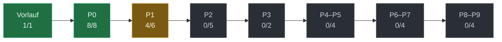

# Planstand Nakama

> **Erzeugt, nicht gepflegt.** Quelle ist `docs/hub/hub.json`;
> dieses Blatt entsteht daraus mit `py -3.13 tools/hub/plan_blatt.py`.
> Aenderungen hier gehen beim naechsten Lauf verloren.

**Stand:** 2026-08-22 · **13 von 34 Schritten fertig**

`███████████████░░░░░░░░░░░░░░░░░░░░░░░░░` 38 %

**Bei dir liegen:** 9 Punkt(e) — Details auf der Briefing-Seite (https://nakama-briefing.philipld.chatgpt.site)

## Phasen auf einen Blick

| Phase | Fortschritt | fertig | offen |
|---|---|---:|---:|
| **Vorlauf** — Beweisen statt behaupten | `████████████████████████` | 1 | 0 |
| **P0** — Bestand einfrieren, Hostgrenzen beweisen | `████████████████████████` | 8 | 0 |
| **P1** — Verträge, gespeicherter Zustand, neutrale Hüllen | `████████████████░░░░░░░░` | 4 | 2 |
| **P2** — Messkern, Nachrichtenweg, Speicher | `░░░░░░░░░░░░░░░░░░░░░░░░` | 0 | 5 |
| **P3** — Passive Landkarte | `░░░░░░░░░░░░░░░░░░░░░░░░` | 0 | 2 |
| **P4–P5** — Vergleichsevidenz und Ursachen | `░░░░░░░░░░░░░░░░░░░░░░░░` | 0 | 4 |
| **P6–P7** — Aktiver Kern: Probeeq | `░░░░░░░░░░░░░░░░░░░░░░░░` | 0 | 4 |
| **P8–P9** — Entmaskierung und Härtung | `░░░░░░░░░░░░░░░░░░░░░░░░` | 0 | 4 |

## Der Weg

## Alle Schritte

### Vorlauf — Beweisen statt behaupten  (1/1)

*Ein Befehl fährt alle Prüfungen und schreibt die rohe Ausgabe in ein Manifest — das ersetzt eine CI.*

- ■ **S0** — Beweis-Runner, Manifest-Vorlage, Basislinie. Heute 18 Prüfbeine. (fertig · 20.08.)

### P0 — Bestand einfrieren, Hostgrenzen beweisen  (8/8)

*Nichts bauen, was FL Studio am Ende nicht hergibt: erst messen, was der Host kann, und die Plugin-Kennungen festschreiben, damit alte Projekte immer laden.*

- ■ **S1** `SONDE-004a` — Wegwerf-Messgerät für Termin A: zwei Nebenwege (Aux) und Latenzausgleich messbar machen. (fertig · 20.08.)
- ■ **Termin A** `FL, du` — Nebenwege und Latenzausgleich in FL gemessen: geht, samplegenau, überlebt Speichern/Laden. (fertig · 22.08.)
- ■ **S2** `SONDE-001/002` — Identität eingefroren: Kennungen aller drei Plugins festgeschrieben und mit 63 Prüfungen bewacht, damit FL alte Projekte weiter erkennt. (fertig · 20.08.)
- ■ **S3** `SONDE-003` — Hostbrücke: ein Patch am Plugin-Rahmenwerk macht sichtbar, was FL liefert (Transport, Latenz, Automationspunkte). 91 Prüfungen. (fertig · 21.08.)
- ■ **S3b** `Nachtrag` — Messgerät für Termin B (Host-Probe): zeichnet Zeitsprünge, Render, Automation als JSON auf. 85 Prüfungen. (fertig · 21.08.)
- ■ **Termin B** `FL, du + Claude` — Hostzeit und Automation in FL gemessen (12:45–13:27): Kontext in allen 259 298 Blöcken, Sprünge/Schleifen/Render/Automation sauber getrennt gemeldet; FL liefert nur float. Du hast aufgebaut, Claude ist über den FL-MCP gefahren. (fertig · 22.08.)
- ■ **S4** — Capabilityreport: die zehn Fähigkeitsbits für FL an die Rohdaten aus Termin A und B gebunden — zwei bestätigt (Hostkontext, Projektzeit), acht nicht: zwei gemessen „kann FL nicht“ (feine Automation, double), drei „noch nicht bewiesen“ (Latenzangabe, beide Nebenwege — Termin A2), eines ungemessen, zwei warten auf ihre Tickets. Prüfbein A13 (61 Prüfungen) misst den Report selbst gegen die Rohdaten; Kanon 18/18 grün. Frischer Prüfer: Runde 1 NEEDS_WORK (zwei Bits zu optimistisch), nachgearbeitet, Runde 2 PASS. (fertig · 22.08.)
- ■ **G0** `Gate` — Erste adversariale Pruefrunde (C++-Review + Codex) ueber P0 — gefahren 22.08., Urteil PASS: beide Bruchauftraege (Gate 1, Gate 5) gescheitert, die P0-Kernflaeche traegt keinen Befund. Manifest docs/beweise/G0.md. Damit ist P0 vollstaendig. (fertig · 22.08.)

### P1 — Verträge, gespeicherter Zustand, neutrale Hüllen  (4/6)

*Alles, was zwischen den drei Apps und dem Broker hin- und hergeht, ist als Vertrag festgeschrieben und in drei Sprachen gleich geprüft — bevor der Messkern darauf baut.*

- ■ **S5** `SONDE-005a` — Nachrichtenverträge (JSON) mit Bandgitter und 153 Prüffällen; in Python, C++ und Rust gleich gelesen. Gebaut und nachgearbeitet — das abschließende Prüfurteil eines frischen Prüfers steht noch aus. (fertig · 21.08.)
- ■ **S6** `SONDE-005b` — Binärformat für Messdaten (FlatBuffers) mit festen Feldnummern und zwei handgeschriebenen Lesern; 6215 Byte-Mutanten bestanden. Prüfurteil wie S5 noch offen. (fertig · 21.08.)
- ■ **S7** `SONDE-006` — Gespeicherter Zustand Schema 2: alte Projekte wandern verlustfrei, fremde Versionen werden nur-lesend geöffnet, FL sieht jede Änderung als „ungespeichert“. 109 Parameter-Kennungen festgeschrieben. (fertig · 22.08.)
- ■ **S8** `SONDE-007a` — Gemeinsamer Kern fuer alle drei Plugins, der keine Bundle-Konstanten sieht — sonst bekaemen zwei Plugins die Identitaet des dritten. Gebaut: der geteilte Code wird jetzt EINMAL uebersetzt statt einmal je Programm, und vier unabhaengige Sperren passen auf, dass keine Kennung hineinrutscht. Jede Sperre wurde absichtlich ausgeloest, um zu zeigen, dass sie wirklich zufasst. Eine davon hat dabei einen Fehler in sich selbst gefunden. Das abschliessende Urteil eines frischen Pruefers steht noch aus. (fertig · 22.08.)
- ▨ **S9** `SONDE-007b` — Drei eigene Plugin-Ziele (Gen, Probeeq, Suna), Rollen-Erkennung, Installer-Manifest. (läuft)
- □ **G1** `Gate` — Prüfrunde über P1 (C++- und Rust-Review + Codex). (offen)

### P2 — Messkern, Nachrichtenweg, Speicher  (0/5)

*Die größte Phase: Audio wird zeitgestempelt gemessen, über den Broker verteilt und gespeichert — ohne je den Audiothread zu blockieren. Danach: Release R0 (Vertrag steht, intern).*

- □ **S10–11** `SONDE-008` — Zeitgestempelte Audio-Warteschlange, Quarantäne für kaputte Blöcke, Lautheitsmessung mit festem Speicher. Gefährlichster Eingriff der Phase (Audiothread). (offen)
- □ **S12–13** `SONDE-009` — Messkern v2: Zeit-, Gültigkeits-, Ereignis- und Bandverträge. (offen)
- □ **S14–15** `SONDE-010` — Nachrichten-Clients in den Plugins und der Parser im Broker. (offen)
- □ **S16–17** `SONDE-011` — Koordinator im Broker, Datenbank-Migration, Ausgangspuffer. (offen)
- □ **G2** `Gate` — Volles Programm: C++-, Rust- und Sicherheits-Review + Codex. (offen)

### P3 — Passive Landkarte  (0/2)

*Gen zeigt alle Quellen mit Frische und Messpunkt — ehrlich, auch wenn etwas fehlt. Danach: Release R1.*

- □ **S18–19** `SONDE-012` — Quellen verbinden und führen, Frische anzeigen, Messpunkt-Wahrheit, Fehlerzustände. (offen)
- □ **G3** `Gate` — Rust-Review + Codex + 60-Minuten-Dauerlauf. Vorher fällig: deine fünf Entscheide aus U9. (offen)

### P4–P5 — Vergleichsevidenz und Ursachen  (0/4)

*Der Advisor: aus Messungen werden belegte Befunde, mögliche Ursachen und der kleinste Test — regelbasiert, ohne KI-Schicht. Danach: Release R2, die erste Fassung, die wirklich nützt (passiv, 9 von 12 Kernfunktionen).*

- □ **S20–22** `SONDE-013` — Dynamik, Stereo, vor/nach der Kette, Passagen — und der manuelle Experimentkern. (offen)
- □ **G4** `Gate` — C++-Review (DSP) + Codex. (offen)
- □ **S23–25** `SONDE-014` — Absicht, Ursachenhypothese, Vorschlag, Assistentenschritt — mit Prüfkorpus. (offen)
- □ **G5** `Gate` — Codex + Gegenbeispiele: der Prüfer soll eine falsche starke Ursachenbehauptung provozieren. (offen)

### P6–P7 — Aktiver Kern: Probeeq  (0/4)

*Probeeq wird der vollwertige EQ, der Anweisungen von Gen umsetzt und manuell bedienbar ist — mit Kopplung, Sicherheit und Rückweg. Danach: Release R3.*

- □ **S26–28** `SONDE-015` — Lokaler EQ-Kern, vier vorbereitete Bänke, Zustand und Automation, A/B. (offen)
- □ **G6** `Gate` — Härtestes Gate des Plans: C++-Review auf höchster Stufe, Nebenläufigkeits-Prüfung, Worst-Case-CPU. (offen)
- □ **S29–31** `SONDE-016/017` — Kopplung Gen↔Probeeq mit Sicherheit, Lease, Anwenden/Zurücknehmen, aktiver Vergleich. (offen)
- □ **G7** `Gate` — Sicherheits- und Rust-Review + Codex + 10 000 Befehle Stress. (offen)

### P8–P9 — Entmaskierung und Härtung  (0/4)

*Sidechain-Entmaskierung (nur wenn Termin A und Gate G0 grün sind — Termin A ist grün, G0 steht aus) und alles für die Auslieferung: Verteilung, Migration, Dauerlauf, Privatsphäre, Rollback. Danach: Release R4, der volle Sondenkern.*

- □ **S32–33** `SONDE-018` — Sidechain-Entmaskierung. (offen)
- □ **G8** `Gate` — C++-Review + Codex + Hör-/Stem-Korpus. (offen)
- □ **S34–35** `SONDE-019` — Verteilung, Migration, Dauerlauf, Privatsphäre, Rollback. (offen)
- □ **G9** `Gate` — Alle acht harten Gates + pluginval Stufe 8 + 30 Minuten mit 32 Sonden. (offen)

---

■ fertig · ▨ läuft · □ offen — „fertig" heisst in diesem Projekt: es gibt ein Beweismanifest in `docs/beweise/`.
