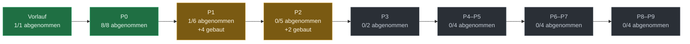

# Planstand Nakama

<!-- quellstand: 56de4fb -->

> **Gerechnet, nicht gepflegt.** Dieses Blatt entsteht aus dem Repo:
> `py -3.13 tools/plan/planstand.py`. Es wird **nie** von Hand editiert —
> jeder Lauf überschreibt es. Was hier steht, ist gemessen:
> ein Schritt gilt als *gebaut*, wenn sein Beweismanifest liegt, und als
> *abgenommen* erst, wenn dort eine Urteilsmarke der geforderten Prüfstufe
> mit **PASS** steht. Fehlt sie, gilt der Schritt als nicht abgenommen.

**Stand:** 2026-08-23 · Quellstand `56de4fb` · **10 von 34 abgenommen** · 6 gebaut · 18 offen

> ⚠️ Gerechnet aus dem Arbeitsbaum: unter `docs/plan/`, `docs/beweise/`
> oder `tools/plan/` liegen Änderungen, die noch nicht in `56de4fb` sind.

`████████████▓▓▓▓▓▓▓░░░░░░░░░░░░░░░░░░░░░` 29 % abgenommen · 47 % gebaut

**Als Nächstes:** **Nacharbeit an S12–13** — der Prüfer hat einen Befund offen gelassen (docs/beweise/SONDE-009.md).

**Wartet auf ein Urteil** (gebaut, nachgemessen, aber ohne PASS eines frischen Prüfers): `S5` · `S6` · `S8` · `S9` · `S10–11`

**Bei dir liegen 10 Fragen** — `U2, U5, U6, U7, U8, U9, U10, U11, U12, U13`. Sie werden im Chat gestellt: Skill `/fragen`.

## Phasen auf einen Blick

| Phase | Fortschritt | abgenommen | gebaut | offen |
|---|---|---:|---:|---:|
| **Vorlauf** — Beweisen statt behaupten | `████████████████████████` | 1 | 0 | 0 |
| **P0** — Bestand einfrieren, Hostgrenzen beweisen | `████████████████████████` | 8 | 0 | 0 |
| **P1** — Verträge, gespeicherter Zustand, neutrale Hüllen | `████▓▓▓▓▓▓▓▓▓▓▓▓▓▓▓▓░░░░` | 1 | 4 | 1 |
| **P2** — Messkern, Nachrichtenweg, Speicher | `▓▓▓▓▓▓▓▓▓▓░░░░░░░░░░░░░░` | 0 | 2 | 3 |
| **P3** — Passive Landkarte | `░░░░░░░░░░░░░░░░░░░░░░░░` | 0 | 0 | 2 |
| **P4–P5** — Vergleichsevidenz und Ursachen | `░░░░░░░░░░░░░░░░░░░░░░░░` | 0 | 0 | 4 |
| **P6–P7** — Aktiver Kern: Probeeq | `░░░░░░░░░░░░░░░░░░░░░░░░` | 0 | 0 | 4 |
| **P8–P9** — Entmaskierung und Härtung | `░░░░░░░░░░░░░░░░░░░░░░░░` | 0 | 0 | 4 |

## Der Weg

## Alle Schritte

### Vorlauf — Beweisen statt behaupten  (1/1 abgenommen)

*Ein Befehl fährt alle Prüfungen und schreibt die rohe Ausgabe in ein Manifest — das ersetzt eine CI.*

- ■ **S0** — Beweis-Runner, Manifest-Vorlage, Basislinie. Heute 18 Prüfbeine. (abgenommen · T1 PASS 2026-08-20 · Kanon 4/4 grün)

### P0 — Bestand einfrieren, Hostgrenzen beweisen  (8/8 abgenommen)

*Nichts bauen, was FL Studio am Ende nicht hergibt: erst messen, was der Host kann, und die Plugin-Kennungen festschreiben, damit alte Projekte immer laden.*

- ■ **S1** `SONDE-004a` — Wegwerf-Messgerät für Termin A: zwei Nebenwege (Aux) und Latenzausgleich messbar machen. (abgenommen · T1 PASS 2026-08-20 · Kanon 5/5 grün)
- ■ **Termin A** `FL, du` — Nebenwege und Latenzausgleich in FL gemessen: geht, samplegenau, überlebt Speichern/Laden. (abgenommen · gemessen (Rohdaten))
- ■ **S2** `SONDE-001/002` — Identität eingefroren: Kennungen aller drei Plugins festgeschrieben und mit 63 Prüfungen bewacht, damit FL alte Projekte weiter erkennt. (abgenommen · T2 PASS 2026-08-20 · Kanon 5/5 grün)
- ■ **S3** `SONDE-003` — Hostbrücke: ein Patch am Plugin-Rahmenwerk macht sichtbar, was FL liefert (Transport, Latenz, Automationspunkte). 91 Prüfungen. (abgenommen · T2 PASS 2026-08-21 · Kanon 6/6 grün)
- ■ **S3b** `Nachtrag` — Messgerät für Termin B (Host-Probe): zeichnet Zeitsprünge, Render, Automation als JSON auf. 85 Prüfungen. (abgenommen · T2 PASS 2026-08-21 · Kanon 7/7 grün)
- ■ **Termin B** `FL, du + Claude` — Hostzeit und Automation in FL gemessen (12:45–13:27): Kontext in allen 259 298 Blöcken, Sprünge/Schleifen/Render/Automation sauber getrennt gemeldet; FL liefert nur float. Du hast aufgebaut, Claude ist über den FL-MCP gefahren. (abgenommen · gemessen (Rohdaten))
- ■ **S4** — Capabilityreport: die zehn Fähigkeitsbits für FL an die Rohdaten aus Termin A und B gebunden — zwei bestätigt (Hostkontext, Projektzeit), acht nicht: zwei gemessen „kann FL nicht“ (feine Automation, double), drei „noch nicht bewiesen“ (Latenzangabe, beide Nebenwege — Termin A2), eines ungemessen, zwei warten auf ihre Tickets. Prüfbein A13 (61 Prüfungen) misst den Report selbst gegen die Rohdaten; Kanon 18/18 grün. Frischer Prüfer: Runde 1 NEEDS_WORK (zwei Bits zu optimistisch), nachgearbeitet, Runde 2 PASS. (abgenommen · T2 PASS 2026-08-22 · Kanon 18/18 grün)
- ■ **G0** `Gate` — Erste adversariale Pruefrunde (C++-Review + Codex) ueber P0 — gefahren 22.08., Urteil PASS: beide Bruchauftraege (Gate 1, Gate 5) gescheitert, die P0-Kernflaeche traegt keinen Befund. Manifest docs/beweise/G0.md. Damit ist P0 vollstaendig. (abgenommen · T3 PASS 2026-08-22)

### P1 — Verträge, gespeicherter Zustand, neutrale Hüllen  (1/6 abgenommen, 4 gebaut)

*Alles, was zwischen den drei Apps und dem Broker hin- und hergeht, ist als Vertrag festgeschrieben und in drei Sprachen gleich geprüft — bevor der Messkern darauf baut.*

- ▣ **S5** `SONDE-005a` — Nachrichtenverträge (JSON) mit Bandgitter und 153 Prüffällen; in Python, C++ und Rust gleich gelesen. Gebaut und nachgearbeitet — das abschließende Prüfurteil eines frischen Prüfers steht noch aus. (gebaut · T2 NEEDS_WORK 2026-08-21 · nachgearbeitet, frisches Urteil fehlt · Kanon 12/12 grün)
- ▣ **S6** `SONDE-005b` — Binärformat für Messdaten (FlatBuffers) mit festen Feldnummern und zwei handgeschriebenen Lesern; 6215 Byte-Mutanten bestanden. Prüfurteil wie S5 noch offen. (gebaut · T2 NEEDS_WORK 2026-08-21 · nachgearbeitet, frisches Urteil fehlt · Kanon 15/15 grün)
- ■ **S7** `SONDE-006` — Gespeicherter Zustand Schema 2: alte Projekte wandern verlustfrei, fremde Versionen werden nur-lesend geöffnet, FL sieht jede Änderung als „ungespeichert“. 109 Parameter-Kennungen festgeschrieben. (abgenommen · T2 PASS 2026-08-22 · Kanon 17/17 grün)
- ▣ **S8** `SONDE-007a` — Gemeinsamer Kern fuer alle drei Plugins, der keine Bundle-Konstanten sieht — sonst bekaemen zwei Plugins die Identitaet des dritten. Gebaut: der geteilte Code wird jetzt EINMAL uebersetzt statt einmal je Programm, und fuenf unabhaengige Sperren passen auf, dass keine Kennung hineinrutscht. Jede Sperre wurde absichtlich ausgeloest, um zu zeigen, dass sie wirklich zufasst. Eine davon hat dabei einen Fehler in sich selbst gefunden. NACHGEPRUEFT am 23.08.: das Herzstueck haelt (der Kern traegt nachweislich keine Kennung), aber das Urteil lautete 'nachbessern' — fuenf Punkte, darunter eine echte Verschlechterung durch den Umbau selbst: der geteilte Code hatte still die schaerfste Warnstufe des Compilers verloren. Alle fuenf noch am selben Tag geschlossen, die fuenfte Sperre ist genau daraus entstanden, danach wieder 19 von 19 Pruefungen gruen. Auf den nachgebesserten Stand fehlt ein zweites Urteil. (gebaut · T2 NEEDS_WORK 2026-08-23 · nachgearbeitet, frisches Urteil fehlt · Kanon 19/19 grün)
- ▣ **S9** `SONDE-007b` — Drei eigene Plugin-Ziele, Rollen-Erkennung, Installer-Manifest. ALLE DREI TEILE GEBAUT am 23.08. (1) Die Kennung der Programme stand bisher als Text im Bauskript UND in der Kennungsdatei - zwei Wahrheiten, die auseinanderlaufen koennen. Jetzt liest das Bauskript die Kennungsdatei; der Test misst weiter das fertige Programm gegen dieselbe Datei. (2) Nakama Suna und Nakama Probeeq sind gebaut, aus EINER gemeinsamen Quelle, und tragen nachweislich ihre eigenen, seit Tagen reservierten Kennungen - keines traegt die eines anderen. Beide sind heute noch stumm: Ton geht unveraendert durch, keine Regler, keine Oberflaeche. Das ist Absicht. (3) Das Hauptprogramm erkennt jetzt seine Rolle, statt sie anzunehmen: beim Laden weiss es nichts ueber sich und bleibt still; erst ein geladenes Projekt entscheidet, ob es ein alter Messpunkt (dann fuer immer passiv) oder ein Hauptfenster ist. Eine frische Instanz wird nur dann zum Hauptfenster, wenn du das Fenster geoeffnet UND die Rolle gewaehlt hast. Ein Scannerlauf entscheidet nichts. Dazu die Packliste fuer die Auslieferung (drei Programme plus Broker, Pruefsumme, Rueckweg mit Warnung vor Datenverlust) - und das Installationsskript liegt endlich im Projekt statt nur auf einem Rechner. FOLGE, DIE MAN HOERT: ein reiner Messpunkt faerbt beim Anhoeren nichts mehr ein. 23 von 23 Pruefungen gruen. NICHT abgenommen: die Nachpruefung durch einen frischen Pruefer steht aus,; das fremde Pruefprogramm sagt bei allen drei Programmen SUCCESS. NACHARBEIT 23.08. nachmittags: alle vier Funde der Nachpruefung geschlossen, jeder erst an der Quelle nachgemessen und jede neue Sicherung beim Anschlagen vorgefuehrt; fuenf weitere Funde kamen dabei heraus und sind mit erledigt. Ein Plugin wird ab jetzt als ganzer ORDNER ausgeliefert statt nur als die Datei darin. Das Zurueckgehen wird ab jetzt bei jedem Pruefdurchlauf wirklich AUSGEFUEHRT (neues Pruefbein, Kanon 23 -> 24) - dabei fielen zwei echte Fehler heraus, die drei Leser uebersehen hatten. Selbstpruefung ueber den Gesamtstand gefahren, 24/24 gruen und beglaubigt. STATUS BLEIBT 'gebaut': wer repariert, spricht sich nicht selbst frei - der nachgebesserte Stand braucht einen frischen Pruefer. (gebaut · T2 NEEDS_WORK 2026-08-23 · nachgearbeitet, frisches Urteil fehlt · Kanon 24/24 grün)
- □ **G1** `Gate` — Prüfrunde über P1 (C++- und Rust-Review + Codex). (offen)

### P2 — Messkern, Nachrichtenweg, Speicher  (0/5 abgenommen, 2 gebaut)

*Die größte Phase: Audio wird zeitgestempelt gemessen, über den Broker verteilt und gespeichert — ohne je den Audiothread zu blockieren. Danach: Release R0 (Vertrag steht, intern).*

- ▣ **S10–11** `SONDE-008` — Zeitgestempelte Audio-Warteschlange, Quarantaene fuer kaputte Bloecke, Lautheitsmessung mit festem Speicher. GEBAUT 23.08. — der gefaehrlichste Eingriff der ganzen Phase, weil er mitten im Audiothread sitzt. Bisher gab die Weitergabe an die Messung bei Platzmangel einen HALBEN Block weiter und zaehlte den Rest; die Messung sah danach einen lueckenlosen Strom, dem in der Mitte Zeit fehlte, und konnte das nicht mehr merken. Jetzt gilt ganz oder gar nicht: passt ein Block nicht, faellt er komplett, wird gezaehlt, und der naechste traegt die Markierung 'hier fehlt etwas'. Dazu haelt die Messung jeden Block einen Moment zurueck, bis der naechste beweist, dass er lueckenlos anschliesst — sonst koennte ein erst nachtraeglich sichtbarer Schleifensprung eine schon veroeffentlichte Auswertung verderben. Und die Lautheitsmessung sammelt nicht mehr endlos: sie braucht ab jetzt immer gleich viel Speicher, egal ob fuenf Minuten oder fuenf Stunden laufen — eine Million Messzellen ohne eine einzige Speicheranforderung, vorgefuehrt. Zwei neue Pruefungen (Kanon 24 → 26), alle 26 gruen und beglaubigt, Fremdpruefer pluginval auf hoechster Stufe an allen drei Plugins bestanden. Kein Sample Audio hat sich geaendert. NACHGEPRUEFT UND NACHGEBESSERT 23.08. abends: ein frischer Pruefer hat vier Sachen gefunden, alle vier haben sich bestaetigt, alle vier sind geschlossen - die Lautheitsmessung ist jetzt auch bei absurd lautem Material genau (statt nur ehrlich darueber), ihre eingebaute Pruefung kann den Fall ueberhaupt erst sehen, deine Entscheidung vom 22.08. hat eine Sicherung, und zwei Raender an der Zeitrechnung stimmen. Jede neue Pruefung wurde einmal absichtlich kaputtgemacht und schlug an. Alle 26 gruen und beglaubigt. Steht weiterhin auf 'gebaut' und nicht auf 'erledigt': wer repariert, spricht sich nicht selbst frei - das bestaetigt ein frischer Pruefer. (gebaut · T2 NEEDS_WORK 2026-08-23 · nachgearbeitet, frisches Urteil fehlt · Kanon 26/26 grün)
- ▣ **S12–13** `SONDE-009` — Messkern v2: Zeit-, Gueltigkeits-, Ereignis- und Bandvertraege. GEBAUT 23.08. — die Schicht, die aus gemessenem Audio ehrliche Zahlen macht. Der Auftrag stand in einem einzigen Satz: 'Drop/Seek/Loop trennt jedes offene Fenster.' Was das heisst: die Messung sammelt staendig ueber laengere Abschnitte (bis zu einer Drittelsekunde), um ueberhaupt etwas ueber tiefe Toene sagen zu koennen. Springt der Abspielzeiger mittendrin an eine andere Stelle, oder wiederholt sich eine Schleife, oder faellt ein Stueck Audio weg, dann liegen in so einem angefangenen Abschnitt ZWEI verschiedene Stellen der Musik. Die daraus gerechnete Zahl sieht aus wie eine Messung und ist keine. Jetzt wird an jeder solchen Stelle alles Angefangene weggeworfen und neu begonnen — und zwar an NEUN verschiedenen Ereignissen, jedes einzeln nachgewiesen. Dazu die Bandaufteilung des Vertrags als eingefrorene Zahlen im Programm (mit zwei unabhaengigen Waechtern) und der eine Weg, ueber den das Plugin im echten FL seine Zeitinformation bekommt, ist ERSTMALS wirklich gefahren worden statt nur gelesen. T2-GEPRUEFT 23.08.: Urteil NEEDS_WORK. Der schwierige Teil haelt - alles, was waehrend eines angefangenen Abschnitts Klang sammelt, wird wirklich weggeworfen, auch der unsichtbare Nachklang des Filters. Gefunden wurde ein Fehler eine Ebene darueber: die fertigen Messwerte (die 64 Balken, der feine Schnappschuss, die Angabe wieviel Klang da war) werden beim Sprung NICHT mit weggeworfen, so dass eine Meldung mit 'neue Stelle' beschriftet sein und ausschliesslich den Klang der alten enthalten kann - gemessen an 80 von 120 durchprobierten Zeitpunkten. Nicht abgenommen; Nacharbeit ist der naechste Schritt. (gebaut · T2 NEEDS_WORK 2026-08-23 · Befund offen · Kanon 28/28 grün)
- □ **S14–15** `SONDE-010` — Nachrichten-Clients in den Plugins und der Parser im Broker. (offen)
- □ **S16–17** `SONDE-011` — Koordinator im Broker, Datenbank-Migration, Ausgangspuffer. (offen)
- □ **G2** `Gate` — Volles Programm: C++-, Rust- und Sicherheits-Review + Codex. (offen)

### P3 — Passive Landkarte  (0/2 abgenommen)

*Gen zeigt alle Quellen mit Frische und Messpunkt — ehrlich, auch wenn etwas fehlt. Danach: Release R1.*

- □ **S18–19** `SONDE-012` — Quellen verbinden und führen, Frische anzeigen, Messpunkt-Wahrheit, Fehlerzustände. (offen)
- □ **G3** `Gate` — Rust-Review + Codex + 60-Minuten-Dauerlauf. Vorher fällig: deine fünf Entscheide aus U9. (offen)

### P4–P5 — Vergleichsevidenz und Ursachen  (0/4 abgenommen)

*Der Advisor: aus Messungen werden belegte Befunde, mögliche Ursachen und der kleinste Test — regelbasiert, ohne KI-Schicht. Danach: Release R2, die erste Fassung, die wirklich nützt (passiv, 9 von 12 Kernfunktionen).*

- □ **S20–22** `SONDE-013` — Dynamik, Stereo, vor/nach der Kette, Passagen — und der manuelle Experimentkern. (offen)
- □ **G4** `Gate` — C++-Review (DSP) + Codex. (offen)
- □ **S23–25** `SONDE-014` — Absicht, Ursachenhypothese, Vorschlag, Assistentenschritt — mit Prüfkorpus. (offen)
- □ **G5** `Gate` — Codex + Gegenbeispiele: der Prüfer soll eine falsche starke Ursachenbehauptung provozieren. (offen)

### P6–P7 — Aktiver Kern: Probeeq  (0/4 abgenommen)

*Probeeq wird der vollwertige EQ, der Anweisungen von Gen umsetzt und manuell bedienbar ist — mit Kopplung, Sicherheit und Rückweg. Danach: Release R3.*

- □ **S26–28** `SONDE-015` — Lokaler EQ-Kern, vier vorbereitete Bänke, Zustand und Automation, A/B. (offen)
- □ **G6** `Gate` — Härtestes Gate des Plans: C++-Review auf höchster Stufe, Nebenläufigkeits-Prüfung, Worst-Case-CPU. (offen)
- □ **S29–31** `SONDE-016/017` — Kopplung Gen↔Probeeq mit Sicherheit, Lease, Anwenden/Zurücknehmen, aktiver Vergleich. (offen)
- □ **G7** `Gate` — Sicherheits- und Rust-Review + Codex + 10 000 Befehle Stress. (offen)

### P8–P9 — Entmaskierung und Härtung  (0/4 abgenommen)

*Sidechain-Entmaskierung (nur wenn Termin A und Gate G0 grün sind — Termin A ist grün, G0 steht aus) und alles für die Auslieferung: Verteilung, Migration, Dauerlauf, Privatsphäre, Rollback. Danach: Release R4, der volle Sondenkern.*

- □ **S32–33** `SONDE-018` — Sidechain-Entmaskierung. (offen)
- □ **G8** `Gate` — C++-Review + Codex + Hör-/Stem-Korpus. (offen)
- □ **S34–35** `SONDE-019` — Verteilung, Migration, Dauerlauf, Privatsphäre, Rollback. (offen)
- □ **G9** `Gate` — Alle acht harten Gates + pluginval Stufe 8 + 30 Minuten mit 32 Sonden. (offen)

---

**■ abgenommen** — Beweismanifest liegt UND ein Prüfer der geforderten Stufe hat **PASS** gegeben.
**▣ gebaut** — Manifest liegt, Prüfungen sind gefahren, aber es gibt kein PASS: der Prüfer steht aus oder hat NEEDS_WORK gesagt. Zählt nicht als fertig.
**□ offen** — noch kein Beleg.

Quelle des Textes: `docs/plan/plan.json` · Quelle des Status: die Urteilsmarken in `docs/beweise/` · Fragen an dich: `docs/plan/fragen.json`.
