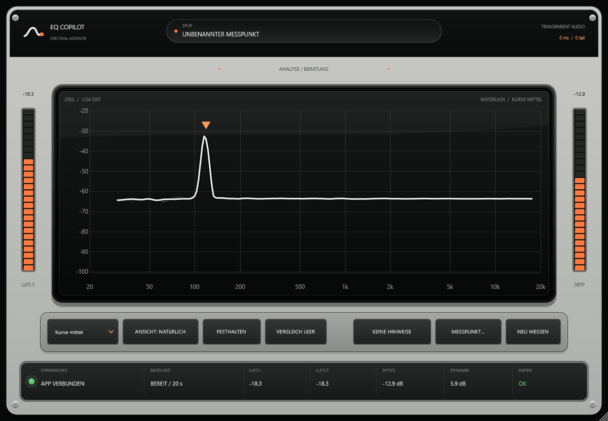

> **PROVISORIUM (User 21.08.2026: „Nie abgenommen – bleibt Provisorium“).** Diese Material-Kit-Front ersetzte am 15.08. ohne Protokoll die vom User entschiedene dunkle NAKAMA-Gerätefront (`archive/nakama-geraetefront/`). Sie bleibt kompiliert, bis die neue UI aus Figma (über `design/ (Nakama-Repo, bis 22.08. Repo Nakama-Design)`) gebaut ist; keine Arbeit mehr daran. Technisch lebendig ist nur die Kette `tokens.json` → `gen-tokens.mjs` → `plugin/src/LeitstandTokens.h`.

# EQ-Copilot Material Kit

> **Ist-Dokument / abzulösende Front.** Dieses Kit beschreibt weiterhin
> korrekt die momentan kompilierte JUCE-Gerätefront. Es ist jedoch nicht mehr
> das freigegebene Zielbild. Der verbindliche Umbau auf **Nakama · Spectral
> Field** steht in `../../docs/archiv/NAKAMA-SPECTRAL-FIELD-BAUPLAN.md` (Archiv, alt seit 21.08.): Graph über die
> gesamte Editorfläche, textfreie Werkzeugkreise, überlagerbare Problemsymbole,
> manuelles Befundarchiv und umschaltbare Farbpakete. Bis dieser Umbau
> tatsächlich gebaut und verifiziert ist, bleibt dieses Dokument als ehrliche
> Beschreibung des Ist-Codes bestehen.

Der Editor verwendet **keine ausgeschnittenen Fremd-Assets** und keine
gerasterte Gesamtfront. Die Referenz bestimmt nur das Qualitätsniveau:
Materialtiefe, ruhige Hierarchie, warmer Metallkörper, schwarzes Analyseglas
und ein sparsamer Ember-Akzent. Geometrie, Zeichen und Komponenten sind eigens
für den EQ-Copiloten gebaut.

## Quelle der Wahrheit

- Farben: `tokens.json`, Gruppe `copilot`
- generierte C++-Farben: `../plugin/src/LeitstandTokens.h`
- Baukasten und Geometrie: `../plugin/src/EqCopilotAssetKit.h`
- Einbau und dynamische Daten: `../plugin/src/PluginEditor.cpp`
- echter Render: `EqCopShot.exe <ziel.png> [breitePx]`

`LeitstandTokens.h` nie von Hand ändern; nach Farbänderungen immer
`node eq-copilot/design/gen-tokens.mjs` ausführen.

Die frühere NAKAMA-Studie bleibt ausschließlich als Designhistorie unter
`design/archive/NakamaGehaeuse-v1.h`; sie ist nicht Teil des Builds.

## Einzelne Bauteile

Alle Funktionen nehmen eine Zielgeometrie entgegen und können unabhängig
verschoben, skaliert oder wiederverwendet werden:

| Bauteil | Funktion | Einsatz |
|---|---|---|
| Metallkörper | `metallFlaeche()` | tragende helle Front |
| Kopfmodul | `kopfleiste()` | Marke und wahrer Passthrough-Status |
| Markenlogo | `marke()` | eigenes Spektrum-/Dialogzeichen |
| Messpunktanzeige | `kopfAnzeigeRahmen()` + `kopfAnzeigeText()` | Rolle und Instanzname |
| Analyseglas | `display()` | LTAS, Vergleich, Marker und Abdeckung |
| Werkzeugbett | `werkzeugBett()` | alle echten Bedienaktionen |
| Statusbett | `statusBett()` | getrennte Mess- und Systemzellen |
| Taste | `taste()` + `tasteText()` | normal, Hover, gedrückt, aktiv, Warnung |
| Auswahlfeld | `combo()` | Kurvenglättung |
| Messleiste | `meter()` | LUFS Short und True Peak, nur Anzeige |
| Status-LED | `led()` | verbunden, wartend, Fehler |
| Statuszelle | `statusZelle()` | Messzustand und Kennzahlen |
| Resonanzmarker | `resonanzMarker()` | dauerhaft gefüllt, flüchtig als Kontur |
| Schraube/Schatten | `schraube()`, `weicherSchatten()` | Materialdetails |

Der statische `skin::Frame` wird nur bei einer Größenänderung neu gerendert.
Der 30-Hz-Pfad zeichnet ausschließlich Messpunktname, Meter, Graph, Marker und
Status. So bleibt die Front hochwertig, ohne den Audio- oder UI-Thread mit
großen Bitmap-Assets zu belasten.

## Produktregeln

1. **Keine Fake-Potis oder Fake-Power-Taste.** Der Copilot schreibt keine
   Audio-Parameter; ein scheinbar bedienbarer Regler wäre unehrlich.
2. **Orange/Ember** steht nur für aktive Analyse oder Aufmerksamkeit.
3. **Grün** bedeutet belegten Erfolg, **Rot** einen Mangel.
4. Messleisten sind Anzeigen und haben deshalb keinen Griff.
5. Text, Achsen und Kurven bleiben echte JUCE-Vektorausgabe; kein Upscaling.
6. Das Geräteraster bleibt `750:520`; Standardgröße ist `1200:832`, Minimum
   `600:416`.

## Layoutvertrag in Geräteeinheiten

- Display: `64,104 · 622×270`
- linker LUFS-Meter: `22,108 · 26×256`
- rechter True-Peak-Meter: `702,108 · 26×256`
- Werkzeugbett: `50,386 · 650×48`
- Statusbett: `24,446 · 702×50`

Die Konstanten stehen am Kopf von `EqCopilotAssetKit.h`. Änderungen dort und
in `PluginEditor::resized()` immer gemeinsam prüfen.
