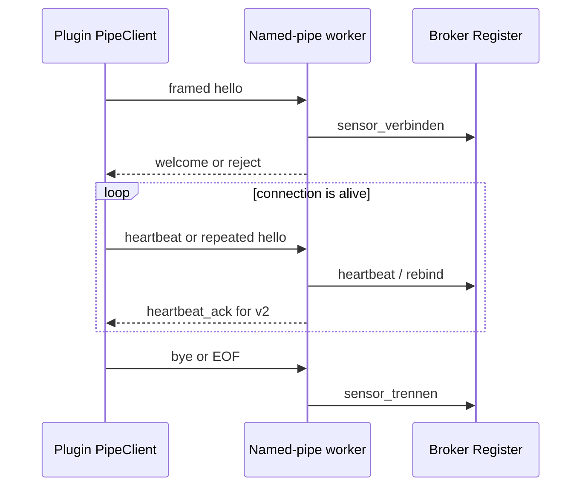

# Broker service lifecycle

`eqcop-broker` is a standalone Windows process backed by the `eqcop_broker`
library. Its binary entrypoint owns command-line parsing and chooses the
optional binding-file path; the library owns process-global startup and the
named-pipe server. Binding-map contents and durability are documented in
[Sessions and aggregation](sessions-and-aggregation.md).

## CLI and startup handoff

The accepted form is `eqcop-broker.exe [--bindungen <path>]`. Without an
explicit path, the CLI selects
`%APPDATA%\evenacadia\nakama\eq-copilot-bindungen.json` when `APPDATA` exists;
otherwise it hands `None` to the library, which means memory-only binding
state. An unknown argument or missing value after `--bindungen` prints a
diagnostic and exits with code 2.

Before startup, the CLI tries to create the selected parent directory. Failure
is a warning and the same path is still passed to `broker_starten`. A successful
handoff prints the pipe name and selected persistence mode, then keeps the
process alive. A library error exits with code 1.

Startup is cached in a process-global `OnceLock<Result<BrokerLauf, String>>`.
The first success or failure is therefore the result observed by later calls;
calling startup again with a different path is not a retry mechanism. The
library returns an explicit unsupported error outside Windows.

## Pipe ownership and security

The server builds a byte-mode Windows named pipe whose security descriptor is
restricted to the current user and whose flags reject remote clients. The
first pipe instance owns the production name, so a second broker using that
name fails visibly instead of silently sharing connections.

The production pipe and probe pipe are separate operational surfaces. Use the
probe name for end-to-end test processes; two independent brokers must not
compete for the production name.

## Connection lifecycle

Every accepted connection must begin with a parseable `hello`. After
negotiation, the worker accepts heartbeats, a repeated hello used for rebinding,
and `bye`. A repeated hello that changes the sensor ID disconnects the old ID
before registering the new one. JSON parse failures are counted and ignored;
framing failure closes only the affected connection. On every exit path the
worker updates the register and disconnects the pipe instance.

The message and compatibility contract itself belongs to
[Runtime protocol v2](../contracts/runtime-protocol-v2.md). Derived sensor,
session, pair, and binding semantics begin after the register handoff and
belong to the sibling broker page.

The plugin client owns its own worker thread. A failed connection enters a
bounded exponential-backoff loop and publishes connection-state notifications
between attempts. This does not stop the separate analysis worker, so local
measurement and snapshots continue while the broker is unavailable. Stopping
the client requests termination, cancels blocking synchronous pipe I/O, joins
the worker, and sends `bye` best-effort when a live session still exists.

## Failure semantics

- CLI syntax errors are immediate and use exit code 2.
- Parent-directory creation failure is non-fatal at the CLI boundary.
- Binding-load and server-start failures remain visible in broker status rather
  than crashing the owning process. Broker initialization failure is cached
  and returned with exit code 1 by the standalone executable.
- A malformed or oversized client frame terminates that connection, not the
  broker process.
- Same-name second startup fails at pipe creation.

## Source map and validation

- Package and binary: `broker/Cargo.toml`, `broker/src/main.rs` — `main`,
  `standard_bindungen`
- Process-global handoff: `broker/src/lib.rs` — `broker_starten`, `BROKER`
- Pipe and worker: `broker/src/server.rs` — `server_starten`,
  `verbindung_bedienen`
- Framing and handshake: `broker/src/framing.rs`, `broker/src/protokoll.rs`
- Client counterpart: `eq-copilot/plugin/src/PipeClient.cpp`

`cargo test --manifest-path broker/Cargo.toml` exercises framing, handshake,
security, and connection-isolation behavior. The repository has no focused
test for CLI parsing, default path selection, exit codes, the infinite process
loop, or retry after a cached startup result; use a narrow executable smoke
test when those paths change.
