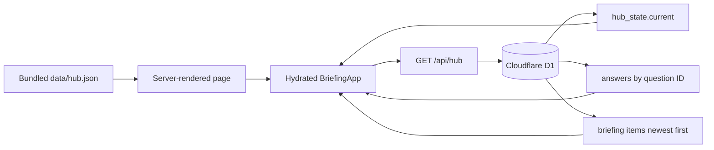

# Briefing application

`briefing-hub/` is a Next/vinext React site deployed through the OpenAI
Sites/Cloudflare integration. Its live persistent store is the Cloudflare D1
binding named `DB`. The bundled `data/hub.json` is a rendering seed and
fallback; it is not the live database.

## Runtime data flow

The server-rendered page starts with the bundled seed. After hydration, the
client fetches `/api/hub` with caching disabled and replaces or augments local
React state with the live hub document, answers, and briefing items.



D1 owns three collections. Answers are keyed by question ID. Briefing items
receive integer IDs and are append-oriented. Hub state is a keyed JSON record,
with `current` as the singleton used by the application. Runtime startup
creates the tables and item timestamp index when needed.

## Read behavior

`GET /api/hub` batches the three database reads. A valid
`hub_state.current.payload_json` overrides the bundled seed. If that row is
missing or malformed, the route uses the seed. If the wider database read
fails, it still returns HTTP 200 with the seed, empty collaborative data, and
a warning so the latest bundled project picture remains usable.

The client retains the seed when initial loading fails. Successful aggregate
loading merges the returned state into the visible application.

## Write routes

`POST /api/answers` trims and bounds inputs, restricts author labels, and
upserts by question ID. Every accepted write resets the answer lifecycle to
`neu` so repository incorporation remains explicit.

`POST /api/items` accepts only configured author, kind, and urgency values.
It creates an `offen` item and returns its D1 row ID.

`POST /api/state` performs shallow structural validation, rejects a serialized
document above 500 KB, and upserts only `hub_state.current`. It does not replace
the answers or items tables.

Frontend forms update local state only after their request succeeds. A failed
save remains visible in the form rather than being presented as persisted.

## Trust boundary

The routes implement allowlists for author labels and other field values, but
the repository contains no application-level authentication or authorization
check. An author string is therefore input data, not proof of identity. Do not
infer a hosting-layer access policy from this code.

The visible built-in decision taxonomy comes from `data/friendly-copy.ts`, not
from arbitrary question text in a hub document. Adding a built-in decision
therefore requires an application code/data change and deployment.

## Operate and extend

From `briefing-hub/`, the primary commands are:

```powershell
npm run dev
npm run lint
npm run build
npm run db:generate
```

Schema evolution must keep `db/schema.ts`, runtime `ensureSchema`, and Drizzle
migrations aligned. New built-in decisions also need friendly copy, while new
images need both repository sources and deployed public assets. Repository
synchronization is intentionally separate; see [briefing sync](briefing-sync.md).
