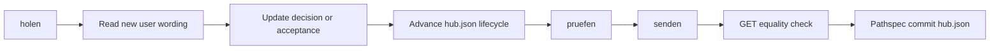

# Briefing synchronization

`tools/hub/hub_sync.py` is the explicit bridge between repository project
state and the deployed briefing application. It is not part of the web app's
runtime. The repository source is `docs/hub/hub.json`; live answers, items,
and hub state remain distinct D1 collections.

## Commands

Run the CLI from the repository root:

```powershell
py -3.13 tools/hub/hub_sync.py holen
py -3.13 tools/hub/hub_sync.py pruefen
py -3.13 tools/hub/hub_sync.py senden
```

`holen` pulls collaborative data, `pruefen` validates locally without network
writes, and `senden` validates, publishes the complete repository hub state,
then reads it back for equality.

The target URL comes from `NAKAMA_HUB_URL` when set, otherwise from `hub_url`
in the repository document. Requests use a 30-second timeout and a custom user
agent. Because the environment variable redirects both reads and writes, treat
it as a deployment trust boundary.

## Derived local views

Two additional tools render repository-only reading views from the same Hub
source:

```powershell
py -3.13 tools/hub/antworten_blatt.py
py -3.13 tools/hub/plan_blatt.py
```

The first rewrites `docs/ANTWORTEN-OFFEN.md` from answer lifecycle data; the
second rewrites `docs/PLAN-STAND.md`, including its Mermaid progress view.
Both outputs are disposable projections and are overwritten completely on
each run. Change `docs/hub/hub.json`, not either generated Markdown file, then
use the normal validate-and-send workflow when the shared state should change.

## Pull and incorporation

Pull reads the aggregate `/api/hub` endpoint. It imports only answers whose
author is `Phil`; changed imported answers become `neu`. Items from any author
enter the repository inbox once, keyed as `item.<id>` so a second pull is
idempotent. The command writes `docs/hub/hub.json` only when it finds new
answers or items.

Pulling does not interpret the answer, update an acceptance, or commit the
result. The required human/agent workflow is:



Preserve the user's wording, date, and resulting decision before marking an
answer incorporated. New items similarly need an explicit disposition rather
than disappearing from the inbox.

## Validation and send safeguards

Local validation is intentionally stricter than the deployed state route. It
checks required collaboration sections, date and URL forms, decision IDs,
image and file-backed evidence, answer lifecycle, exact app keys, allowed
status vocabularies, exactly one `naechster` plan row, evidence on every
completed plan row, and the 500 KB limit.

Before sending, the CLI reads the live aggregate and refuses if a Phil answer
exists remotely but its ID is absent locally. It then posts only the complete
hub-state document as author `Claude`. Answers and items remain untouched in
their D1 tables. A final GET must return a hub document equal to the sent JSON.

The missing-answer guard detects absent IDs, not changed content for a known
ID. A later pull is still required to notice changed wording. HTTP failures
include a bounded response excerpt; validation failures are all printed before
exit, and an unknown command has a distinct exit status.

## Security and extension seams

The CLI has no token or credential handling. The author field sent to the API
is a label, not authenticated identity. Only send to a deployment whose access
controls and data ownership are understood.

New repository sections require validation rules and corresponding web-app
rendering support. New vocabularies extend the allowed-value sets. If answer
import policy changes, update `antworten_holen` explicitly; agent-authored
answers are intentionally ignored today.
