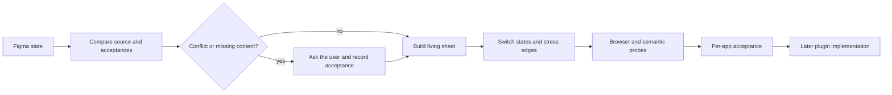

# Design workflow

The `design/` tree translates user-owned Figma states into living browser
sheets. It does not own the plugin or broker implementation. Its job is to
preserve visual evidence, make hidden states and edge cases inspectable, and
turn explicit user judgments into constraints that downstream implementation
can safely follow.

## Sources and ownership

The external `Nakama-Design` Figma file is the current visual source. Only its
dark variants are binding today. Files under `design/assets/figma/` are dated
evidence snapshots, not a replacement source, and older snapshots remain as
history. Rejected directions and older visual material are reference evidence,
not current authority.

Figma defines visual direction and arrangement, not hidden technical behavior.
Specifications and accepted decisions supply state, semantics, and edge-case
requirements that a static image cannot express.

Repository responsibilities are deliberately separated:

- root `CLAUDE.md` owns product truth;
- `assets/figma/` preserves visual-source evidence;
- `abnahmen/` records binding user judgments;
- `docs/arbeitsplan.md` owns sequence and current work, while the surface and
  interaction specifications own content/state and gesture/motion details;
- `werkzeug/` contains measurement and falsification tools;
- `prototyp/` is the implementation surface for living design sheets.

An acceptance is binding only when it records the user's wording, the
constraint derived from it, and what remains unresolved. A provisional
assumption needs an explicit verification point and cannot be cited as an
accepted decision.

## Translation loop

Current Phase 1b proceeds in the order Gen, Probeeq, then Suna. Each app is
compared with its specification and accepted decisions, reproduced at 1:1
accepted dimensions, and captured for direct screenshot comparison with the
current Figma export. It is then given switchable states, stressed at named
edge cases, and accepted independently.



A new Figma state restarts the comparison at the source. When it conflicts
with a recorded acceptance, or required content is absent from the image, the
translator raises the mismatch rather than inventing a resolution.

## Interaction and motion handoff

`docs/interaktions-und-motion-spezifikation.md` complements the current Figma
states without changing their layout or visual language. It defines how the
visible controls and states react: direct band dragging, draft/audition/apply
transitions, Gen's measurement-to-advice flow, and Suna's compact status
behavior. It may not introduce measurements or product states that are absent
from the owning surface specification and technical contracts.

The visual presentation uses an approximately 140 ms ease-out without spring
or bounce. That number is not an audio contract. Parameter ramps and DSP
crossfades remain tied to measured technical behavior, while Figma variants or
motion demos show the intended visible transition. Before implementation
handoff, the required interaction sequences still need explicit visible start
and end states in the design evidence.

## Exactness boundary

The acceptance target is the result inside FL Studio, not an intermediate
gallery or browser approximation. Static shells, material, wordmarks, and
possibly glows may be exported per scale. Dynamic text, curves, cells,
controls, and states remain rendered.

Text rasterization can differ among Figma, browsers, and plugin graphics.
Position, size, spacing, and color remain measurable requirements. If zero
raster difference becomes a requirement, text may need to be baked into an
asset and accepted as such.

## Validation tools

Run the generic living-sheet check from the repository root:

```powershell
node design/werkzeug/pruefung/pruefen.mjs
node design/werkzeug/pruefung/pruefen.mjs --gegenprobe
```

The tool distinguishes a missing Playwright installation from a page failure.
It checks browser errors, silent or empty pages, visible failure bands,
screenshots, and four deliberate counterexamples.

The measurement-sheet probe adds semantic and interaction assertions:

```powershell
node design/werkzeug/pruefung/sondenprobe.mjs alles
```

It covers measured numbers, overflow, state matrices, reversible actions,
export truth, and failure-inducing counterprobes. When a living app sheet is
added under `prototyp/`, extend these probes with its accepted states and edge
cases rather than relying on screenshots alone.

## Change safely

For each new visual state, add a dated export and ledger entry, record each
new user judgment as its own acceptance, and update the current work sequence.
Do not treat hook gates as design authority; hook orchestration is documented
in [session automation](session-automation.md).
