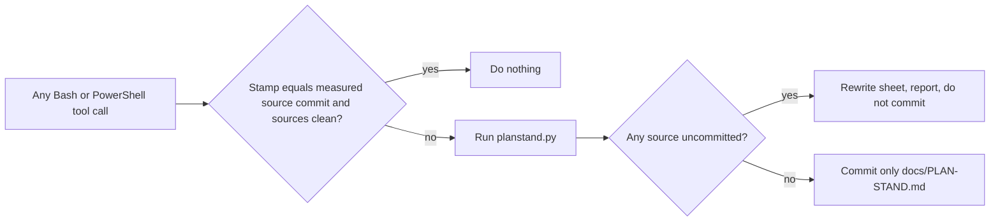

# Plan status and open questions

Plan status in this repository is a **measurement, not a stored field**. Nothing
declares that a step is finished; the state is recomputed from artifacts that
the work leaves behind anyway. `tools/plan/planstand.py` reads the plan text,
inspects the evidence manifests under `docs/beweise/`, and overwrites
`docs/PLAN-STAND.md`. That sheet is a projection and is never edited by hand.

This replaced a hand-maintained hub document and a deployed briefing site on
2026-08-23. Every link in that chain was manual — write the status field, run
the sync CLI, deploy — so a single forgotten step left a silently wrong state
with nothing to signal it. `briefing-hub/` stays in the tree as history and
carries its own retirement note; it must not be deployed, fed, or read as
current. Session hooks that consume this pipeline are described in
[Session automation](session-automation.md).

## What is authored and what is measured

| Question | Answer comes from | Maintained by |
|---|---|---|
| Which steps exist, in which phase | `docs/plan/plan.json` — phase, ticket, plain-language text, evidence path, required review level. It has **no status field** | authored; text is not a measurement |
| Is it built? | Does the evidence path in `docs/beweise/` exist? | written by `tools/beweise.ps1` |
| Is it accepted? | A verdict marker inside that manifest | written by the fresh reviewer |
| How current is the sheet? | The source-state stamp compared with Git | Git |

## The verdict marker

A review verdict is a judgement, not a measurement, so exactly one piece of
status stays hand-written — a single comment line in the manifest it belongs to:

```
<!-- NAKAMA-URTEIL: T2 PASS 2026-08-22 -->
<!-- NAKAMA-URTEIL: T2 NEEDS_WORK 2026-08-23 offen -->
<!-- NAKAMA-URTEIL: T2 NEEDS_WORK 2026-08-23 nachgearbeitet -->
```

`T1` is the builder's own audit, `T2` a fresh-context reviewer, `T3` an
adversarial phase gate. `plan.json` states which level a step requires, and only
a `PASS` at that level or higher marks it accepted. Among qualifying markers the
last one wins, so a later `T3 NEEDS_WORK` overrides an earlier `T2 PASS`.

Two properties matter more than the format:

- **Fail-closed.** A missing marker, a marker below the required level, or
  `NEEDS_WORK` all leave the step at *built*. Forgetting therefore understates
  progress; it can never overstate it.
- **Loud on malformed input.** A line containing `NAKAMA-URTEIL` that does not
  match the strict form is not skipped. The count of loose matches is compared
  with the count of parsed markers, the difference is printed on the sheet as a
  warning, and the run exits with status 4. Without that comparison a typo would
  quietly demote a step and look identical to a genuine absence.

The optional fourth word applies to `NEEDS_WORK` only and decides what the sheet
names as the next action: `offen` means the finding still stands and rework is
due, `nachgearbeitet` means findings are closed and only a fresh verdict is
missing.

## Refresh without drift



`tools/hooks/planstand.sh` runs after every shell tool call and decides from
measured state, not from the text of the command — the same trigger design as
the automatic push hook. It compares the stamp inside the sheet against the last
commit touching `docs/plan`, `docs/beweise`, or `tools/plan`, and it also
recomputes whenever one of those paths is dirty.

The stamp is deliberately the **source-state commit and not `HEAD`**. With
`HEAD` the hook would commit forever: its own sheet commit advances `HEAD`, the
stamp would differ again on the next command, and the cycle would never close.
A sheet commit touches no source, so the source state stands still and the next
run has nothing to do. When a source is uncommitted the hook still rewrites the
sheet, but refuses to commit it and says why — otherwise the sheet would claim a
provenance nobody recorded. The commit uses an explicit pathspec because
parallel sessions share this repository.

## Derived next action

The sheet does not carry a written "next step" either. A step whose marker
reports an open finding outranks everything else, because that is unfinished
work on something already built; otherwise the first step without any evidence
is next. Steps whose findings are closed but which lack a fresh `PASS` are
listed separately as waiting for a verdict.

## Open questions for the user

Questions that only the project lead can answer live in `docs/plan/fragen.json`,
with `offen` holding the open cards, `beantwortet` holding every earlier answer
in the user's own words, and images under `docs/plan/bilder/`. They are asked in
chat by the `fragen` skill, one card per turn.

The rules the skill enforces are the ones the retired site used to carry:
the answer is quoted verbatim with a date, never summarized; a decision is also
written to the decision register in `CLAUDE.md` and, when it concerns how the
apps look or behave, to `design/abnahmen/`; and the consequence is worked into
the plan in the same change set before the next question is asked. Cards that
already have an answer under the same ID carry that earlier wording so the skill
can show it instead of asking twice. Design evidence and acceptance flow is
described in [Design workflow](design-workflow.md).

## Source map and validation

- Computation: `tools/plan/planstand.py` — `marken_lesen`, `messen`, `balken`
- Refresh hook: `tools/hooks/planstand.sh`; session summary:
  `tools/hooks/plan-primer.sh`
- Authored input: `docs/plan/plan.json`, `docs/plan/fragen.json`
- Reading views: `docs/PLAN-STAND.md`, and `docs/ANTWORTEN-OFFEN.md` from
  `tools/plan/antworten_blatt.py`
- House rules: `docs/plan/LIES-MICH.md`

```powershell
py -3.13 tools/plan/planstand.py
```

Exit status 0 means written, 3 an unreadable source, and 4 at least one
unreadable verdict marker. There is no separate unit test: the check is to
remove or damage a marker in a manifest, observe the affected step falling back
to *built*, and restore it.

## Change surfaces

- A new review level or verdict word requires changes in the marker pattern and
  the level ranking together; the strict-versus-loose comparison must keep
  matching or malformed markers become invisible again.
- New status inputs belong in the source list that both the computation and the
  hook read, otherwise the hook will not notice that they changed.
- Anything that can be derived from a repository artifact belongs in the
  computation, not in a new authored field.
