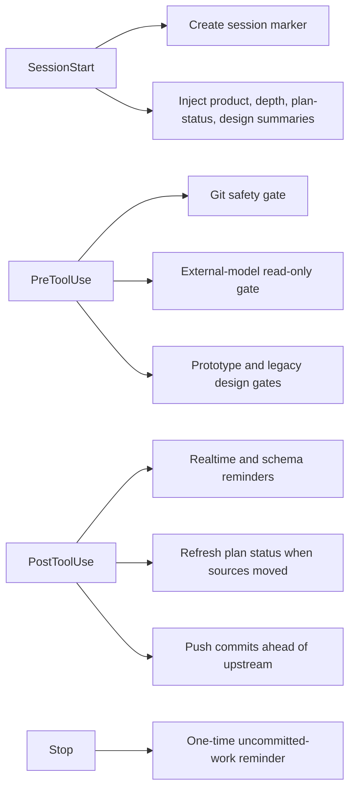

# Session automation

`.claude/settings.json` declares repository automation for Claude Code
`SessionStart`, `PreToolUse`, `PostToolUse`, and `Stop` events. It currently
declares no `SessionEnd` hook.
These settings do not establish that Codex, Nimbalyst, or another host runs the
same hooks. Treat the scripts as Claude Code lifecycle contracts.

## Lifecycle map



On startup, resume, or clear, `session-start-marker.sh` records epoch, current
short HEAD, working directory, and a retired field under
`~/.claude/sessions/<session_id>.start`. It prunes markers older than seven
days. Missing session identity or an unavailable marker directory degrades
silently.

The configured primers summarize repository state:

- `nakama-primer.sh` extracts the marked truth block from root `CLAUDE.md`,
  then adds recent commits and at most ten dirty paths;
- `plan-primer.sh` first invokes the plan-status refresh, then reads the
  generated sheet and the open-question file. It carries no synchronization
  duty at all, because the status it reports is computed rather than kept —
  see [Plan status and open questions](plan-status.md);
- `design-primer.sh` reports local design-document, latest-acceptance, Figma
  snapshot, and design-contract state;
- `depth-primer.sh` injects the repository's deeper-review guidance.

## Write gates and post actions

PreToolUse first applies `git-riegel.sh` and `fremdmodell-riegel.sh` to Bash
and PowerShell commands. The Git gate blocks broad staging without an explicit
pathspec, amend, force-push and forcing refspecs, remote deletion, destructive
reset or cleanup, mass discard, and forced branch deletion. It recognizes Git
behind an absolute path and options such as `-C`; quoted prose is not treated
as a command. The emergency bypass works only when
`NAKAMA_GIT_RIEGEL_AUS=1` is actually set at a command boundary, not merely
mentioned in a comment or message.

The external-model gate keeps Antigravity/Gemini invocations in an audit role.
Ordinary `agy` calls and plan mode remain available, while
`--dangerously-skip-permissions` and `--mode accept-edits` are blocked because
they authorize unattended writes. This is a command-surface restriction, not
a claim that an external model's findings are correct; findings still require
repository evidence.

The other PreToolUse group applies the legacy `eq-copilot/design/`
creative-release gate and the `design/prototyp/` design-contract gate. Their
shared write-target parser recognizes direct Write/Edit paths and common Bash
destinations. The prototype gate exits 2 when a prototype write lacks an
accepted `*designvertrag*.md`; reads and writes elsewhere pass. The creative
gate requires a `.claude/kreativ-freigabe.md` marker younger than 24 hours.

PostToolUse is advisory. It adds context after changes to plugin realtime
sources or versioned schemas but does not block the completed edit. Two further
scripts then act on measured state rather than on the command that just ran.
`planstand.sh` recomputes the plan sheet when its stamp no longer matches the
last commit touching a status source, and commits that one file by pathspec;
`auto-push.sh` checks whether the current branch is ahead of its upstream. Both
skip detached HEAD, merge, and rebase states. A failed push is remembered for
that HEAD so later commands do not repeat the same failure, and the ordering
means a sheet commit created in one round is published by the push check in the
same round.

## Stop behavior

`commit-stop.sh` looks for uncommitted paths whose modification
time is later than the session-start marker. It presents that candidate list
once, but does not stage or choose ownership: the agent must commit only its
own paths explicitly and leave parallel-session work untouched. It is now the
only consumer of the session-start marker, and together with auto-push it
closes the local-commit and remote-publication halves without a configured
SessionEnd action.

## Focused checks

The repository supplies Bash probes for the write gates and the Git surface:

```bash
bash tools/hooks/schleusen-probe.sh
bash tools/hooks/git-automatik-probe.sh
```

The first exercises allowed and denied Write, Edit, and Bash destinations,
including source-versus-destination and heredoc edge cases. The second checks
blocked and allowed Git commands, both directions of the external-model gate,
and auto-push's local gate. A third probe covering the former briefing Stop
reminder was removed with that reminder.

New lifecycle behavior belongs in `.claude/settings.json` with a narrowly
scoped script and both pass and block tests. Hooks summarize, remind, and — for
the plan sheet and the push — act on measured repository state; the computation
they invoke lives in [Plan status and open questions](plan-status.md).
