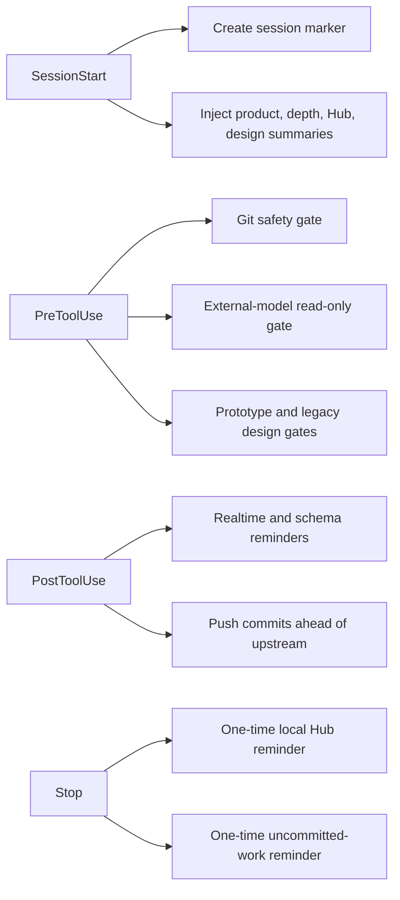

# Session automation

`.claude/settings.json` declares repository automation for Claude Code
`SessionStart`, `PreToolUse`, `PostToolUse`, and `Stop` events. It currently
declares no `SessionEnd` hook.
These settings do not establish that Codex, Nimbalyst, or another host runs the
same hooks. Treat the scripts as Claude Code lifecycle contracts.

## Lifecycle map



On startup, resume, or clear, `session-start-marker.sh` records epoch, current
short HEAD, working directory, and a retired field under
`~/.claude/sessions/<session_id>.start`. It prunes markers older than seven
days. Missing session identity or an unavailable marker directory degrades
silently.

The configured primers summarize repository state:

- `nakama-primer.sh` extracts the marked truth block from root `CLAUDE.md`,
  then adds recent commits and at most ten dirty paths;
- `hub-primer.sh` reads only local `docs/hub/hub.json` plus Git drift and never
  contacts the deployed briefing endpoint; its completion and next-step status
  vocabulary matches the generated local plan view;
- `design-primer.sh` reports local design-document, latest-acceptance, Figma
  snapshot, and design-contract state;
- `depth-primer.sh` injects the repository's deeper-review guidance.

## Write gates and post actions

PreToolUse first applies `git-riegel.sh` and `fremdmodell-riegel.sh` to Bash
and PowerShell commands. The Git gate blocks broad staging without an explicit
pathspec, amend, force-push and forcing refspecs, remote deletion, destructive
reset or cleanup, mass discard, and forced branch deletion. It recognizes Git
behind an absolute path and options such as `-C`; quoted prose is not treated
as a command. The emergency bypass works only when
`NAKAMA_GIT_RIEGEL_AUS=1` is actually set at a command boundary, not merely
mentioned in a comment or message.

The external-model gate keeps Antigravity/Gemini invocations in an audit role.
Ordinary `agy` calls and plan mode remain available, while
`--dangerously-skip-permissions` and `--mode accept-edits` are blocked because
they authorize unattended writes. This is a command-surface restriction, not
a claim that an external model's findings are correct; findings still require
repository evidence.

The other PreToolUse group applies the legacy `eq-copilot/design/`
creative-release gate and the `design/prototyp/` design-contract gate. Their
shared write-target parser recognizes direct Write/Edit paths and common Bash
destinations. The prototype gate exits 2 when a prototype write lacks an
accepted `*designvertrag*.md`; reads and writes elsewhere pass. The creative
gate requires a `.claude/kreativ-freigabe.md` marker younger than 24 hours.

PostToolUse is advisory. It adds context after changes to plugin realtime
sources or versioned schemas but does not block the completed edit. After each
Bash or PowerShell command, `auto-push.sh` also checks whether the current
branch is ahead of its upstream. It skips detached HEAD, merge, and rebase
states; otherwise it pushes without an interactive prompt. A failed push is
remembered for that HEAD so later commands do not repeat the same failure.

## Stop behavior

`hub-stop.sh` does not pull or push the Hub. If commits occurred after session
start but `docs/hub/hub.json` was not touched, it emits one blocking reminder.
A per-session nag marker prevents a loop, and recursive Stop calls are silent.

`commit-stop.sh` independently looks for uncommitted paths whose modification
time is later than the session-start marker. It presents that candidate list
once, but does not stage or choose ownership: the agent must commit only its
own paths explicitly and leave parallel-session work untouched. Together,
commit Stop and auto-push close the local-commit and remote-publication halves
without introducing a configured SessionEnd action.

## Focused checks

The repository supplies Bash probes for the blocking and lifecycle workflows:

```bash
bash tools/hub/test_stop_hook.sh
bash tools/hooks/schleusen-probe.sh
bash tools/hooks/git-automatik-probe.sh
```

The first covers block, no-commit, Hub-touched, recursive, and repeated Stop
conditions. The second exercises allowed and denied Write, Edit, and Bash
destinations, including source-versus-destination and heredoc edge cases. The
third checks blocked and allowed Git commands, both directions of the external-
model gate, and auto-push's local gate.

New lifecycle behavior belongs in `.claude/settings.json` with a narrowly
scoped script and both pass and block tests. Keep real Hub synchronization in
[briefing sync](briefing-sync.md); hooks currently summarize and remind only.
