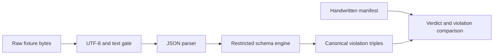

# Family protocol v3

The v3 JSON tree is a prepared contract for the Nakama family, not deployed
IPC. It defines 17 control and evidence message families, reserves eight later
names, and has independent Python, C++, and Rust validators. No production
producer or consumer currently calls those validators. Production traffic
remains [Runtime protocol v2](runtime-protocol-v2.md).

The JSON root deliberately excludes P2 FlatBuffers feature batches and the
future outer envelope/CRC parser. High-rate data belongs to
[Binary telemetry](binary-telemetry.md).

## Identity and message families

Probe addresses carry five strict identity parts. Capability negotiation is a
closed ten-key object, and each capability is either `supported` or
`unsupported`; there is no unknown value. Control and telemetry connections
use separate hello variants. The telemetry hello includes fields intended to
link it to the control connection and challenge when a runtime consumer is
built.

The schema also models timing validity, derived-cycle data, transport stamps,
steering revision and TTL, invalidation, preview leases, acknowledgements,
state reports, evidence, and session snapshots. Session snapshots are declared
transient and reconstructable rather than a persistence store.

Descriptions of idempotency, deadlines, connection linkage, probe-first state
reporting, or preview fail-safe behavior are obligations for future consumers.
The schema package alone does not schedule messages or own runtime state.

## Validation pipeline

Every fixture passes a raw byte/text gate before parsing. That gate normalizes
cross-language behavior for malformed numbers, invalid escapes and UTF-8, NUL,
surrogates, empty keys, and BOMs. Schema loading rejects unsupported keywords,
wrong keyword value types, and dangling references instead of silently
ignoring them.

Python uses Draft 2020-12 to check fixture verdicts. The C++ and Rust engines
implement the repository's supported subset and compare the full canonical
violation set with the same handwritten manifest. A violation is a stable
triple of instance pointer, resolved schema pointer, and keyword, and results
are sorted deterministically.

Objects are strict by default. Only counters, confidence, and distribution are
additive, and each has a maximum-property budget. Unknown or reserved
discriminators are rejected. The reserved-name registry keeps defined and
reserved messages disjoint and assigns future owners.

## Evolution and limitations

- Adding a capability changes a closed required object and is a major contract
  change.
- Grid and quantization files are contracts, not calculation hints; their
  generation and fixtures must remain synchronized.
- A new message requires schema, reservation accounting, fixtures, manifest,
  and all validation legs.
- JSON Schema cannot express every intended cross-field relationship. A prose
  description becomes enforced behavior only when a reader rule and negative
  fixture prove it.
- No v3 envelope, CRC parser, producer, consumer, or persistence owner exists
  in the current runtime.

## Source map and validation

- Root schema: `eq-copilot/schemas/v3/eq-ipc-v3.schema.json`
- Contract rationale: `eq-copilot/schemas/v3/README.md`
- Reserved families: `reservierte-nachrichten-v1.json`
- Grids and quantization: `bandgitter/`, `quantisierung-v1.json`
- C++ reader: `plugin/vertrag/NakamaVertrag.*`
- Rust reader: `broker/src/vertrag.rs`
- Python reference: `tools/eq-copilot/pruefe_v3_vertrag.py`
- Shared evidence: `eq-copilot/fixtures/v3/MANIFEST.json`

Focused checks are `pruefe_v3_vertrag.py --abdeckung`,
`erzeuge_v3_fixtures.py --pruefen`, the grid and quantization regeneration
checks, `EqCopSchemaTest`, and the Rust `contract_cross_language` integration
test. They prove contract agreement, not runtime adoption.

