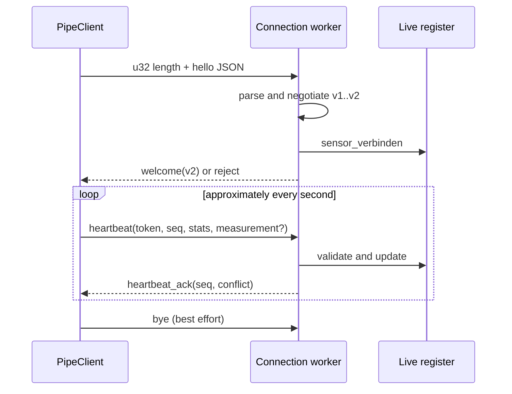

# Runtime protocol v2

The production plugin and broker communicate with UTF-8 JSON protocol v2 over
a Windows named pipe. The broker still accepts protocol-v1 clients; the current
plugin requires a v2 welcome and is not a general downgrade client. The pipe
name retains a legacy `.v1` suffix, so negotiation—not the pipe string—is the
payload-version authority.

## Connection flow

`EqCopilotProcessor` constructs `PipeClient` with providers for persistent
sensor identity, volatile runtime nonce, audio configuration, runtime counters,
and compact measurement. The client connects, sends `hello`, and expects
`welcome` or `reject`. After a v2 welcome it sends a heartbeat roughly once per
second, waits for `heartbeat_ack`, and sends `bye` best-effort during teardown.



Persistent identity comes from [Plugin state](../plugin/state-and-identity.md).
The runtime nonce distinguishes live copies of that state, and the broker's
session token belongs only to the current broker run. Duplicate live nonces for
one sensor ID create a visible conflict; the resolution path assigns one plugin
instance a new persistent ID and reconnects.

## Framing

Both sides use a four-byte little-endian unsigned length followed by exactly
that many UTF-8 JSON bytes. The maximum payload is 262,144 bytes. A zero-length,
oversized, truncated, or invalid UTF-8 frame fails before message dispatch.
Clean EOF before a new prefix is distinguished from a partial prefix or body.
Framing failure closes the affected connection rather than the broker process.

The broker's named-pipe ACL and same-name startup behavior are operational
properties documented in
[Broker service lifecycle](../broker/service-lifecycle.md).

## Declarative schema versus runtime enforcement

`eq-ipc.schema.json` declares strict shapes for hello, welcome, reject,
heartbeat, acknowledgement, and bye, plus measurement limits. Production code
does not load that JSON Schema. Rust `serde` deserialization and explicit
guards in `protokoll.rs` and `server.rs` are the actual runtime boundary.

Currently explicit measurement checks require a state and cap LTAS values at
512. A schema range or `additionalProperties` rule that has no equivalent
serde shape or explicit guard is a declarative contract expectation, not proof
of uniform runtime enforcement. `pruefe_v2_schemas.py` proves that the five v2
schema files are valid JSON Schemas with their frozen IDs; it does not prove
that the binaries enforce every keyword.

## Failure behavior

- Negotiation accepts versions 1 through 2 and returns a bounded version
  rejection otherwise.
- A heartbeat with the wrong session token increments the orphan-token counter,
  is logged, and is ignored.
- Invalid measurement is counted and omitted while the v2 connection remains
  alive and receives an acknowledgement.
- JSON parse failures are counted; frame failures end only that connection.
- V1 clients receive no acknowledgements and provide no v2 measurement.
- The current C++ client records ACK conflict state but does not verify that the
  echoed sequence equals the heartbeat sequence.

## Source map and validation

- Declarative contract: `eq-copilot/schemas/eq-ipc.schema.json`
- Client: `eq-copilot/plugin/src/PipeClient.h`, `PipeClient.cpp`
- Processor integration: `plugin/src/PluginProcessor.cpp`
- Framing: `broker/src/framing.rs`
- Messages/negotiation: `broker/src/protokoll.rs`
- Server dispatch: `broker/src/server.rs::verbindung_bedienen`
- Live state: [Broker sessions and aggregation](../broker/sessions-and-aggregation.md)

Focused validation combines:

```powershell
cargo test --manifest-path broker/Cargo.toml
py -3.13 tools/eq-copilot/pruefe_v2_schemas.py
```

With a broker running, `EqCopPipeProbe` exercises the real C++ client,
negotiated v2 ACKs, a compact measurement, and conflict creation/clearing.
There is no shared valid/invalid v2 corpus that proves full equivalence between
schema, C++ serialization, and Rust runtime checks.
