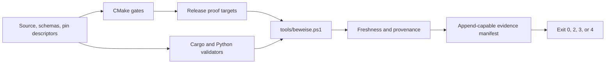

# Build and proof

Nakama uses configure-time gates, focused native targets, contract validators,
and a local evidence-manifest runner. Product proof is deliberately local, and
so is documentation refresh: there is no CI workflow for either. Wiki pages are
reconciled through the OpenWiki lifecycle during a working session, which is
never a replacement for `tools/beweise.ps1`.

## Configure gates and pins

The native root requires CMake 3.22 or newer and C++20. Its
`PROJECT_VERSION` is `0.3.0`, and CMake reads
`nakama::ids::kPluginVersion` from `EqCopilotIds.h`. Configuration fails when
that value is absent or differs, preventing the host-visible bundle identity
from disagreeing with the runtime heartbeat identity.

JUCE is pinned to `8.0.9`. CMake fetches it, applies and verifies the Nakama
wrapper bridge, and only then declares plugin targets. The ordering ensures no
VST3 target compiles an unpatched wrapper. Bridge details belong in
[host capabilities](host-capabilities.md).

FlatBuffers has one checked-in descriptor, `WERKZEUG.json`, which pins version
`25.12.19`, the source commit, generation arguments, and output paths. CMake
checks fetched headers and the compiler; generated C++ carries a compile-time
version assertion; Cargo records the resolved Rust crate in its lockfile.

`pruefe_flatc_drift.py` uses the actual compiler path exported by CMake. It
checks the descriptor, Rust requirement and lockfile, regenerates both
languages, and requires byte-identical committed output. Missing prerequisites
exit 3, measured mismatch or drift exits 2, and a clean result exits 0.

## Native target map

`eq-copilot/plugin/CMakeLists.txt` owns three product VST3s: `EqCopilot`,
`NakamaSuna`, and `NakamaProbeeq`. The first is the current Gen analyzer;
the latter two are thin identity and product-class layers over the shared
`SondeProcessor`. Disposable measurement plugins and focused headless test
executables remain separate from those shipped targets. The public
`NAKAMA_HOST_BRIDGE=1` definition propagates into the EqCopilot JUCE wrapper.

Names, vendor and plugin codes, and VST3 categories come from
`identity/plugin-identities-v1.json` through `NakamaIdentitaet.cmake`. The
reader does not invent defaults: a missing target or a missing, empty, or
`null` identity field stops configuration. Class IDs are deliberately not read
by CMake; JUCE derives them, and `EqCopIdentityTest` compares the resulting
`moduleinfo.json` for all three products with the frozen manifest.

State, parameter, canonicalization, v3 text-guard, and lifecycle sources are
compiled once into the static `NakamaKern`. Its JUCE header facade inherits
headers, definitions, and options without compiling a second copy of JUCE
module sources. Five complementary checks protect the boundary:

- K1 rejects named bundle-identity macros while compiling the kernel;
- K2 inspects the kernel's CMake link closure for identity definitions;
- K2b compares relevant JUCE configuration with every kernel consumer;
- K2c compares the recommended compiler switches with every consumer; and
- A14/K3 inspects the built static library for frozen names, codes, CIDs, and
  unexpected objects, with the built main bundle as a positive countercheck.

Representative focused targets include host context, HostProbe, AuxSpike,
state, pipe, analysis, marking, schema, and editor tests. Add a new native proof
target beside the existing map, then add its runner leg and freshness inputs.

The canon declares 30 legs. The A entries cover main and probe audio, the Rust
broker, JSON and FlatBuffers contracts, regenerated fixtures, host
capabilities, kernel identity, the installer manifest, its rollback path, and
the generated band grid. The phase-native entries add Identity,
StateMigration, HostContext, HostProbe, Schema, Lifecycle, QueueStress,
LoudnessGolden, and AnalysisGolden v2. Only DspGolden and Transaction are still
unbuilt; both belong to the active-EQ phase and become required automatically
once their targets exist, which is why the most recent manifest reports 28 of 28
green.

Count these from the runner's own table rather than from a summary. The
declared list is the only place the number exists, and copied counts in this
repository have gone stale twice within a single ticket.

`EqCopilot_VST3`, `NakamaSuna_VST3`, `NakamaProbeeq_VST3`, and `NakamaKern`
are separately built measured targets rather than canon executables. The
identity and kernel checks inspect those host-visible or linked artifacts, so
the evidence does not stop at CMake declarations.

## Canonical evidence flow



The recommended full entrypoint is:

```powershell
pwsh -File tools/beweise.ps1 -Bauen -Ziel docs/beweise/<ticket>.md -Anhaengen -Titel '<ticket>'
```

With `-Bauen`, the runner configures Visual Studio 2022 for x64 when the
solution is absent, builds the canonical Release targets, and then runs native,
Cargo, and Python legs. It appends exact stdout and stderr, tool and Git
provenance, build logs, source freshness, review fields, and one aggregate
verdict to the evidence manifest.

Without `-Bauen`, freshness is an explicit timestamp heuristic: every native
proof binary is compared with the newest relevant plugin, test, bridge,
contract, probe, CMake, or patch source. An older executable makes the run
stale even if its tests are green. A successful requested build supersedes
that heuristic. For every discovered native proof binary, the manifest also
records its build time and the first 16 hexadecimal characters of its SHA-256.

Verdict precedence is failure `2`, missing prerequisite `3`, stale-but-green
and therefore unattested evidence `4`, then success `0`. A native build failure is written to a
timestamped log before the run aborts. A manifest is incomplete without raw
output and an explicit review/disposition record; use `docs/beweise/VORLAGE.md`
instead of an unstructured log.

A manifest also carries a verdict marker comment near its title, naming the
review level, the verdict, and the date. That single line is the only
hand-written input to computed plan status: a review that omits it leaves its
step counted as built rather than accepted, which is the safe direction. The
rules around it are in
[Plan status and open questions](../collaboration/plan-status.md).

## Installer and rollback contract

`schemas/installer/nakama-installer-v1.md` defines one manifest-driven package
for the three VST3s and broker. The versioned delivery manifest identifies a
VST3 only by its identity-manifest ID and CMake target. Its bundle source path
is derived from those two authorities; product names, plugin codes, and CIDs
are not copied into a second delivery identity table. Canon leg A17 checks this
mapping and exercises deliberately corrupted manifests as counterexamples.

`Install-Nakama.ps1` validates the entire plan before copying anything. A
`null` hash means the package has not been frozen for delivery and causes an
immediate refusal. Missing sources or hash mismatches also stop the run.
Authenticode is checked only when a thumbprint is configured; the current
manifest explicitly says that it is not checked without a certificate.

Before replacement, the installer saves the file actually found at each
destination and records its old and new hashes. `-Rueckweg` restores those
captured files, or removes a newly introduced target when no predecessor
existed. For plugin bundles, an unknown predecessor hash or a lower state
schema is treated as a destructive downgrade and requires explicit
`-Erzwingen`. Installation and rollback are user-invoked elevated operations;
the repository does not run them automatically.

## Focused commands

```powershell
cmake -S eq-copilot -B eq-copilot/build -G "Visual Studio 17 2022" -A x64
cmake --build eq-copilot/build --config Release --target EqCopilot_VST3 NakamaSuna_VST3 NakamaProbeeq_VST3 EqCopLebenslaufTest
cargo test --manifest-path broker/Cargo.toml --color never
py -3.13 tools/eq-copilot/pruefe_flatc_drift.py
py -3.13 tools/eq-copilot/pruefe_installer_manifest.py
```

For the briefing site, Node `22.13` or newer is declared. `package-lock.json`
is the resolved dependency authority; most direct dependencies are exact,
while the Sites Vite plugin deliberately uses a compatible range.

```powershell
cd briefing-hub
npm ci
npm run build
npm run lint
```

Python validator package versions and the Rust compiler itself are not pinned
by tracked requirements/toolchain files. The evidence runner records installed
versions, and validators use the missing-prerequisite exit when required
packages are unavailable.
