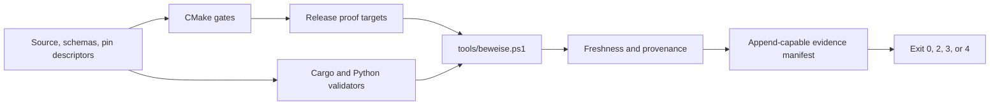

# Build and proof

Nakama uses configure-time gates, focused native targets, contract validators,
and a local evidence-manifest runner. Product proof is deliberately local; the
generated OpenWiki workflow maintains documentation and is not a replacement
for `tools/beweise.ps1`.

## Configure gates and pins

The native root requires CMake 3.22 or newer and C++20. Its
`PROJECT_VERSION` is `0.3.0`, and CMake reads
`nakama::ids::kPluginVersion` from `EqCopilotIds.h`. Configuration fails when
that value is absent or differs, preventing the host-visible bundle identity
from disagreeing with the runtime heartbeat identity.

JUCE is pinned to `8.0.9`. CMake fetches it, applies and verifies the Nakama
wrapper bridge, and only then declares plugin targets. The ordering ensures no
VST3 target compiles an unpatched wrapper. Bridge details belong in
[host capabilities](host-capabilities.md).

FlatBuffers has one checked-in descriptor, `WERKZEUG.json`, which pins version
`25.12.19`, the source commit, generation arguments, and output paths. CMake
checks fetched headers and the compiler; generated C++ carries a compile-time
version assertion; Cargo records the resolved Rust crate in its lockfile.

`pruefe_flatc_drift.py` uses the actual compiler path exported by CMake. It
checks the descriptor, Rust requirement and lockfile, regenerates both
languages, and requires byte-identical committed output. Missing prerequisites
exit 3, measured mismatch or drift exits 2, and a clean result exits 0.

## Native target map

`eq-copilot/plugin/CMakeLists.txt` owns one product VST3, `EqCopilot`, plus
disposable measurement plugins and focused headless test executables. Shared
state-and-binding sources are supplied by one helper rather than copied into
target definitions. The public `NAKAMA_HOST_BRIDGE=1` definition propagates
into JUCE wrapper compilation.

Representative focused targets include host context, HostProbe, AuxSpike,
state, pipe, analysis, marking, schema, and editor tests. Add a new native proof
target beside the existing map, then add its runner leg and freshness inputs.

The current A1-A13 canon is complete and explicit: Null, analysis-golden, and
marking native tests; the Rust broker test suite; v3 schema coverage, band-grid,
quantization, and fixture regeneration; FlatBuffers drift and fixture checks;
v2 schema validation; state fixtures; and host-capability reconciliation. Its
phase-native entries are Identity, StateMigration, HostContext, HostProbe, and
Schema tests. QueueStress, AnalysisGolden v2, DspGolden, and Transaction are
declared as planned legs and automatically become required once their targets
exist.

`EqCopilot_VST3` is a separately built measured target rather than a canon
executable. `EqCopIdentityTest` inspects its `moduleinfo.json`, so the artifact
whose identity reaches the host is part of the build evidence.

## Canonical evidence flow



The recommended full entrypoint is:

```powershell
pwsh -File tools/beweise.ps1 -Bauen -Ziel docs/beweise/<ticket>.md -Anhaengen -Titel '<ticket>'
```

With `-Bauen`, the runner configures Visual Studio 2022 for x64 when the
solution is absent, builds the canonical Release targets, and then runs native,
Cargo, and Python legs. It appends exact stdout and stderr, tool and Git
provenance, build logs, source freshness, review fields, and one aggregate
verdict to the evidence manifest.

Without `-Bauen`, freshness is an explicit timestamp heuristic: every native
proof binary is compared with the newest relevant plugin, test, bridge,
contract, probe, CMake, or patch source. An older executable makes the run
stale even if its tests are green. A successful requested build supersedes
that heuristic. For every discovered native proof binary, the manifest also
records its build time and the first 16 hexadecimal characters of its SHA-256.

Verdict precedence is failure `2`, missing prerequisite `3`, stale-but-green
and therefore unattested evidence `4`, then success `0`. A native build failure is written to a
timestamped log before the run aborts. A manifest is incomplete without raw
output and an explicit review/disposition record; use `docs/beweise/VORLAGE.md`
instead of an unstructured log.

## Focused commands

```powershell
cmake -S eq-copilot -B eq-copilot/build -G "Visual Studio 17 2022" -A x64
cmake --build eq-copilot/build --config Release --target EqCopHostContextTest EqCopHostProbeTest EqCopAuxSpikeTest
cargo test --manifest-path broker/Cargo.toml --color never
py -3.13 tools/eq-copilot/pruefe_flatc_drift.py
```

For the briefing site, Node `22.13` or newer is declared. `package-lock.json`
is the resolved dependency authority; most direct dependencies are exact,
while the Sites Vite plugin deliberately uses a compatible range.

```powershell
cd briefing-hub
npm ci
npm run build
npm run lint
```

Python validator package versions and the Rust compiler itself are not pinned
by tracked requirements/toolchain files. The evidence runner records installed
versions, and validators use the missing-prerequisite exit when required
packages are unavailable.
