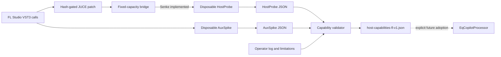

# Host capabilities

Nakama measures host behavior through a thin JUCE VST3 wrapper patch,
fixed-capacity bridge, and disposable probe plugins. Raw reports and operator
observations are reconciled into a strict capability file. That evidence does
not yet drive the product processor at runtime.

## Bridge installation and semantics

JUCE's public processor API does not expose the distinctions Nakama needs for
context presence, every automation point, and per-bus presentation latency.
`NakamaHostBridge.h` supplies SDK-free repository logic; the JUCE patch only
forwards wrapper observations.

Patch installation normalizes line endings before hashing. An already patched
wrapper is a no-op, pristine JUCE `8.0.9` is patched and rehashed, and any
unknown source state fails configuration. A JUCE update therefore requires an
explicitly re-proved patch and new accepted hashes.

The patch observes every parameter-queue point, distinguishes an absent process
context from a present one, forwards `IAudioPresentationLatency`, and hands the
payload off immediately before `processBlock`. JUCE's existing last-point-wins
parameter behavior remains unchanged.

Bridge storage is fixed-capacity: 512 automation events, 128 remembered last
values, and 16 buses. Missing data remains distinct from zero. Overflow keeps
the final host value, revokes sample-accuracy assurance, and increments
explicit counters. Only processors implementing `hostbruecke::Senke` receive
payloads, including flush-style callbacks for which JUCE may not call
`processBlock`.

## Measurement flow



HostProbe is passive, bit-identical, zero-latency, and disposable. It supports
float and double paths and reports bridge callbacks separately from JUCE audio
processing. It promotes multi-point automation to sample-accurate only when
delivery has no overflow or ordering failure. Reports are timestamped JSON
under the user's `evenacadia/nakama/spike` application-data directory;
directory or write failure is returned as an empty path and shown by the
editor.

AuxSpike is a separate passive bus-routing probe with main plus two default-off
auxiliary inputs. It observes impulse offsets without changing main audio and
explicitly rejects continuous-signal contribution measurement.

## What the checked-in evidence proves

The Termin B HostProbe report records bridge/context delivery and project
sample time in one controlled FL Studio measurement. Automation never exceeded
one point per queue, so sample-accurate automation remains unproved. Input and
output presentation latency were reported, but no impulse golden connected the
reported numbers to measured alignment and one later value change was not
retained.

The two Termin A AuxSpike reports show activation and routing for sidechain and
compare buses, with impulses observed at offset zero. They do not prove PDC,
source or channel attribution, or auxiliary contribution because the run used
indistinguishable stimuli and no latency-bearing load.

These are measurements of a particular setup, not general guarantees inferred
from an FL Studio version.

## Capability contract and validation

`identity/host-capabilities-fl-v1.json` is a strict ten-key adoption contract.
Every value is either `supported` or `unsupported`; additional keys are not
accepted. Only `host_context_presence` and `project_time_samples` are currently
supported. Each other capability carries a measured limitation, fixed
fallback, or explicit unmeasured boundary. A value changes only after a new
measurement, never from host-version inference.

The eight unsupported bits and their present dispositions are:

- `sample_accurate_automation` is measured unsupported: FL delivered at most
  one point per queue, always at offset zero. Use a block ramp and disable
  topology automation.
- `float64_processing` is measured unsupported: the run delivered float
  callbacks and no double callbacks. Advertise only the proved float ability.
- `presentation_latency` has a reported value but an incomplete impulse
  golden. Do not perform subtractive cross-probe alignment.
- `aux_compare_pre` was observed without the required PDC and channel-identity
  golden. Permit state A/B only, not a local audio delta.
- `aux_priority_sidechain` has the same incomplete PDC/channel proof. Disable
  dynamic actuation.
- `contribution_aux` is unmeasured. Fall back to association rather than exact
  attribution.
- `binary_telemetry` is not yet adopted. Use reduced JSON cadence without P0
  loss.
- `remote_control` is not yet adopted. Keep the active probe locally
  operable.

Validate the capability file against schemas, raw fields, evidence prose,
fallbacks, and the expected support distribution:

```powershell
py -3.13 tools/eq-copilot/pruefe_host_capabilities.py
```

Missing `jsonschema` exits 3, an evidence or schema mismatch exits 2, and a
successful reconciliation exits 0. Upgrading a capability requires a new
controlled host run, immutable raw report, action log and limitations,
capability update, and successful reconciliation. Unit tests alone cannot
upgrade measured host support.

## Production boundary

The product VST3 compiles the patched JUCE wrapper but `EqCopilotProcessor`
does not implement `hostbruecke::Senke` and does not load the capability JSON.
Today the bridge is inert for the product and the capability document is a
validated evidence/adoption artifact, not runtime configuration.

A future adopter must implement the sink explicitly, define reset and
lifecycle behavior, and map every unsupported capability to its documented
fallback. New bridge fields need fixed-capacity storage, validity and overflow
semantics, patch anchors, serialization, and focused host-context tests.
