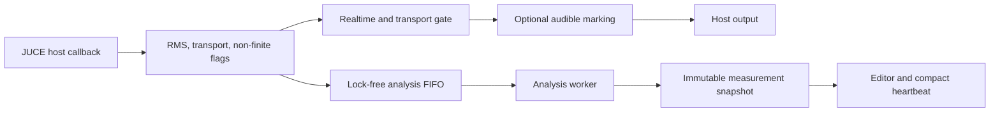

# Plugin audio runtime

The current product entrypoint is `createPluginFilter`, which constructs
`EqCopilotProcessor`. The CMake target links the processor, editor, pipe client,
analysis engine, and diagnosis code into the same VST3. Construction creates a
fresh persistent sensor identity and a separate runtime nonce, allocates the
analysis FIFO, then starts the analysis worker and pipe client. Destruction
stops pipe activity, wakes the worker, and joins it.

## Audio path

`EqCopilotProcessor::processBlock` supports matching mono or stereo layouts.
Within each block it observes RMS and transport state, copies the dry samples
into the lock-free analysis FIFO, and only then asks `HoerMarkierung` to alter
the output. This ordering is the central invariant: meters and analysis always
see the unmarked mix. With no authorized marking, pass-through consists of not
changing the host buffer.

FIFO capacity is a quality-of-analysis limit, not an audio limit. If there is
insufficient room, the callback writes what fits, increments the dropped-frame
counter by exactly the number of unwritten analysis frames, and continues
delivering host audio. The callback contract forbids
allocation, locks, file access, and network access. Non-finite input is likewise
kept in the host buffer, while the analysis engine substitutes zero and counts
the affected samples so its accumulators remain finite.

Project-window time advances only while transport is playing. Expected host
position is tracked from the previous block; a discontinuity greater than 64
samples increments the window-discontinuity counter rather than being silently
treated as continuous program time.

## Worker ownership and publication

The worker is the only thread that mutates [AnalyseEngine](analysis-engine.md).
It drains the FIFO about every 50 ms, uses light publication between expensive
evaluations, and performs a heavy evaluation roughly every fifth iteration
when new samples exist. Reset and sample-rate requests cross into the worker as
atomic state. `PipeClient` runs a different thread and receives fresh hello,
statistics, and compact-measurement values through providers; pipe work never
runs in `processBlock`.

## Audible marking safety

Marking is the one deliberate audio-coloring path in the current processor.
The message thread precomputes a POD `MarkierungsAuftrag` and publishes it
through a four-slot ring. The audio thread consumes that fixed order without
designing filters or allocating memory.

Authorization requires all applicable gates:

- realtime behavior has been proved, or the headless test override is active;
- transport is playing when a transport exists;
- the host is not performing non-realtime processing; and
- the editor is open, unless the test override is active.

Realtime proof requires plausible agreement between processed audio time and
wall time over successive windows. Processing gaps and transport edges reset
the proof; a free-running ratio revokes it and signals the editor. If marking is
unauthorized, the request is disabled, or the host block exceeds prepared
capacity, `HoerMarkierung` leaves the buffer dry.

The FIFO, marking latch, realtime proof, and transport window are runtime-only
state. Host persistence is owned by
[State and identity](state-and-identity.md), not by this path.

## Failure and extension rules

- Analysis overload is visible through a counter and never backpressures audio.
- A sample-rate change resets marking preparation and analysis accumulation.
- New analysis work belongs behind the FIFO/worker boundary.
- New audible modes must remain precomputed orders with an explicit dry path.
- New broker data must be exposed through pipe-thread providers; the current
  wire exchange is documented in
  [Runtime protocol v2](../contracts/runtime-protocol-v2.md).

## Source map and validation

- Entrypoint and target: `eq-copilot/plugin/src/PluginFactory.cpp`,
  `eq-copilot/plugin/CMakeLists.txt`
- Callback and worker: `PluginProcessor.h`, `PluginProcessor.cpp` —
  `prepareToPlay`, `processBlock`, `workerLauf`, `lebenszeichen`
- Audible exception: `HoerMarkierung.h` — `MarkierungsAuftrag`,
  `HoerMarkierungDsp::reicheEin`, `verarbeite`
- Pipe boundary: `PipeClient.h`, `PipeClient.cpp`
- Focused checks: `NullTestMain.cpp` and `MarkierungTestMain.cpp`

`EqCopNullTest` covers bit-exact blocks, latency/tail, layouts, state round-trip,
and non-finite preservation. `EqCopMarkierungTest` covers engagement, fades,
return to exact dry output, realtime/offline/transport gates, and the dry
analysis boundary. These are headless simulations; they do not replace a real
DAW offline-render or transport check.
