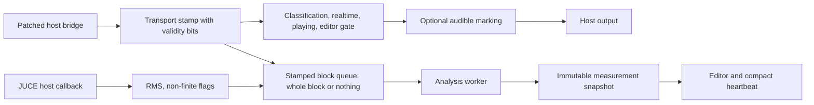

# Plugin audio runtime

The main analyzer entrypoint is `createPluginFilter`, which constructs
`EqCopilotProcessor`. Its CMake target links the processor, editor, pipe client,
analysis engine, and diagnosis code into the Eqcp VST3. Construction creates a
fresh persistent sensor identity and a separate runtime nonce, then starts the
analysis worker and pipe client. The backing store of the stamped analysis
queue is allocated separately, in `prepareToPlay` on the message thread, so the
audio thread never allocates. Destruction stops pipe activity, wakes the
worker, and joins it.

Suna and Probeeq use separate thin targets over one `SondeProcessor`. That
processor currently has no editor, parameter surface, analysis worker, or pipe
client. It accepts matching enabled input/output layouts and otherwise leaves
the supported host buffer untouched. The two current shells therefore have
sample-identical pass-through, zero declared latency, and no tail. Probeeq's
future EQ path will intentionally change that boundary and its proof.

## Audio path

`EqCopilotProcessor::processBlock` supports matching mono or stereo layouts.
Within each block it observes RMS and transport state, publishes the dry samples
to the stamped analysis queue, and only then asks `HoerMarkierung` to alter
the output. This ordering is the central invariant: meters and analysis always
see the unmarked mix. With no authorized marking, pass-through consists of not
changing the host buffer.

Queue capacity is a quality-of-analysis limit, not an audio limit — but the
loss mode is deliberately coarse. A block is published **whole or not at all**:
a sample ring and a descriptor ring are written separately, and only the
descriptor, released after the samples, makes a block visible to the consumer.
If either ring is short, the complete analysis block is discarded, a counter
rises, and the next accepted descriptor starts a new continuity segment. The
earlier partial-write behaviour was removed precisely because it produced the
worst possible loss for time-dependent analysis: a gapless-looking sample
stream with time missing in the middle, which the consumer could no longer see.

For the same reason the local block stream counts *every* host block, including
dropped ones — a counter that tallied only accepted frames could no longer
express that time is missing. A block larger than the layout's fixed slot
capacity is dropped for analysis alone and counted separately; the capacity is a
fixed layout constant rather than a value derived from the host's
expected-block-size hint, because that hint is unreliable and a runtime-derived
capacity could not be checked deterministically.

The callback contract forbids allocation, locks, file access, and network
access; the queue only ever sees the audio buffer read-only. Non-finite input is
likewise kept in the host buffer, while the analysis engine substitutes zero and
counts the affected samples so its accumulators remain finite.

Project-window time advances only while transport is playing. Expected host
position is tracked from the previous block; a discontinuity greater than 64
samples increments the window-discontinuity counter rather than being silently
treated as continuous program time.

## Host transport stamp

`nakamaBlockEmpfangen` is this processor's side of the patched JUCE bridge
described in [Host capabilities](../delivery/host-capabilities.md). It runs on
the audio thread immediately before `processBlock`, and it is where the bridge
stopped being merely compiled and became load-bearing in the product.

Each field of the stamp carries its own validity bit, and every bit is the
conjunction of two different questions: is a host context present at all, and
did the host report *this* field in *this* block. The stamp is cleared per
block, so no field inherits the previous one. A finding is explicitly not paired
one-to-one with a processed block — a parameter flush or the Wavelab guard
produces one without a following block — so a freshness bit is consumed rather
than assumed.

## Worker ownership and publication

The worker is the only thread that mutates [AnalyseEngine](analysis-engine.md).
It drains the FIFO about every 50 ms, uses light publication between expensive
evaluations, and performs a heavy evaluation roughly every fifth iteration
when new samples exist. Reset and sample-rate requests cross into the worker as
atomic state. `PipeClient` runs a different thread and receives fresh hello,
statistics, and compact-measurement values through providers; pipe work never
runs in `processBlock`.

## Audible marking safety

Marking is the one deliberate audio-coloring path in the current processor.
The message thread precomputes a POD `MarkierungsAuftrag` and publishes it
through a four-slot ring. The audio thread consumes that fixed order without
designing filters or allocating memory.

Authorization requires all applicable gates:

- the instance is lifecycle-classified as `main`;
- realtime behavior has been proved, or the headless test override is active;
- the host reports a **valid** playing flag and that flag is set;
- the host is not performing non-realtime processing; and
- the editor is open, unless the test override is active.

The playing term used to be `playing OR no-transport-reported` — a fail-open
branch. It was closed on a user decision, and it could not have been closed
earlier: until the host bridge was wired in, "transport unknown" was not
expressible at all, so the two cases could not be told apart. In FL Studio
nothing changes, because a transport was reported from the first block and the
fail-open branch was dead there; headless without a playhead, marking is now
silent. The realtime test override deliberately does **not** bypass this term:
the override exists for what depends on wall-clock time, and transport does not.

Realtime proof requires plausible agreement between processed audio time and
wall time over successive windows. Processing gaps and transport edges reset
the proof; a free-running ratio revokes it and signals the editor. If marking is
unauthorized, the request is disabled, or the host block exceeds prepared
capacity, `HoerMarkierung` leaves the buffer dry.

The audio thread reads main classification through an atomic mirror and never
locks or queries the lifecycle object. The FIFO, marking latch, realtime proof,
and transport window are runtime-only state. Host persistence and lifecycle
transitions are owned by [State and identity](state-and-identity.md), not by
this path.

## Failure and extension rules

- Analysis overload is visible through counters and never backpressures audio;
  reduction happens through cadence and whole-block drops, never through
  partial copies.
- A sample-rate change resets marking preparation and analysis accumulation.
- New analysis work belongs behind the queue/worker boundary. What the sealed
  blocks then mean for open measurement windows is decided one layer further
  in, by the [Measurement core](measurement-core.md).
- New audible modes must remain precomputed orders with an explicit dry path.
- New broker data must be exposed through pipe-thread providers; the current
  wire exchange is documented in
  [Runtime protocol v2](../contracts/runtime-protocol-v2.md).

## Source map and validation

- Main entrypoint and targets: `eq-copilot/plugin/src/PluginFactory.cpp`,
  `eq-copilot/plugin/CMakeLists.txt`
- Callback and worker: `PluginProcessor.h`, `PluginProcessor.cpp` —
  `prepareToPlay`, `processBlock`, `workerLauf`, `lebenszeichen`,
  `nakamaBlockEmpfangen`
- Analysis hand-off: `plugin/core/StampedAudioQueue.h` — `vorbereiten`,
  `veroeffentliche`, single-block quarantine
- Probe shells: `plugin/sonde/SondeFactory.cpp`, `SondeProcessor.h`,
  `SondeProcessor.cpp`
- Audible exception: `HoerMarkierung.h` — `MarkierungsAuftrag`,
  `HoerMarkierungDsp::reicheEin`, `verarbeite`
- Pipe boundary: `PipeClient.h`, `PipeClient.cpp`
- Focused checks: `NullTestMain.cpp`, `MarkierungTestMain.cpp`,
  `LebenslaufTestMain.cpp`, and `SondeNullTestMain.cpp`

`EqCopNullTest` covers bit-exact blocks, latency/tail, layouts, state round-trip,
and non-finite preservation. `EqCopMarkierungTest` covers engagement, fades,
return to exact dry output, realtime/offline/transport gates, and the dry
analysis boundary. `EqCopLebenslaufTest` connects classification to the real
marking path, while the two probe null targets exercise each compile-time
product class. `EqCopQueueStressTest` covers the queue itself: whole-block
capture across ring wraps, overflow of either ring discarding the complete
block, oversize dropping for analysis while audio stays untouched, and no
allocation on the audio thread across thousands of blocks with transport edges.
These are headless simulations; they do not replace a real DAW offline-render or
transport check.
