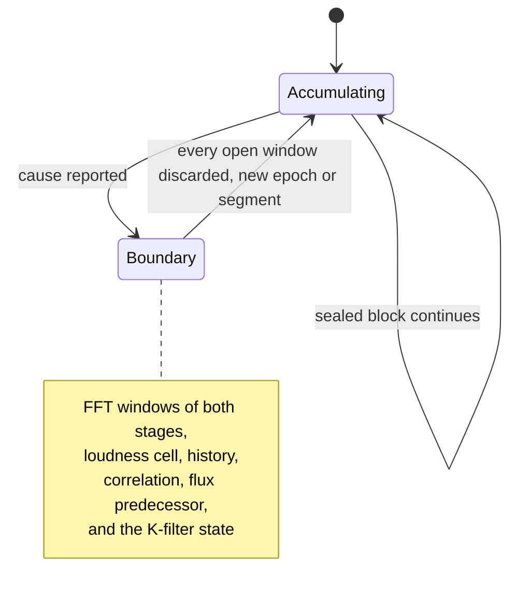

# Measurement core

The feature engine is the layer that decides what a delivered audio block means
for the measurement windows currently open. It consumes the sealed blocks that
the [audio runtime](audio-runtime.md) publishes, runs in the worker, and never
sees the audio thread.

Its whole mandate fits in one sentence from the phase gate: *drop, seek, and
loop separate every open window.* The contract behind it is deliberately
absolute — no FFT, loudness, correlation, or fingerprint window may bridge a
real **or possible** epoch boundary. Not "should preferably not", not
"interpolated". A window that spans a boundary averages two places in the music
into a single number, and that number then looks like a measurement. It is not
one.

This is a distinct component from the legacy `AnalyseEngine` documented in
[Analysis engine](analysis-engine.md), which still feeds the current editor and
its offline reference. The feature engine serves the versioned family contracts
instead; both currently coexist.

## Division of labour with the queue

The queue answers one question — does this block continue the previous one? —
and holds a block in single-block quarantine until its successor proves the
continuation. The feature engine answers the question after that: given a
boundary, what happens to everything currently open?

Discarding the filter state matters as much as discarding the buffers: a
weighting filter carries audible tail across a boundary even when every sample
buffer has been cleared, which is exactly the kind of leak that stays invisible
to a fill-level check.

## Boundary causes

The causes are a closed enumeration rather than a boolean, because the sheet
that reports them must be able to distinguish them:

| Cause | Meaning |
|---|---|
| local gap | queue drop or oversize — separates the **segment**, not the epoch, so a local analysis gap is never mislabelled as a host seek |
| transport edge | the playing flag flipped: stop or start |
| time jump | project time jumped without a loop wrap: a seek |
| loop wrap | backward jump to the loop start while looping is active |
| sample-rate change | named explicitly by the time contract |
| restart | `prepareToPlay` — a new run, and in doubt different host conditions |
| possible straddle | a loop boundary might lie inside this block and the PPQ-to-sample mapping is unproven for this host run, so the possible straddle is marked invalid |
| evidence change | the proof situation itself changed — context appears or disappears, offline render begins — after which the same number means something else |

The counter array is sized from the enumeration itself rather than from a
hand-written number beside it. An earlier revision carried a literal bound that
was correct for the causes then present; a tenth cause would have written past
it silently, with nothing turning red.

## Why two resolution stages

A 1/24-octave band at 30 Hz is 0.88 Hz wide, while a 4096-point FFT at 48 kHz
has 11.7 Hz bins — the lowest band contains no bin at all and is simply not
measurable. Hence two stages: 16384 below 200 Hz, 4096 above.

The second reason is the one that matters for the gate. Two stages mean two
windows open at once with different lengths — about 341 ms and about 85 ms at
48 kHz. A fault in the separation might stay invisible with a single stage,
because a short window is often nearly empty at a boundary anyway; with two, the
long window still reaches across a boundary the short one has long passed. The
golden test drives exactly that.

## Fixed bounds and transport validity

Although the engine runs in the worker, its entire memory is created during
preparation. No ring grows, no list grows, and the event stream is capped and
counts its own losses — a per-window allocation at analysis cadence would
contradict a contract that promises fixed upper bounds for probes, bands,
events, and queue depth.

The seven validity bits of the transport stamp are the contract from the
FlatBuffers telemetry schema, and their values and order may never move; the
binary format is described in
[Binary telemetry](../contracts/binary-telemetry.md). Process-context presence
is deliberately **not** one of those bits: it states whether the numbers mean
anything at all, which is a different question from whether the host reported a
given field in a given block.

## Source map and validation

- Engine: `eq-copilot/plugin/core/analysis/FeatureEngine.h` — `grenzeZiehen`,
  `rahmenLeeren`, `Grenzgrund`
- Fixed-memory loudness: `core/analysis/LoudnessAccumulator.h`
- Band contract and grids: `core/analysis/BandGrid.h`,
  `core/analysis/BandGridZahlen.h`
- Weighting and transform: `core/analysis/KGewichtung.h`, `core/analysis/Fft.h`
- Focused check: `EqCopAnalysisGoldenTest`, which drives every boundary cause
  separately, measures the K-filter state bit-exactly across boundaries, and
  verifies that a stalled project time across split host buffers is **not** a
  boundary
- Loudness check: `EqCopLoudnessGoldenTest`

Both goldens run inside the proof canon described in
[Build and proof](../delivery/build-and-proof.md).

## Change surfaces

- A new boundary cause is added to the enumeration, never as a parallel flag;
  the counter follows automatically.
- A new accumulator must be added to the clearing list in the same change set,
  otherwise it silently bridges boundaries — a fill-level check will not catch
  it, because a fill level is not a state.
- Anything with an unbounded upper size belongs behind a cap with a loss
  counter, not in a growing container.
