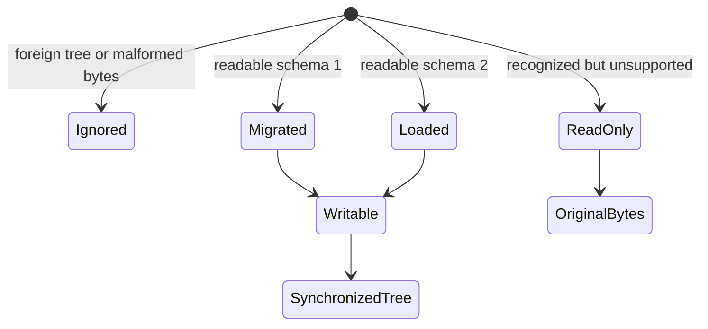

# Plugin state and identity

`nakama::state` owns host-state parsing, migration, typed access, and byte
production. It is an all-or-read-only boundary and is not called from the audio
thread. `EqCopilotProcessor` integrates it with JUCE persistence, pipe
registration, duplicate repair, and host-dirty notifications.

## Schema-2 ownership

A readable `NakamaState` schema-2 tree has exactly one `Common` child and a
kind-specific child matrix. The bundle must accept the stored plugin kind, and
the measurement position must be valid for that kind. The current Eqcp bundle
accepts main and legacy kinds; passive and active identities are reserved for
their own bundles. Unknown children, duplicate children, and the not-yet-readable
`Dsp` or `Pairing` children force read-only handling instead of partial
interpretation.

Foreign roots and malformed bytes leave the processor's current state
unchanged. A recognized state whose version, child matrix, kind, or values
cannot be interpreted is kept read-only with its original bytes. Saving a
read-only state returns those bytes exactly. Saving writable state updates
known values in a copy of the loaded tree so additive unknown properties
survive.

When read-only state is loaded, the processor stops pipe registration because
it has no trusted identity to announce. A readable load or migration restarts
and reconnects the pipe. Loading and migration do not mark the host project
dirty. While read-only, both binding changes and persistent sensor-ID repair
are rejected without reconnecting or emitting a host-dirty notification.

## Migration and persistent changes

Schema-1 roles map into schema-2 plugin kind and measurement position. Migration
preserves sensor ID, label, and pair ID, does not invent a project binding, and
creates a UUID only for a broken legacy state with an empty sensor ID.

Binding edits validate the legacy v2 role bridge, reject read-only state, and
ignore no-op submissions. A real edit marks the host document dirty as a
non-parameter state change and reconnects the pipe. Duplicate plugin instances
can begin with the same persistent sensor ID but have different runtime nonces;
the visible repair action assigns this instance a new persistent ID, marks the
document dirty, and reconnects.

## Parameter and hash contract

The parameter table contains 109 entries: five global values and thirteen
fields for each of eight slots. It is the state contract prepared for the
future active probe; the current Eqcp product exposes no host parameters.

DSP DTO parsing is intentionally strict. The text guard and canonical reader
reject malformed JSON, duplicate keys, wrong structure or schema version,
unknown or missing parameter IDs, wrong types, non-finite numbers, and values
outside contract ranges. Valid values are serialized to canonical UTF-8 and
hashed as lowercase SHA-256. C++, Python, and Rust tests consume the same
canonicalization and DTO fixtures, but the Rust broker hash path remains test
evidence rather than production broker behavior.

## Runtime and build identity

The built Eqcp target fixes its product/vendor codes and VST3 non-replacement
behavior. `plugin-identities-v1.json` freezes that built identity and reserves
the passive and active probe identities without implying that those bundles
exist today. Configure-time equality between project and plugin versions is a
build concern documented in [Build and proof](../delivery/build-and-proof.md).

## Safe change rules

- Additive properties within readable children are the compatible extension
  seam; new semantic children or incompatible values require version work.
- Update save and load behavior together, including byte-preservation tests.
- Change the parameter table, JSON contract, generated fixtures, C++ table, and
  cross-language hash tests as one contract change.
- Do not treat the 109 prepared parameters as current Eqcp controls.

## Source map and focused validation

- State model: `eq-copilot/plugin/state/NakamaState.h`, `NakamaState.cpp`
- Parameter/DTO model: `NakamaParameter.h`, `NakamaParameter.cpp`
- Canonical JSON: `NakamaKanon.h`, `NakamaKanon.cpp`
- Processor integration: `plugin/src/PluginProcessor.cpp` —
  `getStateInformation`, `setStateInformation`, `setzeBindung`, `neueSensorId`
- Contracts: `schemas/state/nakama-state-v2.md`,
  `schemas/state/nakama-parameter-v1.json`, `identity/plugin-identities-v1.json`
- Checks: `StateMigrationTestMain.cpp`, `IdentityTestMain.cpp`,
  `tools/eq-copilot/erzeuge_state_fixtures.py`, and
  `broker/tests/contract_cross_language.rs`

The focused tests cover migration, idempotence, byte preservation, read-only
behavior, dirty/no-op rules, all parameter metadata, canonical hashes, built
metadata, and reserved IDs. They were not a substitute for inspecting a newly
built `moduleinfo.json` during this wiki initialization.
