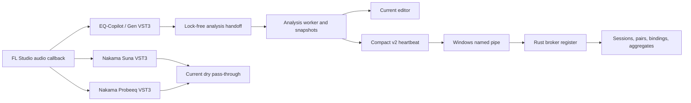

# Nakama quickstart

Nakama is an FL Studio mixing-advice plugin family: **Nakama Gen** is the main
application, **Nakama Probeeq** is the active full EQ, and **Nakama Suna** is
the passive probe. Together they form the planned Nakama Studio bundle.
Current code, bundle, and pipe identifiers still use the legacy EQ-Copilot and
`EqCop*` names.

## What exists today

The native product build now creates three VST3 bundles. `EQ-Copilot.vst3` is
the current Nakama Gen implementation: it links `EqCopilotProcessor`, the
current editor, `PipeClient`, the analysis engine, and diagnosis logic.
`Nakama Suna.vst3` and `Nakama Probeeq.vst3` are newly built product shells
over one shared `SondeProcessor`. They have frozen identities and state
contracts but currently expose no editor or host parameters. Both are
sample-identical pass-through processors today; Probeeq's EQ processing is
still future work.

A standalone Rust broker owns the Windows named pipe, live sensor register,
derived sessions and pairs, profile bindings, and aggregate export.

The repository also contains the computed plan-status pipeline, the active
Figma-to-browser design workflow, delivery evidence, and versioned cross-language
contracts. These collaboration and contract systems support product work but
are not additional shipped audio plugins.

The Gen processor observes host audio, preserves the dry path unless an audible
marking is explicitly authorized, and publishes analysis snapshots outside the
audio callback. `PipeClient` sends compact measurements using production JSON
protocol v2. The broker validates framing and messages before admitting them
to its in-memory register. The two probe shells do not yet participate in that
analysis or pipe flow.

## Current versus prepared contracts

Production IPC is the framed JSON v2 exchange described in
[runtime protocol v2](contracts/runtime-protocol-v2.md). The strict v3 JSON
family in [family protocol v3](contracts/family-protocol-v3.md) and the
FlatBuffers [binary telemetry](contracts/binary-telemetry.md) surface are
prepared, independently validated contracts without production callers. Do
not infer runtime adoption from the existence of schemas, fixtures, generated
bindings, or validators.

The same distinction applies to host evidence. The wrapper bridge and
capability reports are real and validated, but the product processor does not
yet consume bridge payloads or the capability file. See
[host capabilities](delivery/host-capabilities.md).

## Find the right page

For plugin runtime work:

- [Plugin audio runtime](plugin/audio-runtime.md) — host callback, transparent
  audio, lock-free handoff, worker cadence, and audible marking.
- [Analysis engine](plugin/analysis-engine.md) — measurements, active-time
  windows, evaluation, snapshots, and deterministic diagnoses.
- [State and identity](plugin/state-and-identity.md) — state schema, migration,
  read-only preservation, lifecycle classification, per-bundle identity,
  host-dirty signaling, and the prepared parameter inventory.
- [Editor and diagnostics](plugin/editor-and-diagnostics.md) — current editor,
  visible failure states, snapshot export, and headless visual tools.

For broker work:

- [Broker service lifecycle](broker/service-lifecycle.md) — process startup,
  named-pipe security, framing, connection workers, and shutdown.
- [Sessions and aggregation](broker/sessions-and-aggregation.md) — live sensor
  ownership, duplicate conflicts, session/pair derivation, bindings, and
  aggregate persistence.

For shared contracts:

- [Runtime protocol v2](contracts/runtime-protocol-v2.md) — adopted JSON IPC,
  negotiation, runtime guards, failure handling, and compatibility limits.
- [Family protocol v3](contracts/family-protocol-v3.md) — contract-only JSON
  families, text guard, fixtures, canonical violations, and evolution rules.
- [Binary telemetry](contracts/binary-telemetry.md) — FlatBuffers wire model,
  field-ID history, cross-language readers, and generated-code drift.

For construction and evidence:

- [Build and proof](delivery/build-and-proof.md) — dependency pins, version
  gates, three product targets, shared-kernel guardrails, installer contract,
  validation commands, freshness, and evidence manifests.
- [Host capabilities](delivery/host-capabilities.md) — JUCE patch, realtime
  bridge, disposable probes, FL Studio reports, and adoption boundary.

For human and agent collaboration:

- [Design workflow](collaboration/design-workflow.md) — Figma evidence,
  acceptances, living browser sheets, edge cases, and design validation.
- [Plan status and open questions](collaboration/plan-status.md) — progress
  computed from evidence manifests and verdict markers, the refresh hook, and
  how open questions reach the user.
- [Session automation](collaboration/session-automation.md) — Claude Code
  primers, gates, reminders, stop handling, and generated handoffs.

## First validation route

Use focused commands from the owning page while iterating. For a repository
evidence run, the canonical entrypoint is the freshness-aware local runner in
`tools/beweise.ps1`; it can build the proof targets and append raw output,
environment provenance, review fields, and one verdict to a named manifest.
These documentation pages are reconciled through the OpenWiki lifecycle during
a working session — there is no scheduled job — and that never replaces product
proof.

When changing a prepared v3 contract, run its independent C++, Rust, and
Python validation path before claiming compatibility. When a review verdict
changes, record it as a marker in the evidence manifest rather than editing the
generated plan sheet; the sheet is recomputed and would discard the edit.
